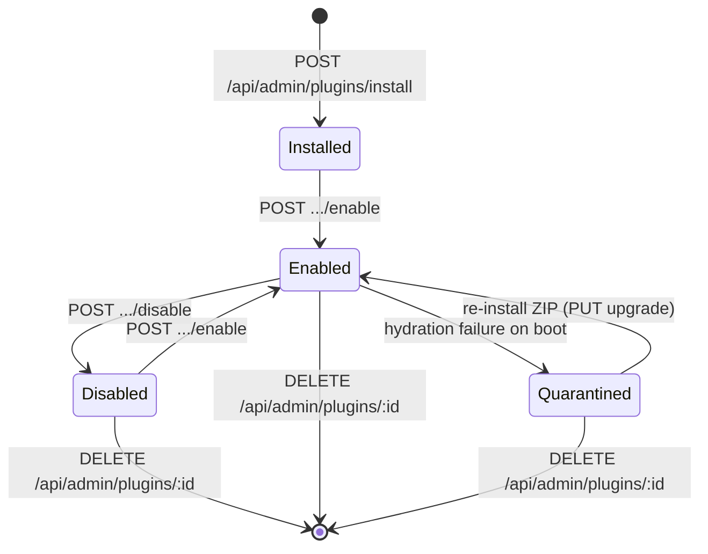
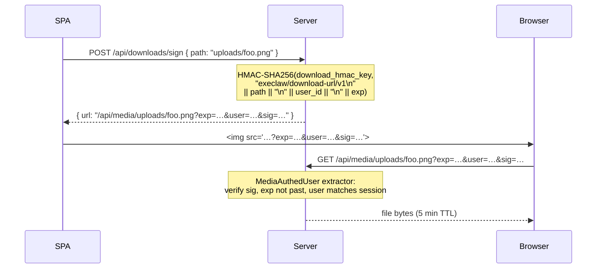
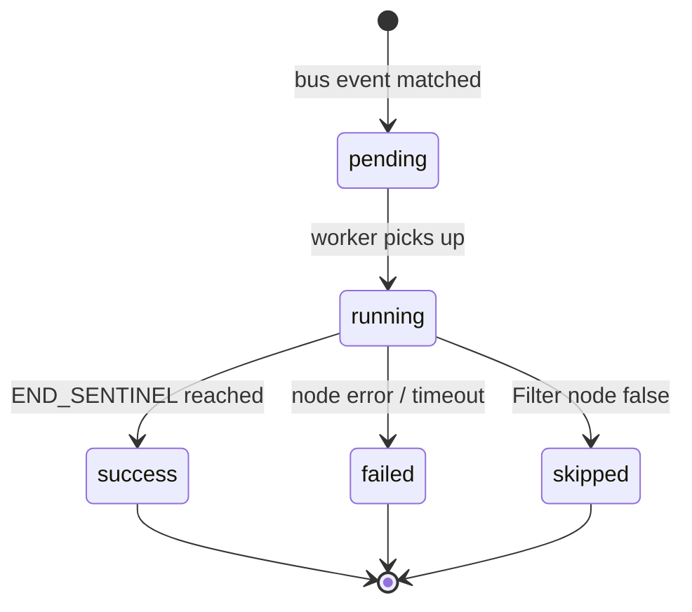

# execlaw — Architecture

Reference document for the execlaw agent model. This is the mental model a new contributor needs in 30 minutes before they read a line of code.

Relationship to other docs:

- [`MIGRATION_PLAN.md`](../MIGRATION_PLAN.md) is the design rationale, section-by-section, with research citations and trade-off discussion. Read it when you need to understand *why*.
- This document is the *what*: the structure, the invariants, the flows. Read it when you need to understand *how things fit together*.
- [`agent-model.md`](agent-model.md) is the *how* of one turn — TurnExecutor, memory layers, reflection loop, planner/executor split.
- [`plugins.md`](plugins.md) is the plugin-author reference — manifest schema, runtime tiers, sidecar model, primitives, and a step-by-step guide for writing a custom plugin.
- [`sidecar-supervisor-design.md`](sidecar-supervisor-design.md) deep-dives the supervised-container layer plugins compose against.
- [`security-hardening-2026-06.md`](security-hardening-2026-06.md) documents the 2026-06 security audit: HTTP security headers, login rate limiting, homoglyph fold expansion, and deferred items (httpOnly cookies, master.key permissions).

---

## 1. One-paragraph pitch

**execlaw is a deterministic state machine over an append-only SQLite event log that occasionally calls an LLM.** The LLM is the interesting but *replaceable* part. The durability, policy, and isolation around it are the product. Everything runs on the operator's hardware (no cloud LLMs, ever). The control plane is a single native binary that registers as a host service (systemd / launchd / Windows SCM); the per-conversation runner is a Docker container the control plane spawns; inference backends (vLLM, Whisper, Kokoro) are separate local service containers. Plugins extend the system via a WordPress-style hook framework loaded from ZIP uploads.

---

## 2. Design principles (referenced everywhere)

From `MIGRATION_PLAN.md` §0 — restated here so this doc stands alone:

1. **Self-hosted only.** No cloud LLM providers on any code path. Strict.
2. **SQLite is the source of truth** for configuration and state.
3. **The event log is the source of truth** for conversations.
4. **Effects go through an outbox**; the LLM never calls external APIs directly.
5. **Every `tool_use` pairs with a `tool_result`** in the same commit.
6. **Plugins, not hardcoded built-ins** — every extension is a plugin.
7. **One control plane, one container manager.**
8. **Participant-aware, trust-class-scoped.**
9. **Rule of Two** for untrusted turns.
10. **Sideband HITL** via a different transport than the one that introduced untrusted content.
11. **Native control-plane binary** — deployment artifact is a per-OS native binary registered as a host service via the `service-manager` crate (systemd on Linux, launchd on macOS, Service Control Manager on Windows). No Docker image for the control plane.
12. **Minimal containers** — every container image execlaw spawns (per-conversation runner, inference backends, plugin sidecars) ships only what its single job requires.

The rest of this document is these principles made concrete.

---

## 3. System topology

```
                            operator's machine
┌─────────────────────────────────────────────────────────────────────────────┐
│                                                                             │
│   ┌──────────────┐   HTTP+WS    ┌───────────────────────────────────────┐   │
│   │              │ ◀──────────▶ │  execlaw control plane                │   │
│   │   Chat UI    │   (JWT)      │  (native binary registered as a       │   │
│   │   (SPA)      │              │   host service via service-manager:   │   │
│   │              │              │   systemd / launchd / Windows SCM)    │   │
│   └──────────────┘              │                                        │   │
│                                 │  axum server  event log  scheduler    │   │
│                                 │  ┌──────────┐ ┌─────────┐ ┌─────────┐ │   │
│                                 │  │ REST/WS  │ │ SQLite  │ │ wakeup  │ │   │
│                                 │  │ + OpenAPI│ │ SQLCipher│ │ queue  │ │   │
│                                 │  │ + AsyncAPI│ └─────────┘ └─────────┘ │   │
│                                 │  └──────────┘                          │   │
│                                 │  container-mgr   outbox-relay          │   │
│                                 │  ┌──────────┐   ┌─────────────┐        │   │
│                                 │  │ bollard  │   │ retry+inbox │        │   │
│                                 │  │ + hw-prof│   │ dedup       │        │   │
│                                 │  └──────────┘   └─────────────┘        │   │
│                                 │  automation-bus  inference-metrics     │   │
│                                 │  ┌──────────┐   ┌─────────────┐        │   │
│                                 │  │ bus events│  │ per-consumer│        │   │
│                                 │  │ dispatcher│  │ p50/p95 lat │        │   │
│                                 │  └──────────┘   └─────────────┘        │   │
│                                 │      │                    │            │   │
│                                 │      │ docker.sock        │ tool calls │   │
│                                 └──────┼────────────────────┼────────────┘   │
│                                        │                    │                │
│                    ┌───────────────────┼────────────────────┼──────────────┐ │
│                    │                   ▼                    ▼              │ │
│                    │  ┌────────────────────────┐  ┌───────────────────┐    │ │
│                    │  │  runner-local (per     │  │ plugins (ZIP-     │    │ │
│                    │  │  active conversation)  │  │ installed, or     │    │ │
│                    │  │                        │  │ bundled from .app)│    │ │
│                    │  │  stateless, Ed25519    │  │  signal, whatsapp │    │ │
│                    │  │  capability token      │  │  slack, discord,  │    │ │
│                    │  └───────────┬────────────┘  │  python-sandbox,  │    │ │
│                    │              │               │  autoresearch,    │    │ │
│                    │              │               │  finance-yahoo…   │    │ │
│                    │              │               └────────┬──────────┘    │ │
│                    │              │ OpenAI API /           │               │ │
│                    │              │ Ollama native API      │               │ │
│                    │              ▼                        │               │ │
│                    │  ┌────────────────────────┐           │               │ │
│                    │  │ local inference services│          │               │ │
│                    │  │                        │          │               │ │
│                    │  │  service-vllm (NVIDIA) │          │               │ │
│                    │  │  service-openarc (Arc) │          │               │ │
│                    │  │  ollama (native, macOS/│          │               │ │
│                    │  │    cross-OS when avail)│          │               │ │
│                    │  │  service-whisper       │          │               │ │
│                    │  │  service-kokoro        │          │               │ │
│                    │  └────────────────────────┘          │               │ │
│                    │                                       │               │ │
│                    │  nvidia GPU / Intel Arc / Apple M*   │               │ │
│                    └───────────────────────────────────────┼───────────────┘ │
│                                                            │                 │
└────────────────────────────────────────────────────────────┼─────────────────┘
                                                             │
                                                             ▼
                                    Signal / SMS / Discord / Slack / email
                                              (external world)
```

Every arrow is local IPC or loopback HTTP. Nothing in the default path reaches the public internet except the transport plugins talking to their external surfaces (Signal server, Discord gateway, Slack Socket Mode, email host, etc.) and the occasional `plugin-url-fetch` during research.

---

## 4. Actors and responsibilities

```
execlaw workspace (crates/)
├── core/           event log · migrations · principal store · memory · history budget
│                   automation bus/runs/suggestions · research jobs · cards
├── server/         axum surface · chats/ · auth · plugin routes · automation runtime
│   ├── chats/      prompt assembly · helpers · attachments · types
│   ├── research/   runner · supervisor · synthesize · workspace · gather
│   └── python_sandbox/  kernel pool · hydration · Jupyter protocol · tools
├── plugin-host/    manifest parsing · hook registry · ZIP install · quarantine
├── plugin-sdk/     plugin.toml schema (source of truth)
├── policy/         trust gating · capability tokens · input guards · spotlighting
├── runner-local/   TurnExecutor — the per-conversation tool loop
├── runner-binary/  standalone runner binary (spawned per conversation)
├── runner-protocol/ typed RPC between control plane and runner
├── inference-api/  OpenAI-compat client · Ollama native /api/chat · streaming SSE
├── model-adapter/  per-family request/response adaptation (Qwen3 · DeepSeek · Llama3 · Mistral)
├── voice-pipeline/ STT→LLM→TTS graph · barge-in · endpointer · HMAC voice events
├── skills/         SkillStore · AutoCaptureWorker · ReuseUpdateWorker · scanner
├── charting/       in-process SVG chart renderer (open-meteo / finance-yahoo panels)
├── outbox/         outbox relay primitives
├── container-manager/ bollard wrapper · GPU detection · NativeServiceController
├── vault/          SQLCipher secret store
├── mcp-client/     MCP server tool dispatch (stdio JSON-RPC)
├── session/        session management helpers
├── identity-api/   identity-provider API types
├── transport-api/  transport plugin API types
└── cli/            execlaw binary · replay · eval commands
```

### 4.1 Control plane (single native binary, host service)

The coordinator. Owns:

- **Event log** — `state_events` + related tables in SQLite (SQLCipher in production).
- **Scheduler** — priority queue for wakeups, sub-second precision.
- **Policy engine** — capability tokens, trust resolution, Rule of Two, input guards (homoglyph fold: Cyrillic + Greek + Armenian).
- **Plugin host** — manifest parsing, ZIP install, hook registry; plugin quarantine (non-destructive on hydration failure, re-uploadable).
- **Bundled-plugin mirror** — copies ZIPs from `.app Contents/Resources/plugins/` (macOS) or `~/.execlaw/bundled-plugins/` (Linux/Windows) on startup; `GET /api/admin/plugins/bundled` + `POST install-bundled`.
- **Container manager** — bollard client wrapping all Docker operations the control plane delegates *out* (per-conversation runner spawns, plugin sidecars, inference services).
- **Outbox relay** — drains `state_outbox` to transport plugins with idempotency.
- **Axum server** — REST + WebSocket surface for UI and plugins; security-headers middleware on every response.
- **Login rate limiter** — per-IP sliding-window token bucket (5 attempts / 10 min) on `POST /api/login`.
- **Automation bus** — durable `state_bus_events` inbox; dispatcher + worker pool; Rhai-evaluated typed-graph automation runtime (M1–M4). See §4.6.
- **Inference metrics** — per-consumer attribution (chat / routines / research / automations); `in_flight`, total calls/failures, p50/p95 latency ring buffer. `GET /api/admin/inference/metrics` + `POST /api/admin/inference/probe`.
- **Skills subsystem** — `crates/skills/` owns the versioned skill store, auto-capture worker (C), reuse-update worker (D), and built-in secret scanner. Separate from the `config_skills` DB table (operator toggles) and the `[[skills]]` manifest entries (plugin-shipped skills). See §4.9.
- **Model adapter** — `crates/model-adapter/` provides per-family `ModelAdapter` impls (Qwen3, DeepSeekR1, DeepSeekV3, Llama3, Mistral, Gemma, OpenAiGeneric). Every LLM call site calls `adapter_for(ModelFamily::detect(&model_id)).chat(...)` so reasoning-block extraction, thinking suppression, and guided-decoding toggling are isolated per family.
- **Graphiti bridge** — built-in `graphiti` tool that proxies `status`, `ingest_episode`, `search`, and `raw_request` actions to a Graphiti-compatible HTTP endpoint. Admin routes `GET/POST /api/admin/graphiti/health|test-call` for operator validation. See §4.8.
- **Cards primitive** — `crates/core/src/cards.rs`; event-sourced `CardOpened`/`CardProgressed`/`CardClosed` lifecycle for long-running tasks (research, Python execution, agent fan-out). Channel-capability downgrade to plain text on non-rich transports.
- **Routine scheduler** — minute-aligned cron tick; fires `config_routines` rows as controller-trust turns via the existing conversation path.
- **Vault** — SQLCipher-encrypted secrets; master key from OS keyring.
- **MCP HTTP client** — `crates/server/src/mcp_http_client.rs`; Streamable HTTP transport for MCP (JSON-RPC-2.0 over HTTP, bearer token auth, `2025-06-18` protocol version). Complements the existing stdio-based `crates/mcp-client/`.

Deployed as a per-OS native binary, one of `x86_64-unknown-linux-gnu`, `x86_64-pc-windows-msvc`, or `aarch64-apple-darwin`. Intel Macs (`x86_64-apple-darwin`) are intentionally out of scope — the only macOS-specific code path that justifies a dedicated build is Metal-accelerated inference, which doesn't exist on Intel hardware. The `service-manager` crate registers the binary as a host service — systemd unit on Linux, launchd plist on macOS, Service Control Manager entry on Windows. State lives at `~/.execlaw/` (SQLite DB, master key, per-plugin sidecar volumes). No Docker image for the control plane itself; `execlaw install` migrates the DB, registers the service, and starts it.

### 4.2 Runner (one container *per active conversation*)

Thin Rust binary (`runner-local`). Speaks OpenAI-compatible API to whichever local inference backend is configured. Stateless against the event log: on spawn, hydrates context from SQLite via an authenticated RPC to the control plane; runs one turn; writes output back; exits (or stays warm for the next turn).

**Why per-conversation isolation?** Ported the HotRunnerPool pattern from selfhosted-claw. A runner compromised by prompt injection in conversation A can't touch conversation B's data — its capability token scopes it to one `conversation_id`.

### 4.3 Inference services (separate containers — or native subprocesses on Apple Silicon)

`service-vllm` (nvidia), `service-openarc` (Intel), `service-whisper`, `service-kokoro`, etc. Each serves an OpenAI-compatible or protocol-matched endpoint. Control plane calls them via `inference-api` client. These are the containers that carry the heavy vendor runtimes — keeping the control plane minimal (axiom #12).

**Apple Silicon carve-out:** `service-ollama` runs as a host-native subprocess, not a Docker container. Docker Desktop on macOS executes containers inside a Linux microVM with no Metal passthrough — every container-bound inference engine on Mac falls back to CPU and loses the entire point of an Apple-GPU host. The same constraint affects every Metal-backed engine (llama.cpp Metal, Whisper.cpp Metal, MLX), so the control plane manages them as native subprocesses via `NativeServiceController` instead. vLLM is intentionally **not** supported on Apple Silicon — it has no Metal kernels and the CPU build is unusable for any LLM larger than a few billion parameters. See [`setup-mac.md`](setup-mac.md) for first-run setup. The "minimal containers" axiom (#12) still holds — it's the same principle expressed as "minimal native dependencies" because Apple Silicon doesn't offer a container-passthrough surface for the GPU.

**Cross-OS Ollama support:** the `NativeServiceController` path is no longer Apple-Silicon-only. The discoverer (`discover_ollama`) probes well-known install locations on macOS (`/opt/homebrew/bin/ollama`), Linux (`/usr/local/bin/ollama` from the `curl|sh` installer, `/usr/bin/ollama` from distro packages), and Windows (`%USERPROFILE%\AppData\Local\Programs\Ollama\ollama.exe` from `winget` / standalone installer). When the binary is detected, the setup wizard surfaces "ollama" as an additional serving-method choice in the backend dropdown alongside the vendor's Docker-backed engines. Apple GPUs still get Ollama as the *only* option (no Metal-to-container passthrough exists); NVIDIA / Intel hosts get it as an alternative useful when Docker Desktop is misbehaving, `nvidia-container-toolkit` is missing, or the operator already has a populated Ollama model cache. See [`docs/ollama.md`](ollama.md) for the cross-OS discovery + dropdown behaviour.

**Ollama native API path:** the `inference-api` crate ships an `ollama.rs` module that speaks Ollama's `/api/chat` endpoint directly instead of the `/v1/chat/completions` OpenAI-compat shim. The shim has been observed to silently drop `tool_calls` on small models (e.g. `qwen2.5:3b-instruct-q4_K_M`) — the agent renders a literal text `(web_search "…")` instead of making a tool call. The native path returns `tool_calls` reliably on the same prompt. The backend supervisor routes Apple-Silicon Ollama backends through `InferenceEngine::Ollama`. vLLM / llama-server still use the shim (their tool support is first-class there).

**Active model pull:** `ollama_puller.rs` handles the case where `ollama serve` is up but the configured model is not yet in cache. The puller polls `/api/tags` after daemon start, detects the missing model, `POST /api/pull`s it, and streams per-layer `total`/`completed` bytes into a `DownloadProgress` snapshot. The backend stays in `LifecycleStage::DownloadingModel` with a live progress pill in the SPA until the pull completes.

```
Inference backend selection flow:

  Backend config (SQLite)
       │
       ▼
  InferenceResolver
       │
       ├─ ServiceRuntime::Docker  ──► BollardServiceController
       │       (vLLM / OpenArc)        └─ OpenAI-compat /v1/chat/completions
       │
       └─ ServiceRuntime::Native ──► NativeServiceController
               (Ollama)                └─ Engine::Ollama?
                                             ├─ YES: /api/chat (native)
                                             └─ NO:  /v1/chat/completions (shim)
```

| Host class | Standard inference | Process model | Alternative |
|---|---|---|---|
| Linux + NVIDIA | vLLM | Docker container, `--gpus` passthrough | Native Ollama subprocess (CUDA) — surfaced when `ollama` is detected |
| Linux + Intel Arc | vLLM-CPU / OpenVINO | Docker container, `/dev/dri` bind | Native Ollama subprocess — surfaced when `ollama` is detected |
| Windows + NVIDIA | vLLM (Docker Desktop) | Docker container, `--gpus` passthrough | Native Ollama subprocess (CUDA) — surfaced when `ollama.exe` is detected |
| **macOS + Apple Silicon** | **Ollama** | **Native `ollama serve` subprocess** | None (no Docker path on Mac) |
| Any host, GPU-less | vLLM-CPU | Docker container, CPU-only | Native Ollama subprocess (CPU) — surfaced when `ollama` is detected |

### 4.4 Plugins (ZIP-installed extensions)

Plugins are how every non-core capability lights up — transports, third-party integrations, identity providers, OAuth-using HTTP bridges, sidecar-backed services, and agent skills. Operator uploads a ZIP via the SPA or installs from the bundled-plugin gallery; the host parses `plugin.toml`, registers all declared hooks atomically, and from that moment the plugin's tools and skills appear in the agent's catalog (subject to capability + trust gating). Two runtime tiers: **script** (Rhai source loaded into an embedded interpreter — the dominant tier) and **subprocess** (native binary, JSON-RPC over stdio).

**Plugin lifecycle:**



A quarantined plugin retains its OAuth tokens, vault references, and admin-panel data — only the Rhai/subprocess code fails to load. The SPA shows a "needs reinstall" badge; operator re-uploads the ZIP to recover.

Currently shipped in-tree plugins:

| Plugin | Type | Notes |
|--------|------|-------|
| `signal` | Transport (sidecar WS) | Signal Messenger via supervised `signal-cli` sidecar |
| `whatsapp` | Transport (sidecar webhook) | WhatsApp via supervised `wuzapi` sidecar + webhook inbound |
| `slack` | Transport (Socket Mode WS) | Multi-workspace OAuth transport |
| `discord` | Transport (Gateway WS) | Multi-guild sidecar-free bot transport |
| `sms-socket` | Transport (WS) | SMS/MMS via Android SMS Socket app on LAN |
| `google-apps` | Integration (OAuth) | Gmail, Calendar, Contacts, Tasks, Drive — one OAuth grant; also an identity provider |
| `google-places` | Integration (API key) | Places text/nearby search + place details |
| `finance-yahoo` | Integration (scrape) | Real-time + historical market data via Yahoo Finance |
| `open-meteo` | Integration (API) | Weather, marine, air-quality, seasonal, ensemble, flood, climate, geocoding, elevation; chart renderer |
| `pushover` | Notifier | One-way push notification to operator's phone |
| `autoresearch` | Research scaffold | Multi-step query decomposition, parallel web-scraper fan-out, synthesis |
| `python-sandbox` | Execution | Persistent per-conversation Python REPL via Jupyter Kernel Gateway sidecar; pandas, polars, duckdb, pyarrow |
| `web-scraper` | Scraping | JavaScript-rendered page scraping via supervised Playwright sidecar |
| `tool-chain` | Orchestration | Deterministic multi-step plan execution with per-step approval gate; persisted to `state_chain_plans/runs/steps` |
| `humanizer-skills` | Skills | Writing-style skill: makes replies natural and human-sounding |
| `obsidian-skills` | Skills | Obsidian vault workflow and atomic-note skills |
| `hello` | Reference (subprocess) | `hello.echo` reference plugin for subprocess tier |
| `identity-local-address-book` | Identity provider (subprocess) | JSON-file contact list → KnownTrusted auto-admit |

Transport-class plugins implement the conversation-routing contract: receive inbound events, push them to the event log with stable `(plugin_id, source_event_id)` identifiers, drain outbox rows, deliver to the external surface. Full reference in [`plugins.md`](plugins.md).

### 4.5 Outbox relay

A separate async task in the control plane, explicitly *not* invoked by the runner. Reads `state_outbox`, delivers via transport plugins with the framework-minted idempotency key, handles retries (5 attempts + exponential backoff + dead-letter), and commits `effect_committed` events on success. The LLM never calls an external API directly; this is the only path out.

---

### 4.6 Automations subsystem (M1–M4)

The automation subsystem lets operators build event-driven, no-code pipelines that react to signals from the bus (webhooks arriving, plugin emits, routine completions) without involving the conversation loop. It is **entirely separate from `state_events`** — the bus carries external signals; the event log carries conversation turns. They share no rows, no foreign keys, and no invariants.

```
┌──────────────────────────────────────────────────────────────────────────┐
│                       Automation Subsystem                               │
│                                                                          │
│  ┌────────────────┐  publish  ┌──────────────────────────────────────┐   │
│  │  External      │──────────▶│  state_bus_events                    │   │
│  │  inbound:      │           │  (id, kind, source, payload,         │   │
│  │  webhooks,     │           │   internal, dispatched_at)           │   │
│  │  plugin emits, │           └─────────────────┬────────────────────┘   │
│  │  routines      │                             │                        │
│  └────────────────┘                             │ dispatch tick          │
│                                                 ▼                        │
│  ┌──────────────────────────────────────────────────────────────────┐    │
│  │  Dispatcher / Worker Pool                                        │    │
│  │                                                                  │    │
│  │  1. SELECT WHERE kind = ? AND enabled = 1  (indexed)            │    │
│  │  2. Evaluate trigger.when Rhai predicate (sandbox, no I/O)      │    │
│  │  3. Mint AutomationRunRow (status=pending)                       │    │
│  └──────────────────────────────┬───────────────────────────────────┘    │
│                                 │                                        │
│                                 ▼                                        │
│  ┌──────────────────────────────────────────────────────────────────┐    │
│  │  Graph Runtime  (spawn_blocking — SQLite + Rhai, no tokio park)  │    │
│  │                                                                  │    │
│  │   trigger ──► node_0 ──► node_1 ──► … ──► END                   │    │
│  │                                                                  │    │
│  │   Node kinds (M2+M3):                                            │    │
│  │     Filter    — Rhai bool; false = skip run                      │    │
│  │     Transform — Rhai expr; result = node output                  │    │
│  │     Branch    — Rhai bool; picks edge.when routing               │    │
│  │     Terminal  — explicit run end                                 │    │
│  │     AskAgent  — single-shot LLM call via AutomationsAgentPool    │    │
│  │                  ← bounded concurrency semaphore                 │    │
│  │                  ← vision capability check                       │    │
│  │                  ← exactly-one exit tool enforced                │    │
│  │                                                                  │    │
│  │   Per-node: append StepTrace → state_automation_runs            │    │
│  └──────────────────────────────────────────────────────────────────┘    │
│                                                                          │
│  Daily sweeper: SuggestionStore::sweep                                   │
│    → detect high-volume (kind, source) patterns with no matching         │
│       automation → insert state_automation_suggestions                   │
│    → skip state_automation_muted_patterns                                │
└──────────────────────────────────────────────────────────────────────────┘
```

**Key design points:**

- Bus dedup is purely primary-key based. Producers that want dedup (e.g. webhook retries) supply a stable content-hash ID; otherwise a random ULID.
- `internal = 1` events (flow side-effects, plugin emits) write directly to SQLite and are picked up by a poller. `internal = 0` events ride a bounded `tokio::sync::mpsc` channel in front of the dispatcher — avoids producer-consumer deadlock through the channel.
- `AskAgent` nodes are bounded by `AutomationsAgentPool` (default concurrency = 1). A `max_turns > 1` config is accepted and surfaced in errors but the multi-turn loop (intermediate tool calls) is a follow-on milestone.
- The suggestions sweep runs daily so repeated untriaged `(kind, source)` pairs surface as automation proposals in the SPA without nagging.

---

### 4.7 Inference observability

All LLM calls route through the `InferenceMetrics` wrapper, which attributes each call to one of four consumers:

```
  ┌────────────┐  ┌───────────┐  ┌──────────┐  ┌────────────┐
  │   Chat /   │  │ Routines  │  │ Research │  │Automations │
  │   Runner   │  │           │  │ Runner   │  │ AskAgent   │
  └─────┬──────┘  └─────┬─────┘  └────┬─────┘  └─────┬──────┘
        │               │              │               │
        └───────────────┴──────────────┴───────────────┘
                                │
                       InferenceMetrics wrapper
                                │
                  ┌─────────────┴────────────┐
                  │  per-consumer HashMap    │
                  │  Mutex<..>               │
                  │                          │
                  │  in_flight  (gauge)      │
                  │  total_calls (counter)   │
                  │  total_failures (counter)│
                  │  last_durations_ms       │
                  │    VecDeque<u64> depth=256│
                  └─────────────┬────────────┘
                                │
                  GET /api/admin/inference/metrics
                       → MetricsSnapshot JSON
                       → p50 / p95 latency
                  POST /api/admin/inference/probe
                       → direct LLM call (no event log)
                       → timing splits: open_stream_ms,
                         first_chunk_ms, decode_ms,
                         chunks_per_sec
```

The probe endpoint (`POST /api/admin/inference/probe`) bypasses the entire agent loop — no event-log writes, no tool dispatch, no history hydration — and is the primary diagnostic for isolating where turn latency originates (network, prompt size, tool catalog complexity, guided-decoding overhead).

### 4.8 Backend purpose routing and model adapter

Every LLM call is routed through `InferenceResolver::resolve(&db, purpose)` which reads the `config_backends` table and returns a `ResolvedInference { client, model_id }`. There is no boot-cached model ID — resolution is per-call so an operator swap of the backend takes effect immediately without a restart.

```
BackendPurpose enum (crates/core/src/backends.rs)
  Standard  — primary agent turns (e.g. Qwen3-30B-AWQ, large instruction model)
  Small     — lightweight summarization, skill capture, title generation
  VoiceStt  — Whisper-compatible STT endpoint
  VoiceTts  — Kokoro-compatible TTS endpoint
  Vision    — multimodal model for AskAgent image-bearing automation nodes
```

`BackendMode` is orthogonal:

- `External` — operator provides a pre-running URL; control plane calls it.
- `Managed` — control plane spawns + supervises the inference container; `endpoint` is written back to the row after spawn.

Every resolved request is then wrapped by `execlaw_model_adapter::adapter_for(ModelFamily::detect(&model_id))`. The adapter provides per-family `prepare_request` + `process_response` overrides:

| Family | Key adapter behaviour |
|---|---|
| `Qwen3` | Sets `enable_thinking: false` in `chat_template_kwargs` unless the caller opts into reasoning mode |
| `DeepSeekR1` | Extracts `<think>…</think>` blocks from content; exposes them separately as `reasoning` field |
| `DeepSeekV3` | Minimal normalization — V3 has no reasoning blocks |
| `Llama3` | Strips assistant-role preamble artifacts |
| `Mistral` | System-prompt placement compatible with Mistral's conversation format |
| `Gemma` | Strips leading/trailing whitespace quirks |
| `OpenAiGeneric` | Pass-through — used for external OpenAI-compatible endpoints |

### 4.9 Continuous learning — skill auto-capture and reuse-update

`crates/skills/` implements a versioned skill store and two background workers that close the learning loop without operator intervention per turn.

**Phase A — skill store:** `state_skills` / `state_skill_versions` / `state_skill_proposals` tables (migration 0029). Skills are versioned markdown documents with structured frontmatter. FTS5 index for retrieval.

**Phase C — auto-capture worker:** enqueued by the chat handler at turn end for every turn with ≥ N tool calls.

```
chat handler (turn complete)
    │  enqueue(conversation_id, turn_events)
    ▼
AutoCaptureWorker  (crates/skills/src/capture.rs)
    │  BackendPurpose::Small → InferenceResolver → Small model
    │  build_prompt(SummarizerPrompt) + parse_response()
    │  proposed SkillCapture (name, body, tags)
    ▼
SkillStore::propose_capture()
    │  config_skills.auto_capture_enabled = 1 ?
    ├─ YES → insert state_skill_proposals row (state=Pending)
    │         operator reviews in SPA /skills page
    │         approve → state_skills upsert / version bump
    └─ NO  → discard silently
```

The secret scanner (`crates/skills/src/scanner.rs`) runs on every write path and rejects proposals containing API keys, PEM keys, JWTs, or high-entropy strings before they reach the DB.

**Phase D — reuse-update worker:** `ReuseUpdateWorker` (crates/skills/src/reuse_update.rs) detects when an existing skill was exercised in a turn and proposes an incremental update. Toggle: `config_skills.reuse_update_enabled`.

Plugin-shipped skills (declared as `[[skills]]` in `plugin.toml`) are imported at install time via `import_plugin_skills()`; they carry a namespace prefix and are not auto-captured.

### 4.10 Deep research pipeline

`crates/server/src/research/` is a multi-phase subsystem for autonomous research jobs, surfaced to the agent via the `spawn_research` tool (trust_floor = Controller).

```
Agent tool_use: spawn_research(query, sub_queries, budget)
         │
         ▼
ResearchJobSupervisor
    ├─ create state_research_jobs row (Pending)
    ├─ open Card (CardKind::Research) → SPA renders live progress tree
    │
    │  Phase: Plan (C3)
    ├─ runner.rs: planner LLM call → ResearchPlan (JSON, steps with sub_queries)
    ├─ persist plan → status: Planned   (phase_gates=plan_only: pause here)
    │
    │  Phase: Gather (C4)
    ├─ gather.rs: per-sub-query worker pool
    │   ├─ web_search tool + web_fetch via HttpWebFetchApi
    │   ├─ InferenceSubagentApi for per-source extraction
    │   └─ persist ResearchNote rows per sub-query
    │
    │  Phase: Synthesize (C5)
    ├─ synthesize.rs: one LLM call (query + notes → report.md)
    ├─ write report to ResearchWorkspace scratch dir
    ├─ register as AttachmentRow → SPA can render inline
    └─ CardClosed(Succeeded) → agent receives tool_result with attachment_id
```

`ResearchWorkspace` (workspace.rs) manages the per-job scratch directory and source-URL registry. Failures at any phase flip the row to `Failed` and emit `CardClosed{Failed}` — no silent partial results.

### 4.11 Graphiti temporal memory and Graphify knowledge graph

Two knowledge-graph capabilities serve different audiences:

**Graphiti (runtime, in-process tool):** `crates/server/src/graphiti_tool.rs` registers a built-in `graphiti` tool in the host tool registry. The agent can call it directly to:

| Action | Description |
|---|---|
| `status` | Check Graphiti service reachability |
| `ingest_episode` | Write a new episode (conversation excerpt, document chunk) into Graphiti's temporal graph |
| `search` | Semantic + temporal search over the graph (`group_id`, `query`, `top_k`) |
| `raw_request` | Arbitrary Graphiti HTTP call (operator-gated) |

Graphiti endpoint and API key are operator-configured (`EXECLAW_GRAPHITI_BASE_URL`, `EXECLAW_GRAPHITI_API_KEY` env vars, or the Settings UI). Admin routes `GET /api/admin/graphiti/health` and `POST /api/admin/graphiti/test-call` allow validation without driving a model turn.

**Graphify (developer tooling, external CLI):** Graphify is an offline AST-level knowledge-graph tool (`~/.local/bin/graphify.exe`). It is not part of the execlaw runtime — it is an operator-side developer aid.

```
graphify update .            # rebuild graph from workspace AST (no LLM calls)
graphify query "<question>"  # BFS/DFS subgraph for a concept
graphify path "<A>" "<B>"    # shortest relationship path between two nodes
graphify explain "<concept>" # focussed concept explanation from the graph
```

The graph persists at `graphify-out/` (graph.json, manifest.json, GRAPH_REPORT.md). A post-commit Git hook (`scripts/install_graphify_memory_hook.ps1`) runs `graphify update` automatically. `scripts/graphify_sync_preview.mjs` slices the top 300 nodes + 800 edges into `web/src/generated/graphifyPreview.json` for the SPA's optional graph panel.

**Obsidian lesson pipeline:** AI-session transcripts (GitHub Copilot, etc.) are imported into an Obsidian vault via `scripts/copilot_to_obsidian.py`. The importer classifies extracted lessons into four categories (Patterns / Mistakes / Decisions / Context) and deduplicates by `lesson_hash`. `scripts/weekly_lessons_maintenance_report.py` generates a stale/duplicate review report. The `obsidian-skills` plugin ships two skills: `vault-workflow` (Obsidian note-taking conventions) and `atomic-notes` (atomic note decomposition). See [`docs/copilot-graphify-obsidian-workspace-setup.md`](copilot-graphify-obsidian-workspace-setup.md) for setup.

---

## 5. Data model

Full schema is the union of every file in [`crates/core/migrations/`](../crates/core/migrations/) — initial schema in `0001_initial_schema.sql` plus 30+ incremental migrations as the system has grown (HMAC-tag column, plugin install table, eval flags, users + WebAuthn, principal groups, OAuth accounts, skills, transport bindings, search providers, memory lifecycle, …). The load-bearing tables:

### 5.1 `state_events` — the source of truth

```sql
CREATE TABLE state_events (
    conversation_id TEXT NOT NULL,
    seq             INTEGER NOT NULL,
    kind            TEXT NOT NULL,
    payload         BLOB NOT NULL,     -- MessagePack
    committed_at    INTEGER NOT NULL,
    actor           TEXT,
    PRIMARY KEY (conversation_id, seq)
);
```

Append-only. Monotonic `seq` per `conversation_id`. Every action in the system is a row here. Replay reconstructs state deterministically.

**Event kinds** (from [`crates/core/src/events.rs`](../crates/core/src/events.rs)):

| Category | Kinds |
|---|---|
| **Conversation** | `user_msg`, `model_turn`, `tool_use`, `tool_result`, `interrupt`, `resume`, `approval`, `effect_committed`, `wakeup` |
| **Trust & identity** | `cold_contact_arrived`, `identity_resolution_conflict`, `trust_changed` |
| **Alerts** | `alert_fired`, `alert_renotified`, `alert_acked`, `alert_resolved`, `alert_snoozed`, `incident_opened`, `incident_closed` |
| **Voice (finer-grained)** | `voice.session_started`, `voice.session_ended`, `vad.speech_started`, `vad.speech_ended`, `stt.partial`, `stt.final`, `turn.user_ended`, `llm.token`, `llm.response_final`, `llm.cancelled`, `tts.first_audio`, `tts.audio_chunk`, `tts.ended`, `interrupt.started`, `interrupt.rescinded`, `interrupt.confirmed` |
| **Research** | `research_progress_updated` |
| **Escape hatch** | `other` (for forward-compat with future additions) |

### 5.2 `state_conversations` — the materialized view

```sql
CREATE TABLE state_conversations (
    conversation_id TEXT PRIMARY KEY,
    kind            TEXT NOT NULL,       -- ControllerDM | GroupWith... | Blocked | ...
    last_seq        INTEGER NOT NULL,
    phase           TEXT NOT NULL,       -- FSM state (§7)
    controller_id   TEXT,
    trust_class     TEXT NOT NULL,       -- effective trust for this conversation
    modality        TEXT NOT NULL,       -- Text | Voice
    snapshot_blob   BLOB,                -- MessagePack, built every ~50 events
    snapshot_seq    INTEGER,
    lease_owner     TEXT,                -- worker id; NULL = idle
    lease_expires   INTEGER               -- crash recovery
);
```

A single row per conversation carrying the fast-resume snapshot and the lease that enforces per-conversation serialization.

### 5.3 `state_outbox` / `state_inbox` — effect plumbing

```sql
CREATE TABLE state_outbox (
    id              INTEGER PRIMARY KEY AUTOINCREMENT,
    idempotency_key TEXT NOT NULL UNIQUE,   -- framework-minted
    conversation_id TEXT NOT NULL,
    effect_kind     TEXT NOT NULL,
    payload         BLOB NOT NULL,
    status          TEXT NOT NULL,          -- pending | in_flight | delivered | failed
    attempts        INTEGER NOT NULL DEFAULT 0,
    next_attempt_at INTEGER,
    last_error      TEXT,
    enqueued_seq    INTEGER NOT NULL
);

CREATE TABLE state_inbox (
    idempotency_key TEXT PRIMARY KEY,
    received_at     INTEGER NOT NULL
);
```

Idempotency keys are derived from `(conversation_id, turn_seq, tool_call_ordinal)` — framework-minted, **never** LLM-derived. Combined with consumer-side inbox dedup at the transport, this gives effectively exactly-once delivery.

### 5.4 `principals` — the trust table

```sql
CREATE TABLE principals (
    id              TEXT PRIMARY KEY,
    identifiers     BLOB NOT NULL,       -- JSON array of (transport, handle) pairs
    trust_level     BLOB NOT NULL,       -- serialized TrustLevel enum
    resolved_by     BLOB NOT NULL,       -- which identity-provider plugins matched
    metadata        BLOB NOT NULL,
    first_seen      INTEGER NOT NULL,
    last_seen       INTEGER,
    controller_notes TEXT
);
```

**Trust ladder** ([`crates/core/src/principal.rs`](../crates/core/src/principal.rs)):

```
Controller   — admin, cryptographically bound, full capabilities
Delegated    — explicit, time-bounded grant from controller
KnownTrusted — identity-provider matched + controller approved
KnownLimited — identity-provider matched, topic/tool-scoped
UnknownPending — first-time contact, awaiting controller
Blocked      — controller rejected (universal state: applies to unknown
               AND previously-trusted principals)
```

The `Blocked` state is the reason we renamed `UnknownDenied` — you can block anyone, not just strangers.

### 5.5 `memory_entries` — long-term memory, trust-scoped

```sql
CREATE TABLE memory_entries (
    scope       TEXT NOT NULL,
    trust_class TEXT NOT NULL,     -- enforced at the tool shim
    key         TEXT NOT NULL,
    value_blob  BLOB NOT NULL,
    ttl         INTEGER,
    created_at  INTEGER NOT NULL,
    updated_at  INTEGER NOT NULL,
    PRIMARY KEY (scope, trust_class, key)
);
```

`trust_class` in the composite key is what prevents an untrusted conversation from reading `Controller`-scoped memories.

### 5.6 Other tables (pointer-level)

- `state_alerts`, `state_incidents`, `state_alert_silences` — operational alerting (§10 of plan).
- `state_attachments`, `state_artifacts` — blob references for inbound images and research PDFs. `state_attachments.filename` column added (migration 0006) so python-sandbox hydration and inbound transport attachments have original filenames instead of sha256-hex paths.
- `config_runner_deployments` — GPU + model + backend mapping per `RunnerPurpose`.
- `config_trust_policy`, `config_alert_routing`, `config_research_quota`, `config_runtime_settings`, `config_general` — operator-editable settings.
- `config_tool_access` (migration 0009) — per-trust-class capability grants for tool dispatch.
- `config_mcp_servers` (migration 0010) — operator-supplied MCP server registrations; tools surface dynamically alongside plugin tools.
- `config_routines` — cron-shaped recurring tasks fired through the wakeup channel.
- `research_jobs` (migration 0027) — background research sessions (§2.9.1 of plan).
- `vault_secrets` — SQLCipher-encrypted secret store; references are opaque to plugins.
- `log_entries` — SQLite half of the JSONL+SQLite dual log sink.
- `transport_cursors` — per-transport resume point (what `source_event_id` was last processed).
- `transport_conversations` (migration 0006) — `(plugin_id, transport_handle, principal_id) → conversation_id` mapping that the `ConversationResolver` uses on inbound to decide whether a new message continues an existing thread or rotates to a new one. The Controller principal short-circuits: every controller message — across web, voice, Signal, WhatsApp, SMS, Slack, email — collapses into one fixed `controller-thread` ConversationId so the SPA can render a single pinned **Control thread**.
- `transport_bindings` (migration 0032) — `(transport, foreign_id) → principal_id` map that drives auto-bridge transport selection (`bridge_text_reply_to_originating_transport`).
- `principal_groups` (migration 0024) — `principal_group_id ↔ conversation_id` mapping; lets multi-channel principals share one conversation thread.
- `eval_flagged` (migration 0004) — operator-tagged regression-target event ranges.
- `state_plugins` (migration 0003) — persisted plugin installs; re-hydrated on every server boot. Now carries `health_status` / `health_message` / `quarantined_at` columns (migration 0005) for non-destructive quarantine: a plugin that fails to hydrate on startup is marked quarantined (not deleted), preserving its OAuth tokens and vault state; the SPA shows a "needs reinstall" badge.
- `state_oauth_clients`, `state_oauth_tokens` (migration 0028) — OAuth client metadata + access/refresh tokens for plugins that declare `[[oauth_accounts]]`. Plugins never see refresh tokens or client secrets.
- `users`, `state_webauthn_credentials`, `state_refresh_tokens` (migrations 0005/0007/0008) — operator account + auth state for the SPA.
- `state_skills`, `state_skill_proposals`, `config_skills` (migrations 0029–0031) — operator-authored skill markdown registry; plugins ship skills via `[[skills]]` manifest entries. Migration 0011 enables `auto_capture_enabled` and `reuse_update_enabled` on existing installs (skills learning loop on by default).
- `search_providers` (migration 0033) — pluggable search backend registrations for the research subsystem.
- **Automation tables** (migrations 0007–0010):
  - `state_bus_events` — durable inbox for the automation event bus (`id`, `kind`, `source`, `received_at`, `payload`, `internal`, `dispatched_at`). Independent from `state_events`; no HMAC chain.
  - `state_automations` — automation definition store (`id`, `name`, `enabled`, `definition` JSON, `created_at`, `updated_at`). Expression index on `json_extract(definition,'$.trigger.kind')` drives the matcher hot path.
  - `state_automation_runs` — per-(automation, triggering event) run records with `step_traces` JSON array (node_id, input, output, ms, error). Soft references — deleting an automation does not cascade-delete its audit history.
  - `state_automation_suggestions` — high-volume `(kind, source)` patterns the daily sweeper proposes as automation candidates. `UNIQUE(kind, source, status)` makes sweep idempotent.
  - `state_automation_muted_patterns` — `(kind, source)` pairs the operator dismissed; the sweep skips them.
- **Tool-chain tables** (migration 0012): `state_chain_plans` (deterministic multi-step plan payloads), `state_chain_runs` (execution attempts with optional approval halt, `UNIQUE(approval_id)`), `state_chain_run_steps` (per-step audit with `outbox_idempotency_key` for external-effect steps). Used by the `tool-chain` plugin to persist gated multi-step execution across approval wait.

### 5.7 Python sandbox (persistent per-conversation kernels)

The `python-sandbox` plugin pairs with a Jupyter Kernel Gateway (JKG) sidecar managed by `container-manager`. Rather than one shared kernel, each conversation gets its own persistent kernel:

```
  Conversation turn (runner)
       │
       │  execute_python (tool call)
       ▼
  python-sandbox plugin (Rhai + WS client)
       │
       │  /api/kernels/<convo_id>  (start if not running)
       │  /api/kernels/<id>/channels  (WS execute_request)
       ▼
  Jupyter Kernel Gateway sidecar (Docker)
       │  /work/<convo_id>/uploads/  ← state_attachments.filename
       │  /work/<convo_id>/outputs/  ← state_artifacts (refs)
       └─ kernel runs in restricted venv (no host network)
```

Key design points:
- `state_attachments.filename` (migration 0006) is the source for upload path mapping. Before this migration, attachments were stored by content-hash only; the sandbox now maps original filenames to the kernel's work directory.
- Artifact outputs (plots, tables, JSON) write to `/work/<convo>/outputs/` and are registered as `state_artifacts` rows. Subsequent tool calls in the same conversation can reference them by artifact ID.
- Kernels are evicted by idle timeout configured in the sidecar. The plugin gracefully handles a dead kernel by restarting it (state is warm in memory but any local variables are lost on eviction).

---

### 5.8 Threads, controller-thread merge, and incognito

A **thread** is the user-facing name for a `ConversationId`. The word *session* is reserved for JWT auth state.

UI channels mint a fresh thread on "new chat" — explicit. Non-UI channels (Signal, email, voice) call `ConversationResolver::resolve_or_mint(plugin_id, transport_handle, principal_id, idle_timeout_ms)` on every inbound message. The resolver:

1. **Controller short-circuit** — if the resolved principal is Controller, ALWAYS return `controller-thread:<controller_principal_id>`. One DM, every channel.
2. Otherwise: look up the `is_current = 1` row for the triple. If present and `now - last_message_at < idle_timeout_ms`, return its `conversation_id`.
3. Else: mark old as `is_current = 0`, mint new, insert, return new.

Default `idle_timeout_ms` per transport: web/UI = explicit (resolver not called), Signal = 24 h, email = none (every reply continues), voice = 5 min, SMS = 4 h.

**Per-message `channel_origin`** field on event payloads lets the SPA render channel icons in the Control thread without losing the unified-DM UX.

**Incognito threads** (`is_ephemeral = 1` on `state_conversations`) persist events during the conversation (so crash recovery works) but the `EphemeralSweeper` task DELETEs every event row whose parent is past `ephemeral_expires_at`. The conversation row stays with `last_seq = 0` after purge so audit reports can show "N incognito threads existed but their content was purged." `execlaw replay` skips purged ephemerals.

---

## 6. The conversation FSM

`state_conversations.phase` is a finite state machine. Transitions are driven by events in `state_events`; illegal transitions are rejected.

```
                      ┌────────────────┐
                      │      Idle      │◀──────────┐
                      └────────┬───────┘            │
                               │                    │
              user_msg arrives │                    │  turn commits
                               │                    │  (no wakeup, no approval needed)
                               ▼                    │
                      ┌────────────────┐             │
                      │    Thinking    │─────────────┤
                      └────────┬───────┘             │
                               │                     │
                 model requests│tool use             │
                               │                     │
                               ▼                     │
                      ┌────────────────┐             │
                      │ AwaitingTool   │─────────────┤
                      └────────┬───────┘             │
                               │                     │
                     policy says│"need approval"     │
                               │                     │
                               ▼                     │
                      ┌──────────────────┐           │
                      │ AwaitingApproval │───approve─┤
                      └────────┬─────────┘           │
                               │  reject             │
                               │                     │
                               ▼                     │
                      ┌────────────────┐             │
                      │ Thinking       │─────────────┘
                      └────────────────┘

      orthogonal phases:
        AwaitingWakeup      agent called schedule_wakeup; scheduler will fire
        AwaitingReconnect   transport dropped; wait N minutes then give up
        AwaitingTrustDecision  cold contact, controller hasn't decided yet
        TrustRevoked        terminal; conversation is archived
```

A worker holds a lease on the conversation (`state_conversations.lease_owner`) while the phase is anything but `Idle`. Leases have an expiry; if a worker crashes, the lease expires and another worker picks up the conversation.

**Phase transitions always commit as events** (`interrupt`, `resume`, `approval`, `wakeup`), so the FSM is replayable from the log.

---

## 7. What a turn is — the anatomy

A **turn** is a commit unit — the smallest span that commits atomically. It is *not* a request/response boundary. Text turns are typically one user-message / one model-response. Voice turns are bounded by utterance / tool call / approval. The invariants below hold identically in both.

### 7.1 Prompt assembly and history budget

Before a turn reaches the inference backend, the runner assembles the prompt from context hydrated from `state_events`. The assembly pipeline lives in `crates/server/src/chats/`:

```
  state_events (all turns, this conversation)
       │
       ▼
  history_budget::truncate(events, char_budget)
  ┌─────────────────────────────────────────────────────┐
  │  Keep most recent messages that fit under budget    │
  │                                                     │
  │  token estimate: chars / 4 (no tokenizer dep)       │
  │                                                     │
  │  pair coherence: Assistant msg always kept with     │
  │    its preceding User msg (or both dropped)         │
  │                                                     │
  │  floor: MIN_KEPT_MESSAGES pairs always kept         │
  │           regardless of budget                      │
  │                                                     │
  │  oldest messages dropped first                      │
  └─────────────────────────────────────────────────────┘
       │
       ▼
  prompt.rs: assemble_system_prompt()
  ┌─────────────────────────────────────────────────────┐
  │  system prompt = identity + date/time + skills +   │
  │    active tool routing prose +                      │
  │    GroupTurnContext (if multi-party)                │
  │                                                     │
  │  build_tool_routing_prose: per-trust-class hint    │
  │    which tools are enabled this turn               │
  │                                                     │
  │  humanise_tool_call: render past tool calls as     │
  │    readable prose (not raw JSON) for re-injection  │
  └─────────────────────────────────────────────────────┘
       │
       ▼
  POST inference (OpenAI-compat or Ollama native)
```

**Why history budget matters:** latency scales with prompt token count. A fresh chat at ~3 KB produced ~657 ms p50 inference time; a long Signal thread at ~83 KB produced ~24.5 s. The budget was introduced on 2026-05-14 after this 24× disparity was observed in production. The `chars/4` heuristic avoids a tokenizer dependency — off-by-a-little in token estimates is acceptable; the budget is a guardrail, not a hard safety invariant.

### 7.2 Text turn sequence

```
  Transport        Control Plane         Runner          Inference        Outbox
     │                  │                  │                 │              │
     │ inbound event    │                  │                 │              │
     │─────────────────▶│                  │                 │              │
     │                  │ dedupe (inbox)   │                 │              │
     │                  │ append user_msg  │                 │              │
     │                  │ to state_events  │                 │              │
     │                  │                  │                 │              │
     │                  │ acquire lease    │                 │              │
     │                  │ phase → Thinking │                 │              │
     │                  │                  │                 │              │
     │                  │ spawn/reuse ────▶│                 │              │
     │                  │   runner         │ hydrate context │              │
     │                  │                  │ from snapshot   │              │
     │                  │                  │  + events       │              │
     │                  │                  │                 │              │
     │                  │                  │ POST /v1/chat/  │              │
     │                  │                  │  completions ──▶│              │
     │                  │                  │                 │              │
     │                  │                  │ stream tokens ◀─┤              │
     │                  │                  │ assemble turn   │              │
     │                  │                  │                 │              │
     │                  │ tool_use(args) ◀─┤                 │              │
     │                  │                  │                 │              │
     │                  │ policy check     │                 │              │
     │                  │   ├─ capability  │                 │              │
     │                  │   ├─ Rule of Two │                 │              │
     │                  │   └─ taint       │                 │              │
     │                  │                  │                 │              │
     │                  │ if local:        │                 │              │
     │                  │   execute tool   │                 │              │
     │                  │ if external:     │                 │              │
     │                  │   enqueue ──────────────────────────────────────▶│
     │                  │                  │                 │              │
     │                  │ tool_result ────▶│                 │              │
     │                  │                  │ continue turn   │              │
     │                  │                  │                 │              │
     │                  │ (repeat tool_use/tool_result until  │              │
     │                  │  model finishes)                   │              │
     │                  │                  │                 │              │
     │                  │ COMMIT TURN (one SQLite tx):       │              │
     │                  │   ├─ model_turn event              │              │
     │                  │   ├─ paired tool_use+tool_result   │              │
     │                  │   ├─ state_outbox rows             │              │
     │                  │   ├─ state_conversations update    │              │
     │                  │   └─ snapshot refresh (every 50)   │              │
     │                  │                  │                 │              │
     │                  │ phase → Idle     │                 │              │
     │                  │ release lease    │                 │              │
     │                  │                  │                 │              │
     │                  │                  │                 │              │ drain, deliver, retry,
     │                  │                  │                 │              │ inbox-dedup, commit
     │                  │                  │                 │              │ effect_committed
     │                  │                  │                 │              │
     │ outbound msg ◀──────────────────────────────────────────────────────┤
     │                  │ effect_committed event on success  │              │
```

### 7.3 Load-bearing invariants (every turn)

1. **`tool_use`/`tool_result` pairing.** Every `tool_use` event must have a matching `tool_result` event committed in the same transaction. If the turn fails, a cancellation `tool_result` is synthesized. Enforced in `EventLog::commit_turn` via `enforce_tool_pairing()` in [`crates/core/src/events.rs`](../crates/core/src/events.rs). *The single most violated invariant in production agent systems — Claude Code itself has an open bug on this.*

2. **Turn-as-transaction.** The entire turn (model_turn event + every tool_use/tool_result pair + every outbox row + the conversation-state update) commits in one SQLite transaction. Either the whole turn is in the log or none of it is. *This is what selfhosted-claw got wrong — it advanced the cursor before the container confirmed.*

3. **Framework-minted idempotency keys.** Derived from `(conversation_id, turn_seq, tool_call_ordinal)`. Never from LLM output (that's a subtle bug: model rephrases rationale, collision check silently fails). Enables at-least-once delivery + consumer-side dedup = effectively exactly-once.

4. **Per-conversation serialization.** Lease on `state_conversations.lease_owner` means one worker per conversation at a time. Different conversations run in parallel, bounded by container pool size.

5. **Runner is stateless against the log.** Everything the runner needs for a turn comes from hydrating `state_events` on spawn. Nothing durable lives in the runner filesystem, process memory, or any non-event-log store.

---

## 8. Effects and the outbox

The LLM emits tool calls. The control plane decides whether they run. If they do run and they have external effect (sending a message, creating a calendar event, making an HTTP call), they are **never executed by the runner**.

```
  turn commit (one tx):
    ┌─────────────────────────────────────┐
    │ state_events: model_turn            │
    │ state_events: tool_use (ord=0)      │
    │ state_events: tool_result (ord=0)   │
    │ state_outbox: {                     │
    │   id: 42,                           │
    │   idempotency_key: hash(conv_123,   │
    │                         turn=47,    │
    │                         ord=0),     │
    │   effect_kind: "transport.send",    │
    │   payload: { to: ..., body: ...},   │
    │   status: "pending"                 │
    │ }                                   │
    │ state_conversations: last_seq=N     │
    └─────────────────────────────────────┘
              ↓
      (transaction commits)
              ↓
      outbox relay (separate task, polls state_outbox)
              ↓
      dispatch via transport plugin with idempotency_key
              ↓
      transport plugin → external surface (Signal, email, …)
              ↓
      on success: status→"delivered", commit effect_committed event
      on failure: status→"pending", backoff, retry (max 5)
      after retry budget: status→"failed", move to dead-letter,
                         fire Error alert
```

If the same idempotency key retries (control plane crashed between send-attempt and status-update), the transport plugin's inbox returns the already-stored delivery ID and we mark success without double-sending.

---

## 9. Participant-aware policy

Every turn carries four trust-related inputs to the policy engine:

- **`sender_trust`** — trust level of the principal whose message triggered the turn.
- **`addressee_trust`** — who the reply is aimed at (default: the sender; for broadcasts: minimum in the room).
- **`effective_trust`** — minimum trust across readers (policy floor).
- **`conversation_kind`** — derived from participants: `ControllerDM`, `GroupWithControllerPresent`, `GroupWithControllerAbsent`, `MixedTrust`, `ExternalWithOutsider`.

### 9.1 Rule of Two (per turn)

```
  for each turn:
    count = 0
    if this turn ingests untrusted input:           count += 1
    if this turn accesses sensitive data:           count += 1
    if this turn produces an external effect:       count += 1

    if count > 2:
      phase → AwaitingApproval
      sideband notify controller (via a DIFFERENT transport
        than the one that introduced the untrusted content)
      no tool_use executes until approved
```

This is Meta's "Agents Rule of Two" pattern. It's the honest posture given that prompt injection at the model level is unsolved.

### 9.2 Planner/executor split for untrusted turns

For `ExternalWithOutsider` turns and any turn ingesting untrusted content:

```
  ┌──────────────┐                       ┌──────────────┐
  │   PLANNER    │                       │   EXECUTOR   │
  │              │                       │              │
  │ sees:        │                       │ sees:        │
  │  trusted     │                       │  UNTRUSTED   │
  │  metadata +  │                       │  content     │
  │  structured  │                       │  (spotlit)   │
  │  summaries   │                       │              │
  │              │                       │              │
  │ has:         │                       │ has:         │
  │  all tools   │                       │  NO tools    │
  │              │                       │              │
  │ produces:    │                       │ produces:    │
  │  tool calls  │───── placeholders ───▶│  values to   │
  │  with holes  │                       │  fill holes  │
  │              │◀─── tainted values ───│              │
  └──────────────┘                       └──────────────┘
                │
                ▼
    policy engine rejects tainted values entering
    sensitive sinks (cross-conversation send, vault read,
    shared-state write) unless explicitly trusted
```

This is CaMeL (DeepMind 2503.18813) restated for execlaw's trust classes. It doesn't prevent injection; it contains blast radius.

### 9.3 Cold-contact escalation (Phase 3)

An inbound message from a sender the control plane has never seen
before doesn't reach the model. Instead:

```
  POST /api/chats/:id/messages         controller's UI
  sender_principal_id = "stranger-42"         ▲
          │                                    │ sideband
          ▼                                    │ notification
  ┌───────────────────────────────────┐   ┌────┴───────┐
  │  resolve_sender()                  │   │ AlertFired │
  │  → PrincipalStore::find_by_identifier│  │ on WS bus  │
  │  → not found                       │   │ (source =   │
  │  → persist as UnknownPending       │   │  core.cold_ │
  │  → return to chat route            │   │  contact)   │
  └─────────┬─────────────────────────┘   └─────────────┘
            │                                    ▲
            ▼                                    │
  ┌───────────────────────────────────┐           │
  │  policy.evaluate_turn()            │           │
  │  sender_trust = UnknownPending     │           │
  │  → drop_turn = false               │           │
  │  → require_approval = true         │           │
  │  → spotlighting = true             │           │
  └─────────┬─────────────────────────┘           │
            │                                      │
            ▼                                      │
  ┌─────────────────────────────────────┐          │
  │  handle_cold_contact()               │          │
  │  1. commit ColdContactArrived event  │          │
  │  2. phase → AwaitingTrustDecision    │──────────┘
  │  3. publish UiEvent::AlertFired      │
  │  4. return 202 { approval_id }       │
  └─────────┬──────────────────────────┘
            │
            │  controller reads the alert,
            │  decides a verb (Trust / TrustLimited /
            │  Block / IgnoreOnce)
            ▼
  POST /api/admin/approvals/:id/respond
  { "verb": "trust" }
            │
            ▼
  ┌─────────────────────────────────────┐
  │  PrincipalStore::set_trust(...)      │
  │  commit TrustChanged event           │
  │  replay original message on WS bus   │
  │  phase → Idle                        │
  └─────────────────────────────────────┘
            │
            ▼
  Normal turn path resumes; original text is now
  processed as a KnownTrusted/KnownLimited message.
```

Note that **the model sees nothing during the cold-contact window** —
no prompt is assembled, no tool is called. An injection attempt hidden
inside the first message from a stranger simply parks the conversation
until the controller intervenes. This is the architectural containment
for the "first contact" attack vector.

### 9.4 Capability tokens

Every runner gets an Ed25519-signed JWT at spawn. Exact field names match `crates/server/src/auth.rs`:

```json
{
  "sub": "pri_controller",
  "principal_id": "pri_controller",
  "conversation_id": "conv_abc123",
  "turn_seq": 47,
  "session_id": "sess_a3f91",
  "capability_set": ["tools.*", "memory.read", "memory.write"],
  "iat": 1714230000,
  "exp": 1714233600,
  "nonce": "a3f91..."
}
```

Bound to a specific conversation and a specific turn. Cross-conversation reads/writes are rejected by the policy engine. A runner compromised by prompt injection is bounded — it can only affect the conversation it's serving.

---

## 10. Memory layers

Four layers, all implemented as OpenAI function-call tools (no vendor SDK).

| Layer | Storage | Agent-facing tools |
|---|---|---|
| **Transcript** | `state_events` | (implicit — hydrated into context) |
| **Scratchpad** | `state_conversations.scratchpad_blob` | `read_scratchpad()`, `write_scratchpad(content)` |
| **Compaction summaries** | Rust-side pass writes into scratchpad before trimming prompt | `compaction_note(content)` (internal) |
| **Long-term memory** | `memory_entries(scope, trust_class, key, value)` | `read_memory(scope, key)`, `write_memory(scope, key, value)`, `list_memory(scope, prefix)` |

The long-term memory tool shim **enforces trust-class scoping before returning any value**. An `ExternalWithOutsider` turn calling `read_memory("controller", "personal_calendar")` gets back a policy denial — the data never leaves the database.

---

## 11. Sub-agents (default on)

The primary runner can spawn background sub-agents for:

1. **Guardrails** — one-shot parallel classifiers (input risk, output policy check).
2. **Research fan-out** — deep research via `plugin-research-orchestrator` (Phase 2 port of selfhosted-claw's `DeepResearchExecutor`).
3. **Deep reasoning** — escalation to the same model in reasoning mode, or a more deliberate-prompt invocation, for hard problems in voice/chat.

Sub-runner invocation:

```
  primary agent                  control plane                  sub-runner
       │                               │                             │
       │ tool: spawn_research(         │                             │
       │         questions=[...],      │                             │
       │         budget={...},         │                             │
       │         return_mode="async")  │                             │
       │──────────────────────────────▶│                             │
       │                               │ create research_job row     │
       │                               │ spawn sub-runner with       │
       │                               │   capability token capped   │
       │                               │   at KnownTrusted           │
       │                               │────────────────────────────▶│
       │ ack_text, research_id ◀───────│                             │
       │                               │                             │
       │ (primary turn commits         │                             │
       │  immediately; phase→Idle)     │ SCOPE → SEARCH → FETCH →    │
       │                               │ SUMMARIZE → (images) →      │
       │                               │ DRAFT → EXEC_SUMMARY → PDF  │
       │                               │                             │
       │                               │◀────────── events ──────────│
       │                               │  (research_progress_updated)│
       │                               │                             │
       │                               │                             │
       │                               │ sub-runner completes;       │
       │                               │ control plane appends       │
       │                               │ synthetic user msg          │
       │                               │ "[Research <id> complete]"  │
       │                               │ to the conversation         │
       │                               │                             │
       │ new turn triggers.            │                             │
       │ agent calls read_research(id);│                             │
       │ digest is in context; agent   │                             │
       │ writes response to user.      │                             │
```

Sub-runners have a narrower tool set (`search_web`, `fetch_url`, `read_pdf`, `describe_image`, `write_research_note`). They cannot touch the parent conversation's memory or send external messages.

`ExternalWithOutsider` turns spawn only guardrail sub-agents — no research fan-out, no deep escalation (peer-agent privilege escalation is a documented jailbreak vector).

---

## 12. Runner isolation — per-conversation hot containers

```
         control plane (container manager)
                       │
                       │ bollard (Docker API)
                       │
          ┌────────────┼────────────┐──────────────────┐
          │            │            │                  │
          ▼            ▼            ▼                  ▼
    ┌──────────┐ ┌──────────┐ ┌──────────┐      ┌──────────┐
    │ runner   │ │ runner   │ │ runner   │ ...  │ runner   │
    │ conv_A   │ │ conv_B   │ │ conv_C   │      │ conv_N   │
    │          │ │          │ │          │      │          │
    │ token    │ │ token    │ │ token    │      │ token    │
    │ scoped   │ │ scoped   │ │ scoped   │      │ scoped   │
    │ to A     │ │ to B     │ │ to C     │      │ to N     │
    └──────────┘ └──────────┘ └──────────┘      └──────────┘
         │            │            │                  │
         └────────────┴────────────┴──────────────────┘
                              │
                  OpenAI-compatible inference
                              │
                              ▼
           ┌──────────────────────────────────┐
           │  service-vllm  (Qwen3.5-27B-AWQ) │
           │  service-whisper  service-kokoro │
           └──────────────────────────────────┘
```

**Lifecycle:**

- Spawn on demand when a conversation has pending work.
- Stay warm per-conversation for a configurable idle window (default ~10 min).
- Reap on idle or memory pressure; respawn if the conversation wakes again.
- On crash (OOM, panic, kill), the container manager detects via bollard events, commits cancellation `tool_result`s for any open `tool_use`, and respawns. Work is never lost; work is never double-executed.

**Minimal image per axiom #12:** Rust binary + shared-lib deps + CA certs. No vendor SDKs, no model weights, no Python. All heavy runtime lives in the `service-*` backends.

---

## 13. Recovery — what happens on every kind of interruption

| Interruption | What happens | What prevents loss / loops / duplicates |
|---|---|---|
| **User cancels mid-turn** | Runner closes SSE stream; cancellation `tool_result`s committed for open `tool_use`s; phase → `Idle` | Pairing invariant enforcement |
| **Runner crash** (OOM, panic, docker kill) | Bollard event detected; cancellation results committed; new runner spawns and hydrates | Pairing invariant + stateless runners + respawn |
| **Control plane restart** (`execlaw service restart`, OS reboot, deploy) | Scan `state_conversations` for stale leases; cancellation for dangling `tool_use`; phase → `Idle`; scheduler picks up pending wakeups | Lease expiry + pairing invariant + event log as source of truth |
| **Host power loss** | SQLite WAL replay restores last committed state; same flow as control-plane restart. Outbox rows in `in_flight` retry on startup | SQLite atomicity + outbox idempotency + inbox dedup |
| **Transport drop** | Transport plugin reconnects, resumes inbound poll from `transport_cursors.cursor_value`; inbox dedup absorbs duplicates | Stable `(plugin_id, source_event_id)` dedup at ingress |
| **External API timeout** (we don't know if send landed) | Outbox row stays `in_flight`; retry uses same idempotency key; consumer-side inbox returns stored delivery ID; mark success | Framework-minted idempotency + consumer inbox |
| **Infinite-retry risk** (tool keeps failing) | Per-effect retry budget: 5 attempts + exp backoff + dead-letter; Error alert fires; turn continues with `retry_budget_exhausted` error fed back to agent | Hard retry caps + dead-letter queue + alerting |
| **Infinite-wakeup risk** (agent keeps scheduling wakeups) | Rate limit (12/hr/conversation); exceeding suspends further wakeups + fires Error alert for controller review | Wakeup rate limit + alert |
| **Controller device loss** | Vault backup (`execlaw vault export`) produces an encrypted bundle; restore rebuilds Controller identity; re-bind channel identifiers | Vault portability |

---

## 14. Observability

Two logging streams, both local, both mirroring selfhosted-claw's pattern:

```
  anywhere in the Rust code:
     tracing::info!(field = value, "message");
                         │
                         ▼
    tracing-subscriber (JSON layer)
                         │
             ┌───────────┴───────────┐
             ▼                       ▼
    ~/.execlaw/logs/*.jsonl   SQLite log_entries table
    (rolling, tailable)       (queryable, filterable in UI)
```

No OpenTelemetry, no Langfuse, no Arize Phoenix — that's bloat for a single-operator system. The `state_events` table IS the forensic audit trail; logs are the operational view on top.

Admin UI has a log viewer with filters by level / plugin / conversation / time window. `execlaw replay <conversation_id> --at <seq>` rebuilds the exact prompt + capability set + policy decisions for a specific turn.

### 14.1 Inference observability

A dedicated `InferenceMetrics` service tracks every inference call with per-consumer attribution and latency percentiles. Accessible without a UI rebuild via:

- `GET /api/admin/inference/metrics` — returns `MetricsSnapshot` JSON with `in_flight`, `total_calls`, `total_failures`, `p50_ms`, `p95_ms` per consumer (Chat, Routines, Research, Automations).
- `POST /api/admin/inference/probe` — runs a diagnostic inference call that bypasses the event log, history hydration, and tool routing. Returns timing splits: `open_stream_ms`, `first_chunk_ms`, `decode_ms`, `chunks_per_sec`. Use this to localize latency to: network, prompt size, guided decoding (outlines), tool-catalog schema inflation, or model prefill.

The 256-deep ring buffer for latency samples is single-Mutex-protected (`Mutex<HashMap<InferenceConsumer, …>>`). Lock contention is negligible compared to inference call duration (hundreds of milliseconds vs sub-microsecond lock hold time).

### 14.2 Signed media download URLs

Serving user attachments and research artifacts via JWT-in-query-parameter passes the credential through browser history, referer headers, and proxy logs. `download_urls.rs` replaces this with per-file signed URLs:



The path allowlist in `downloads_admin.rs` prevents the sign endpoint from acting as an oracle for arbitrary files on the host filesystem.

---

## 15. Voice adaptations (pointer)

The voice modality uses the same event log, runner, policy, memory, and outbox. What differs:

- **Pipeline**: streaming STT (Whisper) → LLM (Qwen) → streaming TTS (Kokoro) orchestrated by the in-tree `voice-pipeline` crate — a two-lane Tokio graph (system lane for interrupts, data lane for audio/text).
- **Endpoint detection**: punctuation + dynamic silence heuristic (not a separate model).
- **Barge-in**: Silero VAD + 120ms backchannel-rescind window (LiveKit pattern).
- **Event kinds** are finer-grained (`stt.partial`, `tts.audio_chunk`, etc.) because commits happen per utterance / tool call / approval rather than per turn.
- **Runner deployments**: STT can run on Intel Arc via OpenVINO while LLM runs on nvidia via vLLM — the voice pipeline composes them.

Full detail in [`MIGRATION_PLAN.md` §2.13](../MIGRATION_PLAN.md).

---

## 16. Key source files

For the reader who wants to jump into code:

| File | What's there |
|---|---|
| [`crates/core/migrations/0001_initial_schema.sql`](../crates/core/migrations/0001_initial_schema.sql) | All 22 tables |
| [`crates/core/migrations/0002_event_hmac_tag.sql`](../crates/core/migrations/0002_event_hmac_tag.sql) | HMAC `tag` + `key_id` on `state_events` |
| [`crates/core/migrations/0003_state_plugins.sql`](../crates/core/migrations/0003_state_plugins.sql) | Plugin install persistence |
| [`crates/core/migrations/0005_plugin_health.sql`](../crates/core/migrations/0005_plugin_health.sql) | `health_status`, `health_message`, `quarantined_at` on `state_plugins` (non-destructive quarantine) |
| [`crates/core/migrations/0006_add_attachments_filename.sql`](../crates/core/migrations/0006_add_attachments_filename.sql) | `filename TEXT` on `state_attachments` — needed for Python sandbox file hydration |
| [`crates/core/migrations/0007_automation_bus.sql`](../crates/core/migrations/0007_automation_bus.sql) | `state_bus_events` table + 2 indexes |
| [`crates/core/migrations/0008_automations.sql`](../crates/core/migrations/0008_automations.sql) | `state_automations` + `state_automation_runs` + 4 indexes |
| [`crates/core/migrations/0009_automation_suggestions.sql`](../crates/core/migrations/0009_automation_suggestions.sql) | `state_automation_suggestions` + `state_automation_muted_patterns` |
| [`crates/core/migrations/0010_suggestion_drafts.sql`](../crates/core/migrations/0010_suggestion_drafts.sql) | Draft storage for automation builder |
| [`crates/core/migrations/0011_enable_skills_learning_loop_defaults.sql`](../crates/core/migrations/0011_enable_skills_learning_loop_defaults.sql) | Enables `auto_capture_enabled=1` and `reuse_update_enabled=1` in `config_skills` for existing installs |
| [`crates/core/migrations/0012_chain_plans_runs.sql`](../crates/core/migrations/0012_chain_plans_runs.sql) | `state_chain_plans`, `state_chain_runs`, `state_chain_run_steps` for tool-chain plugin phase 2 |
| [`crates/core/src/events.rs`](../crates/core/src/events.rs) | Event-log primitives, `commit_turn`, `enforce_tool_pairing`, HMAC sign/verify |
| [`crates/core/src/event_hmac.rs`](../crates/core/src/event_hmac.rs) | HMAC-SHA256 canonical bytes + constant-time verify |
| [`crates/core/src/principal.rs`](../crates/core/src/principal.rs) | Trust ladder + `PrincipalStore` persistence (Phase 3) |
| [`crates/core/src/outbox.rs`](../crates/core/src/outbox.rs) | Outbox enqueue / inbox dedup |
| [`crates/core/src/automations.rs`](../crates/core/src/automations.rs) | M2 Automations: `AutomationDef` typed-graph store, `AutomationStore::upsert`, `list_enabled_for_kind` hot path |
| [`crates/core/src/automation_bus.rs`](../crates/core/src/automation_bus.rs) | M1 Bus: `state_bus_events` table store, `BusEventKind` enum, dedup, `dispatched_at` crash-recovery query |
| [`crates/core/src/history_budget.rs`](../crates/core/src/history_budget.rs) | Sliding-window token budget: `chars/4` heuristic, pair-coherence invariant, `MIN_KEPT_MESSAGES` floor |
| [`crates/policy/src/trust.rs`](../crates/policy/src/trust.rs) | `evaluate_turn` + capability tiers + Rule of Two |
| [`crates/policy/src/spotlighting.rs`](../crates/policy/src/spotlighting.rs) | Per-conversation random delimiters |
| [`crates/policy/src/sideband.rs`](../crates/policy/src/sideband.rs) | Sideband transport picker + `ApprovalVerb` |
| [`crates/policy/src/input_guard.rs`](../crates/policy/src/input_guard.rs) | Zero-width / bidi / homoglyph strip |
| [`crates/plugin-sdk/src/manifest.rs`](../crates/plugin-sdk/src/manifest.rs) | Hook-based manifest parser. Source of truth for every section: `[plugin]`, `[runtime]`, `[[tools]]`, `[transport]`, `[identity_provider]`, `[[services]]` + `[services.sidecar]`, `[[admin_routes]]`, `[[webhook_routes]]`, `[[oauth_accounts]]`, `[[ui_panels]]`, `[[skills]]`, `[[health_checks]]`, `[[event_subscriptions]]`, `[[alert_sources]]`. |
| [`crates/plugin-host/src/host.rs`](../crates/plugin-host/src/host.rs) | `PluginHost` install/upgrade/enable/disable/hydrate lifecycle; quarantine path on hydration failure |
| [`crates/plugin-host/src/hook_registry.rs`](../crates/plugin-host/src/hook_registry.rs) | Tool / transport / identity-provider / admin-route / webhook-route lookup maps |
| [`crates/plugin-host/src/subprocess.rs`](../crates/plugin-host/src/subprocess.rs) | Subprocess plugin tier (JSON-RPC over stdio) |
| [`crates/script/src/primitives.rs`](../crates/script/src/primitives.rs) | Rhai script-tier primitive registration: HTTP, sidecar, vault, OAuth, WS, `host_route_inbound` / `host_route_inbound_spawn`, JSON, time, logging |
| [`crates/server/src/sidecar_supervisor.rs`](../crates/server/src/sidecar_supervisor.rs) | Supervised-container reconcile loop, health probe, crash-loop guard. See [`docs/sidecar-supervisor-design.md`](sidecar-supervisor-design.md). |
| [`crates/server/src/plugin_admin_routes.rs`](../crates/server/src/plugin_admin_routes.rs) | Authenticated dispatcher at `/api/admin/plugins/{plugin_id}{path}` |
| [`crates/server/src/plugin_webhook_routes.rs`](../crates/server/src/plugin_webhook_routes.rs) | Unauthenticated dispatcher at `/api/webhooks/{plugin_id}{path}`; supports both `application/json` and `application/x-www-form-urlencoded` bodies |
| [`crates/server/src/automation_runtime.rs`](../crates/server/src/automation_runtime.rs) | M2 runtime: `EventHandler` impl, graph-walk, `spawn_blocking` for SQLite writes, per-step `append_trace` |
| [`crates/server/src/automation_agent.rs`](../crates/server/src/automation_agent.rs) | M3 AskAgent: `AutomationsAgentPool`, bounded concurrency `Semaphore`, `InferenceAgentInvoker` / `StubAgentInvoker` |
| [`crates/server/src/automation_suggestions_sweeper.rs`](../crates/server/src/automation_suggestions_sweeper.rs) | M4 daily sweep: detect high-volume `(kind, source)` patterns → `state_automation_suggestions` |
| [`crates/server/src/inference_metrics.rs`](../crates/server/src/inference_metrics.rs) | `InferenceConsumer` enum, per-consumer ring-buffer latency, `MetricsSnapshot`, `in_flight` gauges |
| [`crates/server/src/inference_admin.rs`](../crates/server/src/inference_admin.rs) | `GET /api/admin/inference/metrics` route handler |
| [`crates/server/src/inference_probe.rs`](../crates/server/src/inference_probe.rs) | `POST /api/admin/inference/probe` — bypass agent loop, return `open_stream_ms`, `first_chunk_ms`, `decode_ms`, `chunks_per_sec` |
| [`crates/server/src/inference_resolver.rs`](../crates/server/src/inference_resolver.rs) | `InferenceResolver::resolve(&db, BackendPurpose)` — per-call backend selection, returns `ResolvedInference { client, model_id }` |
| [`crates/server/src/skill_capture_runtime.rs`](../crates/server/src/skill_capture_runtime.rs) | `InferenceSummarizer` wiring `AutoCaptureWorker` to `BackendPurpose::Small`; dropped boot-cached model_id (2026-05-13) |
| [`crates/model-adapter/src/families.rs`](../crates/model-adapter/src/families.rs) | Per-family `ModelAdapter` impls — Qwen3 thinking suppression, DeepSeekR1 reasoning extraction, Llama3/Mistral/Gemma normalization |
| [`crates/model-adapter/src/adapter.rs`](../crates/model-adapter/src/adapter.rs) | `ModelAdapter` trait + `OutputHint` (StructuredJson / Markdown / Conversation / Plain) + `AdaptedResponse` |
| [`crates/skills/src/lib.rs`](../crates/skills/src/lib.rs) | `SkillStore`, `AutoCaptureWorker`, `ReuseUpdateWorker`, `scan` (secret scanner), `import_plugin_skills` |
| [`crates/skills/src/capture.rs`](../crates/skills/src/capture.rs) | `AutoCaptureSink`, `AutoCaptureWorker` — background worker enqueued at turn end |
| [`crates/skills/src/reuse_update.rs`](../crates/skills/src/reuse_update.rs) | `ReuseUpdateWorker` — detects skill reuse and proposes incremental updates |
| [`crates/skills/src/scanner.rs`](../crates/skills/src/scanner.rs) | In-process secret scanner (API keys, PEM keys, JWTs, high-entropy strings) — runs on every skill write path |
| [`crates/charting/src/lib.rs`](../crates/charting/src/lib.rs) | In-process SVG chart renderer used by open-meteo weather panels and finance-yahoo price charts |
| [`crates/server/src/research/runner.rs`](../crates/server/src/research/runner.rs) | Per-job runner: Plan → Gather → Synthesize; phase-gating; LLM planner call + JSON plan parse |
| [`crates/server/src/research/synthesize.rs`](../crates/server/src/research/synthesize.rs) | Synthesize phase: assemble notes → one LLM call → report.md → `AttachmentRow` |
| [`crates/server/src/research/workspace.rs`](../crates/server/src/research/workspace.rs) | Per-job scratch directory + source URL registry |
| [`crates/server/src/graphiti_tool.rs`](../crates/server/src/graphiti_tool.rs) | Built-in `graphiti` tool — `status`, `ingest_episode`, `search`, `raw_request` actions; HTTP bridge to Graphiti endpoint |
| [`crates/server/src/graphiti_admin.rs`](../crates/server/src/graphiti_admin.rs) | Admin routes `GET /api/admin/graphiti/health` + `POST /api/admin/graphiti/test-call` |
| [`crates/server/src/mcp_http_client.rs`](../crates/server/src/mcp_http_client.rs) | Streamable HTTP MCP client (JSON-RPC-2.0, `2025-06-18` protocol version, bearer auth) |
| [`crates/server/src/routine_runner.rs`](../crates/server/src/routine_runner.rs) | Minute-aligned cron tick; fires `config_routines` rows as controller-trust turns |
| [`crates/core/src/cards.rs`](../crates/core/src/cards.rs) | `CardKind` enum + event-sourced card lifecycle (`CardOpened`, `CardProgressed`, `CardClosed`); channel-capability downgrade |
| [`crates/core/src/backends.rs`](../crates/core/src/backends.rs) | `BackendPurpose` enum (Standard/Small/VoiceStt/VoiceTts/Vision) + `BackendMode` (External/Managed) |
| [`scripts/graphify_sync_preview.mjs`](../scripts/graphify_sync_preview.mjs) | Slices `graphify-out/graph.json` into `web/src/generated/graphifyPreview.json` (top 300 nodes / 800 edges) |
| [`scripts/copilot_to_obsidian.py`](../scripts/copilot_to_obsidian.py) | Imports chat transcript lessons into Obsidian vault; classifies into Patterns/Mistakes/Decisions/Context; dedupes by `lesson_hash` |
| [`docs/automations.md`](automations.md) | LangGraph-inspired automation design, event bus architecture, use-case walkthroughs |
| [`docs/desktop-installations.md`](desktop-installations.md) | Cross-platform Tauri installation guide (macOS / Linux / Windows) |
| [`docs/ollama.md`](ollama.md) | Cross-OS Ollama discovery + backend dropdown behaviour |
| [`docs/copilot-graphify-obsidian-workspace-setup.md`](copilot-graphify-obsidian-workspace-setup.md) | Graphify CLI setup, Obsidian vault scaffold, lesson import pipeline, preview sync, post-commit hook |
| [`crates/server/src/download_urls.rs`](../crates/server/src/download_urls.rs) | Signed URL shape, HMAC-SHA256 `v1\npath\nuser_id\nexp`, `MediaAuthedUser` extractor, 5 min TTL |
| [`crates/server/src/downloads_admin.rs`](../crates/server/src/downloads_admin.rs) | `POST /api/downloads/sign` route, path allowlist guard |
| [`crates/server/src/bundled_plugins.rs`](../crates/server/src/bundled_plugins.rs) | `mirror_bundled_plugins_into_data_dir` idempotent mirror; `GET /api/admin/plugins/bundled`; `POST install-bundled` |
| [`crates/server/src/chats/prompt.rs`](../crates/server/src/chats/prompt.rs) | `assemble_system_prompt`, `build_tool_routing_prose`, `GroupTurnContext`, `humanise_tool_call` — pure functions, no side effects |
| [`crates/container-manager/src/hardware.rs`](../crates/container-manager/src/hardware.rs) | Cross-platform GPU detection — Linux sysfs (Tier 1) + `hardware-query` (WMI on Windows) + `system_profiler SPDisplaysDataType -json` parse on macOS (the upstream crate's macOS GPU path is currently stubbed). Apple Silicon SoCs surface as `GpuVendor::Apple` with a unified-memory budget derived from `sysctl hw.memsize × 2/3` (matches macOS's `iogpu.wired_limit` default). |
| [`crates/container-manager/src/service.rs`](../crates/container-manager/src/service.rs) | `ServiceController` trait + `BollardServiceController` (Docker) + `NativeServiceController` (host subprocess) + `MultiplexedServiceController` (per-spec dispatch). `ServiceSpec::runtime: ServiceRuntime` (Docker / Native) drives which one spawns; default is Docker for backwards-compat. Native is gated on `binary_hint` (`"ollama"` in v1) so future native engines (llama-server, MLX) slot in by adding match arms in `discover_for_hint`. |
| [`crates/inference-api/src/lib.rs`](../crates/inference-api/src/lib.rs) | OpenAI-compatible client + streaming SSE |
| [`crates/inference-api/src/ollama.rs`](../crates/inference-api/src/ollama.rs) | Ollama native `/api/chat` endpoint — selected via `InferenceEngine::Ollama`; fixes silent `tool_calls` drop on small models in the OpenAI-compat shim |
| [`crates/server/src/ollama_puller.rs`](../crates/server/src/ollama_puller.rs) | Post-daemon active model pull: polls `/api/tags`, `POST /api/pull`, streams layer progress; holds backend in `LifecycleStage::DownloadingModel` |
| [`crates/server/src/auth_rate_limit.rs`](../crates/server/src/auth_rate_limit.rs) | `LoginRateLimiter` — per-IP sliding-window token bucket (5 attempts / 10 min); `PeerIp` custom extractor; `reset(ip)` on successful login |
| [`crates/server/src/routes.rs`](../crates/server/src/routes.rs) | REST surface (auth, OpenAPI); `security_headers` middleware injecting X-Frame-Options, X-Content-Type-Options, Referrer-Policy, and CSP on every response |

---

## 17. 2026-06 Security and Enhancement batch

This section documents the seven enhancements implemented in June 2026.

### 17.1 Master key file permissions hardening (#13)

`crates/vault/src/keyring_key.rs` — the fallback key file (`~/.execlaw/master.key`) is now created with mode `0o600` (owner-read/write only) on Unix. Prior to this change the file was created with the OS default umask, potentially allowing group- or world-read. The `open_with_permissions` helper uses `OpenOptions` + `std::os::unix::fs::OpenOptionsExt::mode(0o600)` on Unix; Windows is a no-op (uses NTFS ACLs, which default to user-only for files in the user profile). A warning is logged if an existing key file has broader permissions than 0600.

### 17.2 HttpOnly session cookies + sensitive_tool flag (#10)

**HttpOnly cookies:** `POST /api/login`, `POST /api/auth/refresh`, and `DELETE /api/auth/logout` now return `Set-Cookie` headers with `HttpOnly; Secure; SameSite=Strict` flags set via the `cookie` crate. This prevents JavaScript from reading the session token, mitigating XSS-based session theft.

**`sensitive` field on `ToolDescriptor`:** `crates/core/src/tool.rs` — `ToolDescriptor` gains a `pub sensitive: bool` field. When `true`, the control plane omits that tool from the `has_sensitive_tools` check in `chats.rs` that gates certain policy decisions. All existing tools default to `sensitive: false`. Plugin authors can mark tools that access credential stores, personal data, or external APIs with `sensitive: true` in their manifest.

### 17.3 Context window manager crate (#9)

**New crate: `execlaw-context-window`** (`crates/context-window/`).

Pure context management with no cloud dependencies. Trims conversation history before inference according to a configurable policy.

```
ContextWindowPolicy enum:
  FullReplay                     — keep all messages (default)
  SlidingTurns(n: usize)         — keep last N user/assistant turn pairs + system prompt
  TokenBudget { max_tokens, reserve_for_reply }
                                 — char/4 heuristic, drop from front until fit
```

**Integration in `runner-local`:** `TurnConfig` gains `context_window_policy: String` field. After `hydrate_messages` assembles the full history, `parse_policy` + `apply` trim the slice before the inference call. Default value (`""`) maps to `FullReplay` for backwards compatibility.

**Token estimation:** `estimate_tokens(messages)` uses a `chars / 4` heuristic with a 4-token per-message overhead constant — matches the budget in `history_budget.rs` and avoids any tokenizer dependency.

### 17.4 History summarizer (#14)

**`crates/runner-local/src/history_summarizer.rs`** — `summarize_segment(turns, client, model_id) -> Result<ChatMessage, InferenceError>`.

Compresses a slice of `ChatMessage`s into a single `Role::System` message containing a bullet-point summary, using the `BackendPurpose::Small` inference backend. Called when the context window is trimmed to replace the dropped segment with a compact summary rather than silently discarding it. The request uses `temperature: Some(0.2)` and `max_tokens: Some(256)` to keep summaries brief and deterministic.

### 17.5 Automation HttpFetch node (#12)

**`execute_http_fetch` in `crates/server/src/automation_runtime.rs`** — adds a new automation graph node kind `HttpFetch`.

Security model:
- URL validated via `reqwest::Url::parse` — rejects malformed inputs at the boundary.
- Scheme whitelist: only `http` and `https` are permitted.
- Method whitelist: only `GET`, `POST`, `PUT`, `DELETE`.
- 30-second timeout.
- Template substitution for `url` and `body` fields (same `render_template_in_value` used by other node kinds).

Output: `NodeOutcome::Output(json!({ "status": <u16>, "body": <String> }))`.

This lets automation graphs make outbound HTTP calls to local services or webhooks without involving the agent loop or requiring a plugin.

### 17.6 DSPy/GEPA offline skill optimizer (#11)

**New module: `crates/skills/src/optimizer.rs`** — `OptimizerWorker` that fires at exact multiples of `REUSE_THRESHOLD = 5` successful skill invocations.

```
Algorithm:
  1. count_successful_invocations(skill_id) → n
  2. if n == 0 || n % REUSE_THRESHOLD != 0: return None
  3. load skill body from SkillStore::get_by_id
  4. collect recent_successful_conversations(skill_id, MAX_SAMPLE=3)
  5. replay each conversation's tool events via EventLog::replay_since
  6. sanitize_step each ToolUse/ToolResult pair → SanitizedStep[]
  7. build_improvement_prompt(skill_name, body_md, SummarizerPrompt)
  8. SkillSummarizer::summarize(synthetic prompt) → SummarizerOutput
  9. Skip → None; Draft → submit ProposalKind::VersionFork proposal
```

**New methods on `SkillStore`:**
- `count_successful_invocations(skill_id) -> Result<u32, SkillError>` — COUNT(*) WHERE outcome = 'success'.
- `get_by_id(skill_id) -> Result<Option<Skill>, SkillError>` — looks up by numeric ID.
- `recent_successful_conversations(skill_id, limit) -> Result<Vec<String>, SkillError>` — most recent N distinct conversation IDs with successful outcomes.

### 17.7 Session crate Phase 1 FSM (#15)

**`crates/session/src/lib.rs`** — adds a formal FSM to the `Session` struct.

```
SessionState enum:  Idle | Active | AwaitingApproval | Completing | Closed

Valid transitions:
  Idle              + TurnStarted         → Active
  Idle              + ConversationClosed  → Closed
  Active            + ApprovalRequired    → AwaitingApproval
  Active            + TurnCompleted       → Idle
  Active            + ConversationClosed  → Closed
  AwaitingApproval  + ApprovalResolved    → Active
  AwaitingApproval  + ConversationClosed  → Closed
  Completing        + ConversationClosed  → Closed
  (all other combos) → Err(SessionError { state, event })
```

`Session::transition(&mut self, event: SessionEvent) -> Result<(), SessionError>` enforces the above. `Closed` is a terminal state — it rejects all further events. `SessionError` implements `Display` and `std::error::Error`.

| Key source file | What's there |
|---|---|
| [`crates/context-window/src/lib.rs`](../crates/context-window/src/lib.rs) | `ContextWindowPolicy`, `estimate_tokens`, `apply`, `parse_policy` — 14 unit tests |
| [`crates/runner-local/src/turn.rs`](../crates/runner-local/src/turn.rs) | `TurnConfig.context_window_policy` field; `parse_policy`+`apply` call after message assembly |
| [`crates/runner-local/src/history_summarizer.rs`](../crates/runner-local/src/history_summarizer.rs) | `summarize_segment` — 3 unit tests |
| [`crates/server/src/automation_runtime.rs`](../crates/server/src/automation_runtime.rs) | `execute_http_fetch`, `NodeKind::HttpFetch` arm |
| [`crates/skills/src/optimizer.rs`](../crates/skills/src/optimizer.rs) | `OptimizerWorker`, `maybe_optimize` — 4 unit tests |
| [`crates/skills/src/store.rs`](../crates/skills/src/store.rs) | `count_successful_invocations`, `get_by_id`, `recent_successful_conversations` |
| [`crates/session/src/lib.rs`](../crates/session/src/lib.rs) | `SessionState`, `SessionEvent`, `SessionError`, `Session::transition` — 10 unit tests |
| [`crates/server/src/chats.rs`](../crates/server/src/chats.rs) | Chat surface — policy + capability + cold-contact + streaming |
| [`crates/server/src/approvals.rs`](../crates/server/src/approvals.rs) | `POST /api/admin/approvals/:id/respond` (Phase 3) |
| [`crates/server/src/plugins.rs`](../crates/server/src/plugins.rs) | `POST /api/admin/plugins/install` + lifecycle (Phase 2) |
| [`crates/server/src/tool_dispatch.rs`](../crates/server/src/tool_dispatch.rs) | `ChainedToolDispatch` — built-ins → plugins with capability check |
| [`crates/server/src/capability.rs`](../crates/server/src/capability.rs) | Per-turn capability token issue + verify |
| [`crates/runner-local/src/turn.rs`](../crates/runner-local/src/turn.rs) | TurnExecutor — full tool-loop turn path |
| [`crates/core/src/builtin_tools.rs`](../crates/core/src/builtin_tools.rs) | Built-in tool implementations including `read_memory` / `write_memory` / `list_memory` |
| [`crates/core/src/tool_apis.rs`](../crates/core/src/tool_apis.rs) | `DbMemoryApi` — trust-class read-down cascade enforced at the storage shim |
| [`crates/core/src/memory_lifecycle.rs`](../crates/core/src/memory_lifecycle.rs) | `PromotionStore` + `ReflectionStore` (memory hot/warm/cold lifecycle) |
| [`crates/inference-api/src/lib.rs`](../crates/inference-api/src/lib.rs) | OpenAI-compatible client + streaming SSE |
| [`crates/voice-pipeline/src/graph.rs`](../crates/voice-pipeline/src/graph.rs) | Two-lane Tokio graph (system lane preempts data lane) |
| [`crates/voice-pipeline/src/traits.rs`](../crates/voice-pipeline/src/traits.rs) | `AudioIn`/`AudioOut`/`Vad`/`SttClient`/`TtsClient` + mocks |
| [`crates/voice-pipeline/src/session.rs`](../crates/voice-pipeline/src/session.rs) | `VoiceSession` orchestrator + voice-event log wiring (Phase 4) |
| [`crates/voice-pipeline/src/endpointer.rs`](../crates/voice-pipeline/src/endpointer.rs) | Punctuation-aware endpointer |
| [`crates/voice-pipeline/src/bargein.rs`](../crates/voice-pipeline/src/bargein.rs) | Barge-in / backchannel-rescind decision |
| [`spec/asyncapi.yaml`](../spec/asyncapi.yaml) | WebSocket event vocabulary |
| [`plugins/hello/`](../plugins/hello/) | In-tree reference subprocess plugin |
| [`plugins/signal/`, `plugins/whatsapp/`, `plugins/slack/`, `plugins/sms-socket/`](../plugins/) | Transport plugins — sidecar / webhook / WS variants |
| [`plugins/discord/`](../plugins/discord/) | Discord transport plugin (gateway WS + REST) |
| [`plugins/google-apps/`, `plugins/google-places/`](../plugins/) | OAuth + API-key reference HTTP plugins |
| [`plugins/autoresearch/`](../plugins/autoresearch/) | Deep-research orchestrator: multi-step query decomposition → web-scraper → synthesis |
| [`plugins/python-sandbox/`](../plugins/python-sandbox/) | Per-conversation Jupyter Kernel Gateway sidecar, artifact I/O |
| [`plugins/finance-yahoo/`](../plugins/finance-yahoo/) | Yahoo Finance market data — real-time quotes, charts, historical prices |
| [`plugins/tool-chain/`](../plugins/tool-chain/) | Deterministic multi-step plan execution with per-step approval gate; persisted to `state_chain_plans/runs/steps` |
| [`plugins/web-scraper/`](../plugins/web-scraper/) | Playwright-backed headless browser scraper via sidecar |
| [`plugins/humanizer-skills/`](../plugins/humanizer-skills/) | Humanizer writing-style skill (makes replies sound natural) |
| [`plugins/obsidian-skills/`](../plugins/obsidian-skills/) | Obsidian `vault-workflow` + `atomic-notes` skills |
| [`plugins/open-meteo/`](../plugins/open-meteo/) | Key-less weather/marine/air-quality/geocoding tools + SVG chart renderer |
| [`plugins/pushover/`](../plugins/pushover/) | One-way Pushover notifier plugin |
| [`plugins/identity-local-address-book/`](../plugins/identity-local-address-book/) | Subprocess identity provider — JSON-file contact list |
| [`desktop-macos/src-tauri/`](../desktop-macos/src-tauri/) | macOS Tauri wrapper; launchd service management; native menu + deep-link |
| [`desktop-linux/src-tauri/`](../desktop-linux/src-tauri/) | Linux Tauri wrapper; systemd service management via `systemd.rs` |
| [`desktop-windows/src-tauri/`](../desktop-windows/src-tauri/) | Windows Tauri wrapper; Service Control Manager via `scm.rs`; NSIS installer hooks |
| [`crates/core/src/eval.rs`](../crates/core/src/eval.rs) | `EvalFlaggedStore` for regression-target event ranges (Phase 5) |
| [`crates/server/src/observability.rs`](../crates/server/src/observability.rs) | `GET /api/admin/logs` + `GET /api/admin/eval/flags` (Phase 5) |
| [`crates/server/src/tracing_layer.rs`](../crates/server/src/tracing_layer.rs) | `SqliteLogLayer` — mirrors tracing events into `log_entries` (Phase 5) |
| [`crates/eval-harness/src/main.rs`](../crates/eval-harness/src/main.rs) | LLM-judge harness against local Qwen (Phase 5) |
| [`evals/rubrics/`](../evals/rubrics/) | Rubric TOML files |
| [`crates/cli/src/main.rs`](../crates/cli/src/main.rs) | `execlaw` CLI (+ replay + eval flag/list subcommands) |

---

### 17.8 Per-conversation context-window policy persistence (#1)

**Migration 0013** (`crates/core/migrations/0013_conversation_context_policy.sql`): adds `context_window_policy TEXT` column to `state_conversations`.

**`ConversationRow`** (`crates/core/src/conversation.rs`) gains `pub context_window_policy: Option<String>`. The `upsert()` SQL binds it at parameter `?18`; `get()` reads it at column index 16.

**`ConversationStore::set_context_window_policy(id, policy)`** — dedicated update method for changing the policy without a full row write.

**Integration in `chats.rs`**: after loading the conversation via `ConversationStore::get()`, the policy string is forwarded to `TurnConfig` so the context-window crate can apply per-conversation trimming. Default `None` maps to `FullReplay` (no trimming) for backwards compatibility.

### 17.9 History summarizer wired into TurnConfig (#7)

**`TurnConfig`** (`crates/runner-local/src/turn.rs`) gains two new optional fields:
- `pub summarizer_client: Option<Arc<dyn InferenceClient>>` — the `BackendPurpose::Small` client passed down from the server.
- `pub session: Option<Arc<Mutex<Session>>>` — the conversation's live Session FSM handle (see §17.11).

When the context-window policy trims messages, `summarize_segment` (`crates/runner-local/src/history_summarizer.rs`) is called with the dropped slice to produce a compact `Role::System` summary message that replaces the removed segment instead of silently discarding it. The call is only made when `summarizer_client` is `Some`; if it's `None` (e.g., in tests that don't need summarization) the segment is dropped without summarization.

### 17.10 OptimizerWorker wired at turn end (#2)

**`AppState`** (`crates/server/src/state.rs`) gains `pub optimizer_worker: Option<Arc<OptimizerWorker>>`.

**`build_optimizer_worker`** (`crates/server/src/skill_capture_runtime.rs`) constructs the worker from the database and a `BackendPurpose::Small` inference client.

**Integration in `chats.rs`**: after the `TurnExecutor` completes and the response has been streamed, a `tokio::spawn` fires `optimizer_worker.maybe_optimize(skill_id)` asynchronously. The spawn is unconditional (fire-and-forget); the optimizer internally checks whether the invocation count has hit the next `REUSE_THRESHOLD` multiple before doing any real work.

### 17.11 Session FSM wired into TurnExecutor (#3)

**`TurnConfig.session`** (`crates/runner-local/src/turn.rs`) holds the live `Arc<Mutex<Session>>` for the conversation. `TurnExecutor::run` drives the FSM:

```
turn start  → session.transition(TurnStarted)
approval    → session.transition(ApprovalRequired)   [if applicable]
turn end    → session.transition(TurnCompleted)
```

Transition errors are logged but do not abort the turn — the FSM enforces audit-trail consistency, not control flow. `session: None` is accepted for backwards-compatible callers (tests, CLI replay mode) that don't carry a live Session object.

### 17.12 HttpFetch node UI in the SPA (#4)

Three React components added under `web/src/settings/`:

- **`HttpFetchNode`** (`automation-nodes.tsx`) — canvas node for the HttpFetch kind. Displays the configured URL and method in the node body.
- **`HttpFetchForm`** (`AutomationNodePanel.tsx`) — side-panel form with fields: URL (text), method (GET/POST/PUT/DELETE select), body (textarea, optional), rate_limit_per_minute (number, optional).
- **`AutomationCanvas.tsx`** — `defaultConfigFor(NodeKind.HttpFetch)` shape added; the canvas routes `NodeKind.HttpFetch` to `HttpFetchNode` in the node renderer.

The palette entry appears in the **Actions** group alongside `CallPlugin` and `Notify`.

### 17.13 HttpFetch rate limiting in the automation runtime (#5)

**`HttpFetchRateLimiter`** (`crates/server/src/automation_runtime.rs`) — token-bucket-style per-automation limiter backed by an `Arc<Mutex<HashMap<AutomationId, u32>>>`. Counts calls per automation within the current sliding window.

**`ExecutorContext`** gains `pub http_fetch_limiter: Option<Arc<HttpFetchRateLimiter>>`. The `with_http_fetch_limit(db, plugin_pool, backend, cap)` constructor sets a global cap; per-node `rate_limit_per_minute` in the node's JSON config overrides the global cap for that node.

**Enforcement**: at the top of `execute_http_fetch`, before any network call, the limiter checks whether the current automation has exceeded its cap. If it has, the node returns `NodeOutcome::Error("rate limit exceeded: ...")` without touching the wire. Tests exercise both the pass-through case (first call, cap=1) and the rejection case (second call, same automation, cap=1).

### 17.14 Signed URL TTL configurable (#6)

**Migration 0014** (`crates/core/migrations/0014_download_url_ttl.sql`): adds `download_url_ttl_secs INTEGER NOT NULL DEFAULT 300` to `config_general`.

**`GeneralSettings`** (`crates/core/src/general_settings.rs`) gains `pub download_url_ttl_secs: i64`.

**`downloads_admin.rs`** (`crates/server/src/downloads_admin.rs`) reads `download_url_ttl_secs` from `GeneralSettingsStore::get()` on every signed-URL request instead of using a hardcoded constant. Operators can change the TTL via the settings API without redeploying the binary.

---

## 17. Non-goals (what execlaw deliberately does not do)

These are *not* oversights — they are chosen constraints:

- **Cloud LLMs.** Not as default, not as opt-in, not ever. No Anthropic, OpenAI, Gemini, or equivalent on any code path. Models must be hosted locally.
- **Native-audio full-duplex** (GPT-4o Realtime-style). The OSS ecosystem hasn't shipped something portable across nvidia + Intel with acceptable quality. Cascaded STT→LLM→TTS with aggressive barge-in is the self-hosted ceiling; we accept the latency delta.
- **Vendor agent SDKs.** The Claude Agent SDK, OpenAI Assistants API, and equivalents are not used. We implement sessions, memory, streaming, tool use, compaction, and reasoning-on-demand ourselves in Rust against a local OpenAI-compatible inference endpoint. Research findings from those SDKs inform design; they do not define dependencies.
- **Multi-agent by default — with exception for research.** Default is single-threaded. Sub-agents are endorsed for guardrails, research fan-out, and deep escalation; never for untrusted conversations.
- **Hosted plugin registries.** Plugins install via ZIP upload. No central index, no `cargo install`-style package manager for plugins.
- **Complex observability stack.** No OpenTelemetry, Langfuse, Phoenix. JSONL + SQLite, same as selfhosted-claw.
- **Distributed operation.** Single host. SQLite is enough; the control plane runs as one host service, the runner + inference + plugin sidecars are local containers it spawns over the host's Docker socket.

---

## 18. What's built vs. what's next

Last refreshed: 2026-06-06. The phase tags below reflect implementation milestones; for the live-progress feed, look at `git log` on `foundation` and the per-plugin manifests under `plugins/`.

**Phase 0 — Foundation + local inference + GPU-aware deployment.** Complete.

**Phase 1 — Agent core with one transport (web chat).** Complete.
- Event-log primitives with pairing-invariant enforcement
- HMAC-signed event log (§7.8): migration 0002 + sign-on-append + verify-on-replay
- TurnExecutor wired into `POST /api/chats/:id/messages`
- Policy + per-turn capability token on the turn path
- Streaming SSE (`chat_completions_stream`) + `ChatTokenDelta` on the WS bus
- Crash-safety tests (kill mid-turn, replay-after-restart, post-commit tamper)

**Phase 2 — Plugin framework.** Complete and exercised in production by 12 in-tree plugins.
- `PluginHost` lifecycle (install/enable/disable/uninstall/hydrate) with SQLite persistence via migration 0003
- `POST /api/admin/plugins/install` + list / enable / disable / uninstall / tools routes
- Manifest schema: `[plugin]`, `[runtime]` (script + subprocess tiers), `[[tools]]` (with `host_internal`, `trust_floor`, `latency`), `[transport]`, `[identity_provider]`, `[[services]]` + `[services.sidecar]`, `[[admin_routes]]`, `[[webhook_routes]]` (unauthenticated, plugin validates), `[[oauth_accounts]]`, `[[ui_panels]]`, `[[skills]]`, `[[health_checks]]`, `[[event_subscriptions]]`, `[[alert_sources]]`
- Capability-enforced `ChainedToolDispatch` — built-ins → plugins → MCP → error
- Script-tier engine (`crates/script/src/`) — embedded Rhai with primitives for HTTP, sidecar HTTP (SSRF-aware), WebSocket subscribe / bidi, vault, OAuth-token injection, JSON, time (incl. `parse_rfc3339_ms`), routing (`host_route_inbound` synchronous + `host_route_inbound_spawn` fire-and-forget for HTTP-webhook handlers)
- Subprocess-tier engine — JSON-RPC over stdio; reference at `plugins/hello/`
- Authenticated admin router at `/api/admin/plugins/{id}/...`; unauthenticated webhook router at `/api/webhooks/{id}/...` accepting both `application/json` and `application/x-www-form-urlencoded` bodies
- Sidecar supervisor (`crates/server/src/sidecar_supervisor.rs`) with 5 s reconcile, health probes, crash-loop guard, stable per-`(plugin_id, sidecar_name)` host port allocation
- Shipped plugins: `signal` (Signal-Messenger transport, supervised `signal-cli` sidecar), `whatsapp` (WhatsApp transport, supervised `wuzapi` sidecar, webhook inbound, `markread` read receipts), `slack` (multi-workspace OAuth transport, v0.3.2 populates display_name/group_name for sidebar labels, caches under vault key `channel_labels`), `discord` (multi-guild gateway-WS transport, sidecar-free, application-layer heartbeat via `ws_set_keepalive`), `sms-socket` (Android-gateway WS transport), `google-apps` (consolidated Gmail/Calendar/Contacts/Tasks/Drive OAuth integration; also an identity provider — consolidates the earlier separate google-calendar + google-contacts plugins), `google-places` (Places API key-only HTTP integration, v0.2 + `X-Goog-FieldMask` support), `finance-yahoo` (real-time + historical market data via Yahoo Finance; v0.2.1 data-ref pipeline for large OHLC+volume series to avoid model catalog-weight regression), `open-meteo` (key-less weather/marine/air-quality/seasonal/ensemble/flood/climate/geocoding/elevation tools + chart renderer; v0.5.1 data-ref pipeline for long-horizon forecasts), `pushover` (one-way notifier), `autoresearch` (experiment-loop scaffold: `bootstrap_run`, `analyze_results_tsv`, `score_candidate`; ships a `loop-playbook` skill), `python-sandbox` (per-conversation Python REPL via Jupyter Kernel Gateway sidecar; pandas, polars, duckdb, pyarrow, numpy, openpyxl; file I/O via `/work/<convo>/uploads` + `/work/<convo>/outputs` artifacts), `web-scraper` (JavaScript-rendered page scraping via supervised Playwright sidecar; `scraper.fetch_page`, `scraper.extract`, `scraper.follow_links`, `scraper.session_close`), `tool-chain` (programmatic multi-step tool-chaining with planning + gated execution; `chain.plan`/`chain.execute`/`chain.resume` — host-implemented in Rust), `humanizer-skills` (humanizer writing-style skill), `obsidian-skills` (vault-workflow + atomic-notes skills), `hello` (subprocess reference), `identity-local-address-book` (subprocess identity provider)
- Plugin-author reference: [`docs/plugins.md`](plugins.md)

**Phase 3 — Participants, trust, policy engine, Rule of Two.** Complete.
- `PrincipalStore` persists the full rich `TrustLevel` variant via JSON
- `ConversationKind::derive` derives the kind (ControllerDM / GroupWithControllerPresent / GroupWithControllerAbsent / ExternalWithOutsider / MixedTrust) from a slice of participant trust-class tags. Chat route refreshes the kind on every inbound message.
- Identity resolution in the chat route: unknown senders → identity-provider dispatch → UnknownPending + cold-contact OR auto-admit as KnownTrusted when a provider vouches
- `PluginHost::resolve_identity` iterates installed `identity_provider` hooks via JSON-RPC `identity.resolve`
- In-tree reference plugin `identity-local-address-book` (in `plugins/identity-local-address-book/`) — JSON-file contact list, exposes the `identity_provider` hook
- `classify_identity_matches` — pure decision function mapping provider matches (highest-confidence wins, `Unknown` hint rejected) to a `TrustLevel`
- Cold-contact escalation: `ColdContactArrived` event + `AwaitingTrustDecision` phase + `AlertFired` sideband broadcast
- **Signed approval-token JWT** (§2.11): cold-contact response includes a `approval_token` whose `jti` matches the `approval_id`. The respond endpoint verifies the JWT before honoring any verb so an attacker who guesses the id can't forge a response.
- `POST /api/admin/approvals/:id/respond` with every `ApprovalVerb` branch
- `POST /api/admin/principals/:id/revoke` for direct trust revocation
- `TrustChanged` event committed on every transition (audit trail)
- Spotlighting applied to prompt assembly when `policy.spotlighting` fires
- **Planner/executor containment** — when `policy.planner_executor` is true (effective_trust < KnownTrusted), the tool-capable chat path is disabled. A prompt-injected executor can't exfiltrate via tool_use args because there are no tool_use slots. Full placeholder-passing choreography lands as a later refinement.
- Trust-class-scoped memory reads (from Phase 1)

**Phase 3 deferrals**:
- `config_trust_policy` UI-editable defaults: SQLite table exists; UI surfacing lands with Phase 6.
- Cross-transport sideband delivery is wired now that signal/whatsapp/slack/sms-socket transports ship; remaining work is the controller-pick-transport policy table.
- Rule-of-Two breach approval flow for non-cold-contact (currently 202 awaiting_approval; the ApprovalVerb::Approve / Edit / Reject path lands when there's a sensitive-tool-call to gate).
- Group-awareness in agent classifier: shipped — agent now knows when it's in a group and is biased toward silence.

**Phase 4 — Voice pipeline primitives.** Complete (internal, with mocks).
- `traits.rs`: `AudioIn` / `AudioOut` / `Vad` / `SttClient` / `TtsClient` — the full contract between the pipeline and stage backends, plus `MockAudioIn` / `MockAudioOut` / `MockVad` / `MockStt` / `MockTts` for deterministic testing.
- `session.rs::VoiceSession`: the orchestrator. Owns the two-lane `Pipeline`, the stage clients, and the event-log handle (with optional HMAC key). Drives the full state machine: `Listening → UserSpeaking → AwaitingLlm → AgentSpeaking ↔ BargeInDecision → …`.
- Voice event schema wired to `state_events`: every stage transition commits a `voice.*` / `vad.*` / `stt.*` / `llm.*` / `tts.*` / `interrupt.*` row via `EventLog::append`. Timestamp (`t_ms`) stored on every row so EoS→first-audio latency can be reconstructed from the log.
- Sentence splitter (`chunk_at_sentence_boundaries`) feeds TTS chunk-by-chunk so first-audio latency can be minimized.
- Barge-in resolution: `resolve_bargein(user_still_speaking)` applies the existing `bargein::decide` rule table to the session state; on Confirm, cancels TTS + fires an `Interruption` on the system lane + commits `InterruptConfirmed`.
- **HMAC-signed voice events** verified end-to-end: tampering with a committed voice row trips `DbError::TamperDetected` on next replay (just like text events).
- **Crash invariant**: a mid-`speak` panic leaves a partially-committed log that still verifies under HMAC. No half-signed rows; the partial state faithfully records what happened without a misleading `TtsEnded`.
- **STT-transcript spotlighting** verified: a delimiter-smuggling attempt in a simulated STT transcript produces a wrap with exactly one outer open + one outer close — no escape.
- **Modality-adaptive helpers** (`VoiceTurnBudget`): voice turns get max_response_tokens=80, max_tool_rounds=1, low-latency-only tools, suppressed extended thinking. The chat route reads these values when running a voice turn.

**Phase 4 deferrals → Phase 8 (real-audio acceptance):**
- Silero VAD ONNX integration — `Vad` trait is ready; `MockVad` covers the decision logic; ONNX runtime binding lands as a feature-gated impl.
- `service-whisper` / `service-kokoro` / `service-piper` sidecar containers — `SttClient` / `TtsClient` traits are ready; the wrappers are subprocess plugins the plugin-host manages.
- `transport-voice` plugin for mic/speaker I/O + WebRTC AEC3 — `AudioIn` / `AudioOut` traits are ready.
- ≤1.1 s EoS → first-audio latency acceptance: can be measured once the real backends plug in (the `t_ms` field on every voice event exists precisely for this measurement).

**Phase 5 — Observability, evaluation, replay CLI (infra only).** Complete.
- Migration 0004: `eval_flagged` table for tagging regression-target event ranges
- `EvalFlaggedStore` (insert / list_all / list_by_label) with adversarial test (inverted range rejected)
- `LogStore::query` with level / plugin_id / conversation_id / since_ms filters + limit
- `SqliteLogLayer` — `tracing_subscriber::Layer` impl that mirrors every tracing event into `log_entries`. Best-effort writes (DB lock failures don't break the process).
- `GET /api/admin/logs` and `GET /api/admin/eval/flags` HTTP routes — pure data feeds for the Phase-6 React UI
- `execlaw replay <conversation_id> --at <seq>` CLI — reconstructs the prompt history + sender trust + policy decision (capabilities / planner_executor / spotlighting / latency_band) + the events that turn committed
- `execlaw eval flag <conv> --range a..b --label X --tags ... --notes ...` and `execlaw eval list [--label]` CLI commands
- `execlaw-eval-harness` Rust binary — runs rubric TOML against a local OpenAI-compatible endpoint (the same Qwen the agent uses; no cloud judge). `--mock` mode skips the network call so CI exercises the orchestration without a live model.
- Reference rubric at `evals/rubrics/trust-class.toml` covering: outsider can't pull Controller memory, Rule-of-Two breach blocked, tool_use/tool_result pairing.

**Phase 5 deferrals → Phase 6 (UI):**
- Log viewer React component
- Eval-flag dashboard
- Trace viewer embedded in the chat UI

**Phase 6 — UI port (chat-first SPA + Tauri Desktop).** Sub-phases 6a–6e landed; full incognito-thread UI polish and voice UI still pending.
- Chat-first SPA scaffolding under `web/` is live: pinned Control thread, thread list, inbound messages from external transports collapse into the controller thread per the `ConversationResolver` rule, OpenAI-style streaming token render.
- Settings → Plugins page drives install / enable / disable / uninstall + per-plugin admin panels (each plugin's `[[ui_panels]]` mounts a SPA route). Bundled-plugin install gallery added (`GET /api/admin/plugins/bundled`).
- Research subsystem (C3–C6) shipped: deep-research plan/gather/synthesize pipeline, retention policy, `/research` page, every-phase event flow.
- Approval queue infrastructure: cold-contact alerts, sensitive-tool approvals, OAuth-grant proposals all flow through one SPA dropdown.
- **6d Tauri Desktop wrapper — macOS** shipped 2026-05-15: `desktop-macos/src-tauri/` produces `execlaw.app` for Apple Silicon. Menu bar app with no Dock icon (NSApplication `Accessory` activation policy), registers the bundled LaunchAgent via Apple's `SMAppService` (macOS 13+) so drag-to-Trash auto-disables the service.
- **6e Tauri Desktop — Linux + Windows** shipped: `desktop-linux/src-tauri/` uses `systemd.rs` for service management; `desktop-windows/src-tauri/` uses `scm.rs` (Windows Service Control Manager) + `installer/hooks.nsh` for NSIS installer hooks. All three desktop targets share the same SPA and `http://127.0.0.1:3031` webview strategy.
- **i18n (8 languages)**: en, es, fr, de, it, nl, pl, pt. Lazy code-split per-locale bundles; locale auto-detected from browser. UI strings in the SPA are fully translated; backend error codes are locale-agnostic.
- Pending: full incognito-thread UI polish, voice UI (lands with Phase 8 audio plugins).

Stack (locked in 2026-04-25):
- **React Native** + **react-native-web** as the cross-platform component layer.
- **react-bootstrap** + **Bootstrap CSS** + **Bootstrap Icons** (subtle, monochrome, theme-tinted) — works on react-native-web's DOM output and Tauri's webview; iOS/Android need a parallel native layer when those targets land.
- **Vite** (web) / **Metro** (native).
- **TanStack Query** for REST, **Zustand** for the WS event store.
- **Plugins are trusted** — UI panels load via dynamic ESM `import()`; no sandboxing.
- Built static assets embedded in the Rust binary via `rust-embed` (shipped 2026-05-15 alongside Phase 6d) so the production artifact stays a single binary serving SPA + API on one origin — both the Docker image and the Tauri `.app` bundle rely on this.

UX (locked):
- Chat-first landing; OpenWebUI-shaped sidebar with `New chat`, nav (Routines / Contacts / More → Tools, Skills, plugin panels), thread list, settings + user at the bottom.
- **Pinned Control thread** at the top of the thread list — every controller message regardless of channel collapses here, with subtle per-message channel icons.
- **Thread-list status icons**: empty grey dot (default), blue filled dot (agent replied unseen), animated loader (agent processing). External threads show their channel icon instead of the dot.
- **Thread names**: "Control thread" for the pinned controller thread; truncated transport-supplied name for external groups; LLM-generated 3-word summary (via `set_thread_name(name)` agent tool) for new internal threads.
- External-channel filter toggle above the thread list (Control thread always visible).
- ChatGPT-style approval card slides in from above the input.
- Tokens render as they arrive.
- Long messages truncate with "Read more…".
- `GET /api/ping` returns `pong` or `setup`; SPA routes to wizard on `setup`.
- **Incognito threads** — toggle in the new-thread modal; default 1h expiry; `EphemeralSweeper` purges events.
- Dark default with light/dark/system toggle.
- Voice UI deferred to Phase 8 with the real audio plugins.
- Native iOS / Android deferred to post-Phase-6.

Sub-phases: **6a** (scaffold + chat view + auth + WS bus + approval card + Control-thread merge), **6b** (admin read-views), **6c** (writes — setup wizard, plugin upload, approval verbs, trust revoke, incognito toggle, thread rename), **6d** (Tauri Desktop macOS), **6e** (Tauri Desktop Linux + Windows, i18n 8 languages, bundled plugin gallery).

---

**Phase 7 — Security hardening.** Partially complete (2026-06).

Full detail in [`docs/security-hardening-2026-06.md`](security-hardening-2026-06.md).

**Phase 8 — Automations, inference observability, Python sandbox, media signing, history budget.** Complete.

- **Automations M1–M4** (full detail in §4.6):
  - M1: `state_bus_events` durable inbox (migrations 0007–0010); `BusEventKind` enum; internal vs external ingress path.
  - M2: Typed-graph automation runtime — `AutomationDef` (TriggerDef + N NodeDef + EdgeDef); Rhai sandbox per predicate eval; run checkpointing via `state_automation_runs`.
  - M3: `AskAgent` node with `AutomationsAgentPool` (semaphore-bounded concurrency); exactly-one exit tool; no conversation history; vision capability check.
  - M4: Daily suggestions sweeper detects high-volume `(kind, source)` patterns → `state_automation_suggestions`.


- **Inference observability** (full detail in §14.1): per-consumer metrics (Chat/Routines/Research/Automations), p50/p95 ring buffer, `GET /api/admin/inference/metrics`, `POST /api/admin/inference/probe`.
- **Python sandbox plugin**: per-conversation persistent Jupyter Kernel Gateway sidecar; artifact I/O at `/work/<convo>/outputs/`; `state_attachments.filename` (migration 0006) for upload hydration.
- **Signed download URLs**: HMAC-SHA256 path+user+expiry binding, 5 min TTL, `MediaAuthedUser` extractor; replaces JWT-in-query-param.
- **History budget**: sliding-window token truncation with `chars/4` heuristic, pair coherence invariant, `MIN_KEPT_MESSAGES` floor; introduced after 24× latency disparity observed on 2026-05-14.
- **Prompt assembly refactor**: `chats/prompt.rs` split out as pure functions (`assemble_system_prompt`, `build_tool_routing_prose`, `GroupTurnContext`, `humanise_tool_call`).
- **Plugin quarantine** (migration 0005): `health_status` / `health_message` / `quarantined_at` on `state_plugins`; failed hydration marks quarantined (not deleted); OAuth tokens and vault state are preserved; SPA shows a "needs reinstall" badge.
- **Bundled plugins**: `mirror_bundled_plugins_into_data_dir` from `.app` bundle or `~/.execlaw/bundled-plugins/`; `GET /api/admin/plugins/bundled` gallery; `POST install-bundled`.
- **Ollama native `/api/chat` path**: `inference-api/src/ollama.rs`; selected via `InferenceEngine::Ollama`; fixes silent `tool_calls` drop on small models in the shim.
- **Active model pull**: `ollama_puller.rs` prevents first-completion 404 when `ollama serve` is up before the model is cached.
- **Tool-chain persistence** (migration 0012): `state_chain_plans`, `state_chain_runs`, `state_chain_run_steps` with per-step `outbox_idempotency_key` for gated external effects.
- **Skills learning loop on by default** (migration 0011): `auto_capture_enabled=1`, `reuse_update_enabled=1` enabled for existing installs.
- **Model adapter layer**: `crates/model-adapter/` isolates per-family LLM quirks (Qwen3 thinking tokens, DeepSeekR1 reasoning blocks, Llama3/Mistral/Gemma normalization). Every inference call site uses `adapter_for(ModelFamily::detect(&model_id))`.
- **BackendPurpose routing**: `InferenceResolver` resolves per-call from `config_backends`; `BackendPurpose::Small` used for skill summarization; `BackendPurpose::Vision` for automation `AskAgent` image nodes.
- **Graphiti built-in tool**: `graphiti` tool registered host-side; supports `status`, `ingest_episode`, `search`, `raw_request` against a Graphiti-compatible HTTP endpoint; admin validation routes at `/api/admin/graphiti/`.
- **Cards primitive** (§4.11): event-sourced `CardOpened/Progressed/Closed` lifecycle surfaced in SPA for long-running tasks; channel-capability-aware text downgrade on non-rich transports.
- **Deep research pipeline** (§4.10): `crates/server/src/research/` — plan/gather/synthesize phases; `ResearchWorkspace`; `AttachmentRow` report delivery.
- **Streamable HTTP MCP client**: `crates/server/src/mcp_http_client.rs` complements stdio MCP client; bearer token auth; protocol version `2025-06-18`.
- **Routine scheduler**: minute-aligned cron tick; `config_routines` rows fire as controller-trust turns.
- **SVG charting**: `crates/charting/` in-process chart renderer for open-meteo and finance-yahoo data panels.

**New plugins shipped with Phase 8:**

| Plugin | Type | Description |
|---|---|---|
| `autoresearch` | Research orchestrator | Multi-step query decomposition → parallel web-scraper → synthesis |
| `discord` | Transport | Discord gateway WS + REST; maps channels to conversations |
| `finance-yahoo` | Data | Real-time quotes, chart data, historical prices |
| `python-sandbox` | Execution | Persistent per-conversation Jupyter Kernel Gateway sidecar |
| `tool-chain` | Execution | Deterministic multi-step plan execution with per-step approval gate |
| `web-scraper` | Research | Playwright-backed headless browser scraper via sidecar |

- **HTTP security headers** (**DONE**) — `security_headers` axum middleware wraps the entire router. Every response now carries `X-Frame-Options: DENY`, `X-Content-Type-Options: nosniff`, `Referrer-Policy: strict-origin`, and a strict `Content-Security-Policy` (`default-src 'self'`; script/style/img/font/connect all scoped to `'self'`; `frame-ancestors 'none'`; `object-src 'none'`). Uses `entry().or_insert()` so per-route overrides (e.g. `no-referrer` on attachment downloads) are not clobbered. See `crates/server/src/routes.rs::security_headers()`.
- **Login brute-force protection** (**DONE**) — `LoginRateLimiter` in `crates/server/src/auth_rate_limit.rs`. DashMap-backed per-IP sliding-window token bucket: 5 failed attempts per 10-minute window. Rate check runs before Argon2id (avoids timing oracle). Returns HTTP 429 with `Retry-After` seconds. `PeerIp` custom extractor reads from `ConnectInfo<SocketAddr>` (requires `into_make_service_with_connect_info` in `cli/src/main.rs`). Successful login calls `reset(ip)`. Covered by 6 unit tests.
- **Homoglyph fold expansion** (**DONE**) — `crates/policy/src/input_guard.rs::fold_common_homoglyphs()` extended from Cyrillic-only (14 chars) to also cover Greek uppercase (Α Β Ε Ζ Η Ι Κ Μ Ν Ο Ρ Τ Υ Χ → ASCII) and lowercase (α ε ο ρ τ υ ν → ASCII) plus Armenian (հ→h, ո→n). Three new tests added.
- **Webhook auth=None log elevation** (**DONE**) — `crates/server/src/plugin_webhook_routes.rs::verify_webhook_auth()` `None`-auth arm elevated from `warn!` to `error!` with operator guidance to add `auth = "none"` or real auth. Makes unintended open webhook routes immediately visible in log viewers and SIEM tooling.
- **`accesses_sensitive_data` hardcoded false** (Deferred) — `crates/server/src/chats.rs` `RuleOfTwoInput` still hardcodes `false`. Correct fix requires either post-dispatch re-evaluation or a `sensitive = true` flag on tool descriptors (tracked for Phase 7b).
- **JWT in localStorage** (Accepted for localhost) — CSP from the headers fix significantly reduces XSS surface; httpOnly sameSite=strict cookie migration is the Phase 7b plan (tracked in `web/src/auth/tokens.ts`).
- **`~/.execlaw/master.key` file permissions** (Deferred) — needs `#[cfg(unix)]` chmod(0700) after `create_dir_all` in `crates/vault/src/keyring_key.rs` + Windows DACL. Low-risk on single-user workstation.
