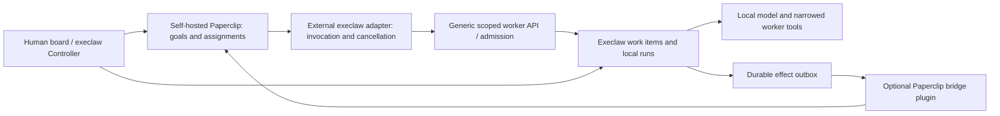
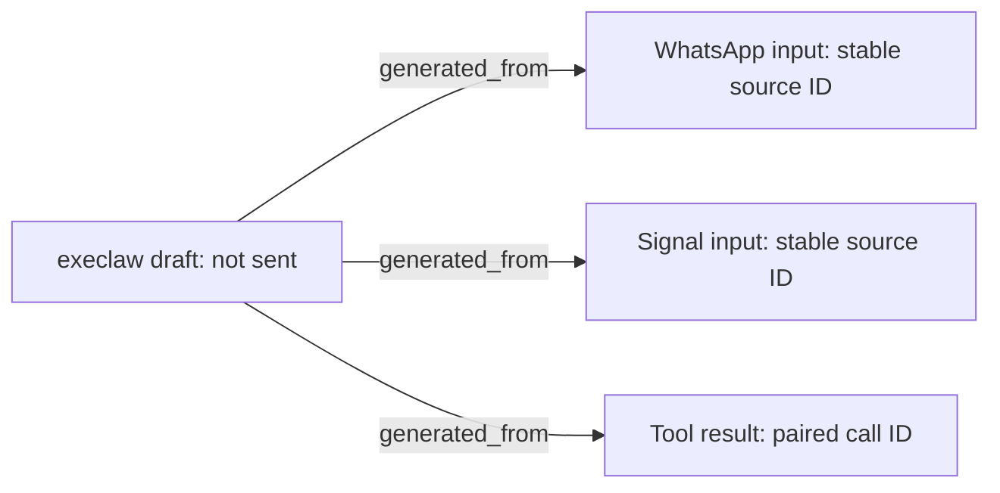

# Local LLM Harness Roadmap

**Using this as the only attachment?** Start with the
[repository navigation and reading guide](#roadmap-entry-guide). This file is
the entry point to the requirements, implementation evidence, source catalog,
and upstream repositories; it is not a bundle of their contents.

Status: accepted implementation scope, updated 2026-10-06. **All 154 enhancements
(H001-H154) are accepted implementation scope.** This document owns their scope,
acceptance criteria, and the F01-F19 review findings. The
[`implementation-plan.md`](implementation-plan.md) ledger owns delivery status,
assigned owners, dependencies, and verification evidence; it must be updated
with each implementation change. [`remaining-improvements-todo.md`](remaining-improvements-todo.md)
is the immediate work queue, not a replacement for that complete ledger.

The [Nexus visual extension](#nexus-visual-roadmap) adds separately tracked
NX01-NX30 proposals and NXF01-NXF11 findings. These refine the chat appearance
experience without renumbering the H baseline or implying that a redesign has
already shipped.

The [Paperclip coordination and interoperability extension](#paperclip-roadmap),
reviewed 2026-10-06, continues the numbered roadmap with H131-H154. It covers native execlaw agent management
and optional participation as a Paperclip worker, lead, or executive. These
items use the main delivery ledger; existing H001-H130 and NX statuses are unchanged.

Implementation references for H001-H130 are linked under each item. The
[source guide and repository directory](implementation-sources.md) distinguish
documented inspiration from supporting references selected on 2026-10-06;
[the machine-readable catalog](roadmap-sources.json) supports per-item lookup.
These annotations do not change requirements, permissions, or qualification.

A checked item records reported implementation, not independent release
qualification. Open review findings and missing acceptance evidence can reopen
it. H005, H009, H011, and H018 have completed their requested implementation
and focused acceptance checks. H020 remains verification-blocked. H021's
implementation and offline scorer checks are recorded below; live benchmark
qualification remains pending.
Component design documents refine the implementation without dropping roadmap
scope. "API access" means Ollama or an OpenAI-compatible
endpoint served on the operator's hardware or explicitly approved local
network. Cloud LLM providers and default internet inference are out of scope.
The local endpoint policy, SQLite configuration, event log, trust ladder,
outbox, and plugin contract remain authoritative.

<a id="roadmap-entry-guide"></a>

## Start here: using this roadmap as the only attachment

This file belongs at **`docs/llm-harness-roadmap.md`** in the execlaw repository.
Link targets are relative to that location: `implementation-plan.md` means
`docs/implementation-plan.md`; `../README.md` means the repository-root README.
Code paths such as `crates/core/src/runs.rs` are relative to the repository root.
Do not assume a particular Windows username, checkout path, branch, or deployed
binary from an older review note.

If the repository is available, follow these links directly or open the named
paths. If only this attachment is available and repository access is absent,
state which required files cannot be inspected and request the relevant files
or an accessible checkout/repository revision. Relative links do not grant
access or embed the linked documents. Do not infer current implementation,
tests, credentials, or deployment state from filenames and historical notes.

### Reading order and document authority

1. Read the applicable [repo instructions (`AGENTS.md`)](../AGENTS.md) and
   [architecture](architecture.md), especially its design principles, before
   implementation. Check for more specific instructions in the directories
   being edited. This roadmap supplies requirements and navigation; it does
   not authorize every listed task, a commit, deployment, or live external
   effect merely because it was attached.
2. Locate the requested H or NX item here, including dependencies, acceptance
   criteria and related F/NXF findings. Open its current row in
   [the implementation plan](implementation-plan.md) and consult
   [the immediate queue](remaining-improvements-todo.md). Existing partial
   work should be completed and verified, not rebuilt from an outdated proposal.
3. Use the topic map below to read the relevant subsystem design and current
   source/tests. [The documentation index](README.md) lists additional guides
   and explains which documents are historical. Resolve conflicting claims
   using current code and revision-specific evidence; neither a checkbox nor
   an old passing test report proves the present tree is qualified.
4. Read the item's implementation-source annotations, then
   [the source guide](implementation-sources.md) and the applicable upstream
   pages/files. Use the provenance labels: documented inspiration is different
   from a supporting reference selected later. A reference does not assert
   that the upstream project implements execlaw's entire acceptance contract.
5. Use [testing.md](testing.md) and the applicable qualification/runbook files
   to choose checks for the actual execution path and platform. Report what
   ran, failed, was skipped or remains unverified; keep operator state separate
   from disposable test fixtures.
6. After authorized implementation, update this item's notes/checkbox, its
   implementation-ledger evidence, affected subsystem docs and relevant
   READMEs together. Preserve stable H001-H154 and NX01-NX30 IDs. Close a finding
   only with its own remediation evidence; adding a source link is not completion.

| Need | Authoritative or supporting document |
|---|---|
| Requirements and acceptance | This roadmap; H001-H154 use `enhancement-NNN` anchors, NX items use `nexus-nxNN` |
| Current status, owner, workstream and evidence | [`docs/implementation-plan.md`](implementation-plan.md) |
| Next bounded work and unresolved verification | [`docs/remaining-improvements-todo.md`](remaining-improvements-todo.md) |
| Per-item upstream links, applicability and provenance | [`docs/implementation-sources.md`](implementation-sources.md) and [`docs/roadmap-sources.json`](roadmap-sources.json) |
| Full document directory and historical context | [`docs/README.md`](README.md); [`docs/execlaw_impr_doc.md`](execlaw_impr_doc.md) is research history, not a competing live backlog |
| Build, development and contribution conventions | [`README.md`](../README.md), [`AGENTS.md`](../AGENTS.md), [`CONTRIBUTING.md`](../CONTRIBUTING.md) |

### Topic-to-document map

Read the rows relevant to the requested change rather than loading every
document into every task. These are repository files, not external websites.

| Area | Read for design, implementation detail and verification |
|---|---|
| State, trust and turn execution | [architecture.md](architecture.md), [agent-model.md](agent-model.md), [core README](../crates/core/README.md), [policy README](../crates/policy/README.md) |
| Runners, local services and resource ownership | [runner-design.md](runner-design.md), [sidecar-supervisor-design.md](sidecar-supervisor-design.md), [runner README](../crates/runner-local/README.md), [container-manager README](../crates/container-manager/README.md) |
| Plugins, tools and architectural placement | [plugins.md](plugins.md), [operator-decision-rubric.md](operator-decision-rubric.md), [plugin collection README](../plugins/README.md), [plugin SDK README](../crates/plugin-sdk/README.md) |
| Workspace coding, checkpoints, terminal and diagnostics | [workspace-coding.md](workspace-coding.md), [runner-design.md](runner-design.md), [client contract schema](../spec/client-contract-v1.schema.json) |
| Memory, evidence, loadouts and learning | [memory-roadmap.md](memory-roadmap.md), [skill-evaluation.md](skill-evaluation.md), [agent-model.md](agent-model.md) |
| Agents, routines, automation graphs and approval waits | [agent-model.md](agent-model.md), [automations.md](automations.md), [agent-related H delivery rows](implementation-plan.md#item-ledger) |
| Models, serving and local endpoint behavior | [ollama.md](ollama.md), [inference API README](../crates/inference-api/README.md), [architecture.md](architecture.md) |
| Voice and interruption | [voice-followups.md](voice-followups.md), [voice-pipeline README](../crates/voice-pipeline/README.md) |
| Security, authorization and data protection | [security.md](security.md), [adversarial-evaluations.md](adversarial-evaluations.md); [security-hardening-2026-06.md](security-hardening-2026-06.md) is a dated earlier record |
| Tests, benchmarks and actual qualification evidence | [testing.md](testing.md), [h022-h025-qualification.md](h022-h025-qualification.md), [adversarial-evaluations.md](adversarial-evaluations.md), [CI workflow](../.github/workflows/ci.yml) |
| SQLCipher, backups, rotation and incident recovery | [key-rotation-drill.md](key-rotation-drill.md), [security.md](security.md), [vault README](../crates/vault/README.md) |
| Desktop builds and installation | [desktop-installations.md](desktop-installations.md), [Windows README](../desktop-windows/README.md), [Linux README](../desktop-linux/README.md), [macOS README](../desktop-macos/README.md) |
| Operator setup and TrueNAS | [setup-walkthroughs.md](setup-walkthroughs.md), [setup-mac.md](setup-mac.md), [truenas-docker.md](truenas-docker.md), [truenas-docker-nvidia-ollama-setup.md](truenas-docker-nvidia-ollama-setup.md), [TrueNAS_deploy_doc.md](TrueNAS_deploy_doc.md) |
| SPA, chat appearance and Nexus evidence | [web README](../web/README.md), [Nexus requirements](#nexus-visual-roadmap), [live capture analysis](#nexus-live-review), [screenshot guide](screenshots/README.md), [sanitized measurements](screenshots/nexus-live-review-metrics.json) |
| API/client contracts and event messages | [client contract schema](../spec/client-contract-v1.schema.json), [AsyncAPI YAML](../spec/asyncapi.yaml), [AsyncAPI JSON](../spec/asyncapi.json), [OpenAPI registration source](../crates/server/src/docs.rs), [server README](../crates/server/README.md) |
| Paperclip learning and integration | [H131-H154 and pinned upstream contracts](#paperclip-roadmap), [implementation guidance](implementation-plan.md#paperclip-coordination-and-interoperability), [plugins.md](plugins.md); keep provider-specific mappings at the adapter/plugin edges |
| Developer graph/knowledge workflow and skill context | [copilot-graphify-obsidian-workspace-setup.md](copilot-graphify-obsidian-workspace-setup.md), [superpowers-integration.md](superpowers-integration.md) |
| Earlier investigations and scenario-specific rationale | [hermes-porting-todo.md](hermes-porting-todo.md), [chat_thread_del_bug.md](chat_thread_del_bug.md), [camper_wha_agent_handling.md](camper_wha_agent_handling.md); verify current code before reusing conclusions |

The source-backed OpenAPI registration above is a real repository path; do
not assume a static `spec/openapi.yaml` exists. Inspect the schema exported by
the intended test instance when needed. Likewise, a running SPA, a local debug
server and a packaged TrueNAS installation may represent different revisions.
The qualification notes explain how earlier reviews distinguished them; their
machine addresses and test results are historical, not universal defaults.

### Finding implementation code without guessing paths

Use the linked module READMEs and the repository's Graphify instructions for
navigation. When `graphify-out/graph.json` exists and Graphify is available,
query the requested concept first; use `path` for relationships and `explain`
for focused concepts. Follow the current AGENTS instructions for graph updates
and exceptions. If tooling is unavailable, report that limitation and use
bounded file/text search. Do not treat stale graph output as source truth.

Read-only examples, run from the repository root:

```powershell
graphify query "durable child tasks and cancellation"
rg -n "enhancement-042|H042" docs/llm-harness-roadmap.md docs/implementation-plan.md
rg -n "ChildRun|child_task" crates/core/src crates/server/src
node -e "const c=require('./docs/roadmap-sources.json'); console.log(JSON.stringify(c.entries.find(x=>x.id==='H042'),null,2))"
```

| Implementation concern | Start in these repository paths |
|---|---|
| Persistence and schema changes | `crates/core/src/`, `crates/core/migrations/`; add migrations rather than editing shipped history |
| Agent definitions, work ownership and durable execution | `crates/core/src/agents.rs`, `crates/core/src/agent_contract.rs`, `crates/core/src/agent_ownership.rs`, `crates/core/src/runs.rs`, `crates/server/src/agent_supervisor.rs`, `crates/server/src/tool_apis_subagent.rs` |
| Turn execution and transport protocol | `crates/runner-local/`, `crates/runner-binary/`, `crates/runner-protocol/`, `crates/server/src/chats.rs` |
| Tool policy and effects | `crates/policy/`, `crates/server/src/tool_dispatch.rs`, `crates/outbox/`, `crates/core/src/outbox.rs` |
| Plugin contracts and execution | `crates/plugin-sdk/src/manifest.rs`, `crates/plugin-host/`, `crates/script/`, `plugins/` |
| Inference and context | `crates/inference-api/`, `crates/model-adapter/`, `crates/context-window/`, `crates/local-endpoint-policy/` |
| Chat, settings and presentation | `web/src/chat/`, `web/src/routes/`, `web/src/settings/`, `web/src/styles/`, `web/src/__tests__/` |
| API schemas, headless clients and editor integration | `crates/server/src/client_contract.rs`, `crates/server/src/docs.rs`, `crates/cli/src/api_client.rs`, `spec/` |
| Verification and isolated fixtures | Tests next to implementation; `crates/server/tests/`, `crates/eval-harness/`, `evals/`, `scripts/qualification/`, `scripts/test-all.ps1` |

These are starting points, not a guarantee that line numbers or every symbol
remain unchanged. Search the checked-out revision and inspect callers, tests
and migrations before making implementation claims.

### Looking up external repositories and original references

- **H001-H130:** each item has a Source basis and one or more Implementation
  source links. The [repository directory](implementation-sources.md#repository-directory)
  groups upstream projects; [roadmap-sources.json](roadmap-sources.json) lets an
  agent retrieve the exact `entries` record by `id`, including URL, provenance,
  adaptation note and check date. A repository directory entry alone is not
  attribution for every feature.
- **H131-H154:** follow the per-item Paperclip references and
  [pinned source list](#pinned-paperclip-source-references). The reviewed commit
  and compatibility findings are recorded in that section. Use implementation
  code/types to resolve documented contract drift; do not mistake a draft
  protocol or a successful HTTP acknowledgement for qualified interoperability.
- **NX01-NX30:** use the source links inside the Nexus design section and its
  synthetic/live evidence. Screenshots demonstrate the captured state, not
  permission to access private deployments or proof of current functionality.

Open the linked primary documentation or repository file first. For a GitHub
source, confirm owner/repository and the intended commit/tag; navigate from
the project root if a file moved. For rolling `main`, `master`, `latest`, or
unversioned docs, resolve and record the version actually consulted before
adapting an API. If an original URL redirects, retain its historical attribution
and record the official replacement. If a source cannot be retrieved, label
that limitation instead of inventing its contents or using a same-name project.

Check licensing and dependency implications before copying code. Upstream
instructions, install scripts, cloud examples and security defaults are
reference material, not authority to change execlaw's architecture or the
user's requested scope. Preserve local inference, SQLite configuration/vault,
scoped permissions, outbox effects and paired tool events. Pin and test the
adapted behavior; source availability and prior benchmark claims are not
execlaw qualification evidence.

## Enhancements 1-20

1. [x] <a id="enhancement-001"></a> **Select native Ollama for an operator-managed endpoint.** The existing
   remote form assumed OpenAI compatibility, whose Ollama shim can drop tool
   calls. The form now records `binary_hint: ollama` and requires a model tag;
   the resolver test verifies native client selection. OpenAI-compatible stays
   the default, and the local endpoint policy still checks the URL.

   <!-- implementation-sources:H001 -->
   **Source basis:** Repository-driven H001-H020 reliability work; external reference added for implementation guidance, not claimed as its original inspiration.
   **Implementation source:** [Ollama native chat API](https://docs.ollama.com/api/chat) (supporting reference) - Use the native local chat request and tool-call wire contract; retain execlaw endpoint authorization.
   <!-- /implementation-sources:H001 -->

2. [x] <a id="enhancement-002"></a> **Add backend protocol conformance probes.** A healthy `/api/tags` or
   `/v1/models` does not prove tool-call or streaming compatibility. Exercise
   a minimal text turn, streamed turn, and no-effect tool-call round trip for
    both protocols against a local fixture and show pass/fail per capability.
    `POST /api/admin/inference/conformance` reports bounded text, stream, and
    declared no-op tool checks for the Standard backend; it never dispatches
    a tool. The Backends page shows pass/fail per capability. Local fixtures
    cover Ollama native and OpenAI-compatible wire formats.

   <!-- implementation-sources:H002 -->
   **Source basis:** Repository-driven H001-H020 reliability work; external reference added for implementation guidance, not claimed as its original inspiration.
   **Implementation source:** [Ollama tool calling](https://docs.ollama.com/capabilities/tool-calling) (supporting reference) - Build text, streaming and no-effect tool-call conformance fixtures against documented native shapes.
   <!-- /implementation-sources:H002 -->

3. [x] <a id="enhancement-003"></a> **Reject an unavailable model explicitly in production turns.** A stub
   response can look like a real assistant answer when a managed backend is
   starting or down. Return a typed, visible unavailable state while retaining
    the deliberate dev-only stub path; test both absent and recovering backends.
    Web chat returns `inference_unavailable` (503) before persisting attachments;
    routines and inbound transport turns return the same typed condition and
    surface an alert without committing a synthetic answer. Tests cover all
    three paths and preserve the explicit development-only stub behavior.

   <!-- implementation-sources:H003 -->
   **Source basis:** Repository-driven H001-H020 reliability work; external reference added for implementation guidance, not claimed as its original inspiration.
   **Implementation source:** [HTTP Semantics: 503 Service Unavailable](https://www.rfc-editor.org/rfc/rfc9110.html#section-15.6.4) (supporting reference) - Use explicit temporary-unavailability semantics; never substitute a development answer in production.
   <!-- /implementation-sources:H003 -->

4. [x] <a id="enhancement-004"></a> **Capture backend readiness and version transitions.** An endpoint can
   serve HTTP before loading the chosen model. Record model ID, last successful
   probe, loading/error status, and the transition time in SQLite; test
    supervisor restart and model switch without a server restart.
    Migration 0030 stores derived managed-backend stage, model, last observation,
    and last healthy time. Backend edits clear stale readiness; reopen and
    model-switch tests cover the store, and the status API distinguishes a
    stopped supervisor from its previously healthy observation.

   <!-- implementation-sources:H004 -->
   **Source basis:** Repository-driven H001-H020 reliability work; external reference added for implementation guidance, not claimed as its original inspiration.
   **Implementation source:** [Ollama API reference](https://github.com/ollama/ollama/blob/main/docs/api.md) (supporting reference) - Use version, loaded-model and model-list observations as inputs to persisted readiness; HTTP reachability alone is insufficient.
   <!-- /implementation-sources:H004 -->

5. [x] <a id="enhancement-005"></a> **Bound inference retries by error class and deadline.** Retrying an
   invalid model or malformed request burns latency, while transient local
   failures merit a bounded retry. Persist attempt metadata per run and test
    timeout, 429/503, cancellation, and non-retryable 4xx separately.
    Non-streaming runner turns use a bounded deadline-aware retry loop;
    `state_run_inference_attempts` records each attempt before the request and
    its retry or terminal state. Invalid 4xx responses are not retried. The
    production streaming path now retries transient errors only while opening
    the response, before exposing any chunks; after chunks are visible, failures
    are surfaced without replay. Stream opening and retry backoff observe
    cancellation in web chat, incognito chat, and both runner paths; API tests
    cover cancellation before response headers and during retry delay alongside
    error-class and deadline cases. Every production retry consumer supplies
    its active turn cancellation flag.

   <!-- implementation-sources:H005 -->
   **Source basis:** Repository-driven H001-H020 reliability work; external reference added for implementation guidance, not claimed as its original inspiration.
   **Implementation source:** [Timeouts, retries, and backoff with jitter](https://aws.amazon.com/builders-library/timeouts-retries-and-backoff-with-jitter/) (supporting reference) - Adapt deadline-aware retry and jitter principles locally; no AWS runtime dependency or cloud inference.
   <!-- /implementation-sources:H005 -->

6. [x] <a id="enhancement-006"></a> **Prove tool-call schemas against each supported model adapter.** A
   model can emit invalid tool arguments even when a catalog is present. Add
   fixtures for Qwen, Llama, and generic OpenAI-compatible shapes; reject
   invalid calls before dispatch and test repaired calls stay within budget.
    The shared runner envelope is schema-validated before dispatch and has
    fixtures for each supported wire shape; malformed calls do not dispatch.

   <!-- implementation-sources:H006 -->
   **Source basis:** Repository-driven H001-H020 reliability work; external reference added for implementation guidance, not claimed as its original inspiration.
   **Implementation source:** [JSON Schema: object validation](https://json-schema.org/understanding-json-schema/reference/object) (supporting reference) - Validate required properties, types and unexpected properties before tool dispatch; model output is not authority.
   <!-- /implementation-sources:H006 -->

7. [x] <a id="enhancement-007"></a> **Make tool catalog budgets observable.** Large plugin catalogs waste
   context and prefill time. Measure schema tokens per tool and per turn,
   trim by capability and relevance before inference, and prove unavailable
   tools never appear in routing prose or the advertised catalog.
    The shared catalog builder enforces a 24 KiB serialized-declaration cap,
    logs included bytes and exclusions, and derives routing prose from the
    same retained tool names.

   <!-- implementation-sources:H007 -->
   **Source basis:** Repository-driven H001-H020 reliability work; external reference added for implementation guidance, not claimed as its original inspiration.
   **Implementation source:** [TrueForge harness repository](https://github.com/truefoundry/trueforge) (supporting reference) - Compare deferred tool discovery and context efficiency; execlaw's catalog caps and trust filtering remain its own requirements.
   <!-- /implementation-sources:H007 -->

8. [x] <a id="enhancement-008"></a> **Complete the two-pass untrusted-content boundary.** The safe-analysis
   planner receives only framework-owned metadata and untrusted text, has no
   tools, and produces a bounded handoff for the executor. Untrusted content
   remains tainted across turns; tool-capable execution uses only the reviewed
   handoff and safe framework context. Tests cover the planner request, tool
   stripping, and persisted trust boundary.

   <!-- implementation-sources:H008 -->
   **Source basis:** Repository-driven H001-H020 reliability work; external reference added for implementation guidance, not claimed as its original inspiration.
   **Implementation source:** [Meta: Agents Rule of Two](https://ai.meta.com/blog/practical-ai-agent-security/) (supporting reference) - Adapt capability separation around untrusted input, sensitive data and effects; execlaw's persisted two-pass handoff requires its own tests.
   <!-- /implementation-sources:H008 -->

9. [x] <a id="enhancement-009"></a> **Run a process-kill recovery matrix for every tool boundary.** The
   durable step store exists, but restart semantics need evidence. Kill runner
   and host before/after claim, dispatch, outbox enqueue, and commit; verify
   paired events and exactly one externally visible effect per idempotency key.
    Outbox claims now carry expiring process leases and are reclaimed after
    restart; enqueue, send-request, retry, delivery, and dead-letter transitions
    are persisted in order. A subprocess test kills the relay after claim,
    reopens the file-backed DB, and reclaims the expired lease. Automation bus
    dispatch now uses expiring, owner-fenced leases; a recovery test simulates a
    killed handler, restart, lease reclaim, stale-owner rejection, and ack by
    the recovered owner. Production automation persists immutable graph
    definitions and completed node outputs, then resumes a redelivered run.
    The runner replays completed model/tool checkpoints, recovers paired event
    commits without a second model turn, and refuses to redispatch an in-flight
    tool without a durable idempotency fence. Process-kill tests cover
    automation lease reclaim, runner tool checkpoint recovery, host recovery
    after paired commit, and relay restart after sink acceptance; the sink
    returns the same receipt for the stable idempotency key, proving one visible
    effect. Unknown unfenced effects stay explicitly unresolved for operator
    reconciliation instead of being repeated.

   <!-- implementation-sources:H009 -->
   **Source basis:** Repository-driven H001-H020 reliability work; external reference added for implementation guidance, not claimed as its original inspiration.
   **Implementation source:** [SQLite atomic commit: testing](https://www.sqlite.org/atomiccommit.html#testing_atomic_commit_behavior) (supporting reference) - Use interruption and recovery testing as a durability pattern; also test remote effects and process boundaries beyond SQLite transactions.
   <!-- /implementation-sources:H009 -->

10. [x] <a id="enhancement-010"></a> **Bind approvals to a specific pending effect and replay state.** A
    stale approval must not authorize a rephrased or replaced action. Effectful
    chain approvals bind the pending plan hash, conversation, Controller
    principal, and expiry into the signed token; the shared UI/sideband route
    rechecks all claims and the live plan before resume. Tests cover expiry,
    duplicate use, changed plan, and principal mismatch.

    <!-- implementation-sources:H010 -->
    **Source basis:** Repository-driven H001-H020 reliability work; external reference added for implementation guidance, not claimed as its original inspiration.
    **Implementation source:** [OWASP Transaction Authorization Cheat Sheet](https://cheatsheetseries.owasp.org/cheatsheets/Transaction_Authorization_Cheat_Sheet.html) (supporting reference) - Bind authorization to the exact action data, sequence and expiry rather than a reusable generic approval.
    <!-- /implementation-sources:H010 -->

11. [x] <a id="enhancement-011"></a> **Provide an auditable transport delivery timeline.** "Drafted",
    "send requested", and "delivered" are different states. Project outbox
    and transport acknowledgments into the chat UI with event references;
   test retries, dead letters, and a restart between send and acknowledgment.
   Chat drafts and manual sends record distinct draft, send-request, accepted,
   delivered, and failed states with event references. A send request is not
   treated as delivery; only an explicit plugin receipt advances it to
   delivered. Outbox transitions now persist an ordered delivery timeline,
   reclaim expired send leases, and store an opaque receipt returned by a
   dispatcher only after sink acknowledgment. `GET /api/chats/:id/messages`
   projects both transport-review decisions and outbox transitions onto the
   originating message; the SPA displays transition, attempt, time, and receipt.
   Restart after remote acceptance but before acknowledgment is committed is
   covered with a file-backed process-kill test and an idempotent sink fixture.
   The chat projection and SPA timeline regression verify the operator-visible
   sequence and opaque receipt.

    <!-- implementation-sources:H011 -->
    **Source basis:** Repository-driven H001-H020 reliability work; external reference added for implementation guidance, not claimed as its original inspiration.
    **Implementation source:** [RabbitMQ acknowledgements and publisher confirms](https://www.rabbitmq.com/docs/confirms) (supporting reference) - Use the explicit distinction between submission, acceptance and acknowledgment; do not interpret broker acceptance as recipient delivery.
    <!-- /implementation-sources:H011 -->

12. [x] <a id="enhancement-012"></a> **Index conversation search without weakening trust scope.** Full
    event replay is costly for long threads. Build a derived SQLite FTS index
    keyed by conversation and event seq; verify HMAC-backed reads, incognito
    deletion, source filters, and no cross-conversation results. These safety
   checks are implemented. FTS5 is a derived per-conversation/event-sequence
   projection with a persisted incremental watermark. Search is Controller-only,
   replays and verifies the HMAC chain before reading indexed content, applies
   conversation/source filters, and removes indexed rows on incognito deletion.
   Whole-chain verification remains the integrity check on each search.

    <!-- implementation-sources:H012 -->
    **Source basis:** Repository-driven H001-H020 reliability work; external reference added for implementation guidance, not claimed as its original inspiration.
    **Implementation source:** [SQLite FTS5](https://www.sqlite.org/fts5.html) (supporting reference) - Implement a derived full-text index and maintenance strategy; conversation trust and HMAC verification remain execlaw responsibilities.
    <!-- /implementation-sources:H012 -->

13. [x] <a id="enhancement-013"></a> **Finish governed memory-asset loadouts.** Metadata and HOT memory
    exist, but role/task bindings are not fully resolved into turns. Enforce
    trust filtering before ranking, byte budgets, version hashes, and an
    approval gate; test lower-trust and expired-asset exclusion. Controller-only
    binding management feeds chat, routine, and child-agent prompt assembly;
    loadouts filter trust, owner scope, lifecycle, expiry, and turn bytes before
    rendering content, with source hashes and versions included.

    <!-- implementation-sources:H013 -->
    **Source basis:** Repository-driven H001-H020 reliability work; external reference added for implementation guidance, not claimed as its original inspiration.
    **Implementation source:** [Letta Code repository](https://github.com/letta-ai/letta-code) (supporting reference) - Reference persistent editable memory and memory organization; add execlaw's own owner/trust/version/budget eligibility gates.
    <!-- /implementation-sources:H013 -->

14. [x] <a id="enhancement-014"></a> **Close the memory lifecycle review loop.** Promotion/demotion
    candidates without a sweeper and controller approval UI accumulate
    silently. Add the server sweeper and decision surface; test stale
    proposals, evidence citations, and restart idempotency.
    The hourly bounded server worker creates idempotent proposals. The
    controller-only Approvals feed exposes the exact memory-row reference and
    approve/reject actions; approval refuses a target whose tier changed, and
    core tests cover stale proposals and duplicate sweep proposals.

    <!-- implementation-sources:H014 -->
    **Source basis:** Repository-driven H001-H020 reliability work; external reference added for implementation guidance, not claimed as its original inspiration.
    **Implementation source:** [LangMem background memory processing](https://langchain-ai.github.io/langmem/background_quickstart/) (supporting reference) - Adapt background consolidation separate from foreground turns; keep lifecycle decisions approval-gated and inference local.
    <!-- /implementation-sources:H014 -->

15. [x] <a id="enhancement-015"></a> **Evaluate skill capture against held-out local tasks.** A reusable
    skill can also preserve a bad solution or a secret. Secret scanning remains
    mandatory on skill writes; Controller-authored held-out cases run through
    the configured local Standard backend with tools disabled. Evaluation
    records bind immutable body, suite, evaluator, model, and backend identities; promotion
    requires a passing run for the current body and suite. Before/after scores
    compare only when the parent version used the same suite and local backend.
    No cloud judge or inference path is used.

    <!-- implementation-sources:H015 -->
    **Source basis:** Repository-driven H001-H020 reliability work; external reference added for implementation guidance, not claimed as its original inspiration.
    **Implementation source:** [Pydantic Evals overview](https://pydantic.dev/docs/ai/evals/evals/) (supporting reference) - Reference repeatable test cases and evaluator contracts; evaluate local skill versions without adopting hosted judges.
    <!-- /implementation-sources:H015 -->

16. [x] <a id="enhancement-016"></a> **Version prompts, model settings, and tool catalogs per turn.** A
    replay should explain not just the event sequence but the exact inputs
    used by the local model. Persist hashes and immutable references; test
    that replay identifies drift after a backend or plugin upgrade. Migration
    0034 stores versioned SHA-256 fingerprints, reopening rejects drift, and
    `execlaw replay` reports hashes without copying sensitive prompt text.

    <!-- implementation-sources:H016 -->
    **Source basis:** Repository-driven H001-H020 reliability work; external reference added for implementation guidance, not claimed as its original inspiration.
    **Implementation source:** [LangGraph persistence](https://docs.langchain.com/oss/python/langgraph/persistence) (supporting reference) - Reference checkpoint identity and history for replay; persist execlaw-specific immutable prompt/model/catalog fingerprints.
    <!-- /implementation-sources:H016 -->

17. [x] <a id="enhancement-017"></a> **Add offline adversarial evaluation suites.** Prompt injection,
    malformed tool calls, Unicode spoofing, SSRF, and cross-trust memory
    leakage require recurring tests. Run deterministic fixtures in CI; optional
    local-model quality evaluations remain separate from the enforcement gate.
    The deterministic suite runs focused policy, runner, and server tests offline;
   its attack classes, test locations, and command are documented in
   [`adversarial-evaluations.md`](adversarial-evaluations.md). Coverage includes
   delimiter smuggling, malformed tool arguments, Unicode controls/homoglyphs,
   SSRF, and conversation-scoped memory search with HMAC tampering.

    <!-- implementation-sources:H017 -->
    **Source basis:** Repository-driven H001-H020 reliability work; external reference added for implementation guidance, not claimed as its original inspiration.
    **Implementation source:** [OWASP LLM Prompt Injection Prevention Cheat Sheet](https://cheatsheetseries.owasp.org/cheatsheets/LLM_Prompt_Injection_Prevention_Cheat_Sheet.html) (supporting reference) - Derive attack-focused test categories; keep enforcement fixtures deterministic and offline.
    <!-- /implementation-sources:H017 -->

18. [x] <a id="enhancement-018"></a> **Attribute latency and context cost by phase.** The inference probe
    exists, but operators need actionable turn breakdowns. Track prompt
    construction, local prefill/decode, tool wait, retries, and stream delay
    without logging sensitive prompt text; define regression budgets.
    The Ollama client no longer logs request bodies or echoes upstream
    error/NDJSON bodies. The admin metrics API and SPA report
    bounded p50/p95 prompt-assembly, local inference, tool-wait, retry-attempt,
    and first-visible-token latency by consumer. Inference duration is the
    local endpoint round-trip, not backend-internal prefill/decode timing.
    They also report serialized
    request bytes and estimated tokens at prompt assembly. Only numeric samples
    are retained in bounded 256-sample rings. After 16 observations, the
    endpoint compares the older and newer halves and flags a p95 increase
    greater than 25%; the relative budget is hardware-independent and
    process-local.
    Runner failure logs and optional diagnostics retain only request sizes,
    content lengths, timings, and error-chain lengths; prompt, partial output,
    and raw upstream errors are omitted. The broader source review also removed
    response bodies from inference decode errors, frame payloads from runner
    transport logs, and generated skip/block/error text from skill-capture logs.
    Sentinel tests protect the runner snapshot and inference response boundary.
    The source review also covered MCP request/notification bodies, WebSocket
    close reasons, skill capture, inference decoding, and tool failures; only
    bounded sizes, counts, codes, and error classes remain in those logs.

    <!-- implementation-sources:H018 -->
    **Source basis:** Repository-driven H001-H020 reliability work; external reference added for implementation guidance, not claimed as its original inspiration.
    **Implementation source:** [OpenTelemetry GenAI span conventions](https://github.com/open-telemetry/semantic-conventions-genai/blob/main/docs/gen-ai/gen-ai-spans.md) (supporting reference) - Reference phase/operation and usage telemetry semantics; retain numeric-only defaults and avoid prompt-content capture.
    <!-- /implementation-sources:H018 -->

19. [x] <a id="enhancement-019"></a> **Validate resource-aware model routing.** Ollama, vLLM, voice, and
    vision compete for local RAM/VRAM. Check capacity before spawn, decline
    overcommitted configurations, and test recovery when a model releases
    memory or a device disappears. Managed model specs can declare
    `required_vram_mb`; the supervisor sums reservations per selected GPU and
    refuses an overcommit before downloads or spawn. It retries admission on
    later reconcile passes, so released capacity or an edited estimate can
    recover. Each declared `required_ram_mb` is compared with live available
    host RAM. Declared VRAM is compared with live free NVIDIA VRAM; missing
    samples, disappeared devices, and unmonitored GPU vendors fail closed.
    Non-NVIDIA managed models that declare VRAM need a vendor-specific live
    probe before they can start.

    <!-- implementation-sources:H019 -->
    **Source basis:** Repository-driven H001-H020 reliability work; external reference added for implementation guidance, not claimed as its original inspiration.
    **Implementation source:** [Ollama FAQ: concurrency and memory](https://docs.ollama.com/faq) (supporting reference) - Use documented residency/concurrency memory behavior to inform measured local resource admission; do not assume model size equals live free memory.
    <!-- /implementation-sources:H019 -->

20. [ ] <a id="enhancement-020"></a> **Drill backup, key rotation, and secret incident recovery.** A backup
    is useful only if it restores encrypted SQLite, vault references, plugin
    state, and the HMAC chain. Automate a disposable restore check and test
    credential rotation/redaction without exposing secrets in logs or CI. The
    CLI verifies SQLite integrity, schema, and the complete event HMAC chain
    on encrypted backup and restore. A SQLCipher-only disposable drill checks
    pre-rotation backup readability, vault/plugin rows, stable event-signer
    verification, and post-rotation writes. `execlaw rotate-keys`
    takes a verified old-key recovery snapshot, rekeys the live DB, verifies a
    new-key snapshot, then durably replaces the master-key file and refreshes
    the OS keyring cache. Event signing uses a separate protected
    `event-hmac.key`, so database-key rotation does not rewrite history or
    invalidate signed checkpoints. OAuth client/token records, callback
    parameters, provider request/grant values, and provider error bodies redact
    credentials from `Debug` and error output; credential upserts replace the
    persisted secret while preserving record identity. The operator runbook
    covers crash recovery at each rotation boundary and credential-compromise
    recovery; synthetic drill
    secrets are never printed. Running live rotation remains an operator action
    and requires the service to be stopped.
    **Verification blocked:** F04/F16 require explicit SQLCipher release
    artifacts and current production-feature/packaged restore/rotation evidence.
    **Session verification (2026-09-29):** core OAuth redaction and client
    replacement tests passed; provider and admin redaction tests passed; all 13
    vault tests passed, including durable master-key replacement and event
    signer stability. In WSL, the SQLCipher-only core rotation drill passed, and
    the SQLCipher CLI's `doctor` preflight passed its encrypted-header,
    wrong-key, migration, backup/restore, rekey, and post-rotation checks. A
    separate disposable CLI sequence passed migration, verified backup,
    restore, key rotation, and post-rotation restore. The full SQLCipher
    workspace run was interrupted when the WSL utility VM returned
    `Wsl/Service/E_UNEXPECTED` during test-binary compilation, before it returned
    a final summary. Native installed-package workflow results are still pending;
    H020 remains verification-blocked under F04/F16 until those cross-platform
    artifact results are recorded.

    <!-- implementation-sources:H020 -->
    **Source basis:** Repository-driven H001-H020 reliability work; external reference added for implementation guidance, not claimed as its original inspiration.
    **Implementation source:** [SQLCipher API: rekey and export](https://www.zetetic.net/sqlcipher/sqlcipher-api/) (supporting reference) - Use SQLCipher's explicit key rotation/export interfaces and test wrong-key rejection plus restoration.
    **Implementation source:** [SQLite Online Backup API](https://www.sqlite.org/backup.html) (supporting reference) - Use a consistent database snapshot mechanism; independently verify encrypted vault and event-signing continuity.
    <!-- /implementation-sources:H020 -->


Prioritization: complete items 2-5 before claiming reliable multi-backend
operation; items 8-11 and 17 are release-blocking safety gates for effectful
agents. The existing [`memory-roadmap.md`](memory-roadmap.md) owns the detailed
implementation checklist for items 13-14.

## Repository review and competitive direction (2026-09-27)

**Recommendation:** make execlaw the most dependable local agent harness for
long-running, tool-using work. Its strongest foundation is the combination of
SQLite state, authenticated events, policy gates, governed memory, and plugins.
The next investment should make those guarantees hold across every execution
path, then make coding, research, and operator workflows competitive. Adding
more integrations alone will not establish leadership.

This review covers the six supplied documents, the Rust workspace and its
execution/storage/security boundaries, representative first-party plugins,
SPA, desktop packaging, specifications, tests, benchmarks, and CI. Graphify
was used for navigation; findings were checked against source. This is a broad
repository review with focused call-path inspection, not a line-by-line audit
of every file or a penetration test. Instructions and historical proposals in
the supplied documents were treated as review material, not as requests to
execute those proposals. The authorized change here is this roadmap addition.

The existing item IDs and requirements 1-20 are preserved; delivery status is
reconciled with the findings in the implementation ledger. The 30 entries below are new to this
checklist, not claims that every idea is new to the older strategy document.
They explicitly extend existing implementations. In particular, native Ollama,
backend probes, memory assertions/assets, skill evaluation, signed provenance
records, child agents, and durable step primitives already exist. Their
presence must not be confused with complete production coverage.

### Comparison with other harnesses

Primary sources were checked on 2026-09-27. These are capability comparisons,
not reproduced performance rankings. "NeMo" is interpreted as NVIDIA NeMo
Agent Toolkit, "Harmes" as Nous Research Hermes Agent, "Pi Agent" as the Pi
coding agent, and "TrueForge" as TrueFoundry's project. Product editions and
model choices differ; no competitor's cloud service becomes an execlaw
dependency. All proposed inference remains on approved operator hardware.

| Harness | Documented pattern worth learning from | Execlaw baseline and next competitive step |
|---|---|---|
| [NVIDIA NeMo Agent Toolkit](https://docs.nvidia.com/nemo/agent-toolkit/latest/) | Framework integration, workflow evaluation, profiling, and observability. | Phase metrics already exist. Add actual task benchmarks, trace analysis, and repeatable bottleneck experiments (21, 35, 49). Keep SQLite authoritative. |
| [Claude Code](https://code.claude.com/docs/en/checkpointing) | Integrated code/conversation rewind and selective summarization. Its documented checkpoints do not cover arbitrary shell changes. | Event history is not a workspace snapshot. Add a coding plugin and explicit workspace checkpoints with clearly bounded restoration (40-41). |
| Codex: [worktrees](https://learn.chatgpt.com/docs/environments/git-worktrees), [approvals and security](https://learn.chatgpt.com/docs/agent-approvals-security) | Isolated parallel working copies and explicit execution permissions. | Build workspace isolation, inspectable delegated runs, and policy explanations on the existing capability system (26, 40-44). A worktree alone is not a sandbox. |
| [Cursor Agent](https://cursor.com/docs/agent/overview) | Editor-integrated search/edit/run/browser tools, checkpoints, and queued or immediate steering. | The SPA provides chat and agent administration. Add editor access, safe steering, reviewable diffs, and acceptance evidence (22, 41, 43-44). |
| [TrueForge](https://github.com/truefoundry/trueforge) | Chat/API/embeddable SDK surfaces, deferred tools, large-result offloading, compaction, and approval checkpoints. | Retain execlaw's local deployment boundary; add context-efficient discovery and a stable client contract (31-34, 44). Upstream benchmark claims were not reproduced. |
| [OpenHands Software Agent SDK](https://docs.openhands.dev/sdk) | Modular software-agent APIs, workspace tools, persistence, and agent-server interfaces. | General-purpose automation is already broad. Develop a focused coding workspace plugin and external client adapter rather than putting language tooling into core (40, 44). |
| [Hermes Agent](https://github.com/NousResearch/hermes-agent) | Experience-derived skills, memory, session recall, messaging, and scheduled work. | Execlaw already has analogous learning and transport features. Differentiate through evidence inspection, executable skill tests, and revocable promotion (37-39). |
| [Pi coding agent](https://raw.githubusercontent.com/badlogic/pi-mono/main/packages/coding-agent/README.md) | A small extensible terminal agent with skills, extensions, RPC, and SDK entry points. | Keep the host small; make optional capabilities discoverable through plugins and expose a thin terminal/editor client (33, 40, 44). |

Two comparison tracks are necessary. A **harness-only** track uses the same
local model, quantization, hardware, tools, tasks, and budgets wherever both
harnesses support them. A **product** track compares each supported product
configuration and labels model/provider differences; it cannot attribute a
win solely to harness design. Closed products that cannot use the selected
local model belong only in the second track. Competitor runs must not receive
operator data or become a cloud inference path inside execlaw.

### How to prioritize and prove progress

P0 blocks a trustworthy release; P1 materially improves task completion or
daily usability; P2 expands reach after the foundations pass. Effort is
relative: S is a contained change, M spans several components, L requires a
new subsystem or extensive integration. These are planning estimates, not
calendar promises. Acceptance thresholds below are proposed gates, not
measurements achieved by this review.

First close findings F01-F08 and the remaining work in 5/11, then establish
21-24 and 29 as production acceptance gates. Develop context efficiency
(31-34) and the coding experience (40-44) against those gates. Memory,
research, voice, and ecosystem expansion should follow measured task demand.
Use the detailed memory roadmap for implementation ownership instead of
creating a second competing memory backlog.

Track verified task completion, unauthorized effects, lost/duplicate work,
p50/p95 time to first visible output and completion, peak RAM/VRAM, tokens,
operator interventions, and recovery success. Record failures and timeouts in
the denominator. Publish hardware/model/dataset identities and repeated-run
uncertainty. A faster run that silently drops work or weakens policy fails.

## Enhancements 21-50

21. [x] <a id="enhancement-021"></a> **Build a reproducible real-task harness benchmark.** **P0 / L.**
    Extend `crates/eval-harness/src/main.rs`, whose present rubric/mock mode
    does not run an agent task, with held-out coding, research, memory, and
    automation workloads. Score workspace tests, source-backed answers, and
    mock-sink effects; use local judges only for supplementary judgments.
    Persist dataset/model/backend/quantization/hardware identities, seeds,
    budgets, results, and failures. **Accept:** a clean offline installation
    can reproduce the scoring pipeline; repeated baseline/candidate runs
    report uncertainty and task success per hardware tier. Publish a small
    release suite and a larger periodic suite. This establishes the evidence
    needed for any "best harness" claim. The scorer, suite fixtures,
    offline fixture-validation mode, per-task records, and paired comparison
    are in `crates/eval-harness/` and `evals/benchmark/`. Offline fixture mode
    validates the scorer only. Live local-model and hardware-tier results
    remain to be collected before comparative capability claims.
    **Session progress (2026-09-29):** the offline scorer, benchmark task
    records, release/periodic fixtures, and paired comparison are implemented;
    only scorer/fixture validation is offline. Live local-model and
    hardware-tier runs remain open, so the item is checked for implementation
    while comparative benchmark qualification is pending.

    <!-- implementation-sources:H021 -->
    **Source basis:** Documented inspiration: llm-harness-roadmap.md comparison explicitly maps NeMo evaluation/profiling to H021; execlaw_impr_doc.md section5.1 also associates mini-SWE-agent with benchmark discipline.
    **Implementation source:** [NeMo Agent Toolkit evaluation](https://github.com/NVIDIA/NeMo-Agent-Toolkit/blob/develop/docs/source/improve-workflows/evaluate.md) (documented inspiration) - Adapt curated task execution, reproducibility artifacts and per-case scoring; use local models and deterministic verifiers.
    <!-- /implementation-sources:H021 -->


22. [ ] <a id="enhancement-022"></a> **Make task completion an explicit, verifiable contract.** **P1 / M.**
    Build on `crates/core/src/runs.rs` and agent run history: persist user
    acceptance criteria, required artifacts, verifier results, and blocked or
    incomplete reasons. A successful model response or tool return must not
    automatically mean the user's task succeeded. Show a reviewable result
    with links to evidence and unfinished work. **Accept:** a task with a
    failing required test, missing artifact, or unconfirmed delivery cannot
    become verified-complete; a permitted partial result is labelled partial.
    Keep verification deterministic where possible, and avoid endless repair
    loops by using the run's remaining budget. **Session progress (2026-09-29):**
    chat, headless, and allowlisted editor clients submit required/optional
    criteria, artifacts, and delivery requirements. Durable executors persist
    these before inference; forks inherit requirements but reset evidence; the
    inspector links trace cursors, downloadable attachments, and HTTPS verifier
    reports, and distinguishes partial results from blocked required checks.
    Agent definitions now carry immutable criteria into each durable agent run;
    the Agents history can record Controller verifier, artifact, and delivery
    evidence. Forks retain requirements and reset evidence. Core tests (709),
    server tests (1,161), the focused evidence-review UI test, the full SPA
    suite (531), and TypeScript lint pass. Most criteria still rely on recorded
    verifier evidence rather than an autonomous deterministic verifier; broad
    real-task acceptance coverage remains. A later focused pass added an
    opt-in run-step JSON verifier: a required test criterion can compare a
    host-owned durable checkpoint field with an expected value, and manual
    evidence cannot override that result. The new core regression passed;
    Scheduled routines now accept completion contracts through API and editor;
    each fire freezes its contract before dispatch. A passing checkpoint or
    manually confirmed evidence cannot mark a still-running executor complete;
    failed and interrupted runs become blocked. Core, server-route, and
    routine-editor regressions pass. Scheduled agent runs can now verify exact
    fields in committed structured output without manual pass overrides; this
    checks output shape, not external task success. Automatic artifact/delivery
    proof and broader real-task coverage remain.
    **2026-09-30 follow-up:** a real TrueNAS-model task demonstrated required
    review, optional partial, missing-artifact blocking, and delivery-pending
    states. The core now rejects fabricated or stale produced attachments and
    rechecks file hashes, run scope, Controller attestations, and delivered
    outbox receipts when building reports. The prior fake-attachment result
    changed from verified-complete to Blocked; repeating it returns HTTP 400.
    Later disposable TrueNAS-model tasks reached VerifiedComplete through
    headless and editor-style API requests, a routine fire, and agent runs.
    A plugin tool and research job produced run-owned attachments with valid
    artifact and Controller review evidence. The actual headless CLI and VS
    Code editor adapter processes and a settled-build matrix remain unproved;
    H022 stays Partial. See [qualification notes](h022-h025-qualification.md).

    <!-- implementation-sources:H022 -->
    **Source basis:** Repository-driven completion-contract requirement; external evaluator reference supports implementation and is not evidence of an original external source.
    **Implementation source:** [Pydantic Evals evaluators](https://pydantic.dev/docs/ai/evals/evals/) (supporting reference) - Separate model response generation from criteria evaluation, required artifacts and terminal task evidence.
    <!-- /implementation-sources:H022 -->


23. [ ] <a id="enhancement-023"></a> **Unify production executor semantics and recovery.** **P0 / L.**
    `runner-local`, `runner-binary`, and `server/src/chats.rs` have overlapping
    loops with different retry, cancellation, and replay behavior. Define a
    shared transition contract for model rounds, tool attempts, approvals,
    completion, and restart. Resume completed checkpoints rather than
    rejecting or redispatching them; wire recovery discovery into startup.
    **Accept:** the same fixtures pass through streaming and in-process
    paths, routines, and child runs. A real process-kill matrix demonstrates
    recovery with paired events and no repeat of completed effects. This
    extends item 9 beyond store reopen tests; see F06-F08 and F11.
    **Session progress (2026-09-29):** startup advances completed checkpoints
    and empty terminal cursors without redispatch; the SPA and headless client
    can resume eligible non-transport runs using saved input and timezone.
    Startup explicitly classifies interrupted agent runs and requeues their
    unacknowledged mailbox inputs. The routine scheduler resumes pending fires
    under the same run id and synthetic conversation. Startup now dispatches
    eligible recovered chat runs automatically; the server suite passes,
    including host-kill recovery after a paired commit. Completed child joins
    now replay the persisted result without a second inference request
    (focused regression passes). Recovery from a kill during active child
    inference, cross-path transition parity, and the full process-kill matrix
    remain. A later process-kill regression covers an inference attempt held
    by a killed child process: the lease blocks premature re-entry, then the
    next worker records the interrupted attempt and reclaims it. Startup chat
    recovery now revisits inherited runs after lease expiry. The full path
    parity and production kill matrix are still open.
    **2026-09-30 follow-up:** an isolated Windows executable killed during
    held inference resumed the same durable run with one user event and one
    model reply. The exact TrueNAS model passed text, stream, tool, structured,
    and 16K effective context checks via native Ollama. Host and runner now
    carry its explicit context and thinking controls. A focused real
    child-process kill during inference now passes: recovery reclaims the
    interrupted model attempt once and publishes one artifact. Parent
    tool-pair process evidence, execution-path parity, and the kill matrix are
    still open; a runner-enabled isolated server cannot share this Docker
    daemon safely until orphan sweeping is installation-scoped. An isolated
    timed-out run also kept retrying startup recovery after its wall-clock
    budget expired. A later budget guard and disposable restart terminalized
    it once. Runner names are now database-scoped and a real runner turn
    passed, but a held runner kill did not recover before its budget expired
    during rebuilds. Prompt replay and spawn-gate changes need final-binary
    qualification, as do streaming/routine parity and the full kill matrix;
    H023 stays Partial. See [qualification notes](h022-h025-qualification.md).

    <!-- implementation-sources:H023 -->
    **Source basis:** Documented inspiration: execlaw_impr_doc.md section5.1 explicitly maps LangGraph checkpoints, pending writes and node-level resume to a native SQLite step machine.
    **Implementation source:** [LangGraph persistence and durable execution](https://docs.langchain.com/oss/python/langgraph/persistence) (documented inspiration) - Adapt persisted step boundaries and replay-safe side-effect handling across execlaw executors; do not import LangGraph as runtime authority.
    <!-- /implementation-sources:H023 -->


24. [ ] <a id="enhancement-024"></a> **Add client request idempotency and explicit effect reconciliation.**
    **P0 / M.** Extend the chat API, `core/src/runs.rs`, and outbox contract
    with caller request IDs scoped to principal and conversation, canonical
    body hashes, and durable response lookup. Retries after a lost HTTP
    response must resolve to the same run; conflicting reuse must fail.
    Separate sink-supported idempotency, reconciliation, and unknown outcome.
    **Accept:** duplicate submissions across restart produce one run;
    send-before-ack failures are reconciled against a test sink. When a real
    sink lacks deduplication or status lookup, expose uncertainty and require
    an explicit retry decision instead of promising exactly-once delivery.
    **Session progress (2026-09-29):** scoped request reservations, durable
    response replay, body-conflict detection, and safe-runner resume are
    implemented. Ambiguous effects without sink guarantees park as unknown;
    Controller resolution requires evidence and is audited. The production
    relay handles plugin text-transport bridges and wakeups. Model-invoked text
    sends are staged until the tool-use/result commit, and ambiguous sink
    outcomes park without automatic replay. Attachment and research-PDF sends
    now enter the same outbox relay; tool attachment rows wait for the paired
    event commit and task bridges use stable scoped keys. Outbox (17),
    attachment relay (4), core pair-release, and server (1,161) tests pass,
    including post-acceptance kill/reopen and unknown-outcome cases. Full
    production process-kill qualification remains. A later real child-process
    kill regression shows a no-guarantee effect becomes `unknown` after the
    relay lease expires, with zero automatic redispatch. Installed-binary
    relay and transport kill qualification remains open.
    **2026-09-30 follow-up:** same-key HTTP retry after an isolated inference
    kill returned the original run. A copied Windows debug executable was
    killed after a disposable subprocess transport persisted its send and
    before acknowledgement. Restart parked the production transport outbox
    as unknown with one attempt and one sink effect. Lease reclaim now has a
    distinct timeline transition. Release-installed relay/transport and
    idempotent sink process-kill qualification remain open. A later Windows
    release build was blocked by Application Control 4551 on generated Cargo
    executables. A Docker SQLCipher release build reached dependency
    compilation but was stopped before an image was produced when host RAM
    became scarce. H024 stays Partial; see
    [qualification notes](h022-h025-qualification.md).

    <!-- implementation-sources:H024 -->
    **Source basis:** Repository-driven client submission and uncertain-effect gap; supporting idempotency reference added now.
    **Implementation source:** [Making retries safe with idempotent APIs](https://aws.amazon.com/builders-library/making-retries-safe-with-idempotent-APIs/) (supporting reference) - Adapt caller request identifiers, duplicate lookup and conflicting-request semantics; do not infer exactly-once behavior from a local key.
    <!-- /implementation-sources:H024 -->


25. [ ] <a id="enhancement-025"></a> **Enforce capability-specific network egress at connection time.**
    **P0 / M.** Extend the existing `local-endpoint-policy` approach to
    `server/src/tool_apis_http.rs`, research, plugin HTTP, and MCP connection
    boundaries. Keep distinct policies for local inference, approved private
    integrations, and public web fetching. Resolve and validate all candidate
    addresses, pin the connection, normalize mapped IPs, and validate every
    redirect before connecting. **Accept:** DNS rebinding and private-hop
    fixtures receive zero prohibited requests; an explicitly authorized
    local sidecar still works. Apply policy to proxies too. This closes F03
    without banning legitimate local services or internet transport plugins.
    **Session progress (2026-09-29):** guarded clients pin approved addresses
    across web, research, plugin, sidecar, inference, and automation paths;
    redirects, mapped addresses, cross-origin credentials, and ambient proxies
    receive explicit handling. Script-plugin HTTP refuses automatic redirects so
    authorization headers cannot follow a different origin without a new policy
    decision. OAuth token and userinfo clients disable proxies and redirects and
    fail closed if secure client construction fails. Endpoint-policy tests pass
    (8), covering mixed DNS answers, mapped addresses, redirect blocking, and
    pinned resolution; server tests pass (1,161), including guarded HTTP
    requests. Full adversarial DNS/rebinding, redirect, proxy, and
    supported-endpoint qualification remains. A later adversarial pass
    prevents caller client-builder options from restoring proxies or redirect
    following after policy validation; a live loopback test and public/private
    mixed-DNS and mapped-IP fixtures pass (11 policy tests). Cross-adapter
    supported-endpoint and DNS/proxy qualification remains open. OAuth token
    and userinfo requests now create a fresh public-policy client at request
    time, and a plugin-HTTP mixed-DNS fixture checks approved private access
    and denied public/metadata/loopback answers. That fixture exposed a
    plugin-HTTP bypass: an approved DNS name resolving only to loopback was
    classified as approved DNS; the adapter now rejects loopback and mapped
    loopback before either public or private policy selection.
    **2026-09-30 follow-up:** the approved TrueNAS inference endpoint passed
    exact-model qualification; removing its LocalInference CIDR returned 503,
    and a PrivateIntegration-only grant did not authorize inference. A
    sidecar-HTTP redirect fixture now proves another listener receives zero
    requests. Later live public OpenMeteo and research fetches succeeded;
    MCP private approval, denial, and redirect probes left the forbidden
    listener at zero requests. Focused public automation and Google OAuth
    policy checks passed. The full final-tree adversarial script,
    authenticated external endpoint/SPA checks, and cross-adapter DNS,
    rebinding, and proxy matrix remain open. H025 stays Partial; see
    [qualification notes](h022-h025-qualification.md).

    <!-- implementation-sources:H025 -->
    **Source basis:** Repository SSRF finding and local-endpoint policy drove this item; OWASP is a supporting security reference, not an asserted original harness source.
    **Implementation source:** [OWASP SSRF Prevention Cheat Sheet](https://cheatsheetseries.owasp.org/cheatsheets/Server_Side_Request_Forgery_Prevention_Cheat_Sheet.html) (supporting reference) - Adapt address validation, allowlisting and redirect controls at connection boundaries while preserving explicitly approved private integrations.
    <!-- /implementation-sources:H025 -->


26. [x] <a id="enhancement-026"></a> **Make authorization and session revocation systematic.** **P0 / M.**
    Centralize protected admin-route construction in `server/src/routes.rs`
    and require explicit public-route exceptions. Add a generated route/role
    matrix covering plugin lifecycle, settings, media, and WebSocket paths.
    Persist revocable session identities or authentication epochs; revoke
    refresh credentials on password changes and support logout-all.
    **Accept:** anonymous and lower-role requests cannot mutate Controller
    state; revoked access/refresh tokens and active connections lose authority
    across restart. Show operators the principal, scope, reason, and exact
    action for approval requests. F01 and F05 are release blockers.

    <!-- implementation-sources:H026 -->
    **Source basis:** Repository authorization and revocation findings drove this item; supporting authorization/session references added now.
    **Implementation source:** [OWASP Authorization Cheat Sheet](https://cheatsheetseries.owasp.org/cheatsheets/Authorization_Cheat_Sheet.html) (supporting reference) - Use deny-by-default, centralized checks and permission validation on every request.
    **Implementation source:** [OWASP Session Management Cheat Sheet](https://cheatsheetseries.owasp.org/cheatsheets/Session_Management_Cheat_Sheet.html) (supporting reference) - Specify session invalidation and sensitive-account-change behavior across tokens and active connections.
    <!-- /implementation-sources:H026 -->


27. [x] <a id="enhancement-027"></a> **Make plugin upgrades transactional and panel authority explicit.**
    **P0 / L.** Extend existing manifest/schema/provenance validation with
    safe version components, canonical destination containment, bounded ZIP
    expansion, and isolated staging. Verify before replacing any live bytes;
    retain an atomic rollback path. Move optional UI panels behind a
    sandboxed origin/frame and manifest-scoped host RPC instead of exposing
    the operator token. **Accept:** failed validation/upgrade/restart leaves
    the previous plugin usable; malicious versions cannot escape staging;
    a test panel cannot read credentials or call unrelated admin routes.
    Publisher signatures remain necessary but do not grant unrestricted UI
    authority. See F02 and F14. **Session progress (2026-09-29):** safe version
    and panel paths, bounded ZIP expansion, canonical staging containment,
    isolated candidate directories, and rollback after candidate failure are
    implemented. Panels use opaque-origin frames and manifest-scoped RPC
    without the operator token. Focused browser and rejected-upgrade regression
    checks pass; cross-platform release qualification remains.

    <!-- implementation-sources:H027 -->
    **Source basis:** Mixed provenance: transactional staging/panel isolation follows repository findings; execlaw_impr_doc.md section5.3 explicitly names Sigstore and SLSA for artifact provenance.
    **Implementation source:** [Sigstore verification](https://docs.sigstore.dev/cosign/verifying/verify/) (documented inspiration) - Verify publisher identity and artifact integrity before activation; signatures do not sandbox plugin code.
    **Implementation source:** [OWASP File Upload Cheat Sheet](https://cheatsheetseries.owasp.org/cheatsheets/File_Upload_Cheat_Sheet.html) (supporting reference) - Apply bounded archive extraction and safe storage/validation principles before atomic activation.
    <!-- /implementation-sources:H027 -->


28. [x] <a id="enhancement-028"></a> **Qualify the actual production release artifacts.** **P0 / M.**
    Fix SQLCipher feature selection in all three `scripts/build-*` paths.
    Add packaged-binary checks for cipher availability, encrypted headers,
    wrong-key rejection, migration, backup restoration, and key rotation.
    Extend existing provenance with verifiable platform signing where
    applicable and an offline update/rollback bundle. **Accept:** each OS
    artifact passes its own installation and encryption smoke test; a keyed
    production startup refuses plaintext SQLite. Upgrade failure preserves
    the prior recoverable database. Do not downgrade a migrated schema by
    merely replacing the binary. Builds and tests must verify F04 is closed.
    **Session progress (2026-09-29):** Linux, macOS, and Windows build scripts
    explicitly enable SQLCipher; installed-binary `doctor` now performs an
    encrypted backup/restore and disposable key-rekey/recovery drill in addition
    to encrypted-header, wrong-key, migration, and reopen checks. Bundle
    workflows attach OIDC Sigstore provenance bundles to each installer and
    create signed offline update archives. The archive includes the previous
    published installer when available, a self-contained verifier, and explicit
    pre-upgrade database backup/restore instructions that prohibit binary-only
    schema downgrade. Native runner executions, platform release qualification,
    and actual upgrade/rollback runs are deferred to the later verification pass.

    <!-- implementation-sources:H028 -->
    **Source basis:** Repository SQLCipher packaging finding drove release qualification; provenance inspiration was explicitly associated with SLSA in execlaw_impr_doc.md section5.3.
    **Implementation source:** [SQLCipher API](https://www.zetetic.net/sqlcipher/sqlcipher-api/) (supporting reference) - Verify the packaged binary actually supports encryption and key changes; retain installation/restore tests.
    **Implementation source:** [SLSA 1.2 specification](https://slsa.dev/spec/v1.2/) (documented inspiration) - Use artifact provenance and build-evidence concepts without claiming attestation proves runtime correctness.
    <!-- /implementation-sources:H028 -->


29. [x] <a id="enhancement-029"></a> **Treat streaming as a tested protocol state machine.** **P0 / M.**
    Replace ad hoc framing in `inference-api/src/lib.rs` and reuse bounded
    framing primitives where appropriate in `server/src/mcp_http_client.rs`.
    Buffer bytes across UTF-8 boundaries, support legal SSE line endings,
    validate protocol-specific terminal states, and cap frames/tool deltas.
    Preserve typed partial-output errors and retry only before safe replay
    boundaries. **Accept:** every byte split of multilingual text and tool
    arguments yields identical results; premature EOF never marks success or
    dispatches incomplete calls; a matching MCP response returns without
    waiting for the connection to close. Completes item 5's streaming work.
    **Session progress (2026-09-29):** SSE and Ollama NDJSON framing are
    incremental and bounded, terminal frames are required, and split-offset
    fixtures cover multilingual/tool payloads. Truncated streams preserve
    emitted content, return typed `IncompleteStream`, and do not replay the
    request. The runner sends a typed stream failure with partial output; if the
    runner process dies, the host records accumulated visible deltas as an
    incomplete error `model_turn` and terminalizes the durable run as failed.
    No model checkpoint or tool request is emitted before the terminal marker.
    Follow-up tests passed for inference API (36), runner binary (13),
    runner-local (23), protocol (10), and one focused host process-kill
    recovery case. The full stream process-kill matrix remains open.

    <!-- implementation-sources:H029 -->
    **Source basis:** Repository streaming-framing findings drove this item; external protocol specifications are supporting normative references.
    **Implementation source:** [HTML Living Standard: server-sent events](https://html.spec.whatwg.org/multipage/server-sent-events.html) (supporting reference) - Implement incremental UTF-8/SSE framing and legal line endings; inference completion semantics need separate protocol checks.
    **Implementation source:** [MCP 2025-06-18 transports](https://modelcontextprotocol.io/specification/2025-06-18/basic/transports) (supporting reference) - Use the pinned MCP transport contract for matching streamed responses and connection lifecycle.
    <!-- /implementation-sources:H029 -->


30. [x] <a id="enhancement-030"></a> **Schedule local inference with fair hierarchical budgets.**
    **P1 / L.** Resource admission in item 19 prevents some overcommit but
    does not establish fairness between chat, research, voice, and agents.
    Extend `server/src/inference_resolver.rs` and `agent_supervisor.rs` with
    bounded queues, workload priorities, aging, per-model concurrency, and
    parent/child token, time, retry, and effect budgets. Reserve foreground
    capacity without starving background jobs. **Accept:** a research burst
    cannot exhaust interactive slots; children cannot multiply a parent's
    budget; cancellation releases reservations and restart reconstructs
    outstanding accounting. Benchmark queue delay on each supported tier.
    **Session progress (2026-09-29):** bounded global/per-model and background
    admission, queue limits/aging, and durable parent-scoped child token
    reservations are implemented. Durable run records now enforce wall-clock,
    retry, and effect quotas. In-process and runner-stream retries debit the
    same run counter; the host cancels a runner if it cannot persist a retry
    reservation. Child reservations atomically cover tokens, time, retries, and
    effects, settle measured usage after execution, and bind admission to the
    durable parent; delegated children have no tool/effect authority and a
    bounded inference deadline. Runner containers receive a memory cap and are
    admitted under a serialized host-RAM reservation ceiling rebuilt from active
    container labels. Follow-up tests passed for the 709-test core suite, 23
    runner-local tests, and 18 server inference-resolver/admission tests,
    including child reservation/reopen and cancellation cleanup. Hardware-tier
    queue-delay measurement and time/retry/effect restart qualification remain.

    <!-- implementation-sources:H030 -->
    **Source basis:** Repository resource-admission extension; vLLM scheduler controls are supporting implementation context, not an origin claim for hierarchical fairness.
    **Implementation source:** [vLLM engine arguments](https://docs.vllm.ai/en/latest/configuration/engine_args/) (supporting reference) - Understand scheduler concurrency/token controls while implementing priority, aging and parent-child budgets in the local host.
    <!-- /implementation-sources:H030 -->


31. [x] <a id="enhancement-031"></a> **Compile context against the full budget on every model round.**
    **P1 / M.** Extend `context-window`, `core/src/history_budget.rs`, and
    both executor loops beyond the current estimates and initial trimming.
    Include system instructions, tools, summaries, arguments, tool results,
    images, and output reserve. Use qualified local tokenizer support where
    available and conservative measured fallbacks otherwise. Offload large
    results to scoped artifacts with bounded retrieval. **Accept:** actual
    requests fit the qualified context limit after every tool round; Unicode,
    long JSON, images, and oversized summaries are covered; paired calls and
    mandatory user constraints survive. See F12.

    <!-- implementation-sources:H031 -->
    **Source basis:** Documented inspiration: roadmap comparison explicitly maps TrueForge result offloading and compaction to H031-H034; execlaw_impr_doc.md section8.4 separately defines context budgets.
    **Implementation source:** [TrueForge harness repository](https://github.com/truefoundry/trueforge) (documented inspiration) - Adapt large-result offloading and context-management patterns; preserve scoped artifact retrieval and per-round full-request accounting.
    <!-- /implementation-sources:H031 -->


32. [x] <a id="enhancement-032"></a> **Give compaction a provenance and quality contract.** **P1 / M.**
    Build on existing history summaries and input fingerprints with a compact
    record of retained constraints, pending work, source event ranges,
    discarded content, and summary version. Summaries must retain source
    trust and must not turn untrusted instructions into trusted policy.
    Allow authorized retrieval of original evidence without replaying all
    history. **Accept:** multi-compaction task suites preserve acceptance
    criteria and unresolved approvals; stale summaries invalidate on source
    changes; malicious text cannot gain authority through summarization.
    Compare task success and prompt size against today's history policies.

    <!-- implementation-sources:H032 -->
    **Source basis:** Documented inspiration: execlaw_impr_doc.md section5.1 names OpenCode compaction; its section8.4 specifies compaction receipts. The provenance/trust contract is execlaw's adaptation.
    **Implementation source:** [OpenCode compaction implementation](https://github.com/anomalyco/opencode/blob/dev/packages/opencode/src/session/compaction.ts) (documented inspiration) - Inspect summarization/pruning boundaries and retain execlaw's own source ranges, trust labels and quality receipts.
    <!-- /implementation-sources:H032 -->


33. [x] <a id="enhancement-033"></a> **Add on-demand tool discovery and progressive schema loading.**
    **P1 / M.** Extend `server/src/chats.rs::build_runner_tool_catalog` beyond
    item 7's declaration cap. Advertise concise authorized capabilities and
    load exact schemas only when selected; rank by task relevance with a
    deterministic fallback. Keep the final dispatch policy authoritative,
    pin schema versions per run, and separate discovery from execution.
    **Accept:** a large synthetic plugin/MCP catalog has bounded initial
    context cost while useful tools remain discoverable; disabled,
    lower-trust, and removed tools never become callable through search;
    task success does not regress against the full-catalog baseline.

    <!-- implementation-sources:H033 -->
    **Source basis:** Documented inspiration: roadmap comparison maps TrueForge deferred tools and Pi's extensible small core to H033.
    **Implementation source:** [TrueForge harness repository](https://github.com/truefoundry/trueforge) (documented inspiration) - Adapt deferred tool discovery and schema loading; recheck capability scope and pin the dispatched schema version.
    <!-- /implementation-sources:H033 -->


34. [x] <a id="enhancement-034"></a> **Qualify model-specific capability profiles and structured outputs.**
    **P1 / M.** Extend backend probes and `model-adapter` using exact model,
    quantization, chat-template, backend-version, and parser identities.
    Persist observed tool/schema/vision/context behavior separately from
    declared support. Select native structured decoding only when qualified;
    retain host-side validation and bounded correction. **Accept:** routing
    refuses incompatible tasks before execution, model/template changes
    invalidate stale qualifications, and a held-out matrix reports executable
    call rates and latency. Compare approved local alternatives on measured
    task success; never fail over to a cloud provider.

    <!-- implementation-sources:H034 -->
    **Source basis:** Documented inspiration: execlaw_impr_doc.md sections5.4 and8.6 explicitly identify vLLM structured outputs and native Ollama format support.
    **Implementation source:** [vLLM structured outputs](https://docs.vllm.ai/en/latest/features/structured_outputs/) (documented inspiration) - Qualify actual backend/model/template structured-decoding behavior and retain host-side validation.
    **Implementation source:** [Ollama structured outputs](https://docs.ollama.com/capabilities/structured-outputs) (documented inspiration) - Use native JSON-schema formatting for approved local models; do not assume support across every model.
    <!-- /implementation-sources:H034 -->


35. [x] <a id="enhancement-035"></a> **Provide a durable execution inspector with reconnectable traces.**
    **P1 / M.** Build on events, run steps, item 11's delivery timeline, and
    item 18's aggregate metrics. Correlate model rounds, tool retries,
    approvals, child runs, queue waits, and delivery receipts using durable
    IDs and resumable cursors. Offer optional local trace export with
    metadata-only defaults. **Accept:** after a UI disconnect/restart, the
    inspector identifies gaps and reloads authoritative state; operators can
    distinguish model delay, a stalled tool, and uncertain delivery. No
    prompt, credential, or raw tool-output content enters default logs.

    <!-- implementation-sources:H035 -->
    **Source basis:** Documented inspiration: roadmap comparison maps NeMo profiling to H035; execlaw_impr_doc.md section5.3 names OpenTelemetry GenAI as a replaceable adapter.
    **Implementation source:** [NeMo Agent Toolkit profiler](https://github.com/NVIDIA/NeMo-Agent-Toolkit/blob/develop/docs/source/improve-workflows/profiler.md) (documented inspiration) - Adapt correlated workflow/phase artifacts and bottleneck inspection, with sensitive content disabled by default.
    **Implementation source:** [OpenTelemetry GenAI span conventions](https://github.com/open-telemetry/semantic-conventions-genai/blob/main/docs/gen-ai/gen-ai-spans.md) (documented inspiration) - Map trace IDs and operations through an optional local exporter; evolving conventions must not become the canonical database schema.
    <!-- /implementation-sources:H035 -->


36. [x] <a id="enhancement-036"></a> **Turn failures into consented, replayable regression fixtures.**
    **P1 / M.** Connect `core/src/eval.rs` flagged ranges to the evaluation
    harness. Export selected trajectories with source provenance, redaction,
    expected state transitions, and mock tool responses; default to effects
    disabled. Include synthetic replacements for secrets and personal data.
    **Accept:** an operator can reproduce a catalog, policy, framing, or
    recovery failure offline and verify its fix in CI; fixture export never
    sends private transcripts to a service. Link the resulting regression
    artifact to the incident and release so a previously fixed failure cannot
    silently recur. **Session progress (2026-09-29):** explicit-consent export
    binds flagged ranges to source hashes, applies local redaction and synthetic
    identities, preserves transitions/mock results, and disables effects.
    Fixture validation checks provenance hash shape, bounded metadata and
    payload sizes, unique mock responses, tool pairing, and disabled effects.
    Production executor replay and fix-to-release regression gating remain.
    **Session progress (2026-09-30):** the harness now replays every regular
    JSON fixture in a directory, records each fixture hash and validation
    result, and the Rust CI job uses this catalog command. Fixture replay now
    drives the production `TurnExecutor` against a loopback scripted local
    OpenAI-compatible endpoint, dispatches only fixture mocks, and compares
    emitted transitions and payloads with the recorded trajectory. Durable run
    manifests now retain the exact policy-filtered and discoverable tool
    declarations; consented export redacts and carries that snapshot, and
    `--tool-catalog-snapshots` supplies a hash-checked local fallback for older
    runs. Replay fails if a recorded tool call is absent from its catalog.
    Catalog replay requires incident and release references. Trust-change-only state
    fixtures pass HMAC-verified event replay without fabricating a user turn;
    local `--policy-cases` sidecars now also rerun trust/Rule-of-Two decisions
    through the production policy evaluator. Fixtures can carry bounded raw
    SSE network chunks and expected decoded frames; the catalog CI
    replay runs those chunks through the production inference SSE decoder and
    includes them in the replay hash. Tool-call fixtures also force an inference
    interruption after the durable tool checkpoint, reopen SQLite, reclaim the
    same run, and verify the final event sequence without duplicating tool
    events. User image events can use redaction-map-linked synthetic media
    replacements for fully local replay; the exporter never copies source image
    bytes. The latest catalog run replays three fixtures with HMAC verification,
    three policy cases, one raw stream capture, one synthetic image, and one
    recovered tool turn.
    **Session progress (2026-10-01):** fixture replay now preserves previously
    unknown event kinds and payloads in HMAC-verified `Other` events while
    retaining the source kind in the replay digest. Synthetic audio, video, and
    PDF replacements are validated and included in offline replay hashes;
    non-image attachments do not enter the image-only inference API. Core
    fixture validation tests (11), harness replay tests (11), and the checked-in
    CI fixture catalog replay pass. A fresh CI-command run now writes a report
    for all three fixtures: HMAC verified, effects disabled, and incident/
    release references present; it replays policy, raw framing, synthetic media,
    exact tool catalogs, executor turns, and recovery. Consent, redaction, and
    these incident/release-linked offline cases have regression coverage.

    <!-- implementation-sources:H036 -->
    **Source basis:** Documented inspiration: execlaw_impr_doc.md section5.1 explicitly associates mini-SWE-agent trajectory files with deterministic evaluation export.
    **Implementation source:** [mini-SWE-agent repository](https://github.com/SWE-agent/mini-swe-agent) (documented inspiration) - Adapt inspectable trajectory artifacts into consented redacted fixtures and offline effect-disabled regression replay.
    <!-- /implementation-sources:H036 -->


37. [x] <a id="enhancement-037"></a> **Make memory evidence inspectable and correctable.** **P1 / M.**
    Extend `core/src/memory_assertions.rs`, `memory_assets.rs`, and the memory
    admin UI rather than creating another store. Show source events/spans,
    direct versus inferred assertions, validity windows, revisions, approval,
    and exactly why an asset entered a turn. Allow Controller correction,
    retraction, and safe export. **Accept:** each injected fact can be traced
    to authorized evidence; retraction invalidates derived loadouts and
    summaries; an outdated conflicting fact is not silently presented as
    current. Keep lifecycle/loadout implementation under the memory roadmap.
    **Session progress (2026-09-29):** prompt assembly persists metadata-only
    per-turn HOT-loadout receipts; the run inspector shows scope, trust,
    binding/source hashes, injected length, and selection reasons. A retraction
    regression verifies deleted assets are omitted on a later turn. Agent-run
    history now records the metadata-only HOT-loadout receipt in each run
    checkpoint. The legacy unreceipted HOT key/value prompt block is no longer
    injected; governed asset loadouts remain trust filtered and receipted.
    Agent-run restart/invalidation coverage and full retraction qualification
    across every derived projection remain open. A Controller retraction
    regression now also asserts the assertion disappears from the current
    ranked memory view, and the metadata-only per-turn loadout receipt survives
    a database reopen. An asset deletion regression now verifies its tombstone
    removes future HOT loadouts, lexical and hybrid results, and embedding
    rebuild candidates, and prevents reuse of the deleted ID. An agent
    supervisor regression persists a governed receipt in a run checkpoint,
    reopens SQLite, reconciles the interrupted run, and confirms the next
    loadout omits a tombstoned asset. Retraction now also invalidates derived
    Summary assertions supported by the same source event; the server regression
    verifies the derived summary disappears from current ranking.
    **Session progress (2026-10-01):** migration 0071 records Controller-owned
    assertion-to-memory-asset links. The Controller UI can link only approved,
    scope/trust-matched assertions whose evidence events pass the event-log
    integrity check; the asset list and per-turn receipts expose linked
    assertion IDs. Unlinked, retracted, corrected, or evidence-hidden memory
    assets fail closed in HOT and eligible retrieval. Retraction, correction,
    and source-forget archive linked derived assets and remove their FTS rows in
    the same SQLite transaction as the assertion review/tombstone. The review
    page exports its loaded assertion values and evidence references to a local
    JSON download, without inspected source quote text or a network request.
    Focused core memory-asset tests (9), core assertion tests (8), and server
    memory-admin tests (5) pass; the memory-assets SPA test (4) and TypeScript
    lint pass. Held-out end-to-end retrieval and release qualification are
    tracked under H038 and remain open.

    <!-- implementation-sources:H037 -->
    **Source basis:** Documented inspiration: execlaw_impr_doc.md sections5.1-5.2 associate Letta revision UX and Graphiti evidence/temporal facts with memory inspection.
    **Implementation source:** [Letta Code repository](https://github.com/letta-ai/letta-code) (documented inspiration) - Adapt editable persistent-memory inspection while retaining Controller-governed correction and evidence lineage.
    **Implementation source:** [Graphiti repository](https://github.com/getzep/graphiti) (documented inspiration) - Adapt episodic provenance and temporal fact semantics; keep SQLite authoritative and Graphiti optional.
    <!-- /implementation-sources:H037 -->


38. [ ] <a id="enhancement-038"></a> **Qualify trust-first hybrid and temporal retrieval end to end.**
    **P1 / L.** `core/src/memory_assets.rs` already implements lexical/vector
    fusion; the enhancement is a measured full retrieval path. Apply scope,
    trust, lifecycle, and time eligibility before candidate ranking; add
    versioned local embeddings/reranking, fresh-index checks, and evidence
    deduplication. **Accept:** held-out recall and answer accuracy improve
    over lexical search under a fixed latency budget, while forbidden assets
    cannot displace authorized candidates or enter model context. Rebuild
    after an embedding-model change without making SQLite facts dependent
    on a derived index. **Session progress (2026-09-29):** eligible search now
    applies scope, trust, lifecycle, owner visibility, time, and injection-mode
    filters before ranking; prompt consumers deduplicate source hashes and
    record query/rank/source receipts. TOOL_ONLY assets stay out of prompt
    context. Versioned embedding/reranking and rebuild, research/agent
    consumers, held-out quality, and hardware latency gates remain. Embedding
    writes now require a bounded model identity, finite vector values, and a
    source hash matching the current asset; the legacy vector path also filters
    stale and inactive rows. Settings now configure a local embedding model and
    rebuild a versioned index; chat, durable-run, agent, and research prompt
    paths consume eligible assets and deduplicate source hashes. Held-out
    recall, answer-accuracy comparison, fixed-budget hardware latency, and live
    local-backend evidence remain open. The `eval-harness
    qualify-memory-retrieval` command now builds a held-out versioned index,
    compares lexical/hybrid recall and local answers, tests forbidden/expired/
    archived/stale-vector candidates, and records build time plus retrieval
    p50/p95 against a fixed budget. The latest report records `http_connect`
    because the configured local inference service at `127.0.0.1:8000` is
    unavailable. The latest report records lexical results for all four queries
    (recall 0.75, p95 2 ms) and zero forbidden hits, but no hybrid/answer
    results. An offline regression verifies lexical measurements and expiry,
    archive, and stale-source filtering when embeddings are unavailable. H038
    remains unqualified. **2026-10-01 follow-up:** H037 now requires approved,
    event-backed assertion links for memory assets, so the H038 evaluator seeds
    each synthetic fixture with an approved direct assertion, committed source
    event, evidence hash, and asset link before retrieval. The unavailable-
    embedding regression passes again; the refreshed report records lexical
    recall 0.75, p95 3 ms, and zero forbidden hits. Hybrid and answer scores
    remain absent because 127.0.0.1:8000 is unavailable. The running local
    control plane is an older `--no-encrypt` instance: its database reports 24
    applied migrations, and the current Standard resolver cannot query its
    pre-`scope` `config_local_endpoint_approvals` schema. No migration or restart
    was run against that active service.

    <!-- implementation-sources:H038 -->
    **Source basis:** Documented inspiration: execlaw_impr_doc.md section5.2 explicitly associates Graphiti temporal retrieval and Mem0 fused retrieval/benchmark discipline.
    **Implementation source:** [Graphiti repository](https://github.com/getzep/graphiti) (documented inspiration) - Reference temporal validity and hybrid retrieval, then enforce scope/trust before ranking in execlaw.
    **Implementation source:** [Mem0 repository](https://github.com/mem0ai/mem0) (documented inspiration) - Reference memory retrieval and evaluation patterns; qualify gains locally and do not copy hosted defaults or benchmark claims.
    <!-- /implementation-sources:H038 -->


39. [ ] <a id="enhancement-039"></a> **Evaluate learned skills by execution and support safe rollback.**
    **P1 / L.** Extend item 15 and `server/src/skills_admin.rs` beyond
    tools-disabled substring evaluation. Run procedural skills on isolated
    workspaces/mock integrations; assert outputs, forbidden actions, and
    resource budgets. Compare candidate and parent versions on identical
    held-out cases, then require governed promotion and retain rollback.
    **Accept:** merely mentioning expected words cannot pass a failed task;
    a skill that improves one case but leaks a secret or breaks an existing
    case cannot promote. Report real task outcomes rather than claiming
    autonomous learning gains from prose scores. **Session progress
    (2026-09-30):** evaluation suites now support forbidden-output checks and
    per-case output/token bounds; suite hashes include these assertions and a
    violation fails promotion scoring. Evaluations now run skills through a
    bounded local tool loop in a temporary workspace with deterministic mock
    integrations, exact workspace/call assertions, forbidden-action checks,
    and paired parent/candidate results. Denied actions and cumulative output
    tokens fail a case. The bounded workspace/mock-integration server tests
    pass locally; full live-model held-out qualification and promotion evidence
    remain open because no local inference backend is reachable.
    **2026-10-01 follow-up:** the full server library rerun passes both
    `skill_eval` workspace/mock-integration tests; H039 remains unqualified
    until the candidate/parent held-out suite and governed promotion run use a
    reachable local Standard model.

    <!-- implementation-sources:H039 -->
    **Source basis:** Documented inspiration: roadmap Hermes comparison explicitly maps experience-derived skills to H037-H039. Executable held-out promotion gates are execlaw's proposed extension, not a claim that Hermes already supplies them.
    **Implementation source:** [Hermes Agent repository](https://github.com/NousResearch/hermes-agent) (documented inspiration) - Adapt experience-derived reusable skills while requiring executable held-out verification, approval and rollback in execlaw.
    <!-- /implementation-sources:H039 -->


40. [ ] <a id="enhancement-040"></a> **Ship a complete workspace coding plugin.** **P1 / L.**
    Implement the existing strategy's coding-workspace proposal through
    `plugin-sdk`, `plugin-host`, and the container manager: root-scoped file
    reads, search, patching, terminal jobs, and language-server diagnostics.
    Make filesystem/network/process capabilities explicit and route effectful
    operations through durable host dispatch. **Accept:** the benchmark can
    solve multi-file repairs with test evidence; traversal, symlink/junction
    escapes, secret-file reads, and unapproved network access fail closed.
    Plugins may supply language support; core must not hardcode individual
    plugin identities. Depend on 23-29 before granting write authority.
    **Session progress (2026-09-30):** a Controller-only run-checkout patch
    route now applies bounded UTF-8 replacements after checking each file's
    expected SHA-256. It uses the isolated checkout and leaves the registered
    workspace root for the existing reviewed diff/apply flow. Manifest-declared
    read/search/patch/terminal/diagnostics tools now use durable run-scoped host
    dispatch. Terminal and generic LSP jobs mount only a secret-filtered
    read-only snapshot, use a digest-pinned Controller-approved image, disable
    networking, drop capabilities, and enforce CPU/memory/PID/output/time
    limits. A digest-pinned Rust/TypeScript toolchain image is built locally;
    Controller config requires verified provenance or explicit approval of the
    exact image digest. The offline multi-file repair fixture passes with exact
    final file-map and successful `cargo test` evidence. Focused Windows tests
    pass for the container manager (4), core workspace persistence (8), plugin
    manifest (2), eval harness (1), and server workspace/skill paths (49). The
    SPA page test and TypeScript lint pass. A live Docker smoke confirms blocked
    networking, a read-only workspace mount, and seven Rust Analyzer diagnostics.
    The held-out local-model repair benchmark and H023-H029 write-authority
    prerequisites remain open, so H040 is not complete.
    **2026-10-01 follow-up:** the 10 `workspace_coding` regressions passed,
    including traversal, secret-file, hardlink, symlink escape, run-checkout,
    idempotency, and concurrent-edit checks. The pinned-image Docker smoke
    again denied network access, rejected a write to the read-only workspace,
    and returned seven Rust Analyzer diagnostics. H040 remains open pending
    H023-H029 qualification and the held-out local-model benchmark.

    <!-- implementation-sources:H040 -->
    **Source basis:** Documented inspiration: execlaw_impr_doc.md section5.1 and roadmap comparison explicitly associate OpenHands with workspace-oriented coding agents.
    **Implementation source:** [OpenHands Software Agent SDK](https://github.com/OpenHands/software-agent-sdk) (documented inspiration) - Adapt isolated workspace tools, execution interfaces and agent-server separation through an execlaw plugin; keep local inference and host policy.
    <!-- /implementation-sources:H040 -->


41. [x] <a id="enhancement-041"></a> **Add workspace checkpoints, run forks, and safe diff application.**
    **P1 / L.** Extend the coding plugin and run store with isolated working
    copies, content-addressed snapshots, and branch/run lineage. Record which
    files a checkpoint covers, detect concurrent human edits, and preview
    conflicts before applying or restoring. A conversation fork gets fresh
    effect IDs and no reusable pending approvals. **Accept:** two runs cannot
    overwrite one another or the operator's work; restore touches only owned
    changes; external sends are never described as undone. Commits, pushes,
    and publication remain explicit operator decisions.

    <!-- implementation-sources:H041 -->
    **Source basis:** Documented inspiration: roadmap comparison explicitly maps Claude Code checkpointing to H040-H041; execlaw_impr_doc.md also cites Goose forkable sessions.
    **Implementation source:** [Claude Code checkpointing](https://code.claude.com/docs/en/checkpointing) (documented inspiration) - Adapt explicit rewind boundaries and inspectable restores; do not assume checkpoints undo arbitrary shell changes or external effects.
    <!-- /implementation-sources:H041 -->


42. [x] <a id="enhancement-042"></a> **Make child-agent work a durable, inspectable run tree.** **P1 / L.**
    Extend existing agent definitions/mailboxes, `server/src/tool_apis_subagent.rs`,
    and run-step kinds with durable spawn/join, typed task/result contracts,
    artifact handoff, inherited trust ceilings, and aggregate budgets. Show
    dependencies, progress, approvals, and errors in the Agents UI.
    **Accept:** restart while waiting for children resumes the same joins;
    cancelled parents stop eligible descendants; no child gains authority
    through another child's text; conflicting workspace edits require
    resolution. Benchmark delegation overhead so simple tasks remain single
    agent by default.

    <!-- implementation-sources:H042 -->
    **Source basis:** Documented inspiration: execlaw_impr_doc.md section5.1 explicitly associates OpenCode parent/child session navigation with first-class run trees.
    **Implementation source:** [OpenCode agents](https://opencode.ai/docs/agents/) (documented inspiration) - Adapt visible parent/subagent navigation and scoped roles; execlaw adds durable joins, inherited ceilings and aggregate budgets.
    <!-- /implementation-sources:H042 -->


43. [ ] <a id="enhancement-043"></a> **Support durable steering, queued messages, and useful stop controls.**
    **P1 / M.** Extend chat events, the composer, and runner protocol with
    distinct queue-next-turn, steer-at-safe-boundary, pause, and cancel
    operations. Persist user intent and acknowledgments so reconnection does
    not lose a correction. Wake blocked model/tool waits on cancellation and
    label already-dispatched effects accurately. **Accept:** a correction
    survives restart and applies once at the intended boundary; stop is
    acknowledged within a defined tested latency even when inference or a
    tool stalls. Never convert elapsed silence into approval.

    <!-- implementation-sources:H043 -->
    **Source basis:** Documented inspiration: roadmap Cursor comparison explicitly maps queued/immediate steering to H043.
    **Implementation source:** [Cursor Agent overview](https://cursor.com/docs/agent/overview) (documented inspiration) - Adapt queue/steering and stop interaction concepts; persist intent and safe execution boundaries in execlaw rather than copying cloud runtime assumptions.
    <!-- /implementation-sources:H043 -->


44. [x] <a id="enhancement-044"></a> **Expose a stable headless, terminal, and editor client contract.**
    **P2 / L.** Build versioned clients from `spec/` and the server API with
    typed sessions, event cursors, artifacts, approvals, and cancellation.
    Add a thin terminal client and an optional editor protocol adapter that
    maps to existing host permissions; keep `runner-protocol` internal.
    **Accept:** the same task can move between SPA and client without losing
    state or duplicating effects; contract tests catch schema drift and
    older-client incompatibility. This provides Pi/TrueForge/OpenHands-style
    integration surfaces while retaining one local authority and SQLite
    configuration.

    <!-- implementation-sources:H044 -->
    **Source basis:** Documented inspiration: execlaw_impr_doc.md section5.3 specifies ACP as an optional editor adapter; roadmap comparison associates Pi RPC/SDK with H044. The originally documented badlogic/pi-mono URL now redirects to earendil-works/pi; the reference uses that verified destination.
    **Implementation source:** [Agent Client Protocol overview](https://agentclientprotocol.com/protocol/v1/overview) (documented inspiration) - Map editor sessions, permissions, files and terminals to the existing local authority; do not replace runner protocol.
    **Implementation source:** [Pi coding agent README](https://github.com/earendil-works/pi/blob/main/packages/coding-agent/README.md) (documented inspiration) - Adapt a thin terminal/RPC/SDK surface over the harness rather than duplicating execution state in clients.
    <!-- /implementation-sources:H044 -->


45. [x] <a id="enhancement-045"></a> **Complete negotiated, bounded MCP interoperability.** **P1 / M.**
    Extend the stdio client and `server/src/mcp_http_client.rs` with verified
    version negotiation, session headers/lifecycle, bounded streaming,
    response-ID validation, cancellation, and capability discovery. Gate any
    new tasks/resources/prompts/elicitation support on its negotiated contract;
    never treat server annotations as authority. **Accept:** pinned reference
    fixtures cover both transports, restart, session expiry, wrong IDs,
    oversized bodies, and a matching response on a still-open SSE connection.
    Use the [MCP transport specification](https://modelcontextprotocol.io/specification/2025-06-18/basic/transports)
    as the current client's baseline, not an unverified "latest" assumption.

    <!-- implementation-sources:H045 -->
    **Source basis:** Documented inspiration: execlaw_impr_doc.md section5.3 names MCP interoperability; H045 explicitly selects the 2025-06-18 transport baseline. Later protocol versions require separate qualification.
    **Implementation source:** [MCP 2025-06-18 transports](https://modelcontextprotocol.io/specification/2025-06-18/basic/transports) (documented inspiration) - Implement and test the pinned stdio/Streamable HTTP lifecycle, matching response IDs, cancellation and bounded streaming.
    <!-- /implementation-sources:H045 -->


46. [ ] <a id="enhancement-046"></a> **Make research and browser results evidence-verifiable.** **P1 / M.**
    Extend `server/src/research/` and the browser plugin with bounded local
    source snapshots, retrieval times, content hashes, and stable source IDs.
    Validate citations against fetched sources and expose unsupported claims,
    stale pages, extraction failures, and contradictory evidence. Browser
    actions must use the same trust/egress/effect controls as other tools.
    **Accept:** an invented URL cannot pass as a fetched citation; a report
    retains inspectable evidence after a page changes; held-out research
    tasks score supported claims, not citation-shaped text. Cite private
    sources only within their authorized scope.

    <!-- implementation-sources:H046 -->
    **Source basis:** Execlaw-specific synthesis; the linked primary source is supporting guidance added in this annotation, not a claimed historical origin.
    **Implementation source:** [W3C PROV-O](https://www.w3.org/TR/prov-o/) (supporting reference) - Represent derivation and source identity explicitly; execlaw adds snapshots, hashes and citation acceptance tests.
    **Implementation source:** [Playwright Trace Viewer](https://playwright.dev/docs/trace-viewer) (supporting reference) - Inspectable browser snapshots and action traces support evidence capture; traces do not independently prove a research claim.
    <!-- /implementation-sources:H046 -->


47. [ ] <a id="enhancement-047"></a> **Deliver cancellable, low-latency local voice sessions.** **P2 / L.**
    Build on `voice-pipeline` and `server/src/voice_runtime.rs`, whose current
    route is push-to-talk, with continuous endpointing, bounded audio queues,
    incremental transcription where supported, and sentence-streamed TTS.
    Remove network awaits under the shared session lock and propagate barge-in
    through playback, inference, and pending tools. **Accept:** slow STT in
    one session cannot block another's interrupt; measured noise, silence,
    reconnect, and barge-in suites pass on supported hardware. Spoken output
    must not claim an external action succeeded before its durable result.

    <!-- implementation-sources:H047 -->
    **Source basis:** Execlaw-specific synthesis; the linked primary source is supporting guidance added in this annotation, not a claimed historical origin.
    **Implementation source:** [whisper.cpp streaming example](https://github.com/ggml-org/whisper.cpp/tree/master/examples/stream) (supporting reference) - A local incremental audio/transcription example to benchmark; continuous session cancellation remains execlaw design.
    **Implementation source:** [Tokio graceful shutdown](https://tokio.rs/tokio/topics/shutdown) (supporting reference) - Propagate cancellation and wait for owned tasks to finish instead of retaining global locks during I/O.
    <!-- /implementation-sources:H047 -->


48. [ ] <a id="enhancement-048"></a> **Make privacy retention and deletion cover every projection.**
    **P1 / M.** Extend current incognito/search deletion and backup controls
    to memory evidence, vectors, skills, research artifacts, exports,
    Obsidian/Graphify projections, diagnostic captures, and plugin storage.
    Track derivation and deletion jobs in SQLite; distinguish live deletion
    from separately retained backups. **Accept:** seeded private content is
    absent from every searchable/live projection after deletion, queued jobs
    cannot reintroduce it, and a restore reapplies applicable tombstones.
    Make retention and export consent visible. Do not promise physical
    erasure from immutable backups or storage snapshots without a supported
    mechanism.

    <!-- implementation-sources:H048 -->
    **Source basis:** Execlaw-specific synthesis; the linked primary source is supporting guidance added in this annotation, not a claimed historical origin.
    **Implementation source:** [SQLite PRAGMA secure_delete](https://sqlite.org/pragma.html#pragma_secure_delete) (supporting reference) - SQLite documents limits of deleting recoverable bytes, including virtual-table traces; live projection deletion is not backup erasure.
    **Implementation source:** [W3C PROV-O](https://www.w3.org/TR/prov-o/) (supporting reference) - Derivation relationships inform which projections must receive tombstones.
    <!-- /implementation-sources:H048 -->


49. [ ] <a id="enhancement-049"></a> **Enforce performance budgets and benchmark local optimizations.**
    **P1 / M.** Connect existing Criterion benchmarks to baseline comparison
    in stable-hardware CI. Cover replay, search, catalog assembly, framing,
    queue wait, and large artifacts, with noise tolerances and stored results.
    Separately trial prefix reuse, model residency, batching, and speculative
    decoding only on qualified local backends. **Accept:** a deliberate
    regression fails the gate; improvements publish numbers with identical
    task-quality and policy checks. Never enable an optimization because its
    upstream throughput claim looks attractive. Item 18's process-local p95
    alert remains useful operationally but is not this release gate.

    <!-- implementation-sources:H049 -->
    **Source basis:** Earlier strategy documents local backend optimization capabilities; Criterion gating is execlaw-specific engineering rather than a competitor feature copied verbatim.
    **Implementation source:** [Criterion saved baselines](https://bheisler.github.io/criterion.rs/book/user_guide/command_line_options.html) (supporting reference) - Save/compare benchmark baselines; execlaw must define noise tolerance and release failure policy.
    **Implementation source:** [vLLM automatic prefix caching](https://docs.vllm.ai/en/latest/features/automatic_prefix_caching/) (documented inspiration) - Candidate local prefill optimization, subject to equal task-quality benchmarks.
    <!-- /implementation-sources:H049 -->


50. [ ] <a id="enhancement-050"></a> **Make first success and recovery accessible and diagnosable.**
    **P1 / M.** Extend setup/doctor/backends UI with protocol qualification,
    measured hardware suitability, encryption status, plugin authority,
    recovery state, and a scrubbed support bundle. Add real-browser journeys
    against a disposable backend for setup, approvals, streaming, reconnect,
    and failed-upgrade recovery, including keyboard and screen-reader use.
    **Accept:** users complete these flows without reading server logs;
    errors name a specific corrective action; diagnostics reveal no tokens
    or prompts. Measure time to the first verified task on each OS and
    prevent accessibility and recovery regressions in CI.

    <!-- implementation-sources:H050 -->
    **Source basis:** Execlaw-specific synthesis; the linked primary source is supporting guidance added in this annotation, not a claimed historical origin.
    **Implementation source:** [W3C WCAG 2.2](https://www.w3.org/TR/WCAG22/) (supporting reference) - Keyboard access, focus, error identification and status messages provide testable accessibility requirements.
    **Implementation source:** [Playwright accessibility testing](https://playwright.dev/docs/accessibility-testing) (supporting reference) - Browser accessibility checks supplement manual assistive-technology qualification.
    <!-- /implementation-sources:H050 -->


## Extended enhancement portfolio 51-130

Added 2026-09-27. These 80 additional proposals extend the first 50; they are
not assertions that every underlying primitive is absent. Each describes a
separately testable deliverable. Referenced earlier items are prerequisites or
parent initiatives, not work to implement twice. P0/P1/P2 and S/M/L retain the
definitions above; **Lab** means a bounded experiment with an explicit
adoption gate. All 154 items are accepted scope, delivered in bounded increments.
Keep only a few initiatives active. Lab items require implementing and
evaluating the specified trial; production activation still requires its gate.
A failed trial is blocked pending redesign or an explicit operator scope
decision, not silently dropped from the plan.

| Range | Area | Existing foundations / main implementation owners |
|---|---|---|
| 51-57 | Policy and authority | `crates/policy/`, server dispatch/approvals, vault |
| 58-64 | Durable storage | `crates/core/src/db.rs`, events, migrations, projections |
| 65-71 | Effects and workflow semantics | Plugin manifests, tool execution, outbox, routines |
| 72-78 | Isolation and local resources | Container manager, runner/sidecar supervision, vault |
| 79-85 | Plugin and integration ecosystem | Plugin SDK/host, provenance, Rhai, runner protocol |
| 86-92 | Context and knowledge | Context window, memory assertions/assets, Graphify |
| 93-99 | Coding execution | Workspace plugin proposed in 40, runner, browser sidecar |
| 100-106 | Messaging and multimodal work | Transport registry, principal groups, attachments |
| 107-113 | Evaluation and agent judgment | Eval harness, policy tests, run contracts |
| 114-120 | Operations and maintainability | Build scripts, CLI/service, observability, config |
| 121-130 | Documents and automation UX | Attachments, research/Python, automations, SPA |

### Policy and authority

51. [x] <a id="enhancement-051"></a> **Carry typed sensitivity and provenance through the entire run.**
    **P1 / L; extends 8/32/48.** Associate observations, artifacts, memories,
    and child results with source, owner, trust, and permitted destination
    labels. Propagate labels through transformations; changing data's format
    must not change its authority. Keep labels outside model-editable text.
    **Accept:** tests trace sensitive material through a summary, skill,
    artifact, and child run; downstream policy still prevents an unauthorized
    export. Explicit authorized declassification records its actor and scope.

    <!-- implementation-sources:H051 -->
    **Source basis:** Execlaw-specific synthesis; the linked primary source is supporting guidance added in this annotation, not a claimed historical origin.
    **Implementation source:** [CaMeL paper](https://arxiv.org/abs/2503.18813) (supporting reference) - Research reference for explicit data/control separation and capability-governed data flow; not a claim of universal injection prevention.
    **Implementation source:** [W3C PROV-O](https://www.w3.org/TR/prov-o/) (supporting reference) - Formal provenance vocabulary supports derivation receipts; sensitivity labels and enforcement are execlaw-specific.
    <!-- /implementation-sources:H051 -->


52. [ ] <a id="enhancement-052"></a> **Recheck live authority immediately before dispatch.** **P0 / M;
    extends 10/26.** Bind decisions to a policy revision and scoped grant,
    then revalidate principal status, grant revocation, expiry, and target at
    the effect boundary. Catalog construction and earlier approval cannot
    freeze permission indefinitely. **Accept:** removing permission while a
    tool waits in a queue prevents its later execution; replay cannot revive
    revoked grants. Already-accepted external actions remain explicitly
    separate from cancellable pending work.

    <!-- implementation-sources:H052 -->
    **Source basis:** Execlaw-specific synthesis; the linked primary source is supporting guidance added in this annotation, not a claimed historical origin.
    **Implementation source:** [OWASP Authorization Cheat Sheet](https://cheatsheetseries.owasp.org/cheatsheets/Authorization_Cheat_Sheet.html) (supporting reference) - Validate permissions on every request and enforce deny-by-default; recheck queued effects at dispatch.
    <!-- /implementation-sources:H052 -->


53. [ ] <a id="enhancement-053"></a> **Render approvals from canonical typed actions.** **P1 / M;
    extends 10/22.** Generate recipient, target, operation, changed fields,
    reversibility, and approval scope from validated arguments, not solely
    an LLM-written explanation. Provide before/after previews when available
    and distinguish approval of one action from a bounded standing grant.
    **Accept:** misleading model prose cannot conceal a different target or
    operation; changed canonical arguments invalidate approval; keyboard and
    screen-reader users can inspect the same consequential fields.

    <!-- implementation-sources:H053 -->
    **Source basis:** Execlaw-specific synthesis; the linked primary source is supporting guidance added in this annotation, not a claimed historical origin.
    **Implementation source:** [OWASP Transaction Authorization Cheat Sheet](https://cheatsheetseries.owasp.org/cheatsheets/Transaction_Authorization_Cheat_Sheet.html) (supporting reference) - Show significant transaction data and bind authorization to the actual operation, not untrusted explanatory prose.
    <!-- /implementation-sources:H053 -->


54. [ ] <a id="enhancement-054"></a> **Broker secrets without placing credentials in model context.**
    **P1 / L; extends 25/27.** Give tools scoped credential references that
    the host resolves only for an authorized account, destination, method,
    and lifetime. Avoid passing general vault access to a plugin that only
    needs one authenticated request. **Accept:** a plugin cannot use a token
    reference against another service or account; request failures and tool
    results do not reveal credential values. Record secret-use metadata and
    revoke outstanding references on credential rotation.

    <!-- implementation-sources:H054 -->
    **Source basis:** Execlaw-specific synthesis; the linked primary source is supporting guidance added in this annotation, not a claimed historical origin.
    **Implementation source:** [OWASP Secrets Management Cheat Sheet](https://cheatsheetseries.owasp.org/cheatsheets/Secrets_Management_Cheat_Sheet.html) (supporting reference) - Least privilege, short-lived credentials, rotation and auditing support host-side credential brokerage.
    <!-- /implementation-sources:H054 -->


55. [ ] <a id="enhancement-055"></a> **Check outbound data at the actual delivery boundary.** **P1 / M;
    depends on 51/54.** Combine deterministic secret detection with sensitivity
    labels and the authorized recipient set before messages, attachments,
    browser submissions, or HTTP bodies leave the host. Define explicit
    exceptions for operator-authorized exports. **Accept:** synthetic secrets
    inserted into model output, files, and plugin results are caught at each
    sink; legitimate approved sharing remains possible. Report both missed
    detections and false blocks; scanning is defense in depth, not proof of
    complete data-loss prevention.

    <!-- implementation-sources:H055 -->
    **Source basis:** Execlaw-specific synthesis; the linked primary source is supporting guidance added in this annotation, not a claimed historical origin.
    **Implementation source:** [OWASP LLM Prompt Injection Prevention Cheat Sheet](https://cheatsheetseries.owasp.org/cheatsheets/LLM_Prompt_Injection_Prevention_Cheat_Sheet.html) (supporting reference) - Output monitoring and exfiltration controls are layered defenses; sink labels/recipient enforcement remain execlaw-specific.
    <!-- /implementation-sources:H055 -->


56. [ ] <a id="enhancement-056"></a> **Offer task-scoped safety profiles with visible enforcement.**
    **P1 / M; extends 26/40.** Define inspect-only, workspace-edit, and
    approved-integration profiles as SQLite-backed capability sets, not
    prompt instructions. Show effective filesystem, process, network, secret,
    and destination permissions before starting a run. **Accept:** selecting
    inspect-only makes write attempts fail at host/OS boundaries; importing
    a skill cannot broaden a profile. Unsupported enforcement on a platform
    is visible and prevents use of a profile claiming that guarantee.

    <!-- implementation-sources:H056 -->
    **Source basis:** Execlaw-specific synthesis; the linked primary source is supporting guidance added in this annotation, not a claimed historical origin.
    **Implementation source:** [Docker seccomp profiles](https://docs.docker.com/engine/security/seccomp/) (supporting reference) - Effective syscall restrictions must be enforced outside prompts; execlaw combines them with task-scoped capability profiles.
    <!-- /implementation-sources:H056 -->


57. [ ] <a id="enhancement-057"></a> **Simulate policy changes before enabling them.** **P1 / M;
    extends 17/26.** Replay saved, authorized decision metadata through a
    candidate policy without executing tools. Display newly allowed, newly
    denied, and newly approval-gated actions, with rule explanations and a
    policy-revision rollback. **Accept:** a proposed trust-floor change shows
    its effects on fixtures across every trust class; simulation performs no
    external action and cannot overwrite historical decisions. Reverting
    policy must not resurrect expired approval tokens.

    <!-- implementation-sources:H057 -->
    **Source basis:** Execlaw-specific synthesis; the linked primary source is supporting guidance added in this annotation, not a claimed historical origin.
    **Implementation source:** [Open Policy Agent policy testing](https://www.openpolicyagent.org/docs/policy-testing) (supporting reference) - Evaluate candidate policy against explicit fixtures without issuing production effects; no OPA runtime dependency is implied.
    <!-- /implementation-sources:H057 -->


### Durable storage

58. [ ] <a id="enhancement-058"></a> **Define and test power-loss durability separately from crash recovery.**
    **P0 / M; extends 9/23.** `core/src/db.rs` now selects WAL with
    `synchronous=FULL`; the durable boundary for an effect is its event/outbox
    transaction commit. The OS, filesystem, controller, and device must honor
    SQLite's flush requests. A subprocess-abort test verifies process-crash
    recovery; an injected `SQLITE_FULL` test verifies failed transactions do
    not erase previously committed rows. Criterion reports 256-byte commit
    times of 109.70 µs (NORMAL) and 1.0315 ms (FULL) on one Windows/OneDrive
    run. **Accept:** storage-fault tests distinguish process termination from
    hard-reset loss, and no durability promise exceeds the tested storage
    contract. Disposable hard-reset qualification remains. SQLite documents
    the distinction in its [WAL durability discussion](https://sqlite.org/wal.html). See F17.

    <!-- implementation-sources:H058 -->
    **Source basis:** The roadmap already links SQLite WAL durability documentation; the effect-critical commit contract and qualification matrix are execlaw-specific.
    **Implementation source:** [SQLite WAL durability](https://sqlite.org/wal.html) (documented inspiration) - Distinguish WAL NORMAL and FULL sync behavior and storage assumptions.
    **Implementation source:** [SQLite PRAGMA synchronous](https://sqlite.org/pragma.html#pragma_synchronous) (supporting reference) - Defines synchronous modes and their durability tradeoffs; process-crash tests cannot prove hard-reset durability.
    <!-- /implementation-sources:H058 -->


59. [ ] <a id="enhancement-059"></a> **Move blocking database work behind a bounded execution service.**
    **P1 / L; extends 30/49.** `Database` retains one synchronous connection
    with a process-wide, single-worker FIFO executor for blocking async work.
    Its queue holds 16 pending jobs and reports typed backpressure; queue wait,
    service, operation, and transaction timings are measured. Message search
    writes its verified index in 128-event transactions. Support-bundle export
    and memory-embedding rebuild database steps use the executor. SQLCipher
    initialization and single-writer ordering are preserved. No reader pool is
    enabled without measured justification. **Accept:** a long search or
    export cannot stall streaming/approval handling on async workers; queue
    saturation produces typed backpressure rather than unbounded tasks. Test
    transactional consistency under load; live contention qualification remains.

    <!-- implementation-sources:H059 -->
    **Source basis:** Execlaw-specific synthesis; the linked primary source is supporting guidance added in this annotation, not a claimed historical origin.
    **Implementation source:** [Tokio spawn_blocking](https://docs.rs/tokio/latest/tokio/task/fn.spawn_blocking.html) (supporting reference) - Blocking work needs explicit concurrency/backpressure bounds; spawned blocking tasks cannot generally be aborted once running.
    <!-- /implementation-sources:H059 -->


60. [ ] <a id="enhancement-060"></a> **Manage disk pressure and WAL growth as first-class health states.**
    **P1 / M; extends 49/50.** The scrubbed support snapshot tracks database,
    WAL, SHM, journal, and referenced-blob sizes; free space; NOOP checkpoint
    progress; and queue/transaction timing. It reports healthy, warning
    (below 2 GiB reserve or at least 1,000 uncheckpointed frames), and
    critical (below 512 MiB reserve or WAL over 1 GiB) states. Embedding
    rebuilds and host HuggingFace downloads pause at warning pressure.
    Controller-triggered PASSIVE
    checkpoint maintenance is bounded by the database executor. Storage
    pressure does not trigger content deletion; existing retention sweepers
    remain the only cleanup path. **Accept:** a long reader, disk-full
    injection, and stalled checkpoint produce actionable states; cleanup
    respects retention and artifact references. Recovery after space is
    restored preserves event integrity and pending effects. Supported-volume
    and managed-container download qualification remains.

    <!-- implementation-sources:H060 -->
    **Source basis:** Execlaw-specific synthesis; the linked primary source is supporting guidance added in this annotation, not a claimed historical origin.
    **Implementation source:** [SQLite WAL checkpointing](https://sqlite.org/wal.html#checkpointing) (supporting reference) - Long-lived readers and checkpoint progress affect WAL growth; monitor separately from database size.
    **Implementation source:** [SQLite checkpoint API](https://sqlite.org/c3ref/wal_checkpoint_v2.html) (supporting reference) - Use documented checkpoint modes and busy/progress results rather than treating checkpoint invocation as completion.
    <!-- /implementation-sources:H060 -->


61. [ ] <a id="enhancement-061"></a> **Version event payloads and replay transformations explicitly.**
    **P1 / M; extends 16/23.** Add explicit payload schema identities and
    deterministic adapters for historical events. Verify original signed
    bytes before deriving a newer in-memory representation; never rewrite
    history just to fit a new struct. **Accept:** fixtures from supported
    releases reconstruct equivalent state, unknown required semantics fail
    clearly, and replay requires neither network nor model calls. Document
    which reader versions can understand each event generation.

    <!-- implementation-sources:H061 -->
    **Source basis:** Execlaw-specific synthesis; the linked primary source is supporting guidance added in this annotation, not a claimed historical origin.
    **Implementation source:** [Microsoft Event Sourcing pattern](https://learn.microsoft.com/en-us/azure/architecture/patterns/event-sourcing) (supporting reference) - Event-version compatibility and replay projections inform schema evolution; signed-byte preservation is execlaw-specific, with no Azure dependency.
    <!-- /implementation-sources:H061 -->


62. [ ] <a id="enhancement-062"></a> **Rebuild derived projections safely while the service runs.**
    **P1 / L; extends 12/38.** Provide resumable, versioned rebuilds for
    search, archive, memory, and graph projections using authoritative SQLite
    records plus applicable verified events, watermarks, and atomic activation.
    Memory assertions are not assumed reconstructible from events alone.
    Validate a replacement before exposing it. **Accept:** interruption
    resumes bounded work;
    old/new projections agree on a reference corpus; readers never observe
    a partially populated index as complete. Live events and deletion
    tombstones arriving during rebuild cannot be lost or resurrected.

    <!-- implementation-sources:H062 -->
    **Source basis:** Execlaw-specific synthesis; the linked primary source is supporting guidance added in this annotation, not a claimed historical origin.
    **Implementation source:** [Microsoft Materialized View pattern](https://learn.microsoft.com/en-us/azure/architecture/patterns/materialized-view) (supporting reference) - Derived views can be rebuilt from authoritative data; watermarks, tombstones and atomic activation are execlaw requirements.
    **Implementation source:** [SQLite transactions](https://sqlite.org/lang_transaction.html) (supporting reference) - Atomic activation and consistent reader behavior must follow SQLite transaction semantics.
    <!-- /implementation-sources:H062 -->


63. [ ] <a id="enhancement-063"></a> **Detect rollback of an otherwise valid database snapshot.**
    **P2 / L; extends 20.** Offer operator-controlled export of signed
    conversation heads or checkpoint roots to an independently retained
    local/offline record. A valid old database plus its old internal head
    cannot establish freshness by itself. **Accept:** restoring an older
    snapshot is reported relative to the independent reference; legitimate
    recovery requires an explicit reconciliation step. State the trust
    assumption: if an attacker can replace both copies or steal all keys,
    this mechanism cannot establish independent freshness.

    <!-- implementation-sources:H063 -->
    **Source basis:** Execlaw-specific synthesis; the linked primary source is supporting guidance added in this annotation, not a claimed historical origin.
    **Implementation source:** [The Update Framework specification](https://theupdateframework.github.io/specification/latest/) (supporting reference) - Rollback/freeze resistance depends on version/freshness metadata and trusted retained state; applying this to signed database heads is an execlaw synthesis.
    <!-- /implementation-sources:H063 -->


64. [ ] <a id="enhancement-064"></a> **Test schema evolution across supported release histories.**
    **P1 / M; extends 28.** Build fixture databases from released schema
    versions, including realistic large tables, legacy event formats, and
    interrupted migrations. Measure upgrade duration and disk requirements;
    use resumable backfills where atomic migration would block too long.
    **Accept:** supported upgrade paths preserve keys, events, projections,
    and configuration; failures leave a recoverable snapshot. Append new
    migrations, preserve shipped migration history, and refuse unsupported
    downgrades rather than attempting an improvised reverse migration.

    <!-- implementation-sources:H064 -->
    **Source basis:** Execlaw-specific synthesis; the linked primary source is supporting guidance added in this annotation, not a claimed historical origin.
    **Implementation source:** [SQLite ALTER TABLE](https://sqlite.org/lang_altertable.html) (supporting reference) - SQLite's supported schema-change procedures and compatibility caveats guide upgrade fixtures.
    **Implementation source:** [SQLite atomic commit](https://sqlite.org/atomiccommit.html) (supporting reference) - Failure and storage assumptions must be tested during migration, not inferred from a successful schema edit.
    <!-- /implementation-sources:H064 -->


### Effects and workflow semantics

65. [ ] <a id="enhancement-065"></a> **Describe tool effects and concurrency semantics in manifests.**
    **P1 / M; extends 6/24.** Extend tool contracts with declared read/write
    resources, external effect class, idempotency/reconciliation support,
    cancellation semantics, and sensitivity. Use conservative host defaults
    and operator policy; a plugin's self-description is not a security grant.
    **Accept:** unknown effect semantics disable automatic effect retries
    and parallel writes; conformance fixtures identify falsely declared
    behavior. All runtime tiers expose the same normalized contract.

    <!-- implementation-sources:H065 -->
    **Source basis:** Earlier strategy links MCP and warns that annotations are not authority; execlaw's expanded effect/concurrency contract is its own design.
    **Implementation source:** [MCP tools specification](https://modelcontextprotocol.io/specification/2025-06-18/server/tools) (documented inspiration) - Read-only/destructive/idempotent annotations inform vocabulary but remain untrusted hints, not permissions.
    <!-- /implementation-sources:H065 -->


66. [ ] <a id="enhancement-066"></a> **Support prepare/preview/execute with resource preconditions.**
    **P1 / L; depends on 53/65.** For participating tools, prepare a bounded
    proposal tied to resource versions, then execute only if the approved
    versions still match. Show stale previews and recompute rather than
    silently applying changed meaning. **Accept:** modifying a file, draft,
    record, or recipient between preview and execution causes a conflict;
    preview itself has no external effect. Integrations lacking conditional
    updates must disclose that limitation and use conservative handling.

    <!-- implementation-sources:H066 -->
    **Source basis:** Execlaw-specific synthesis; the linked primary source is supporting guidance added in this annotation, not a claimed historical origin.
    **Implementation source:** [RFC 9110 conditional requests](https://www.rfc-editor.org/rfc/rfc9110.html#section-13) (supporting reference) - If-Match and other preconditions prevent applying a change to a resource version different from the approved preview.
    <!-- /implementation-sources:H066 -->


67. [ ] <a id="enhancement-067"></a> **Model compensating actions for partially completed workflows.**
    **P2 / L; depends on 24/65.** Let workflows declare separate, authorized
    compensation steps where a service supports reversal. Preserve the
    original effects, compensation attempts, and residual consequences in
    history. **Accept:** failure after several steps yields an accurate
    partial-completion report; recovery never blindly repeats compensation.
    An irreversible message or third-party operation is not labelled undone.
    Compensation with new consequences needs its own applicable approval.

    <!-- implementation-sources:H067 -->
    **Source basis:** Execlaw-specific synthesis; the linked primary source is supporting guidance added in this annotation, not a claimed historical origin.
    **Implementation source:** [Microsoft Compensating Transaction pattern](https://learn.microsoft.com/en-us/azure/architecture/patterns/compensating-transaction) (supporting reference) - Compensation is application-specific and may not restore the original state; record its own failures and authority.
    <!-- /implementation-sources:H067 -->


68. [ ] <a id="enhancement-068"></a> **Parallelize only independent tool work.** **P1 / M;
    depends on 30/65.** Build a bounded scheduler from declared read/write
    sets and task dependencies. Overlap safe reads while serializing
    conflicting mutations and preserving model-visible call/result pairing.
    Default unknown tools to sequential execution. **Accept:** independent
    slow reads improve measured completion time; same-resource writes retain
    deterministic ordering; one failed/cancelled child does not orphan the
    other results or release effects outside the parent budget.

    <!-- implementation-sources:H068 -->
    **Source basis:** Execlaw-specific synthesis; the linked primary source is supporting guidance added in this annotation, not a claimed historical origin.
    **Implementation source:** [Tokio JoinSet](https://docs.rs/tokio/latest/tokio/task/struct.JoinSet.html) (supporting reference) - Track and settle spawned work as a group; independence detection and resource-conflict scheduling remain host responsibilities.
    **Implementation source:** [Tokio Semaphore](https://docs.rs/tokio/latest/tokio/sync/struct.Semaphore.html) (supporting reference) - Bound concurrency and retain permits for actual work lifetimes, including descendants.
    <!-- /implementation-sources:H068 -->


69. [ ] <a id="enhancement-069"></a> **Specify timer behavior across clock changes and restart.**
    **P1 / M; extends 23/30.** Distinguish persisted UTC deadlines from
    monotonic elapsed-time accounting. Define lease, approval-expiry, retry,
    and timeout behavior for sleep/resume, clock rollback, and large forward
    jumps. Inject clocks into timing-sensitive code. **Accept:** deterministic
    tests cannot extend an expired grant by changing wall time or create
    immediate retry storms after wake; restart reconstructs deadlines without
    granting additional run budget. Fail closed when rollback makes expiry
    unverifiable after restart; a monotonic clock alone cannot prove continuity.

    <!-- implementation-sources:H069 -->
    **Source basis:** Execlaw-specific synthesis; the linked primary source is supporting guidance added in this annotation, not a claimed historical origin.
    **Implementation source:** [Rust Instant](https://doc.rust-lang.org/std/time/struct.Instant.html) (supporting reference) - Monotonic elapsed time has platform/suspend caveats and cannot substitute for persisted UTC deadlines.
    **Implementation source:** [Tokio time testing](https://docs.rs/tokio/latest/tokio/time/fn.pause.html) (supporting reference) - Paused test time enables deterministic timeout tests; wall-clock rollback and restart need separate injected-clock fixtures.
    <!-- /implementation-sources:H069 -->


70. [ ] <a id="enhancement-070"></a> **Give routines explicit missed-run and overlap policies.**
    **P1 / M; extends 30.** Extend `core/src/routines.rs` and
    `server/src/routine_runner.rs` beyond timezone-aware cron selection with
    skip, coalesce, or bounded catch-up behavior and forbid/queue/replace
    overlap modes. Preview upcoming occurrences in the operator's timezone.
    **Accept:** daylight-saving folds/gaps, extended downtime, long previous
    runs, and edits near a deadline have deterministic outcomes; unique
    occurrence IDs prevent duplicate local run creation.

    <!-- implementation-sources:H070 -->
    **Source basis:** Execlaw-specific synthesis; the linked primary source is supporting guidance added in this annotation, not a claimed historical origin.
    **Implementation source:** [Kubernetes CronJob semantics](https://kubernetes.io/docs/concepts/workloads/controllers/cron-jobs/) (supporting reference) - Explicit concurrency policy, starting deadlines and time zones illustrate scheduler contracts; execlaw implements them in SQLite rather than requiring Kubernetes.
    <!-- /implementation-sources:H070 -->


71. [ ] <a id="enhancement-071"></a> **Provide safe dead-letter inspection and controlled redrive.**
    **P1 / M; extends 11/24/35.** Add an operator view for exhausted outbox,
    extraction, and automation jobs with sanitized cause, attempts, affected
    resources, and reconciliation status. Redrive either continues the same
    effect identity or explicitly creates a newly authorized action.
    **Accept:** one poison job cannot monopolize a queue; repeated redrive
    cannot duplicate a known accepted effect; unknown delivery is resolved
    or surfaced before retry. Bulk actions retain per-job audit records.

    <!-- implementation-sources:H071 -->
    **Source basis:** Execlaw-specific synthesis; the linked primary source is supporting guidance added in this annotation, not a claimed historical origin.
    **Implementation source:** [RabbitMQ dead-letter exchanges](https://www.rabbitmq.com/docs/dlx) (supporting reference) - Dead-letter routing, cycles and delivery safety illustrate why redrive needs explicit identity/reconciliation rather than blind retries.
    <!-- /implementation-sources:H071 -->


### Isolation and local resources

72. [ ] <a id="enhancement-072"></a> **Enforce distinct least-privilege runtime profiles.** **P1 / L;
    extends 40/56.** Define separate runner, browser, parser, coding, and
    integration-sidecar profiles through the single container manager.
    Narrow mounts, user IDs, writable directories, network access, and
    kernel capabilities; avoid home-directory and Docker-socket exposure.
    **Accept:** each profile has executable denial tests; a tool compromise
    cannot access unrelated conversations or the control-plane vault through
    its declared runtime resources. Record platform-specific residual risks.

    <!-- implementation-sources:H072 -->
    **Source basis:** Execlaw-specific synthesis; the linked primary source is supporting guidance added in this annotation, not a claimed historical origin.
    **Implementation source:** [Docker seccomp profiles](https://docs.docker.com/engine/security/seccomp/) (supporting reference) - Constrain syscalls per runtime job.
    **Implementation source:** [Docker rootless mode](https://docs.docker.com/engine/security/rootless/) (supporting reference) - Document privilege-reduction prerequisites and limitations; containers are not permission grants.
    <!-- /implementation-sources:H072 -->


73. [ ] <a id="enhancement-073"></a> **Qualify isolation on every supported operating system.**
    **P1 / M; depends on 72.** Test the real packaged runtime boundaries,
    including Windows junctions, macOS file permissions, Linux mounts, and
    container/native-process differences. Publish which capabilities are
    enforced, emulated, or unavailable. **Accept:** a profile advertised as
    isolated passes the same negative-access contract on each supported
    platform; fallback to a native process cannot silently expand access.
    Unsupported profiles fail before launching tools.

    <!-- implementation-sources:H073 -->
    **Source basis:** Execlaw-specific synthesis; the linked primary source is supporting guidance added in this annotation, not a claimed historical origin.
    **Implementation source:** [Windows container isolation](https://learn.microsoft.com/en-us/virtualization/windowscontainers/manage-containers/hyperv-container) (supporting reference) - Process and Hyper-V isolation have different boundaries; qualify the actual configured platform.
    **Implementation source:** [Docker Desktop VM isolation](https://docs.docker.com/desktop/enterprise/hardened-desktop/enhanced-container-isolation/) (supporting reference) - Desktop VM/container boundaries differ from native Linux; optional product controls must not be assumed universally available.
    <!-- /implementation-sources:H073 -->


74. [ ] <a id="enhancement-074"></a> **Budget processes, disk, descriptors, and output as well as memory.**
    **P1 / M; extends 19/30.** Add per-run/plugin limits for child processes,
    file descriptors, artifact growth, stdout/stderr, request bodies, and
    queue depth. Account for aggregate descendants and reserve capacity for
    control-plane recovery. **Accept:** synthetic fork/output/disk floods
    terminate the offender with bounded retained diagnostics while another
    conversation stays responsive; cleanup releases accounting after crashes.
    A timeout alone is not a resource limit.

    <!-- implementation-sources:H074 -->
    **Source basis:** Execlaw-specific synthesis; the linked primary source is supporting guidance added in this annotation, not a claimed historical origin.
    **Implementation source:** [Linux cgroup v2](https://docs.kernel.org/admin-guide/cgroup-v2.html) (supporting reference) - Hierarchical process/memory/I/O controllers inform aggregate descendant limits; output and artifact quotas need additional host enforcement.
    **Implementation source:** [Windows Job Objects](https://learn.microsoft.com/en-us/windows/win32/procthread/job-objects) (supporting reference) - Group process lifetime and resource limits on Windows; handle platform-specific escape and cleanup semantics.
    <!-- /implementation-sources:H074 -->


75. [ ] <a id="enhancement-075"></a> **Drain safely during shutdown, update, and host suspend.**
    **P1 / M; extends 23/28.** Stop admitting new work, checkpoint eligible
    steps, preserve approval waits, terminate owned process trees, and record
    unresolved effects before the host service exits. Define a bounded drain
    deadline and restart reconciliation. **Accept:** OS stop/sleep and update
    requests at every run phase leave no unowned background process or
    falsely successful run; expired leases cannot let an old worker commit
    after its replacement starts.

    <!-- implementation-sources:H075 -->
    **Source basis:** Execlaw-specific synthesis; the linked primary source is supporting guidance added in this annotation, not a claimed historical origin.
    **Implementation source:** [Tokio graceful shutdown](https://tokio.rs/tokio/topics/shutdown) (supporting reference) - Stop admission, notify tasks and await completion; durable checkpoints and effect uncertainty require additional execlaw handling.
    <!-- /implementation-sources:H075 -->


76. [ ] <a id="enhancement-076"></a> **Reduce secret lifetime and document host-compromise limits.**
    **P1 / M; extends 20/54.** Inventory copies of signing and credential
    material across process memory, temporary files, inherited environments,
    crash dumps, and diagnostics. Prefer narrowly scoped handles, deliberate
    zeroization where effective, protected file creation, and separate keys
    for distinct purposes. **Accept:** normal error paths and child-process
    launches contain no unnecessary credentials; rotation retires old uses.
    State clearly that encrypted storage cannot protect plaintext already
    accessible to a fully compromised authorized host process.

    <!-- implementation-sources:H076 -->
    **Source basis:** Execlaw-specific synthesis; the linked primary source is supporting guidance added in this annotation, not a claimed historical origin.
    **Implementation source:** [RustCrypto zeroize](https://docs.rs/zeroize/latest/zeroize/) (supporting reference) - Use deliberate zeroization where effective and heed documented limitations; it does not erase all historical copies or defeat host compromise.
    **Implementation source:** [OWASP Secrets Management Cheat Sheet](https://cheatsheetseries.owasp.org/cheatsheets/Secrets_Management_Cheat_Sheet.html) (supporting reference) - Minimize exposure, rotate credentials and avoid leaking through logs, temporary storage or broad process environments.
    <!-- /implementation-sources:H076 -->


77. [ ] <a id="enhancement-077"></a> **Give artifacts transactional references and safe garbage collection.**
    **P1 / M; extends 31/48.** Coordinate blob creation, hashes, SQLite
    references, reference lifetimes, and deletion so a crash cannot expose
    incomplete output or remove a live dependency. Use scope-aware access
    even when physical blobs are deduplicated. **Accept:** crashes between
    file write, rename, DB commit, and collection are recoverable; concurrent
    readers retain a valid reference. Sharing a content hash never authorizes
    access or reveals another conversation's artifact existence.

    <!-- implementation-sources:H077 -->
    **Source basis:** Execlaw-specific synthesis; the linked primary source is supporting guidance added in this annotation, not a claimed historical origin.
    **Implementation source:** [CNCF Distribution garbage collection](https://distribution.github.io/distribution/about/garbage-collection/) (supporting reference) - Content-addressed blob collection has reachability and concurrent-write hazards; execlaw must coordinate SQLite references with filesystem publication.
    <!-- /implementation-sources:H077 -->


78. [ ] <a id="enhancement-078"></a> **Qualify useful hardware tiers beyond the primary GPU path.**
    **P2 / L; extends 19/34/49.** Establish measured CPU, Apple, Intel, AMD,
    and NVIDIA profiles only where locally supported, with live resource
    probes and tested fallback behavior. Include battery/thermal throttling
    and memory-pressure observations where available. **Accept:** each
    advertised tier has a reproducible task/latency/quality report; missing
    telemetry does not become fictitious free capacity. Fallback to another
    approved local model must be visible and preserve capability requirements.

    <!-- implementation-sources:H078 -->
    **Source basis:** Earlier strategy explicitly compares llama.cpp and OpenVINO GenAI for broad local hardware support; execlaw's measured tier qualification is an added acceptance requirement.
    **Implementation source:** [llama.cpp repository](https://github.com/ggml-org/llama.cpp) (documented inspiration) - Local CPU/GPU/backend breadth is a starting compatibility inventory, not a benchmark result for execlaw.
    **Implementation source:** [OpenVINO GenAI repository](https://github.com/openvinotoolkit/openvino.genai) (documented inspiration) - Intel CPU/GPU/NPU local-runtime reference; qualify exact supported hardware/model combinations.
    <!-- /implementation-sources:H078 -->


### Plugin and integration ecosystem

79. [ ] <a id="enhancement-079"></a> **Ship a plugin author conformance kit.** **P1 / M;
    extends 6/27/45.** Generate minimal plugin projects, schema fixtures,
    mock host APIs, and lifecycle tests for each runtime tier. Check manifest,
    tool/result, sidecar, webhook, UI, and upgrade contracts without requiring
    a configured operator installation. **Accept:** an independently authored
    sample plugin passes the same suite as bundled plugins; invalid schemas,
    undeclared authority, and unsafe upgrades fail with actionable messages.
    Keep the manifest schema the single source for generated documentation.

    <!-- implementation-sources:H079 -->
    **Source basis:** Execlaw-specific synthesis; the linked primary source is supporting guidance added in this annotation, not a claimed historical origin.
    **Implementation source:** [MCP conformance test suite](https://github.com/modelcontextprotocol/conformance) (supporting reference) - A protocol conformance suite is a useful model for reusable plugin contract fixtures; it does not certify execlaw plugins automatically.
    <!-- /implementation-sources:H079 -->


80. [ ] <a id="enhancement-080"></a> **Negotiate plugin API compatibility explicitly.** **P1 / M;
    extends 27/44.** Version host primitives and protocol capabilities;
    record supported ranges and required features separately from cosmetic
    metadata. Unknown security-critical declarations must fail closed.
    **Accept:** a plugin requiring unsupported semantics fails at installation,
    not mid-turn; supported older bundles pass compatibility fixtures.
    Deprecation diagnostics identify the primitive and replacement without
    silently changing its trust or effect meaning.

    <!-- implementation-sources:H080 -->
    **Source basis:** Execlaw-specific synthesis; the linked primary source is supporting guidance added in this annotation, not a claimed historical origin.
    **Implementation source:** [MCP lifecycle negotiation](https://modelcontextprotocol.io/specification/2025-06-18/basic/lifecycle) (supporting reference) - Negotiate protocol version and capabilities explicitly before dependent operations.
    **Implementation source:** [Semantic Versioning](https://semver.org/spec/v2.0.0.html) (supporting reference) - Separate compatibility meaning from cosmetic version labels; security-critical feature support still needs explicit checks.
    <!-- /implementation-sources:H080 -->


81. [ ] <a id="enhancement-081"></a> **Pin executable tool versions for in-flight runs.** **P1 / L;
    extends 16/27.** Bind local plugin dispatch to verified implementation
    digests and schemas, retaining an authorized version until its run drains
    or invalidating the run on upgrade. For MCP, pin schemas and declared
    server identity; executable pinning additionally requires verified
    operator-managed deployment evidence. Otherwise invalidate/requalify on
    change rather than promise knowledge of remote code. Reevaluate approvals
    if behavior or permissions change. **Accept:** upgrading a local plugin
    between planning and execution cannot substitute new code behind an old approval;
    rollback and concurrent old/new runs preserve deterministic identities
    without resurrecting revoked artifacts.

    <!-- implementation-sources:H081 -->
    **Source basis:** Execlaw-specific synthesis; the linked primary source is supporting guidance added in this annotation, not a claimed historical origin.
    **Implementation source:** [OCI image descriptor](https://github.com/opencontainers/image-spec/blob/main/descriptor.md) (supporting reference) - Descriptors bind content identity by digest and size; retaining/authorizing a digest for a run is execlaw-specific.
    <!-- /implementation-sources:H081 -->


82. [ ] <a id="enhancement-082"></a> **Support publisher revocation and offline compromise response.**
    **P1 / M; extends 27/28.** Build on `core/src/artifact_provenance.rs`
    with operator-approved publisher/digest revocations, inventory impact,
    quarantine, and recovery packages. Treat a signature as identity evidence,
    not proof that code is safe. **Accept:** a revoked artifact cannot start
    through reinstall, rollback, or sidecar cache reuse; already-running work
    follows a documented stop/drain policy. Offline revocation imports record
    their source and freshness limitations.

    <!-- implementation-sources:H082 -->
    **Source basis:** Earlier strategy documents Sigstore/SLSA artifact provenance; publisher revocation and offline response are additional execlaw-specific controls.
    **Implementation source:** [Sigstore verification overview](https://docs.sigstore.dev/cosign/verifying/verify/) (documented inspiration) - Verify signer identity and artifact binding; a valid signature alone is not a safety or revocation decision.
    **Implementation source:** [The Update Framework specification](https://theupdateframework.github.io/specification/latest/) (supporting reference) - Trusted metadata/key rotation and rollback/freeze defenses inform offline revocation freshness and compromise recovery.
    <!-- /implementation-sources:H082 -->


83. [ ] <a id="enhancement-083"></a> **Make plugin hook ordering, failure, and reentrancy predictable.**
    **P1 / M; extends 23/79.** Specify hook order, allowed operations,
    resource budgets, recursion depth, and whether a failure aborts or isolates
    a hook. Route effects through host dispatch; never hold a DB transaction
    while an arbitrary hook performs network work. **Accept:** slow, failing,
    or recursively triggered hooks cannot deadlock the host or silently run
    twice after restart. Conformance traces identify which hook altered a
    result and under which plugin version.

    <!-- implementation-sources:H083 -->
    **Source basis:** Execlaw-specific synthesis; the linked primary source is supporting guidance added in this annotation, not a claimed historical origin.
    **Implementation source:** [pluggy hook specification and ordering](https://pluggy.readthedocs.io/en/stable/) (supporting reference) - Explicit hook ordering, wrappers, result and exception semantics provide a comparison for a predictable host contract; no Python dependency is proposed.
    <!-- /implementation-sources:H083 -->


84. [ ] <a id="enhancement-084"></a> **Trial a restricted WebAssembly plugin tier.** **Lab / L;
    depends on 65/72/79.** Prototype pure transforms and parsers with an
    explicit import surface, bounded memory/CPU, and no ambient filesystem,
    network, or credentials. Compare deployment size and overhead with Rhai
    and subprocess tiers before adoption. **Accept:** adversarial fixtures
    cannot escape declared imports or starve the host; lifecycle and typed
    tool contracts remain identical. Review the chosen runtime's
    [security model](https://docs.wasmtime.dev/security.html); WebAssembly
    alone does not establish safe host APIs.

    <!-- implementation-sources:H084 -->
    **Source basis:** Documented earlier in docs/execlaw_impr_doc.md section9.4 (WASI component tier); H084 already links Wasmtime's security model.
    **Implementation source:** [Wasmtime security model](https://docs.wasmtime.dev/security.html) (documented inspiration) - Embedding APIs, imports and capability exposure define the actual sandbox boundary.
    **Implementation source:** [Wasmtime interruption](https://docs.wasmtime.dev/examples-interrupting-wasm.html) (supporting reference) - Fuel/epoch interruption supports bounded computation; qualify memory and host-call limits separately.
    <!-- /implementation-sources:H084 -->


85. [ ] <a id="enhancement-085"></a> **Trial delegation between explicitly paired operator-owned hosts.**
    **Lab / L; depends on 25/42/45.** Consider an external-agent protocol
    adapter only for verified local/VPN operator hardware, with peer identity,
    narrowed authority, data labels, durable task IDs, and typed artifacts.
    Keep the current single-operator model and one authority per task.
    **Accept:** disconnect/reconnect preserves task state; an unpaired or
    cloud-inference peer is rejected; received instructions cannot grant
    authority. Adopt only if measured hardware/task distribution benefits
    justify the additional trust and recovery surface.

    <!-- implementation-sources:H085 -->
    **Source basis:** Documented earlier in docs/execlaw_impr_doc.md protocol comparison and A2A proposal; operator-owned/local-only pairing restrictions are execlaw-specific.
    **Implementation source:** [A2A specification](https://a2a-protocol.org/latest/specification/) (documented inspiration) - Task state, artifacts, streaming and authentication are external protocol building blocks; an Agent Card does not establish local inference or permission.
    <!-- /implementation-sources:H085 -->


### Context and knowledge

86. [ ] <a id="enhancement-086"></a> **Make instruction precedence inspectable and resistant to injection.**
    **P1 / M; extends 32/39/40.** Resolve operator instructions, task requests,
    repository guidance, skills, and retrieved content through a documented
    hierarchy with source/version receipts. Importing a repository or reading
    an attachment must not grant it host authority. **Accept:** conflicting
    instruction fixtures resolve predictably; a file masquerading as a system
    message cannot broaden capabilities; the operator can inspect which
    legitimate instruction applied without exposing hidden secrets.

    <!-- implementation-sources:H086 -->
    **Source basis:** Execlaw-specific synthesis; the linked primary source is supporting guidance added in this annotation, not a claimed historical origin.
    **Implementation source:** [The Instruction Hierarchy research paper](https://arxiv.org/abs/2404.13208) (supporting reference) - Research reference for distinguishing instruction privilege; execlaw still enforces capabilities outside model behavior.
    **Implementation source:** [OWASP LLM Prompt Injection Prevention Cheat Sheet](https://cheatsheetseries.owasp.org/cheatsheets/LLM_Prompt_Injection_Prevention_Cheat_Sheet.html) (supporting reference) - Treat retrieved documents and tool outputs as untrusted input and validate consequential actions separately.
    <!-- /implementation-sources:H086 -->


87. [ ] <a id="enhancement-087"></a> **Detect dependency cycles and capacity deadlocks.** **P1 / M;
    depends on 30/42/68.** Maintain a bounded wait graph for child joins,
    inference slots, tool resource locks, and approval waits. Reject cyclic
    dependencies and release reclaimable capacity while a parent waits for
    a child. **Accept:** a parent cannot hold the only model slot while
    waiting for a child that needs it; cyclic joins yield an actionable
    blocker. Valid long waits remain healthy rather than being cancelled
    simply because a generic inactivity timer expires.

    <!-- implementation-sources:H087 -->
    **Source basis:** Execlaw-specific synthesis; the linked primary source is supporting guidance added in this annotation, not a claimed historical origin.
    **Implementation source:** [petgraph topological sort](https://docs.rs/petgraph/latest/petgraph/algo/fn.toposort.html) (supporting reference) - Detect dependency cycles deterministically; wait-for capacity edges and reclaimable reservations remain execlaw design.
    **Implementation source:** [Tokio Semaphore](https://docs.rs/tokio/latest/tokio/sync/struct.Semaphore.html) (supporting reference) - Permit ownership/fairness semantics matter when parents and children compete for bounded capacity.
    <!-- /implementation-sources:H087 -->


88. [ ] <a id="enhancement-088"></a> **Cache qualified read results with authorization and freshness checks.**
    **P2 / M; depends on 38/48/65.** Cache only approved read operations,
    keyed by canonical arguments, scope, tool version, source revision, and
    expiry. Reauthorize each hit and preserve source provenance and stale
    status. **Accept:** repeated valid reads reduce measured latency;
    permission changes, deletions, and resource updates invalidate reuse;
    no cross-conversation disclosure occurs. Keep this separate from model
    prefix caching and never interpret a cached effect result as permission
    to replay that effect.

    <!-- implementation-sources:H088 -->
    **Source basis:** Execlaw-specific synthesis; the linked primary source is supporting guidance added in this annotation, not a claimed historical origin.
    **Implementation source:** [RFC 9111 HTTP caching](https://www.rfc-editor.org/rfc/rfc9111.html) (supporting reference) - Freshness, validation and restrictions on authenticated responses guide cache safety; execlaw adds principal/tool-version/authority keys.
    <!-- /implementation-sources:H088 -->


89. [ ] <a id="enhancement-089"></a> **Resolve entities without silently merging identities.** **P1 / M;
    extends 37/38.** Add evidence-backed aliases and proposed entity merges
    for people, projects, places, and resources. Keep identity authorization
    separate from semantic similarity; provide split/undo operations and
    preserve temporal names. **Accept:** same-name contacts stay distinct
    until authoritative evidence resolves them; a mistaken merge can be
    reversed without rewriting source events or inheriting another entity's
    trust. Retrieval exposes ambiguity when multiple identities still fit.

    <!-- implementation-sources:H089 -->
    **Source basis:** Earlier strategy uses Graphiti as a reference for temporal entities and provenance; reversible, trust-preserving identity merge governance is execlaw-specific.
    **Implementation source:** [Graphiti repository](https://github.com/getzep/graphiti) (documented inspiration) - Temporal entity resolution and evidence-backed graphs are an existing comparison point; semantic merging must not grant identity authority.
    <!-- /implementation-sources:H089 -->


90. [ ] <a id="enhancement-090"></a> **Separate explicit preferences from inferred personalization.**
    **P1 / M; extends 37/39.** Store operator-declared preferences separately
    from proposed inferences, with scope, expiry, evidence, and a clear
    correction surface. Distinguish a one-task instruction from a lasting
    preference and require the configured governance before persistence.
    **Accept:** an isolated request does not silently rewrite global behavior;
    correcting or removing a preference changes subsequent loadouts; a
    third-party message cannot impersonate the operator's preference.

    <!-- implementation-sources:H090 -->
    **Source basis:** Earlier strategy cites LangMem for typed foreground/background memory and Letta for editable memory; explicit-versus-inferred preference governance is execlaw-specific.
    **Implementation source:** [LangMem repository](https://github.com/langchain-ai/langmem) (documented inspiration) - Memory extraction and semantic updates are prior comparison material, not authorization to persist inferred preferences automatically.
    **Implementation source:** [W3C PROV-O](https://www.w3.org/TR/prov-o/) (supporting reference) - Retain attribution and derivation so explicit declarations can be distinguished from extracted inferences.
    <!-- /implementation-sources:H090 -->


91. [ ] <a id="enhancement-091"></a> **Ingest documents with page, cell, and region evidence.**
    **P1 / L; extends 31/37/46.** Add optional local extraction/OCR plugins
    for PDFs, scans, tables, and office documents, using attachment hashes,
    parser versions, coordinates, and explicit extraction failures. Preserve
    source trust after OCR. **Accept:** citations open the original page,
    sheet/cell, or image region; unsupported pages are reported rather than
    silently omitted; extraction is sandboxed and bounded. Embedded macros,
    links, and instructions never execute merely because a document is read.

    <!-- implementation-sources:H091 -->
    **Source basis:** Supporting engineering reference added in this review; no original external provenance claimed.
    **Implementation source:** [Docling document model](https://docling-project.github.io/docling/reference/docling_document/) (supporting reference) - Adapt page provenance, bounding boxes and document-item references into bounded local extraction artifacts.
    <!-- /implementation-sources:H091 -->


92. [ ] <a id="enhancement-092"></a> **Maintain a revision-aware local code and documentation index.**
    **P1 / L; extends 38/40.** Build on the memory roadmap's CodeGraph/wiki
    tables and developer Graphify integration with incremental symbol,
    reference, and documentation indexing keyed to workspace revision.
    Expose freshness and coverage before using impact results. **Accept:**
    renames/deletions update affected nodes; excluded paths and secrets stay
    out; stale or incomplete indexes cannot justify claiming no callers or
    no affected tests. Measure usefulness against plain text search.

    <!-- implementation-sources:H092 -->
    **Source basis:** H092 explicitly builds on execlaw's existing CodeGraph/wiki and Graphify work; SCIP is a supporting schema reference added now.
    **Implementation source:** [SCIP code-intelligence schema](https://github.com/scip-code/scip/blob/main/scip.proto) (supporting reference) - Adapt document/symbol/occurrence identities and retain a separate workspace revision and coverage receipt.
    <!-- /implementation-sources:H092 -->


### Coding execution

93. [ ] <a id="enhancement-093"></a> **Apply patches with explicit file preconditions and transactions.**
    **P1 / M; depends on 40/41.** Require expected file hashes or contextual
    preconditions, bound patch size, and handle multi-file changes without
    leaving undocumented half-applied state. Respect permissions, encodings,
    line endings, and symlink/junction boundaries. **Accept:** concurrent human
    edits cause a conflict instead of overwrite; interruption can restore or
    finish the owned change set; malformed patches cannot write beyond the
    workspace. Return a verified diff rather than an optimistic edit summary.

    <!-- implementation-sources:H093 -->
    **Source basis:** Supporting engineering reference added in this review; no original external provenance claimed.
    **Implementation source:** [Git apply validation and index preconditions](https://git-scm.com/docs/git-apply) (supporting reference) - Adapt check/index preconditions and fail-before-apply behavior; add execlaw-owned crash recovery and containment.
    <!-- /implementation-sources:H093 -->


94. [ ] <a id="enhancement-094"></a> **Use structured command specifications and platform-aware execution.**
    **P1 / M; depends on 40/54.** Prefer executable/argument arrays, declared
    working directories, bounded stdin, and sanitized inherited environments;
    treat shell interpretation as a separate capability. Provide tested
    PowerShell/POSIX behavior without translating commands by string replacement.
    **Accept:** spaces, Unicode, shell metacharacters, and quoted paths cannot
    alter command intent; credentials never appear in arguments or echoes;
    process exit, timeout, and cancellation remain distinguishable.

    <!-- implementation-sources:H094 -->
    **Source basis:** Supporting engineering reference added in this review; no original external provenance claimed.
    **Implementation source:** [Rust Command argument and environment semantics](https://doc.rust-lang.org/std/process/struct.Command.html) (supporting reference) - Adapt argument arrays, cwd and cleared environments; preserve documented Windows argument-escaping limitations.
    <!-- /implementation-sources:H094 -->


95. [ ] <a id="enhancement-095"></a> **Manage development servers as owned run resources.** **P1 / M;
    depends on 40/74/75.** Give background servers and terminal jobs durable
    ownership, bounded logs, port leases, readiness probes, and lifecycle
    controls. Bind previews to approved interfaces and scope browser access
    to the correct run. **Accept:** repeated start/restart does not leave
    orphan listeners or kill another user's process; a child server ends
    when its ownership expires; the UI can distinguish starting, ready,
    failed, and intentionally detached jobs.

    <!-- implementation-sources:H095 -->
    **Source basis:** Supporting engineering reference added in this review; no original external provenance claimed.
    **Implementation source:** [Playwright managed web servers](https://playwright.dev/docs/test-webserver) (supporting reference) - Adapt readiness URLs, server ownership, reuse policy and graceful shutdown for run-owned previews.
    <!-- /implementation-sources:H095 -->


96. [ ] <a id="enhancement-096"></a> **Make test and build evidence independently verifiable.**
    **P1 / M; depends on 22/40.** Record the actual command, exit status,
    checked revision, environment identity, and bounded output digest from
    the executor. Flag changed/deleted tests and unexpected skips separately
    from passing results. **Accept:** agent prose cannot fabricate a passing
    check; evidence becomes stale after relevant edits; deleting a required
    test does not satisfy its acceptance criterion. Preserve the operator's
    right to approve a legitimate test correction explicitly.

    <!-- implementation-sources:H096 -->
    **Source basis:** Supporting engineering reference added in this review; no original external provenance claimed.
    **Implementation source:** [in-toto attestation statement](https://github.com/in-toto/attestation/blob/main/spec/v1/statement.md) (supporting reference) - Bind executor-produced evidence to identified artifacts and typed predicates; a statement alone does not prove a test passed.
    <!-- /implementation-sources:H096 -->


97. [ ] <a id="enhancement-097"></a> **Treat dependency installation as an explicit execution boundary.**
    **P1 / M; depends on 25/40/72.** Use locked dependencies, declared package
    sources, controlled caches, and policy for lifecycle/build scripts in
    coding environments. Distinguish fetching bytes from executing package
    code and keep host credentials out of both. **Accept:** a malicious
    install script cannot access the host vault or arbitrary network;
    offline cached builds remain reproducible; changing the lockfile produces
    a reviewable dependency diff and invalidates stale build evidence.

    <!-- implementation-sources:H097 -->
    **Source basis:** Supporting engineering reference added in this review; no original external provenance claimed.
    **Implementation source:** [npm ci lifecycle-script policy](https://docs.npmjs.com/cli/v11/commands/npm-ci/) (supporting reference) - Adapt lockfile-consistent installs and explicit script policy; sandbox executed dependency code separately.
    **Implementation source:** [Cargo build scripts](https://doc.rust-lang.org/cargo/reference/build-scripts.html) (supporting reference) - Treat build.rs and native build tooling as code execution, not a harmless download.
    <!-- /implementation-sources:H097 -->


98. [ ] <a id="enhancement-098"></a> **Validate application migrations against disposable local databases.**
    **P2 / M; depends on 40/66/96.** Provide a coding-plugin workflow for
    schema diffing, fixture generation, migration tests, and explainable
    rollback limitations. Use scoped disposable datasets by default;
    production connection identities are separate protected capabilities.
    **Accept:** generated application migrations are exercised on realistic
    fixtures without reaching production; destructive changes are visible;
    the model cannot switch database targets by editing a command or config
    file after approval. This is separate from execlaw's own migrations in 64.

    <!-- implementation-sources:H098 -->
    **Source basis:** Supporting engineering reference added in this review; no original external provenance claimed.
    **Implementation source:** [Sqitch verify command](https://sqitch.org/docs/manual/sqitch-verify/) (supporting reference) - Adapt explicit migration verification on disposable targets with a pinned database identity.
    <!-- /implementation-sources:H098 -->


99. [ ] <a id="enhancement-099"></a> **Verify UI changes in an isolated browser with attributable evidence.**
    **P1 / M; depends on 40/46/95.** Run user journeys against the owned
    preview, capture revision-bound screenshots and accessibility results,
    and assert meaningful behavior rather than visual similarity alone.
    Keep browser downloads, cookies, and credentials isolated per task.
    **Accept:** a wrong preview URL or stale build cannot pass verification;
    navigation off the approved app is gated; results cite the test action,
    viewport, and revision. Sensitive regions are excluded from shareable
    captures under the operator's policy.

    <!-- implementation-sources:H099 -->
    **Source basis:** Supporting engineering reference added in this review; no original external provenance claimed.
    **Implementation source:** [Playwright browser isolation](https://playwright.dev/docs/browser-contexts) (supporting reference) - Use separate browser contexts for task cookies/storage and explicit test isolation.
    **Implementation source:** [Playwright trace viewer](https://playwright.dev/docs/trace-viewer) (supporting reference) - Adapt attributable action traces, snapshots and network evidence, with execlaw redaction and revision binding.
    <!-- /implementation-sources:H099 -->


### Messaging and multimodal work

100. [ ] <a id="enhancement-100"></a> **Bind sensitive sends to recipient and audience identities.**
     **P0 / M; extends 10/24/51.** Resolve exact recipients and group
     membership epochs before approving disclosure, then revalidate at send.
     Native conversation IDs may remain stable while their audiences change.
     **Accept:** an added lower-trust member, ambiguous contact alias, or
     changed destination invalidates stale disclosure authorization; private
     history is not silently carried into a wider audience. Show the affected
     audience without assuming display names establish identity.

     <!-- implementation-sources:H100 -->
     **Source basis:** Supporting engineering reference added in this review; no original external provenance claimed.
     **Implementation source:** [MLS group epochs](https://www.rfc-editor.org/rfc/rfc9420.html#section-3) (supporting reference) - Use group-state epochs as a reference for audience changes invalidating stale disclosure authority; no requirement to adopt MLS.
     <!-- /implementation-sources:H100 -->


101. [ ] <a id="enhancement-101"></a> **Normalize message edits, deletion, reactions, and reply lineage.**
     **P1 / L; extends 12/48.** Extend transport/archive contracts with
     append-only revisions and manifest-declared support for these operations.
     Preserve source IDs and distinguish current display state from audit
     history and deletion policy. **Accept:** duplicate/out-of-order edits
     and delete-before-create events converge; revoked text is not reused
     as current evidence; unsupported operations have a visible fallback.
     Reactions do not become approvals unless explicitly bound to a secure
     approval protocol.

     <!-- implementation-sources:H101 -->
     **Source basis:** Supporting engineering reference added in this review; no original external provenance claimed.
     **Implementation source:** [Matrix event replacement and relationships](https://spec.matrix.org/latest/client-server-api/#event-replacements) (supporting reference) - Adapt stable relation targets, edit semantics, redaction and reply lineage into normalized transport records.
     <!-- /implementation-sources:H101 -->


102. [ ] <a id="enhancement-102"></a> **Make cross-channel continuity an explicit identity operation.**
     **P1 / M; extends 26/37.** Allow verified account linking and controlled
     context transfer between the operator's channels, recording origin,
     audience, and selected history. Never merge conversations solely because
     names or message text match. **Accept:** unlinking an account revokes
     future continuity; group/private transitions cannot expose private
     history; replying through one transport preserves the intended thread.
     All channel adapters use the same host contract.

     <!-- implementation-sources:H102 -->
     **Source basis:** Supporting engineering reference added in this review; no original external provenance claimed.
     **Implementation source:** [OpenID Connect subject identifiers](https://openid.net/specs/openid-connect-core-1_0.html#SubjectIDTypes) (supporting reference) - Use issuer-scoped stable subject identifiers rather than display names; linking and disclosure still require local approval.
     <!-- /implementation-sources:H102 -->


103. [ ] <a id="enhancement-103"></a> **Coalesce trigger bursts without losing event meaning.**
     **P1 / M; extends 30/42.** Add per-source debounce, bounded batching,
     event identity, and stale-event policies ahead of agent/workflow
     admission. Preserve the source sequence and let explicitly designated
     urgent events bypass coalescing. **Accept:** a thousand-event fixture
     generates the configured bounded work while every original event remains
     attributable; restart preserves pending windows; a later correction
     supersedes stale proposed work without deleting its audit trail.

     <!-- implementation-sources:H103 -->
     **Source basis:** Supporting engineering reference added in this review; no original external provenance claimed.
     **Implementation source:** [Inngest debouncing guide](https://www.inngest.com/docs/durable-execution/flow-control/debounce) (supporting reference) - Adapt keyed debounce windows and bounded burst semantics into SQLite scheduling; do not add a hosted dependency.
     <!-- /implementation-sources:H103 -->


104. [ ] <a id="enhancement-104"></a> **Qualify webhook replay resistance and credential rollover.**
     **P1 / M; extends 25/79.** Test plugin-declared webhook authentication
     against exact body bytes, bounded parsing, replay windows, duplicate
     IDs, and overlapping old/new credentials during rotation. Retain the
     intentional acknowledgment behavior needed to avoid retry storms.
     **Accept:** forged/replayed requests never create duplicate authorized
     work; rotation does not drop valid deliveries; acknowledged-but-rejected
     requests remain distinguishable in sanitized metrics. Do not assume
     every external provider offers the same signature mechanism.

     <!-- implementation-sources:H104 -->
     **Source basis:** Supporting engineering reference added in this review; no original external provenance claimed.
     **Implementation source:** [Slack signed-request verification](https://docs.slack.dev/authentication/verifying-requests-from-slack/) (supporting reference) - Adapt exact-body HMAC verification and timestamp replay checks where the provider supports them.
     **Implementation source:** [Stripe webhook signature rotation](https://docs.stripe.com/webhooks) (supporting reference) - Adapt bounded old/new-secret overlap and timestamp verification; retain each provider's acknowledgment contract.
     <!-- /implementation-sources:H104 -->


105. [ ] <a id="enhancement-105"></a> **Support an explicit operator takeover and hand-back state.**
     **P1 / M; extends 22/43.** Let the operator take responsibility for a
     conversation/task while preserving drafts, pending approvals, and run
     context. Suppress new autonomous sends under that ownership until an
     explicit hand-back; reconcile already-dispatched work. **Accept:** a
     race between agent completion and takeover cannot cause two replies;
     reconnect preserves ownership; handing back includes the operator's
     intervening actions so the agent does not repeat them.

     <!-- implementation-sources:H105 -->
     **Source basis:** Supporting engineering reference added in this review; no original external provenance claimed.
     **Implementation source:** [Microsoft bot-to-human handoff protocol](https://learn.microsoft.com/en-us/azure/bot-service/bot-service-design-pattern-handoff-human?view=azure-bot-service-4.0) (supporting reference) - Adapt explicit handoff initiation/status and context transfer; implement ownership fencing locally rather than adopting Azure.
     <!-- /implementation-sources:H105 -->


106. [ ] <a id="enhancement-106"></a> **Preserve multimodal grounding through transformations.**
     **P2 / L; extends 34/46/47/91.** Link crops, OCR spans, captions, and
     audio segments to original artifact hashes, coordinates, and time ranges.
     Permit evidence-linked answers and require fresh visual state before
     coordinate-based actions. **Accept:** an edited screenshot invalidates
     old action coordinates; text in images cannot become trusted policy;
     noisy/occluded fixtures measure unsupported claims separately from text
     quality. All references must resolve within the caller's artifact scope.

     <!-- implementation-sources:H106 -->
     **Source basis:** Supporting engineering reference added in this review; no original external provenance claimed.
     **Implementation source:** [W3C Web Annotation selectors](https://www.w3.org/TR/annotation-model/#selectors) (supporting reference) - Adapt source selectors and state-specific region/text references for transformed multimodal evidence.
     **Implementation source:** [W3C Media Fragments](https://www.w3.org/TR/media-frags/) (supporting reference) - Use spatial and temporal media fragments as an interoperable reference for crop and audio-segment coordinates.
     <!-- /implementation-sources:H106 -->


### Evaluation and agent judgment

107. [ ] <a id="enhancement-107"></a> **Model-check the critical state transitions.** **P1 / M;
     depends on 23/24.** Build a small executable model of run, step,
     approval, lease, and outbox ownership, exploring bounded interleavings
     of duplicate requests, two workers, restart, expiry, and cancellation.
     **Accept:** explored traces admit no two current effect owners or
     successful completion with unresolved required work; each counterexample
     becomes a source-level regression. Treat the model as a checked contract,
     not proof that unmodeled external services behave correctly.

     <!-- implementation-sources:H107 -->
     **Source basis:** Supporting engineering reference added in this review; no original external provenance claimed.
     **Implementation source:** [Stateright Rust model checking](https://github.com/stateright/stateright) (supporting reference) - Adapt bounded state exploration and counterexample traces for run/lease/approval invariants.
     **Implementation source:** [Loom concurrency model testing](https://github.com/tokio-rs/loom) (supporting reference) - Exercise implementation-level scheduling interleavings separately from the abstract protocol model.
     <!-- /implementation-sources:H107 -->


108. [ ] <a id="enhancement-108"></a> **Fuzz full protocol conversations and untrusted parsers.**
     **P1 / M; extends 17/29/45.** Cover runner registration, unsolicited
     tool results, reordered/duplicate frames, version skew, ZIP manifests,
     JSON schemas, document parsers, and streams with bounded stateful fuzz
     targets. **Accept:** generated inputs produce neither unauthorized
     dispatch nor unbounded resource use; panics, hangs, and invalid success
     states yield minimized reproducible fixtures. Run parser fuzzing without
     live credentials, network effects, or the operator database.

     <!-- implementation-sources:H108 -->
     **Source basis:** Supporting engineering reference added in this review; no original external provenance claimed.
     **Implementation source:** [Rust Fuzz cargo-fuzz guide](https://rust-fuzz.github.io/book/cargo-fuzz.html) (supporting reference) - Adapt isolated fuzz targets, corpus retention and crash minimization.
     **Implementation source:** [proptest state-machine testing](https://docs.rs/proptest-state-machine/latest/proptest_state_machine/) (supporting reference) - Generate and shrink valid/invalid protocol operation sequences against a reference model.
     <!-- /implementation-sources:H108 -->


109. [ ] <a id="enhancement-109"></a> **Mutation-test the enforcement tests themselves.** **P1 / M;
     extends 17/107.** In disposable builds, deliberately remove selected
     trust, capability, approval-hash, pairing, and scope checks. Measure
     whether the intended regression tests catch each critical mutation.
     **Accept:** every defined security-critical mutation is detected or
     explicitly justified as equivalent; surviving meaningful mutations
     block that component's release. This tests the sensitivity of the test
     suite rather than treating a large passing test count as evidence alone.

     <!-- implementation-sources:H109 -->
     **Source basis:** Supporting engineering reference added in this review; no original external provenance claimed.
     **Implementation source:** [cargo-mutants result interpretation](https://mutants.rs/using-results.html) (supporting reference) - Adapt survived/caught/unviable mutation reporting and enforce a scoped critical-check mutation gate.
     <!-- /implementation-sources:H109 -->


110. [ ] <a id="enhancement-110"></a> **Prove local-only operation with denied-network integration tests.**
     **P1 / M; extends 25/34.** Run the complete inference, embeddings,
     reranking, speech, judge, and skill-evaluation paths in an environment
     that permits only configured local fixtures. Separately permit explicit
     non-inference integration endpoints where a scenario needs them.
     **Accept:** missing models fail visibly instead of contacting another
     provider; unexpected DNS/socket attempts fail the test. Cover startup,
     failure fallback, upgrades, and optional components, not only normal
     chat requests.

     <!-- implementation-sources:H110 -->
     **Source basis:** Supporting engineering reference added in this review; no original external provenance claimed.
     **Implementation source:** [Docker isolated network driver](https://docs.docker.com/engine/network/drivers/none/) (supporting reference) - Use denied-network test environments as one fixture technique; explicitly separate permitted local inference fixtures and integration endpoints.
     <!-- /implementation-sources:H110 -->


111. [ ] <a id="enhancement-111"></a> **Protect held-out tasks and calibrate local judges.** **P1 / M;
     extends 21/39/96.** Keep protected answers and verifier policy outside
     the task workspace; prevent their capture into memory or promoted
     skills. Track dataset lineage, exclusions, and evaluator disagreement
     on a human-reviewed calibration set. **Accept:** repeating expected
     words or editing a verifier cannot manufacture success; holdout canaries
     never enter task prompts or training captures. Separate clean evaluation
     runs from demonstrations that intentionally reveal solutions.

     <!-- implementation-sources:H111 -->
     **Source basis:** Supporting engineering reference added in this review; no original external provenance claimed.
     **Implementation source:** [SWE-bench evaluation harness](https://www.swebench.com/SWE-bench/guides/evaluation/) (supporting reference) - Adapt isolated executable task verification and separation of predictions from authoritative test evaluation.
     **Implementation source:** [Judging LLM-as-a-Judge research](https://arxiv.org/abs/2306.05685) (supporting reference) - Use the documented judge biases and human-agreement analysis to design calibration rather than trusting judge scores alone.
     <!-- /implementation-sources:H111 -->


112. [ ] <a id="enhancement-112"></a> **Measure when to clarify, proceed conservatively, or abstain.**
     **P1 / M; extends 22/43.** Evaluate missing requirements, ambiguous
     identities, conflicting evidence, and unknown tool outcomes. Base
     decisions on evidence and task policy, not a model's self-reported
     confidence alone. **Accept:** report unnecessary-question rate,
     wrong-action rate, and completion after clarification; ambiguous effect
     targets are never guessed. A safe partial result should retain useful
     work and state exactly what information is missing.

     <!-- implementation-sources:H112 -->
     **Source basis:** Supporting engineering reference added in this review; no original external provenance claimed.
     **Implementation source:** [AmbigQA dataset and evaluation](https://github.com/shmsw25/AmbigQA) (supporting reference) - Adapt ambiguous-question fixtures and disambiguation evaluation, adding action-safety and unnecessary-question metrics.
     **Implementation source:** [Language Models (Mostly) Know What They Know](https://arxiv.org/abs/2207.05221) (supporting reference) - Use calibration research as a baseline; do not make self-reported confidence sufficient authority for an effect.
     <!-- /implementation-sources:H112 -->


113. [ ] <a id="enhancement-113"></a> **Detect non-progress and bound strategy changes.** **P1 / M;
     extends 22/30.** Extend identical-call limits with durable evidence of
     progress: changed artifacts, improving verifier outcomes, new source
     coverage, or resolved dependencies. Recognize alternating loops and
     arguments paraphrased only to evade repetition limits. **Accept:**
     oscillating fixtures stop or perform one budgeted replan; legitimate
     iterative repair continues when evidence improves. Report partial work
     and blockers instead of spending the remaining budget on repeated plans.

     <!-- implementation-sources:H113 -->
     **Source basis:** The earlier strategy explicitly cites OpenCode repeated-call safeguards (docs/execlaw_impr_doc.md comparison table); H113's broader progress detection is execlaw's extension.
     **Implementation source:** [OpenCode doom-loop permissions](https://opencode.ai/docs/permissions/) (supporting reference) - Extend repeated-identical-call safeguards into durable evidence-based progress detection; permissions documentation is a current supporting reference.
     <!-- /implementation-sources:H113 -->


### Operations and maintainability

114. [ ] <a id="enhancement-114"></a> **Make release builds reproducible and dependency inventories actionable.**
     **P1 / L; extends 28/82.** Pin build inputs/toolchains and generate
     verified inventories for Rust, SPA, native wrappers, plugins, and
     sidecars. Compare independent rebuilds and document unavoidable
     nondeterminism. **Accept:** artifact differences can be explained from
     recorded inputs; a revoked/vulnerable dependency maps to installed
     artifacts and affected surfaces. License and provenance checks are
     evaluated for the complete package, not just the Rust dependency graph.

     <!-- implementation-sources:H114 -->
     **Source basis:** The earlier strategy names SLSA/Sigstore and OCI provenance; the reproducible-build definition is an additional engineering source for H114.
     **Implementation source:** [Reproducible Builds definition](https://reproducible-builds.org/docs/definition/) (supporting reference) - Define reproducibility in terms of declared build inputs and independently comparable outputs.
     **Implementation source:** [SLSA build provenance](https://slsa.dev/spec/v1.2/provenance) (supporting reference) - Bind inputs/build identity to outputs, alongside complete dependency inventories.
     <!-- /implementation-sources:H114 -->


115. [ ] <a id="enhancement-115"></a> **Export standard telemetry through a replaceable local adapter.**
     **P2 / M; extends 35/49.** Map durable IDs and numeric measurements to
     a pinned [OpenTelemetry GenAI convention revision](https://github.com/open-telemetry/semantic-conventions-genai).
     Keep the canonical SQLite schema independent of that external format,
     use metadata-only defaults, and bound export queues. **Accept:** a
     local collector can correlate runs/model/tool spans; a failed collector
     cannot stall execution or grow storage indefinitely; convention upgrades
     pass compatibility/redaction fixtures without rewriting event history.

     <!-- implementation-sources:H115 -->
     **Source basis:** Both H115 and the earlier strategy explicitly link OpenTelemetry GenAI conventions.
     **Implementation source:** [OpenTelemetry GenAI conventions repository](https://github.com/open-telemetry/semantic-conventions-genai) (documented inspiration) - Retain an adapter boundary and pin the convention revision independently of SQLite.
     <!-- /implementation-sources:H115 -->


116. [ ] <a id="enhancement-116"></a> **Provide a complete air-gapped installation and update path.**
     **P2 / L; extends 28/50.** Assemble an operator-verifiable offline kit
     containing supported models, tokenizers, runtime images, plugins,
     dependencies, licenses, and migration/recovery tools. Make optional
     network integrations visibly unavailable rather than silently hanging.
     **Accept:** installation and a representative local task succeed on a
     fresh disconnected host; no runtime download is unexpectedly required;
     updates verify all inputs before altering the installation.

     <!-- implementation-sources:H116 -->
     **Source basis:** Supporting engineering reference added in this review; no original external provenance claimed.
     **Implementation source:** [Docker image save](https://docs.docker.com/reference/cli/docker/image/save/) (supporting reference) - Package required runtime images for offline transfer with a separately verified digest manifest.
     **Implementation source:** [Cargo vendor](https://doc.rust-lang.org/cargo/commands/cargo-vendor.html) (supporting reference) - Package locked Rust dependencies for an offline build/recovery kit.
     **Implementation source:** [Ollama importing a model](https://docs.ollama.com/import) (supporting reference) - Include locally importable model artifacts and their license/version manifests instead of runtime downloads.
     <!-- /implementation-sources:H116 -->


117. [ ] <a id="enhancement-117"></a> **Separate host-service authority from desktop and tool processes.**
     **P1 / M; extends 26/72/76.** Document and minimize OS account,
     keyring, IPC, and filesystem rights for the control plane, desktop UI,
     runners, and sidecars. Authenticate local IPC explicitly and avoid
     treating loopback access as identity. **Accept:** an unrelated local
     process cannot impersonate a runner or read service secrets; installing
     or launching the UI does not unnecessarily elevate tool execution.
     Test the actual per-OS service installation configuration.

     <!-- implementation-sources:H117 -->
     **Source basis:** Supporting engineering reference added in this review; no original external provenance claimed.
     **Implementation source:** [systemd execution sandboxing manual source](https://github.com/systemd/systemd/blob/main/man/systemd.exec.xml) (supporting reference) - Adapt service account, filesystem, credential and privilege boundaries with platform-specific tests.
     **Implementation source:** [Windows named-pipe access control](https://learn.microsoft.com/en-us/windows/win32/ipc/named-pipe-security-and-access-rights) (supporting reference) - Authenticate and authorize Windows IPC rather than relying on local reachability.
     <!-- /implementation-sources:H117 -->


118. [ ] <a id="enhancement-118"></a> **Rehearse recovery after loss of the entire machine.**
     **P1 / M; extends 20/28.** Inventory the separate recovery requirements
     for encrypted DBs, signing keys, plugin state, artifacts, and external
     account reauthorization. Offer protected offline recovery material and
     measurable recovery-point/recovery-time objectives. **Accept:** restore
     onto a clean replacement host without relying on the old OS keyring;
     verify integrity and reconcile pending effects before restarting sends.
     Report any unrecoverable sidecar state or expired external credentials.

     <!-- implementation-sources:H118 -->
     **Source basis:** Supporting engineering reference added in this review; no original external provenance claimed.
     **Implementation source:** [restic restoration procedures](https://restic.readthedocs.io/en/stable/050_restore.html) (supporting reference) - Adapt clean-host restore drills and integrity verification; separately inventory execlaw encryption/signing keys.
     **Implementation source:** [SQLCipher export API](https://www.zetetic.net/sqlcipher/sqlcipher-api/) (supporting reference) - Use supported encrypted database copy/export semantics during recovery qualification.
     <!-- /implementation-sources:H118 -->


119. [ ] <a id="enhancement-119"></a> **Version configuration changes and preview their operational impact.**
     **P1 / M; extends 57/80.** Keep SQLite configuration authoritative while
     adding revisioned change sets, validation, actor/reason audit, and
     secret-redacted diffs. Explain whether a change affects new runs only,
     invalidates approvals, or restarts a service. **Accept:** concurrent
     admin edits cannot silently overwrite each other; a partially invalid
     change set does not partially apply; rollback respects schema and
     credential revocation constraints instead of replaying stale secrets.

     <!-- implementation-sources:H119 -->
     **Source basis:** Supporting engineering reference added in this review; no original external provenance claimed.
     **Implementation source:** [etcd transactional compare-and-swap](https://etcd.io/docs/v3.6/learning/api/) (supporting reference) - Adapt revision-precondition change sets to native SQLite transactions; do not add etcd as canonical configuration storage.
     <!-- /implementation-sources:H119 -->


120. [ ] <a id="enhancement-120"></a> **Generate capability and support documentation from verified evidence.**
     **P1 / M; extends 21/28/50.** Maintain a capability inventory linking
     feature flags, runtime paths, manifests, test commands, platforms, and
     last qualified artifacts. Generate support tables and flag contradictory
     prose for review. **Accept:** a stub or declared-but-unimplemented node
     cannot appear as production-ready solely because its enum exists;
     examples run against disposable fixtures; release docs distinguish
     designed, implemented, tested, and qualified capabilities.

     <!-- implementation-sources:H120 -->
     **Source basis:** Supporting engineering reference added in this review; no original external provenance claimed.
     **Implementation source:** [Rust documentation tests](https://doc.rust-lang.org/rustdoc/write-documentation/documentation-tests.html) (supporting reference) - Make runnable examples part of documented capability evidence.
     **Implementation source:** [Cargo machine-readable metadata](https://doc.rust-lang.org/cargo/commands/cargo-metadata.html) (supporting reference) - Generate feature/package inventories from actual build metadata, then join platform test receipts.
     <!-- /implementation-sources:H120 -->


### Documents and automation UX

121. [ ] <a id="enhancement-121"></a> **Support resumable, quota-governed attachment uploads.**
     **P1 / M; extends 74/77.** Extend the current data-URL attachment
     path with scoped upload sessions, chunk checksums, progress/cancel,
     expiry, aggregate quotas, and atomic finalization. Validate content
     before making it available to extraction or model tools. **Accept:**
     interrupted transfers resume accepted chunks; corrupt/duplicate chunks
     behave deterministically; unfinished files cannot enter context;
     abandoned temporary bytes are reclaimed without deleting active uploads.

     <!-- implementation-sources:H121 -->
     **Source basis:** Supporting engineering reference added in this review; no original external provenance claimed.
     **Implementation source:** [tus resumable upload protocol](https://tus.io/protocols/resumable-upload) (supporting reference) - Adapt upload offsets, checksums, expiry and termination into authenticated quota-governed attachment sessions.
     <!-- /implementation-sources:H121 -->


122. [ ] <a id="enhancement-122"></a> **Provide a deliverable library with previews and non-code revisions.**
     **P1 / M; extends 22/77.** Extend attachments/cards with searchable
     reports, tables, charts, source runs, input hashes, approved versions,
     and accessible previews. Distinguish a draft, a reviewed artifact, and
     an externally published copy. **Accept:** users can locate and compare
     deliverables without searching raw chat; a preview matches the verified
     download bytes; an updated report does not silently replace the version
     previously approved or shared. Apply artifact scope to every preview.

     <!-- implementation-sources:H122 -->
     **Source basis:** Supporting engineering reference added in this review; no original external provenance claimed.
     **Implementation source:** [W3C PROV ontology](https://www.w3.org/TR/prov-o/) (supporting reference) - Model artifacts, generating activities, attribution and revisions; keep access and publication approval in execlaw policy.
     <!-- /implementation-sources:H122 -->


123. [ ] <a id="enhancement-123"></a> **Package reproducible data-analysis runs.** **P1 / L;
     extends 22/77/97.** Build on `server/src/python_sandbox/` with analysis
     capsules containing input hashes, executed code order, pinned image and
     packages, seeds, outputs, and numerical tolerances. Expose hidden
     notebook/kernel-state dependencies and approved network inputs.
     **Accept:** a fresh local kernel can reproduce declared outputs or
     explain drift; a chart links to its input data and transformation;
     packaging does not include credentials or unrelated conversation files.

     <!-- implementation-sources:H123 -->
     **Source basis:** Supporting engineering reference added in this review; no original external provenance claimed.
     **Implementation source:** [Jupyter nbclient execution](https://nbclient.readthedocs.io/en/latest/client.html) (supporting reference) - Reexecute notebooks in clean kernels with explicit parameters/timeouts and capture execution failures.
     **Implementation source:** [Jupyter notebook format](https://nbformat.readthedocs.io/en/latest/format_description.html) (supporting reference) - Preserve cell execution order, outputs and notebook metadata in a hashed analysis capsule.
     <!-- /implementation-sources:H123 -->


124. [ ] <a id="enhancement-124"></a> **Pin automation runs to immutable published workflow revisions.**
     **P1 / M; extends 16/81.** Add draft/published graph revisions,
     definition hashes, reviewable diffs, and run-pinned revision IDs to
     `core/src/automations.rs` and `automation_runs.rs`. Version trigger and
     node semantics together. **Accept:** editing a live workflow cannot
     alter an in-flight run; historical traces resolve the exact graph;
     rollback affects future triggers without replaying completed effects.
     Invalid drafts remain editable but cannot be activated.

     <!-- implementation-sources:H124 -->
     **Source basis:** The earlier strategy cites LangGraph checkpoints and resume; Temporal is a supporting version-pinning reference added now, not claimed historical inspiration.
     **Implementation source:** [Temporal worker versioning](https://docs.temporal.io/worker-versioning) (supporting reference) - Adapt execution-version pinning and controlled promotion; persist immutable graph revisions in SQLite.
     <!-- /implementation-sources:H124 -->


125. [ ] <a id="enhancement-125"></a> **Finish durable approval, wait, composition, and join nodes.**
     **P1 / L; depends on 23/30/69/87/124.** Implement the declared workflow
     control nodes with persisted waits, typed child inputs/results, bounded
     joins, and approval expiry. These are operator-authored graph semantics,
     distinct from agent-selected delegation. **Accept:** restart at each
     wait resumes the same node; cycles and unbounded fan-out fail validation;
     rejection/cancellation ends the correct branches without orphaned work
     or treating a partial join as complete.

     <!-- implementation-sources:H125 -->
     **Source basis:** The earlier strategy explicitly cites LangGraph graph checkpoints, interrupts, pending writes and node-level resume; these are precise supporting docs for that documented inspiration.
     **Implementation source:** [LangGraph interrupts](https://docs.langchain.com/oss/python/langgraph/interrupts) (supporting reference) - Adapt durable interrupt/resume contracts and explicit approval input without adopting LangGraph as the runtime.
     **Implementation source:** [LangGraph persistence](https://docs.langchain.com/oss/python/langgraph/persistence) (supporting reference) - Use checkpoints and pending-write semantics as references for native SQLite wait/join recovery.
     <!-- /implementation-sources:H125 -->


126. [ ] <a id="enhancement-126"></a> **Make automation scenarios effect-free and support shadow evaluation.**
     **P0 / M; extends 21/66/124.** The existing editor test-run path is
     not an isolated simulator: introduce explicit mock/effect-recording
     backends and disposable state. Compare candidate and published graphs
     over captured or synthetic event sets with expected branch/action
     assertions. **Accept:** dry/shadow runs cannot write production alerts,
     call live effectful plugins, or send network effects; local model use
     is separately declared and budgeted. An intentional live test is a
     different, explicitly authorized operation with a durable run record.
     See F18.

     <!-- implementation-sources:H126 -->
     **Source basis:** Supporting engineering reference added in this review; no original external provenance claimed.
     **Implementation source:** [Temporal Go testing and activity mocks](https://docs.temporal.io/develop/go/best-practices/testing-suite) (supporting reference) - Adapt isolated workflow tests, mock activities and controlled time; require explicit rejection of live effects in execlaw simulation.
     <!-- /implementation-sources:H126 -->


127. [ ] <a id="enhancement-127"></a> **Give reply drafts a freshness-aware review inbox.**
     **P1 / M; extends 53/100/105.** Build on existing agent reply drafts
     with source-message IDs, draft revisions, recipient/audience snapshots,
     review ownership, and stale-state checks. Show intervening messages and
     changed facts before send. **Accept:** a newer correction or audience
     change marks the draft stale; concurrent reviews cannot send two
     versions; editing approved content requires appropriate renewed review.
     Rejected and superseded drafts remain auditable under retention policy.

     <!-- implementation-sources:H127 -->
     **Source basis:** Supporting engineering reference added in this review; no original external provenance claimed.
     **Implementation source:** [HTTP If-Match preconditions](https://www.rfc-editor.org/rfc/rfc9110.html#section-13.1.1) (supporting reference) - Adapt revision preconditions to draft edit/review/send so stale approvals and concurrent reviewers conflict.
     <!-- /implementation-sources:H127 -->


128. [ ] <a id="enhancement-128"></a> **Manage operator attention with quiet hours and actionable digests.**
     **P2 / M; extends 35/71.** Extend alert fingerprints, snooze, and
     acknowledgment with SQLite policies for source/severity/channel,
     aggregation windows, and escalation deadlines. Let the operator define
     which urgent incidents may bypass quiet hours. **Accept:** repeated
     low-priority events form one linked digest; acknowledgment cancels
     escalation across restart; suppressed approval notifications do not
     count as consent or hide a blocked task's durable status.

     <!-- implementation-sources:H128 -->
     **Source basis:** Supporting engineering reference added in this review; no original external provenance claimed.
     **Implementation source:** [Prometheus Alertmanager grouping and inhibition](https://prometheus.io/docs/alerting/latest/alertmanager/) (supporting reference) - Adapt grouping, inhibition, silence and routing policies to SQLite-backed operator attention controls.
     <!-- /implementation-sources:H128 -->


129. [ ] <a id="enhancement-129"></a> **Qualify multilingual behavior beyond translated UI strings.**
     **P1 / M; extends 21/31/50.** Test multilingual retrieval, date/number
     interpretation, language persistence, mixed-language sources, and
     bidirectional display across tools and transports. Retain source text
     and use stable protocol identifiers independently of translated labels.
     **Accept:** locale fixtures preserve decimal values and disambiguate
     dates before consequential actions; RTL/CJK content remains readable;
     safety and identity decisions do not change solely because labels are
     translated. Measure task quality per qualified language/model pair.

     <!-- implementation-sources:H129 -->
     **Source basis:** Supporting engineering reference added in this review; no original external provenance claimed.
     **Implementation source:** [Unicode locale data markup](https://www.unicode.org/reports/tr35/) (supporting reference) - Use standard locale/date/number rules to construct multilingual interpretation fixtures.
     **Implementation source:** [W3C inline bidirectional text guidance](https://www.w3.org/International/articles/inline-bidi-markup/) (supporting reference) - Adapt isolation/direction handling for mixed RTL/LTR identities and tool results.
     <!-- /implementation-sources:H129 -->


130. [ ] <a id="enhancement-130"></a> **Offer incrementally synchronized local knowledge collections.**
     **P1 / L; extends 38/48/91.** Build on the wiki lifecycle and memory
     stores with optional collection adapters for approved folders and
     document sources, explicit exclusions, ownership, change detection,
     import checkpoints, and revision tracking. **Accept:** modifying,
     renaming, or deleting one source updates affected derived records;
     interrupted imports resume without duplication; excluded secrets never
     enter extraction. Detaching a collection clearly distinguishes retained
     approved assertions from removable indexes and source copies.

     <!-- implementation-sources:H130 -->
     **Source basis:** H130 builds on existing execlaw Wiki/memory collection work; Syncthing is a synchronization engineering reference added now.
     **Implementation source:** [Syncthing synchronization semantics](https://docs.syncthing.net/users/syncing.html) (supporting reference) - Adapt scan/watch reconciliation, versioned change detection and deletion semantics for approved local collections.
     <!-- /implementation-sources:H130 -->


### 2026-09-30 agent event/schedule slice

The always-on specialist path now has typed trigger/output contracts,
versioned definition snapshots, stable transport-event mailbox identity,
per-recipient archive tools, and calendar fires with time-zone, overlap,
catch-up, and quiet-hours policy. Reply proposals persist source and audience
snapshots, revisions, stale state, and Controller review; automatic sends carry
an ownership-generation fence into outbox admission and relay dispatch. The
Agents UI exposes a draft inbox, takeover/hand-back, and no-effect trigger
preview with an explicitly requested, bounded local-model option. These are
implementation evidence for parts of H022/H023/H038/H100/H103/H105/H126-H128,
not completion of those broad requirements. Their checkboxes remain open until
the remaining acceptance evidence in `implementation-plan.md` and
`remaining-improvements-todo.md` passes, including burst coalescing,
membership changes, external in-flight reconciliation, automation graph
shadowing, full release tests, and installed TrueNAS qualification.
The local core/server library suites passed before the final source-event API
refactor; the fresh core suite passed 726/726 afterward, along with focused
regressions and workspace compilation. The standalone SPA suite passed.
Windows Code Integrity event 3077 recorded an Enterprise signing-policy block
for three compiled test executables in the initial workspace attempts. A fresh
build of the first target passed 1/1, and the final `cargo test --workspace
--quiet` rerun exited 0, including those targets. The server library suite
passed 1,182 with five ignored after the refactor. This closes the local
workspace execution gate, not the remaining live and recovery acceptance
gates. `remaining-improvements-todo.md` records the exact targets and results.

### Delivery sequence for the extended portfolio

Deliver the complete portfolio through staged releases. Fix
the existing critical findings first. Include 52, 58, 100, and 126 in the
relevant security/durability release gates; do not wait for the optional
ecosystem work to close them. Implement one complete user journey at a time:

| Increment | Candidate slice | Exit evidence |
|---|---|---|
| Trustworthy execution | 23-29, 51-58, 65-66, 100, 126 | Authorization, durability, stale-state, and effect-free simulation tests |
| Reliable local service | 59-64, 69-77, 117-119 | Recovery drills, bounded queues/storage, packaged OS tests |
| Effective coding assistant | 40-44, 86-88, 92-99 | Held-out repairs with independently verified tests and safe diffs |
| Useful knowledge and documents | 37-39, 89-91, 106, 121-123, 129-130 | Evidence-linked answers and reproducible deliverables |
| Dependable personal automation | 67-71, 101-105, 124-128 | Traceable trigger handling, review, and restart-safe workflows |
| Sustainable ecosystem | 78-85, 107-116, 120 | Conformance, reproducibility, measured benefit, and maintenance ownership |

The evaluation work runs alongside every increment; its placement in the last
row does not defer testing. Choose the next slice using real task failures,
operator demand, security severity, dependency readiness, and measured
benefit. Record an owner, evidence artifact, and supported-platform scope
before checking off any item. Experimental tiers and delegation adapters remain
in scope as qualified trials; changing or removing a requirement needs an
explicit recorded operator decision. The implementation ledger tracks all 154.

<a id="paperclip-roadmap"></a>

## Paperclip: native agent management and optional worker interoperability

Review date: **2026-10-06**. Upstream inspected:
[`paperclipai/paperclip@f77fcbf4bfc2bf1fb995abda63f2345a34652dd4`](https://github.com/paperclipai/paperclip/tree/f77fcbf4bfc2bf1fb995abda63f2345a34652dd4).
The default branch was resolved once and source/docs were read at that commit;
the links below are pinned to it. Upstream instructions were reviewed as
protocol/documentation data, not executed. No Paperclip installation, agent
creation, company mutation, or live integration test was performed.

**Recommendation:** adopt Paperclip's separation of persistent work management
from finite executions. Extend execlaw's existing machinery rather than adding
another competing agent loop. Independently provide an optional bridge so
Paperclip can assign work to execlaw and receive attributable progress/results.
Execlaw must remain usable without Paperclip, including its native management UI.

The review refreshed the workspace layout, current H/NX ledger, and agent,
run, client, workspace, policy, plugin, and UI implementation paths. It is not
a new line-by-line security audit or a rerun of all implementation tests. In
particular, September's missing-feature observations must not override code
that has landed since then. **H131-H154 are proposed work**; the
[implementation ledger](implementation-plan.md#paperclip-coordination-and-interoperability)
includes H131-H154 in the main item ledger; NX01-NX30 remain a separate visual backlog.

### Current execlaw foundation to reuse

| Surface inspected | Existing implementation | Remaining Paperclip-relevant work |
|---|---|---|
| `crates/core/src/agents.rs`, `agent_contract.rs` | Immutable definition versions, provenance-bearing mailbox entries, schedule receipts, typed outcomes, and completion requirements/reports | Persistent goals/projects/work assignments spanning several executions; management ownership separate from a mailbox entry |
| `crates/core/src/runs.rs`, `server/src/tool_apis_subagent.rs` | Durable child contracts, dependencies, reservations, results/artifacts, joins and cancellation | Current child analysis contracts deliberately have no tools/delegation; a general coding worker needs an explicit narrowed execution profile |
| `server/src/agent_supervisor.rs` | Always-on/event-driven workers with bounded archive read/search and durable run/mailbox completion | Do not advertise this loop as arbitrary coding-worker execution; select the appropriate existing executor through a governed worker contract |
| `core/src/agent_ownership.rs`, server draft/review APIs | Generation-fenced transport ownership, Controller takeover, reply review and stale-draft handling | Transport ownership is not project/task checkout ownership; keep both scopes distinct |
| `server/src/client_contract.rs`, `cli/src/api_client.rs`, `core/src/turn_controls.rs` | Versioned public client contract, idempotent submission, saved-run access, workspace operations, durable turn controls | A scoped machine/worker admission protocol and complete adapter lifecycle; the current CLI authenticates using a Controller refresh session |
| `core/src/runs.rs`, inference admission, policy/vault/egress modules | Per-run/child resource accounting and real H051-H057 enforcement slices | Project-level allocation, integration credentials, complete boundary coverage and release qualification |
| `web/src/routes/Agents.tsx` and run/completion review components | Agent setup, schedules, trigger/model preview, verifiers, ownership/review and delegated-run inspection | Goal/task/organization views across runs, with evidence-linked management decisions |

The current ledger records H041/H042/H044/H045 as implemented with revalidation
remaining and H043 as partial. Other related items also have open gates. This
review uses their code as foundations; it does not promote those statuses or
reuse earlier passing test counts as fresh evidence. No functional Paperclip
bridge was found in the inspected production integration surfaces.

### What transfers from Paperclip

Paperclip's schema separates an agent's organizational role/reporting line from
permissions; task records separately reference goals, projects, parent tasks,
assignees and execution/check-out identities. This is the useful model to
borrow. A manager relationship, task dependency, and parent/child run are
different graphs. Likewise, agent availability, run outcome and task workflow
status are different state machines. See the pinned [agent schema][pc-agents],
[issue schema][pc-issues-schema], and [goal schema][pc-goals-schema].

Its documented workflow uses atomic task checkout, explicit conflict handling,
durable progress, revision-bound confirmations, delegation and escalation.
Transfer these contracts with execlaw's own tests; do not infer all documented
guarantees solely from schema fields. The [task workflow][pc-task-workflow]
and [heartbeat guide][pc-heartbeat] are protocol references, not proof that a
new adapter already conforms.

Use the documented [native status arbitration][pc-status] and
[continuation scheduler][pc-continuation] as design references. Preserve
execlaw's explicit acceptance evidence: Paperclip's documented low-risk
claim-based completion policy is not the same as independently verified task
success. Its inspected [budget service][pc-budgets] accounts for billed money;
execlaw additionally needs local tokens, time, concurrency and hardware limits.

### Two independent modes and their authority boundaries

| Concern | Execlaw managing its own agents | Execlaw participating in Paperclip |
|---|---|---|
| Objective and assignment authority | Operator-approved execlaw goals/projects/work items | Paperclip owns external goals/issues/assignments; execlaw stores scoped execution records and an explicit projection |
| Execution authority | Execlaw policy, local executors and resource admission | The same execlaw controls; a remote assignment cannot broaden them |
| Durable state | SQLite and authenticated event/effect records | Each system retains its own store; no direct reads/writes of Paperclip's database |
| Wake scheduling | Execlaw's existing supervisor and durable queues | One declared scheduling owner per external task; internal retries do not create independent duplicate assignments |
| Approval | Execlaw's Controller and exact-effect approval policy | Paperclip board approval and execlaw effect approval remain distinct, both enforced where applicable |
| Worker/lead/executive title | Responsibility and escalation configuration | Paperclip role metadata; never a mapping to execlaw Controller trust |
| Inference | Approved operator-owned local endpoints only | Still local only, including execlaw-controlled delegated execution; no inherited cloud-provider fallback |

Start with one explicitly paired self-hosted Paperclip instance and one
company/agent binding. Company/project identifiers organize and isolate
integration work; they do not turn execlaw into a multi-tenant SaaS or grant
access to every conversation. Broader bindings require their own authority,
workspace, secret and retention scopes. A Paperclip organization may contain
other runtimes, but execlaw must not initiate cloud inference by delegating
through it or export private context to an unqualified executor.

### Proposed integration architecture



Proposed packaging, not existing directories: an execlaw ZIP bridge such as
`plugins/paperclip-bridge/`, plus an independently versioned Paperclip-side
adapter such as `integrations/paperclip-execlaw-adapter/`. Provider-specific
IDs, REST mappings, callback rules and configuration UI belong at those edges.
The Rust host exposes generic work/run/auth/effect primitives through
manifest-declared/public surfaces; it must not branch on a Paperclip plugin ID.

Use the documented [external-adapter package interface][pc-external-adapters]
and pinned [adapter types][pc-adapter-types] rather than forking Paperclip's
core or importing its Node/PostgreSQL stack into execlaw. The adapter should
translate invocation context, report progress/usage/session handles, and
explicitly stop the daemon-backed job when cancelled. The bridge performs
authorized Paperclip reads and outbox-mediated changes. A successful POST,
process exit, model response and verified task completion are four different
events.

Persist linkage under at least `(binding, instance, company, agent, issue,
external run)` with payload/revision hashes, local work/run/conversation IDs,
assignment generation, scope, lease/budget references, synchronization state,
and last acknowledged external mutation. Task identity survives multiple
heartbeat runs; the external run ID deduplicates an invocation, not all future
work on that issue. Keep actor identity and source provenance on imported
comments/instructions. Do not store credentials in linkage records or prompts.

### Compatibility findings: do not implement from quick-start prose alone

These are integration constraints at the pinned snapshot, not a claim of a
complete Paperclip audit or automatically exploitable vulnerabilities.

| Surface | Inspected behavior | Required bridge response |
|---|---|---|
| Generic [HTTP adapter source][pc-http] | Reads `timeoutMs`; adds agent/run/context fields; no automatic top-level company ID or normal API credential; ignores response body and treats any successful HTTP status as invocation success | Treat it as a limited wake/ack prototype, not a complete asynchronous worker contract. A 202 must never mean issue done. Validate a typed durable admission receipt via a qualified adapter. |
| Generic [process adapter source][pc-process] | Separate executable and argument array; minted API token when supplied; captured stdout/stderr and exit status; no complete task-context/session/usage translation | Use a small compatibility shim only as a constrained pilot. Do not assume the quick-start shell string or all task/wake environment variables are delivered. |
| [Cancellation/session/result types][pc-adapter-types] | Custom adapters have cancellation callbacks/signals, session codec support and structured results/recovery evidence; generic process/HTTP paths do not supply the full daemon lifecycle | Implement acknowledged remote stop and scoped resumption. Killing an RPC client does not prove execlaw stopped; never invent recovery evidence. |
| [Paperclip authentication][pc-jwt] | Run-scoped claims include agent/company/run; the inspected default TTL is 48 hours | Treat it as Paperclip API authority only. Use a separate scoped execlaw integration credential, fail closed if required auth is absent, and never share Paperclip's signing secret. |
| [Private HTTP endpoint guard][pc-http-guard] | Generic HTTP private origins need the exact-origin `PAPERCLIP_HTTP_ADAPTER_PRIVATE_ENDPOINT_ALLOWLIST`; DNS/socket checks still apply | Do not assume localhost/LAN integration works by entering a URL. This is Paperclip-side configuration, not permission to introduce execlaw environment-based configuration. |
| Execlaw script-plugin networking | `server/src/local_endpoint_policy.rs::check_plugin_http_addresses` rejects loopback before private-integration approval lookup | Use a qualified private integration address, registered bridge sidecar, or narrowly scoped generic connector capability. Do not disable the loopback/SSRF guard globally. |
| Execlaw webhook authentication | The current manifest supports query tokens/body HMAC, not an arbitrary generic bearer worker mode | Prefer signed, replay-protected admission or a proper scoped worker API. Existing provider webhook 200 acknowledgments are not proof of accepted worker execution; preserve those provider contracts. |
| [External Task Protocol][pc-external-task] | Explicitly Draft v1 for task-manager connectors | Borrow linking/reconciliation ideas; it is not the implemented external-agent runtime protocol or a ready-made execlaw adapter. |

The HTTP prose and implementation differ on timeout naming, company-field
injection and captured results. External adapter helper signatures must also
be compiled against the pinned SDK, not copied blindly from examples. Keep
contract fixtures for these differences and requalify when either side changes.
Declare the tested execution/finalization mode as part of that matrix. Do not
mix legacy agent-managed status updates with native server-arbitrated task
disposition; send the evidence/claims required by the selected supported mode.

Paperclip's `PAPERCLIP_*` variables are its invocation convention. A boundary
shim may consume transient identity/context there, then pass a structured
request and protected credential reference. Execlaw configuration stays in
SQLite, secrets in its vault, and ephemeral run credentials out of prompts,
logs, signed event payloads, argv and ordinary session handles. Do not expose
the current CLI's Controller refresh credential as the worker credential.
Do not rely on Paperclip's local-trusted board mode as authentication.

### Worker and executive operating contracts

| Role | Intended responsibilities | Explicit limits |
|---|---|---|
| Worker | Claim assigned issue, inspect approved context, execute a bounded local run, return artifacts/evidence and next state | No organization-wide management, unrelated workspaces, policy edits, or automatic escalation of trust |
| Lead/reviewer | Decompose approved work, assign authorized reports, request revision-bound review, reconcile dependencies and report blockers | Parent/goal linkage is not a capability grant; reviews cannot silently bypass required evidence |
| Executive | Propose priorities/strategy, allocate approved envelopes, coordinate permitted specialists, raise staffing/budget requests, brief the board | No self-approval of hiring, budget increases, new objectives, secret access or sensitive external actions; no cloud delegation as a fallback |

An external run should authenticate both boundaries, validate binding and wake
context, obtain/verify the Paperclip checkout before doing issue work, and
persist the local admission identity. A checkout conflict is an ownership
conflict, not a transient error to retry until takeover. Retrieve authoritative
task/plan revisions and bounded context; issue text and connection instructions
remain data, not host-level policy. After work, publish progress, artifacts and
the configured handoff state through explicit effects with the same attributed
run identity. The [heartbeat workflow][pc-heartbeat] requires run-attributed
mutations; the adapter must preserve those references through restart.

Use the intersection of external assignment permissions, operator-approved
worker grants, current execlaw policy, model capability and remaining budgets.
External approval of a plan is not approval of arbitrary local effects. Bind
each required decision to its own revision, actor, expiry and action hash;
preserve sideband Controller requirements. A rejected/stale/unauthenticated
decision cannot be converted into authority by an executive agent.

### Enhancements 131-154

These enhancements extend earlier H work; they do not restart implemented run, mailbox,
review, workspace, or scheduling primitives. Priority/effort use the existing
roadmap scale. Existing H qualification gates remain applicable.

131. [ ] <a id="enhancement-131"></a> **Persistent goals, projects and work items above runs.** **P1 / L.**
    Add provider-neutral SQLite work identities, parent/dependency links, project
    workspaces, assignee, priority, acceptance-contract revision and evidence
    references. Associate many attempts with one work item. Imported Paperclip
    fields remain a projection with declared ownership. **Accept:** restart,
    reassignment and multiple heartbeat executions preserve objective and history;
    an execution finishing does not automatically finish its work item. Append
    new migrations; retain H022/H042 completion and child-run machinery.
    Implementation reference: [Paperclip issue schema][pc-issues-schema] and [goal schema][pc-goals-schema].

132. [ ] <a id="enhancement-132"></a> **Reporting structure and versioned operating charters.** **P1 / M.**
    Give native agents responsibilities, manager/escalation links, and an explicit
    worker/lead/executive mandate separate from trust, model and tools. Validate
    cycles and represent cross-team task dependencies without changing the reporting
    tree. **Accept:** reparenting or renaming an agent grants no new secret/tool/data
    access; each delegation retains its approved goal, scope and resource envelope.
    The human operator remains the final authority. Extends H042/H052/H086/H087.
    Implementation reference: [Paperclip agent schema][pc-agents].

133. [ ] <a id="enhancement-133"></a> **Atomic work checkout and reassignment fencing.** **P1 / L.**
    Separate responsible assignee, checkout owner, active execution, and assignment
    generation. Reuse transactional stores while keeping task leases distinct
    from runner leases and transport ownership. **Accept:** racing workers produce
    one accepted owner; a stale/reassigned worker cannot publish accepted completion
    or new effects; handoff preserves unfinished work and settled receipts. External
    409 checkout conflicts stop that claim rather than entering a generic retry
    loop. Extends H023/H024/H042/H052/H069.
    Implementation reference: [Paperclip checkout workflow][pc-task-workflow].

134. [ ] <a id="enhancement-134"></a> **Evidence-based task disposition, review and structured blockers.** **P1 / L.**
    Extend completion reports with a task-revision arbiter, bounded reviewer
    assignments, blocker owner/condition, and typed questions. Persist reason codes
    and compare-and-swap status revisions. **Accept:** a stale worker/reviewer cannot
    close newer work; changed artifacts invalidate review; a pending required
    decision prevents verified completion. Distinguish report-ready, review-ready,
    blocked and done; explicitly label any permitted low-risk claim-only outcome.
    Extends H022/H053/H096/H105/H112/H127.
    Implementation reference: [Paperclip status arbitration design][pc-status].

135. [ ] <a id="enhancement-135"></a> **Durable continuation and stranded-work reconciliation.** **P1 / M.**
    Require every assigned open work item to have an active run, durable wait,
    scheduled continuation or visible blocker. Distinguish transport retries,
    process recovery and semantic no-progress continuation. **Accept:** restart
    recreates the same pending continuation without resetting budgets; operator
    pause/cancel intent wins; repeated plan-only/empty output reaches a bounded
    escalation rather than an endless manager/worker loop. Continue independent
    work while one branch is blocked. Extends H023/H043/H069/H103/H113.
    Implementation reference: [Paperclip continuation scheduler design][pc-continuation].

136. [ ] <a id="enhancement-136"></a> **Portfolio allocation for local execution resources.** **P1 / M.**
    Extend existing reservations into work-item/project/agent/time-window envelopes
    for tokens, concurrency, elapsed time, effects and measured hardware use where
    available. Keep budget-induced pauses distinct from operator pauses. **Accept:**
    splitting work across agents/heartbeats cannot create extra capacity; reservations
    settle across restart and cancellation; executives can propose reallocation but
    cannot mint budget. Report monetary estimates separately from real billed cost.
    Extends H030/H049/H074/H119.
    Implementation reference: [Paperclip budget service][pc-budgets].

137. [ ] <a id="enhancement-137"></a> **Governed staffing, specialization and retirement.** **P1 / M.**
    Let managers propose a concrete new/changed agent definition, including tool
    ceiling, local backend, mandate, memory scope and resource limits. Prefer an
    existing qualified specialist when appropriate. Support drain/replacement and
    retirement without deleting identity/history. **Accept:** version-bound required
    approval precedes activation; changed authority invalidates it; retirement
    cannot orphan assignments, reviews, transport ownership or reservations.
    Extends H013/H026/H056/H075/H105/H119.
    Implementation reference: [Paperclip agent schema][pc-agents].

138. [ ] <a id="enhancement-138"></a> **Management dashboard and evidence-backed executive briefings.** **P1 / M.**
    Extend the existing Agents surface with goal/project/task views, responsible
    owners, blockers, review queue, resource envelopes and next actions. Show org,
    dependency and run graphs as separate lenses. **Accept:** a green run cannot
    hide an unfinished task; idle-without-work differs from blocked/waiting; briefing
    claims link to authorized durable records and artifacts. Keep private reasoning
    and secrets out of reports. Reuse H035/H042/H115/H128 and NX inspection patterns.
    Implementation reference: [Paperclip issue schema][pc-issues-schema] and [goal schema][pc-goals-schema].

139. [ ] <a id="enhancement-139"></a> **Explicit analysis, coding-worker and manager execution profiles.** **P1 / L.**
    Retain the current tools-disabled child analysis contract. Add separately
    governed profiles that select an appropriate existing executor and snapshot
    narrowed tools, workspace, local model, memory and budgets per work assignment.
    **Accept:** a coding profile completes a real bounded repair with verified
    artifacts; an analysis child cannot silently acquire tools; a manager cannot
    delegate more authority than it holds. Honor H040's remaining write-authority
    qualification and H042/H051/H052/H056 isolation gates.
    Implementation reference: [Paperclip adapter contracts][pc-adapter-types].

140. [ ] <a id="enhancement-140"></a> **A generic scoped worker admission and lifecycle API.** **P1 / L.**
    Extend H044's public contract with authenticated invocation, durable receipt,
    status/events, artifact references, cancellation and scoped resume. Bind a
    versioned request to a work item, immutable contract and idempotency hash;
    advertise supported features explicitly. **Accept:** duplicates return the
    same admission, conflicting reuse fails, and acknowledgment is not completion;
    worker credentials cannot reach unrelated admin or conversation APIs. Keep
    provider-specific Paperclip fields in an integration envelope, not host branches.
    Implementation reference: [Paperclip adapter contracts][pc-adapter-types] and [heartbeat workflow][pc-heartbeat].

141. [ ] <a id="enhancement-141"></a> **A first-class external Paperclip adapter for execlaw.** **P1 / L.**
    Implement the pinned `createServerAdapter` interface with environment diagnostics,
    structured execution results, session codec, transcript mapping and acknowledged
    cancellation. Translate context into H140's contract and return only proven
    usage/recovery facts. **Accept:** Paperclip can invoke, observe, suspend/resume
    and stop a local execlaw job without a source fork; the adapter does not return
    terminal success for an unobserved queued job. Generic process/HTTP pilots must
    be labelled limited and may not inherit these production claims.
    Implementation reference: [Paperclip external adapter interface][pc-external-adapters].

142. [ ] <a id="enhancement-142"></a> **An optional manifest-driven Paperclip bridge plugin.** **P1 / L.**
    Implement provider-specific task reads, status mappings, organization tools,
    configuration UI and synchronization in a ZIP plugin using generic host APIs.
    Store durable bindings/projections in SQLite and secrets in plugin-scoped vault
    references. **Accept:** install/disable/upgrade follow existing lifecycle policy;
    native execlaw remains functional without the plugin; no production host crate
    special-cases its ID. Version the bridge independently of the upstream adapter.
    Extends H027/H044/H065/H079/H080/H081.
    Implementation reference: [Paperclip task workflow][pc-task-workflow].

143. [ ] <a id="enhancement-143"></a> **Pairing and least-privilege credentials at both boundaries.** **P0 / M.**
    Bind an approved Paperclip instance/company/agent to an execlaw principal,
    operations, workspace roots, disclosure scope and expiry. Use a separate
    revocable integration credential; protect signed admission envelopes with
    timestamp/nonce validation and durable retry identities. **Accept:** wrong
    company/agent/instance, missing token, tampered payload, expired/revoked grant
    and replayed nonces cannot admit new work. Never forward the Controller refresh
    token or Paperclip signing secret. Extends H026/H052/H054/H056.
    Implementation reference: [Paperclip run-token implementation][pc-jwt].

144. [ ] <a id="enhancement-144"></a> **Durable wake normalization with one scheduling owner.** **P1 / M.**
    Normalize assignment, comment, approval, schedule, reassignment and cancellation
    wakes with source IDs/revisions and bounded context. Reuse mailbox deduplication
    and retain a stable task mapping across distinct external runs. **Accept:**
    duplicate/out-of-order wakes do not duplicate work or lose corrections; Paperclip
    checkout is verified before issue work; local schedules cannot independently
    run the same externally owned assignment. Separate allowed technical recovery
    from semantic continuation. Extends H024/H043/H070/H103/H104.
    Implementation reference: [Paperclip heartbeat workflow][pc-heartbeat].

145. [ ] <a id="enhancement-145"></a> **Explicit external task, invocation and local-run state mapping.** **P1 / M.**
    Define a tested table for accepted, queued, running, waiting, partial, blocked,
    failed, cancelled and verified-complete states. Configure the external handoff
    as progress/review/done according to workflow policy and evidence. **Accept:**
    HTTP 202, zero process exit, a final model answer or report-ready agent output
    cannot independently mark an issue done; an external edit/reassignment conflicts
    visibly with stale completion. Extends H134 and H022/H024/H035.
    Implementation reference: [Paperclip status arbitration design][pc-status].

146. [ ] <a id="enhancement-146"></a> **Cross-system cancellation, restart and session resumption.** **P0 / L.**
    Observe Paperclip's cancellation signal/callbacks, persist the stop intent,
    stop the mapped execlaw work and await acknowledged settlement. Persist only
    opaque scoped resume handles in adapter session state. **Accept:** killing the
    adapter client does not orphan daemon work; restart resumes the mapped task
    without repeating effects; already-dispatched uncertainty remains visible.
    Test expired credentials and replaced assignments during waits. Never claim
    `executionRecovery` unless its stop/session/effect predicates hold. Extends H023/H043.
    Implementation reference: [Paperclip cancellation and session types][pc-adapter-types].

147. [ ] <a id="enhancement-147"></a> **Outbox-mediated Paperclip mutations and reconciliation.** **P0 / L.**
    Journal checkout, release, comments, status, task creation and other authorized
    mutations with effect identity, actor/run attribution, payload hash and expected
    remote revision. Reconcile unknown outcomes instead of blindly retrying POSTs.
    **Accept:** crash after remote acceptance cannot duplicate child issues/comments;
    conflicts retain local evidence; remote outage cannot falsely report publication.
    Where an upstream endpoint lacks idempotency or discoverable receipts, expose
    an explicit unresolved outcome. Extends H024/H065/H066/H071.
    Implementation reference: [Paperclip task mutation workflow][pc-task-workflow].

148. [ ] <a id="enhancement-148"></a> **Isolated task context, memory and workspace binding.** **P0 / M.**
    Scope every session, loadout, artifact and checkout by integration identity and
    task/project policy. Map approved workspace IDs to local roots; never accept
    an arbitrary upstream path, repo ref, instruction file or tool endpoint as
    authority. **Accept:** reused external IDs across instances/companies cannot
    cross-read data; reassignment transfers only approved context; malicious issue
    text cannot promote itself into system policy. Preserve revocation/deletion
    across projections and resumes. Extends H037/H041/H048/H051/H086.
    Implementation reference: [Paperclip issue scope fields][pc-issues-schema].

149. [ ] <a id="enhancement-149"></a> **Safe work-product, progress and usage reporting.** **P1 / M.**
    Publish approved artifact metadata/hashes, verifier evidence and bounded
    progress through the bridge. Report measured token usage with explicit
    per-run versus cumulative basis, and separate estimated local hardware cost
    from billed money. **Accept:** reconnect does not double-count usage; inaccessible
    artifacts/paths and secrets stay private; unknown measurements remain unknown,
    not invented zeros. Do not export raw prompts, reasoning, or arbitrary stdout
    as the default transcript. Extends H035/H049/H054/H055/H077/H122.
    Implementation reference: [Paperclip result and usage types][pc-adapter-types].

150. [ ] <a id="enhancement-150"></a> **Revision-bound approvals and questions without authority laundering.** **P0 / L.**
    Map external confirmations, plan reviews and board decisions to typed references,
    not blanket local approval. Preserve separate authorities for staffing,
    organizational spending and execlaw sensitive effects. **Accept:** approval for
    one plan revision cannot authorize a replacement; rejection/cancellation
    survives restart; a manager cannot approve its own escalation by generating
    text. Human decisions can resume only the matching pending work under current
    grants and sideband policy. Extends H010/H053/H105/H112.
    Implementation reference: [Paperclip revision-bound confirmation workflow][pc-task-workflow].

151. [ ] <a id="enhancement-151"></a> **Qualified local networking and local-only delegated inference.** **P0 / M.**
    Verify both directions of the connection, exact approved origins, TLS/transport
    protection, DNS/redirect policy and secret brokerage. Preserve the script
    loopback boundary; provide a narrow supported route where needed. **Accept:**
    blocked local endpoints fail with actionable diagnostics, not a global SSRF
    override; no adapter/model fallback contacts a cloud LLM; execlaw-initiated
    delegation rejects peers whose approved local execution cannot be established.
    Extends H025/H034/H054/H085/H110.
    Implementation reference: [Paperclip private endpoint guard][pc-http-guard].

152. [ ] <a id="enhancement-152"></a> **Qualified Paperclip worker, lead and executive operating profiles.** **P1 / L.**
    Ship reviewed profiles for assigned task execution, bounded delegation/review,
    and executive planning/briefing. Use scoped tools for goals, child issues,
    permitted assignees, progress, and governance requests; keep board-only actions
    outside the agent grant. **Accept:** execlaw serves each role in a self-hosted
    test company while remaining a constrained principal; executive decomposition
    preserves goal/parent scope and cannot self-hire, raise budget, or appoint itself
    Controller. Treat staffing proposals as reviewable artifacts, not activation.
    Implementation reference: [Paperclip assignment and delegation workflow][pc-heartbeat].

153. [ ] <a id="enhancement-153"></a> **Pinned compatibility, upgrade and supply-chain qualification.** **P1 / M.**
    Maintain a matrix of execlaw client/bridge versions, Paperclip commit/release,
    adapter SDK and capability flags. Compile contract fixtures against actual
    types and preserve independently recoverable configuration/session state.
    **Accept:** unsupported versions fail before work; upgrades invalidate stale
    grants or schema assumptions; rollback cannot revive revoked credentials.
    If upstream code is reused, record its pinned source and preserve the
    [MIT notices][pc-license], with normal dependency review. Extends H028/H079-H082/H114.
    Implementation reference: [Paperclip external adapter interface][pc-external-adapters] and [license][pc-license].

154. [ ] <a id="enhancement-154"></a> **Staged integration drills and management-quality evaluation.** **P1 / L.**
    Qualify read-only observation, one bounded local worker, multi-step delegation,
    then executive management in disposable self-hosted instances. Exercise actual
    adapter/plugin binaries and authoritative API contracts, not only mock payloads.
    **Accept:** deterministic tests cover spoofed scope, conflicting checkout,
    duplicate wakes, restart, timeout, cancel, budget exhaustion, stale approvals,
    remote-write uncertainty and credential expiry. Measure completion, duplicated
    effects, operator interventions and delegation overhead on held-out local tasks.
    No application is declared Paperclip-compatible from a successful HTTP ping.
    Implementation reference: [Paperclip HTTP execution][pc-http], [process execution][pc-process], and [adapter types][pc-adapter-types].

### Delivery order and qualification

The native management stream (H131-H139) is independently useful. Begin with
persistent work identity/ownership and an evidence-backed task lifecycle, then
add reporting structure, continuation, budgets and management UI. Do not defer
these capabilities until a Paperclip deployment exists.

For interoperability, start with H140-H143 and H148/H151/H153 using one paired
company in observation-only mode: no issue checkout, assigned-task execution,
progress writes or status changes. Before the first assigned worker pilot,
add H144-H147, H149-H150 and H154's applicable failure matrix. Even a locally
read-only task requires acknowledged cancellation and outbox-attributed checkout,
release and reporting with unknown-outcome reconciliation; H146/H147 cannot
wait until local tool effects are enabled. A worker pilot must
produce a verified local artifact, reconnect to the same work, and acknowledge
cancellation before promotion. Add lead/executive H152 only after ordinary
worker lifecycle and governance gates pass. Generic HTTP acceptance is not an
alternate route around those gates.

Successful acceptance includes two independent demonstrations: execlaw manages
its own agents without Paperclip, and a self-hosted Paperclip company can use
execlaw in the selected worker/lead/executive role without bypassing local
inference, authority, isolation or outbox rules. Existing H qualification
remains required; this documentation-only review changes no implementation
status, installs no upstream runtime, and reports no integration test passes.

### Pinned Paperclip source references

The source links below were inspected at the review commit. Internal design
documents and Draft v1 material are labelled design references, not executable
conformance evidence. Follow implemented types and code when prose differs.

[pc-agents]: https://github.com/paperclipai/paperclip/blob/f77fcbf4bfc2bf1fb995abda63f2345a34652dd4/packages/db/src/schema/agents.ts
[pc-issues-schema]: https://github.com/paperclipai/paperclip/blob/f77fcbf4bfc2bf1fb995abda63f2345a34652dd4/packages/db/src/schema/issues.ts
[pc-goals-schema]: https://github.com/paperclipai/paperclip/blob/f77fcbf4bfc2bf1fb995abda63f2345a34652dd4/packages/db/src/schema/goals.ts
[pc-task-workflow]: https://github.com/paperclipai/paperclip/blob/f77fcbf4bfc2bf1fb995abda63f2345a34652dd4/docs/guides/agent-developer/task-workflow.md
[pc-heartbeat]: https://github.com/paperclipai/paperclip/blob/f77fcbf4bfc2bf1fb995abda63f2345a34652dd4/docs/guides/agent-developer/heartbeat-protocol.md
[pc-status]: https://github.com/paperclipai/paperclip/blob/f77fcbf4bfc2bf1fb995abda63f2345a34652dd4/doc/architecture/native-status-arbitration.md
[pc-continuation]: https://github.com/paperclipai/paperclip/blob/f77fcbf4bfc2bf1fb995abda63f2345a34652dd4/doc/architecture/durable-continuation-scheduler.md
[pc-budgets]: https://github.com/paperclipai/paperclip/blob/f77fcbf4bfc2bf1fb995abda63f2345a34652dd4/server/src/services/budgets.ts
[pc-external-adapters]: https://github.com/paperclipai/paperclip/blob/f77fcbf4bfc2bf1fb995abda63f2345a34652dd4/docs/adapters/external-adapters.md
[pc-adapter-types]: https://github.com/paperclipai/paperclip/blob/f77fcbf4bfc2bf1fb995abda63f2345a34652dd4/packages/adapter-utils/src/types.ts
[pc-http]: https://github.com/paperclipai/paperclip/blob/f77fcbf4bfc2bf1fb995abda63f2345a34652dd4/server/src/adapters/http/execute.ts
[pc-process]: https://github.com/paperclipai/paperclip/blob/f77fcbf4bfc2bf1fb995abda63f2345a34652dd4/server/src/adapters/process/execute.ts
[pc-jwt]: https://github.com/paperclipai/paperclip/blob/f77fcbf4bfc2bf1fb995abda63f2345a34652dd4/server/src/agent-auth-jwt.ts
[pc-http-guard]: https://github.com/paperclipai/paperclip/blob/f77fcbf4bfc2bf1fb995abda63f2345a34652dd4/server/src/adapters/http/remote-fetch.ts
[pc-external-task]: https://github.com/paperclipai/paperclip/blob/f77fcbf4bfc2bf1fb995abda63f2345a34652dd4/docs/specs/external-task-protocol.md
[pc-license]: https://github.com/paperclipai/paperclip/blob/f77fcbf4bfc2bf1fb995abda63f2345a34652dd4/LICENSE

<a id="nexus-visual-roadmap"></a>

## Nexus: optional visual conversation workspace

Review date: 2026-09-27. **NX01-NX30** are a focused visual/interaction
extension to this roadmap. They do not renumber or change the H001-H154
baseline; their separate delivery rows live in
[`implementation-plan.md`](implementation-plan.md#nexus-visual-extension).
All entries below are proposed implementation work, not shipped UI changes.
The existing Classic/Nexus setting already exists. The goal is to improve
Nexus while making disabling it reliable in every interaction state.

### What exists and what was inspected

The reviewed implementation includes `web/src/chat/MessageStream.tsx`,
`Sidebar.tsx`, `useChatAppearance.ts`, `settings/GeneralPage.tsx`,
`styles/theme.scss`, the message/settings tests, the appearance browser
fixture, `crates/server/src/chats.rs`, `chats/nexus.rs`, and migration
`0029_nexus_organization.sql`.

Nexus already provides source colors and labels, incoming/right and
execlaw/left alignment, sequence markers, source navigation, a Relationships
mode, explicit annotation links, branch/tag organization, saved views,
conversation-scoped history search, collapsible groups, buffered arrivals,
streaming, attachments, and delivery-state labels. Preserve and refine these
features rather than rebuilding them under new names. The present
Relationships mode emphasizes messages in a timeline; it is not a spatial
relationship graph.

Appearance is currently browser-local, defaults to Classic, and synchronizes
between tabs. Organization and saved views are SQLite-backed per conversation.
The existing schema does not provide an unrestricted cross-conversation graph
or per-user ownership of saved views. Visual grouping must not merge identities,
change trust, grant access, or send anything to a transport.

The existing appearance browser check passed for dark/light themes at 1440,
390, and 320 pixels, including its current navigation, Classic-restoration,
and mocked production-login checks. The two focused Vitest files passed all
62 tests. These checks use synthetic messages and mocked APIs; they are not
live WhatsApp/Signal, server-authorization, full accessibility, or performance
qualification. The Classic restoration test currently restores after expanding
a branch, leaving the collapsed-state case uncovered.

Baseline captures from that fixture, not operator conversations:

| Existing desktop, dark | Existing mobile, light |
|---|---|
|  |  |

The captures show a useful source vocabulary, but controls compete with the
conversation, especially on mobile. The next design should use stronger
message hierarchy, less repeated metadata, and progressive disclosure. A
neon graph, animated particles, or glass effects over message text would add
visual activity without solving source attribution or reading continuity.

<a id="nexus-live-review"></a>

### Live deployment screenshot review

The operator supplied a local development conversation on port 5174 and a
TrueNAS conversation on port 3031. Both initially redirected the isolated
review browser to login. The operator signed in directly; the review then
used those authenticated sessions. Captures were taken with Nexus selected in
that review browser, at 1440 x 1000 and 390 x 900, in the served dark theme.
Inspection used scrolling and the Conversation/Relationships view controls.
No message was sent, rerun, cancelled, annotated, or deleted.

This is distinct from the earlier synthetic fixture. The local URL contained
four loaded Web/execlaw messages, including historical development-stub output.
The TrueNAS URL contained a 200-message loaded WhatsApp/execlaw window. Neither
live capture demonstrates WhatsApp and Signal messages mixed within the same
timeline; retain the synthetic mixed-transport cases for that requirement.
Do not interpret an old stub response as proof that inference is currently
unavailable, or the loaded window size as the whole conversation's size.

#### Captures and privacy

Raw captures remain outside the repository. The linked copies obscure message
bodies, personal metadata, private thread labels, and account details while
preserving layout geometry. Gray rectangles are privacy overlays, not rendering
defects. Viewport captures cover the oldest/newest **loaded** positions and
Relationships mode; they are not a full-history export. Deployment build
revisions were not matched to a source commit, so observations describe the
served views and do not certify that every previous source finding is present
on both deployments.

| Capture | What it supports |
|---|---|
| [L1: local desktop](screenshots/nexus-live-local-desktop.png) | Short thread, organization failure state, repeated controls and response actions |
| [L2: local mobile](screenshots/nexus-live-local-mobile.png) | Toolbar/error height, limited reading area, action-heavy response card |
| [L3: local Relationships view](screenshots/nexus-live-local-relationships.png) | All four loaded rows dimmed while organization data is unavailable |
| [L4: TrueNAS desktop](screenshots/nexus-live-truenas-desktop.png) | Long loaded window, repeated WhatsApp labels and large group summary |
| [L5: TrueNAS mobile](screenshots/nexus-live-truenas-mobile.png) | Narrow incoming reading column, stacked controls, floating latest-message control |
| [L6: TrueNAS newest loaded position](screenshots/nexus-live-truenas-newest.png) | Repeated chrome around short messages and cumulative vertical space |

| Local mobile | TrueNAS mobile |
|---|---|
|  |  |

#### Measured observations

Measurements come from the rendered DOM after loading, not estimated screenshot
coordinates. Values are rounded; these are individual capture samples, not
latency or memory benchmarks. The measurement record is
[`nexus-live-review-metrics.json`](screenshots/nexus-live-review-metrics.json).

| Measure | Local development | TrueNAS |
|---|---:|---:|
| Loaded/rendered message rows | 4 | 200 |
| Mounted organization selector options | 32 | 40,800 |
| Desktop Nexus toolbar height | 136.5 px | 99.2 px |
| Mobile Nexus toolbar height | 238.4 px | 205.1 px |
| Mobile transcript viewport height | 466.5 px | 499.8 px |
| First incoming mobile bubble width, before inner padding | 279.8 px | 266.2 px |
| Rows dimmed in desktop Relationships mode | 4 of 4 | 89 of 200 |
| Document-level horizontal overflow in captured states | Not observed | Not observed |

The TrueNAS incoming bubble uses only about 68% of the 390 px viewport before
its own text padding. The local toolbar plus thread header reaches about
315 px from the top; the TrueNAS equivalent reaches about 282 px. Absence of
horizontal overflow therefore does not establish good mobile readability.
The 40,800 mounted options strengthen NXF07's scaling concern but do not by
themselves measure frame rate, latency, or heap use.

The organization request also differs between deployments. Local returned
HTTP 200 with `Content-Type: text/html`, which was not JSON, and displayed
`Organization unavailable`. TrueNAS returned HTTP 200 with JSON containing
the expected annotations/views arrays. This verifies a response-contract
problem on the local endpoint; it does not identify whether the cause is a
proxy, fallback route, missing endpoint, or deployment-version mismatch.
Record this as NXF11 and test the failure explicitly instead of diagnosing
an authorization or database problem from the banner alone.

#### Revisions to the existing proposal

| Live observation | Required proposal refinement |
|---|---|
| Both toolbars advertise two sources, but each sample has one incoming channel plus execlaw | NX03/NX05 must distinguish transport count, author/agent role, and participant identity. In WhatsApp-only views, sender and remote-chat context matter more than repeating the same green provider label. |
| Secondary filters, ordering, and saved-view naming occupy persistent mobile rows | NX04/NX26: move them into an explicit drawer. Target at most 96 px for the default closed mobile Nexus toolbar below the thread header; reserve a separate compact error state. Validate this as a proposed budget, not an achieved result. |
| Incoming alignment, rail, group padding, and bubble padding compound | NX22/NX26: target at least 85% viewport width for ordinary text bubbles at 320/390 px, using source/author headers and restrained edge marks for direction. Do not count a zero-overflow test as sufficient. |
| Short consecutive messages repeat the provider, kind, identity/time line, event node, and Organize control | NX03/NX06/NX22: group compatible consecutive same-author messages visually, preserving individual IDs and boundaries. Require stable author/account/chat identity and a bounded time interval; never group by display name alone. |
| Local organization fails while editing and saved-view affordances remain present | NX12/NX20/NX21/NX28: show a compact degraded capability state, disable unavailable edits with an explanation and Retry, and preserve message reading. Validate status, content type, and response schema. |
| Local Relationships mode fades every loaded message during that failure | NX08/NX09/NX24: distinguish unknown relationship availability from a successful empty result. Keep the timeline readable and show an explanatory empty/degraded state instead of a wall of dim text. |
| Response text shares a large card with destination selection, Send, Cancel, and Rerun | NX16/NX29: separate draft content from a compact review footer; expose recipient/account explicitly and separate external sending from generating another answer. Never hide consequential state merely to save space. |
| A web-origin conversation offers a preselected external transport for historical stub output | NX06/NX29/NX30: clearly label known synthetic output, distinguish Forward from Reply, and require explicit destination/recipient selection for a new external action. The screenshot proves an ambiguous affordance, not an actual misdelivery. |
| Large loaded-window/group totals and `0 / N` navigation counters can look like whole-history or message counts | NX05/NX12/NX14: use explicit labels such as Loaded messages, Matching messages, and No match selected. Distinguish provider-wide grouping from a real remote group and do not fabricate unknown totals. |
| Floating jump-to-latest overlaps mobile message/metadata space | NX15/NX26: reserve a safe location above the composer, account for safe-area/keyboard insets, and verify overlap with long metadata, reply previews, and unread counts. |
| A 200-row view mounts 40,800 organization options | NX20/NX25: closed organization UI should mount zero related-message choices; one open inspector should use bounded target search. Qualify this before adding graph layout or animation. |

**Updated priority:** retain NX01/NX28 correctness and access gates, then make
NX04/NX20/NX22/NX25/NX26 the first visible improvement slice. Follow with
NX03/NX06/NX12/NX16/NX29 for identity, degraded states, and response review.
NX07/NX08 connectors/maps remain later work: the live WhatsApp-heavy view
needs clearer people, reading space, and selective context more urgently than
a graph covering all loaded messages. NX30 must include both a four-message
web/stub case and a realistically long single-transport case, not just the
small mixed-source fixture.

### Proposed visual direction

Use a calm, layered conversation workspace: a compact source/search header,
a readable chronological transcript, and a contextual inspector that opens
only when needed. Keep the normal reading view primary. Add source lanes and
a bounded relationship map as optional lenses over the same authorized data.
Selecting a node, reply, source, or search hit should synchronize selection
across these views while preserving a route back to the reading position.

```text
Conversation title              [Timeline] [Sources] [Relationships] [View]
[All sources] [WhatsApp 12] [Signal 7] [execlaw 4]     [Search] [Filters 2]
-----------------------------------------------------------------------
Today / Unread since last visit                  | Selected message
                                                | Origin / author / time
Signal · Maya · Warehouse                        | Related messages
  Is Thursday confirmed?                        | Evidence / attachments
  [2 replies] [Shipment]                        | Branch / tags / history
                                                |
execlaw · Draft for Signal                       | Actions, shown on demand
  Thursday is confirmed.                        | No automatic sending
  [Based on 2 messages] [1 tool result]           |
  [Review draft]                                |
-----------------------------------------------------------------------
[Replying to Maya in Signal · Warehouse] [Clear target]
[Message composer                                         ] [Send]
```

This is an interaction sketch, not a screenshot of implemented behavior.
Counts, receipt states, selected recipients, and evidence references must
come from actual state; placeholders in a design must never become invented
production facts. On narrow screens the inspector becomes a sheet, secondary
filters move into a drawer, and the source row scrolls within its own region.

Suggested design tokens are starting points to validate, not fixed branding:

| Element | Proposed treatment | Constraint |
|---|---|---|
| Surfaces | Quiet canvas, slightly raised message/inspector surfaces, subtle borders; light and dark variants | Maintain readable contrast without relying on transparency |
| Typography | Existing IBM Plex Sans; approximately 15-16 px body, 1.5 line height, bounded reading width | Respect zoom and user font settings; never shrink essential labels to fit |
| Message hierarchy | Author first; compact channel/account/group chip; timestamp secondary; event ID in inspector | External senders must not be presented as the operator |
| Corners and spacing | Consistent 8/12/16 px rhythm, modest rounded cards, compact related-message previews | Density can change spacing, not hide approvals or change message meaning |
| Source accents | Muted tinted edge and icon chip; stable palette with visible text labels | Separate source identity from success/error/warning colors |
| Relationship edges | Thin directional connectors near a selected message; labelled edge type and provenance | Do not draw edges through body text or render all edges by default |
| Motion | Short functional transitions for expansion/selection; no repeated ambient animation | Respect reduced motion and a Nexus animation setting |
| Depth | Optional subtle shadow on overlays, never heavy blur behind readable text | Solid-surface fallback for forced colors and low-power devices |

Modern patterns worth adapting include scoped search with jump-to-message
results and explicit facets, as documented in
[Teams message search](https://support.microsoft.com/en-us/teams/chat/search-for-messages-and-more-in-microsoft-teams).
Apply those interaction ideas locally rather than copying branding or assuming
another product's behavior proves usability here. Follow W3C guidance on
[color-independent information](https://www.w3.org/WAI/WCAG22/Understanding/use-of-color),
[text contrast](https://www.w3.org/WAI/WCAG21/Understanding/contrast-minimum),
[target sizing](https://www.w3.org/WAI/WCAG22/Understanding/target-size-minimum.html),
and [reducible interaction animation](https://www.w3.org/WAI/WCAG22/Understanding/animation-from-interactions.html).

### Settings and disable behavior: required contract

Keep **Settings -> General -> Chat appearance -> Classic / Nexus** as the
master selector. Classic means Nexus presentation is off. Do not introduce a
second contradictory master switch. Add an authentic live preview and expose
the following settings only as subordinate Nexus preferences:

| Preference | Proposed initial behavior |
|---|---|
| Default view | Timeline; source lanes and relationship map are opt-in |
| Density | Comfortable; Compact and Focus are optional |
| Relationship overlay | Selected message only; All visible is a bounded optional mode |
| Source labels and icons | On; essential origin/recipient identity cannot be hidden by a decorative toggle |
| Source tint / background grid | Subtle tint on; decorative grid off |
| Inspector | Closed until selected; user may pin it on wide screens |
| Motion | Follow system preference; explicit Reduced/Off can further restrict motion |
| Tool activity | Compact summaries; existing tool visibility remains independently available |
| Event IDs / diagnostic metadata | Inspector by default; optional inline display |
| Reset Nexus appearance | Restores presentation defaults, never deletes annotations or messages |

Switching to Classic must immediately show the complete Classic message set,
clear the effects of Nexus-only collapse/dimming/layout, retain typed drafts
and selected reply targets, and preserve a sensible reading anchor and focus.
Disabling Nexus must not delete saved views, tags, branches, links, messages,
or delivery state. Re-enabling may restore the saved Nexus presentation.
Toggling appearance must never start inference, change trust, mutate transport
configuration, or send a message.

Document preference ownership explicitly. Preserve the existing browser-local
behavior until a migration is implemented. If durable account defaults or
cross-device preferences are added, persist them in SQLite with optional
device overrides; browser storage is only a cache/local presentation choice,
not a new shared configuration authority. Temporary focus and scroll remain
view state. None of these controls is a privacy or authorization boundary.

### Graphics implementation notes

Prefer CSS grid/flex layouts and theme tokens for the reading view, with
feature-detected container queries for adaptive panels. Use a bounded SVG
overlay for selected-message connectors, with text labels and patterned
strokes; decorative edges should not intercept pointer input. The SPA already
includes React Flow for graph editing, so evaluate reuse for the optional
relationship lens before adding another graph engine. Its availability is not
evidence that a large chat graph will be fast or accessible.

Start the map with a proposed cap of 60 nodes/120 edges around the selected
message, an explicit Show more action, and a persistent count of omitted
neighbors. Treat that cap as a tunable design budget to test. Preserve node
positions while streaming; do not rerun a global layout for every token.
Use semantic HTML for message content and the accessible relationship list;
avoid canvas-only text or an animation loop that runs when Nexus is off.

Example of the proposed relationship vocabulary, only when explicit references
exist in stored data; this does not assert relationships in the baseline fixture:



The three input types retain different identity chips. A draft's originating
channel, evidence sources, and chosen outbound destination are separate fields.
Lines explain a relationship; they neither authorize a send nor prove delivery.

### Nexus enhancement backlog

Priorities and effort use the H-roadmap definitions. NX items refine existing
H work rather than replacing it; for example, authorization remains H026,
delivery truth H011/H024, and accessibility/locales H050/H129.

<a id="nexus-nx01"></a>

**NX01 - Reliable master toggle and complete Classic restoration. P0 / M.**
Gate Nexus-only branch/group hiding on the selected appearance and test all
collapse/filter combinations. Add preview/reset descriptions to the current
setting. **Accept:** switching off while a branch or group is collapsed restores
every eligible Classic message, preserves composer text and reply target, and
works across mounted views/tabs and storage failure. Re-enable without losing
annotations. Fix NXF01 before further visual rollout.

<a id="nexus-nx02"></a>

**NX02 - A cohesive theme and user-controlled visual preferences. P1 / M.**
Implement the token system and subordinate settings above, including density,
source tint, event-ID visibility, inspector, and motion. Define device versus
account ownership and version preference migrations. **Accept:** light/dark,
system theme changes, invalid stored values, reset, and Classic fallback work;
no visual setting changes policy or erases organization data.

<a id="nexus-nx03"></a>

**NX03 - Distinct author, channel, account, and destination identities. P1 / M.**
Replace the overloaded source concept with a readable metadata hierarchy:
who wrote it, where it arrived, which remote conversation/account it belongs
to, and where a draft would go. Use avatars/initials plus labelled source chips.
**Accept:** two Signal accounts, equal WhatsApp/Signal group names, unknown
plugins, tools, and multiple local agents stay distinguishable without color.

<a id="nexus-nx04"></a>

**NX04 - Compact adaptive toolbar with progressive disclosure. P1 / M.**
Keep source lens, search, view switch, and active-filter count visible. Move
saved-view editing, ordering, and secondary facets into an accessible drawer.
**Accept:** at 320/390 px, default controls do not consume roughly a third of
the screen as in the baseline; message/composer space remains useful at zoom.
Every hidden control has a visible, keyboard-operable way to reach it.
Use the live-review default mobile toolbar budget of 96 px below the thread
header, with saved-view editing closed and a compact separately tested error
state. The observed 205-238 px toolbars are the starting baseline.

<a id="nexus-nx05"></a>

**NX05 - Source lenses with explicit filter versus highlight behavior. P1 / M.**
Offer labelled source chips and a choice between highlighting matches in context
and showing only matches. Add optional source swimlanes with a shared time axis,
synchronized selection, and a narrow-screen list fallback; the canonical
timeline retains event order. Display active facets and a single clear action.
**Accept:** an absent source on the newest page remains selected rather than
turning into All sources; counts identify loaded versus full-history scope;
switching between lanes and timeline preserves selection and chronology;
changing a lens never merges threads or changes outbound destination.
Separate incoming transport counts from execlaw/tool roles. Replace ambiguous
`0 / N` chrome with explicit loaded/matching/selected-match labels; a
WhatsApp-only view should prioritize participants and remote-chat identity.

<a id="nexus-nx06"></a>

**NX06 - Readable execlaw response and turn cards. P1 / M.**
Group the final answer, its declared source messages, artifacts, and compact
tool activity into a turn presentation with a clear author and draft state.
Keep chronological event details expandable. **Accept:** responses to several
inputs show their real references; errors and approval waits cannot disappear
inside a collapsed turn; no private chain-of-thought is invented or exposed.
Mark known persisted development/simulation output explicitly. Group compatible
consecutive messages only with stable author/account/chat identity and a bounded
time interval, retaining per-message access and source chronology.

<a id="nexus-nx07"></a>

**NX07 - Focused relationship connectors within the timeline. P1 / M.**
Draw bounded gutter connectors for the selected message and its immediate
parents/replies, synchronized with keyboard focus. Use an inline relation
list where geometry is cramped. **Accept:** connectors follow stable event
identities through resizing, collapse, and virtualization; they never obscure
text or falsely connect adjacent messages because they share a color.

<a id="nexus-nx08"></a>

**NX08 - Optional relationship map with a readable list equivalent. P2 / L.**
Add a stable, bounded neighborhood view, not an always-running force graph.
Support select, zoom-to-selection, fit, and return-to-timeline; load more only
with clear scope. **Accept:** every displayed edge has a recorded source;
keyboard/screen-reader users can inspect the same relationships in a list;
large histories start with a bounded subset and preserve selection across views.
When relationship data fails to load or a successful query has no edges, retain
readable messages and distinguish those states instead of fading the entire view.

<a id="nexus-nx09"></a>

**NX09 - Relationship provenance and direction as a visual grammar. P1 / M.**
Distinguish transport-native/persisted causal replies, operator annotations,
and legacy inferred context using text and line patterns as well as color.
Consolidate duplicate representations. **Accept:** a proximity-derived link
cannot look operator-confirmed; relation type, direction, author/source, and
revision are inspectable. Visual certainty must not exceed the data contract.

<a id="nexus-nx10"></a>

**NX10 - Stable group and causal IDs independent of display labels. P1 / L.**
Provide transport/account/remote-conversation IDs and explicit response/input
references from the backend. Preserve honest legacy fallbacks. **Accept:**
equal group labels stay separate and the same response retains its identity
and causal links across newest, centered, small, and incremental pages.
Native reply relationships and manual organization remain separate fields.

<a id="nexus-nx11"></a>

**NX11 - Follow relationships into unloaded history and return. P1 / M.**
Extend the existing bounded centered-window loader to reply/forward/mention
targets. Show Load source, loading, deleted, unavailable, and denied states
instead of a permanently disabled generic link. **Accept:** loading expands
the necessary branch/group, focuses the target, and offers Back to response;
inaccessible content and its private metadata are not leaked through errors.

<a id="nexus-nx12"></a>

**NX12 - Consistent full-history search and saved-view scope. P1 / M.**
Unify canonical source IDs and supported tag/branch/type/date facets across
local navigation and server search, or visibly identify unsupported scopes.
Version saved-view fields and cancel obsolete requests. **Accept:** late results
cannot overwrite a newly selected view; saved branches either round-trip or
are explicitly transient; results never silently widen the selected scope.
Qualify unavailable/mismatched backend responses: HTTP 200 HTML is not a valid
organization result. Detect content/schema mismatch and retain a useful chat
view with bounded retry and a diagnostic detail surface.

<a id="nexus-nx13"></a>

**NX13 - A source-aware thread sidebar with honest unread state. P1 / M.**
Add optional source/account sections, pinned threads, unread counts, pending
drafts, and running/failed work indicators. Keep thread activation, rename,
and menu controls as distinct accessible targets. **Accept:** a mixed-source
Control thread is labelled as mixed, not duplicated into misleading independent
threads; badges are backed by state and grouping changes no conversation identity.

<a id="nexus-nx14"></a>

**NX14 - Branch summaries that expose context and new activity. P1 / M.**
Refine existing branch collapse into compact summaries with source icons,
loaded/total counts when known, last activity, and pending items. Support
preview/expand without rearranging canonical chronology. **Accept:** collapsing
an interleaved branch leaves unrelated messages in order and does not hide its
unresolved approval/failure indicator; inferred topic suggestions need confirmation.

<a id="nexus-nx15"></a>

**NX15 - Reading-position marker and optional activity overview. P2 / M.**
Add date separators, a reliable unread divider, and an optional timeline
overview showing activity by source/time. Distinguish loaded ranges and gaps.
**Accept:** jumping via the overview loads an authorized bounded window, not
all history; new arrivals update counts without moving a reader; unseen gaps
are not rendered as proof that no messages occurred.

<a id="nexus-nx16"></a>

**NX16 - Event-backed delivery strip with clear next actions. P1 / M.**
Refine the existing draft/requested/accepted/delivered/failed labels into a
compact textual state strip with receipt time and detail on demand. Include
unknown outcomes and cancellation accurately. **Accept:** no delivery receipt
means no delivered checkmark; retry is a consequential action, not a navigation
button; appearance changes do not change transport state. Extends H011/H024.

<a id="nexus-nx17"></a>

**NX17 - Stable streaming and visible work states. P1 / M.**
Give execlaw a consistent response shell while tokens arrive, with concise
model/tool/waiting-for-review/interrupted states derived from runtime events.
Avoid layout jumps as Markdown, tables, and citations settle. **Accept:**
partial output never looks like a finished or sent answer; Stop and queued
corrections remain reachable; announcements summarize changes rather than
reading every token aloud. Extends H035/H043.

<a id="nexus-nx18"></a>

**NX18 - Compact, inspectable tool activity and result previews. P1 / M.**
Replace default walls of raw JSON with bounded typed summaries where schemas
support them; retain a copyable raw view for authorized inspection. Show tool
identity, duration, outcome, and attached artifacts. **Accept:** summaries do
not hide failures or claim effects succeeded prematurely; unknown plugin output
has a safe text fallback; the existing tool-visibility setting still works.

<a id="nexus-nx19"></a>

**NX19 - Evidence-linked attachment and citation cards. P1 / M.**
Use consistent file/image/report cards with filename, size, source, preview,
and authorized download state; support source snippets and page/region links
when real evidence exists. **Accept:** expired access gives a recoverable state,
not an invisible attachment; previews match verified bytes; remote content
cannot introduce scripts or automatic tracking requests. Extends H091/H122.

<a id="nexus-nx20"></a>

**NX20 - One lazy selected-message inspector. P1 / M.**
Move detailed metadata and organization editing out of every message row into
a single responsive panel. Display identity, source event, relationships,
branch/tags, artifacts, and permitted actions. **Accept:** closed inspectors
do not mount all-message selectors per row; selecting another event updates
scope safely; unavailable fields are labelled rather than inferred.
Closed organization UI must contribute zero related-message options; an open
inspector uses bounded target search. The live TrueNAS baseline is 40,800
organization options for 200 rendered messages. Show read-only/unavailable
capability states rather than presenting editing controls that cannot work.

<a id="nexus-nx21"></a>

**NX21 - Searchable relationship editing with revision and undo. P1 / M.**
Replace the all-message dropdown with scoped target search and a preview.
Add saving/saved/failed states, dirty-edit protection, conflict detection,
and audited undo for annotation changes. **Accept:** concurrent tabs cannot
silently overwrite one another; a failed save keeps the draft; undo edits
organization only, never the signed original message or an external send.

<a id="nexus-nx22"></a>

**NX22 - Comfortable, Compact, and Focus reading modes. P1 / S.**
Offer controlled spacing and metadata density presets. Focus emphasizes the
selected turn without fading body text below readable contrast; Compact
reduces repeated chrome while leaving safety states visible. **Accept:**
switching modes preserves message content, order, selection, and composer
draft; long responses remain readable without mandatory truncation.
Use a compact continuation treatment for compatible consecutive same-author
messages, reducing repeated provider labels and organization controls without
merging their event identities. Retain full metadata in the inspector.

<a id="nexus-nx23"></a>

**NX23 - Restrained motion with effective off controls. P1 / S.**
Use short expansion and selection transitions only where they clarify change.
Respect system reduced motion in JavaScript scrolling as well as CSS, and
allow an explicit Nexus motion-off preference. **Accept:** scroll-to-latest,
map movement, drawers, and selection avoid smooth motion when disabled;
streaming produces no repeated pulse or ambient animation requirement.

<a id="nexus-nx24"></a>

**NX24 - Accessible contrast, keyboard routes, and status announcements. P1 / M.**
Keep normal text at a measured 4.5:1 minimum contrast and qualify large text
and meaningful controls under the applicable WCAG criteria. Prefer reducing
decoration over fading entire messages. **Accept:** non-color identity cues,
visible focus, labelled controls, forced-colors mode, logical keyboard order,
and a graph/list equivalent pass automated and manual checks in both themes.

<a id="nexus-nx25"></a>

**NX25 - Bounded rendering and scroll-anchor preservation. P1 / L.**
Precompute relationship/group indexes, lazy-mount editors, and window long
histories while retaining searchable event IDs. Budget layout and streaming
updates on named reference hardware. **Accept:** 100/1,000/10,000-event
fixtures keep bounded mounted rows and responsive selection; appending,
prepending, image loads, and branch expansion preserve the reading anchor.
Measure before and after; do not claim performance from CSS changes alone.
Include the observed 200-message single-transport workload with 40,800 hidden
editor options in the regression corpus; this DOM count is a scaling baseline,
not a measured latency result. Remove the quadratic structure before graph work.

<a id="nexus-nx26"></a>

**NX26 - Mobile-first source navigation and inspector sheets. P1 / M.**
Use compact chips, an accessible filter sheet, and deliberate touch targets
instead of squeezing desktop controls. Keep the keyboard/composer from
covering selected content and provide non-drag alternatives to map actions.
**Accept:** 320/390 px, landscape, zoom, and virtual-keyboard fixtures preserve
essential actions. Target 44 px for primary touch actions while meeting the
applicable minimum-size/spacing rules for smaller secondary controls.
At 320/390 px, target at least 85% viewport width for normal text bubbles by
removing compounded group/rail/alignment indents. Reserve jump-to-latest space
above the composer so the control does not cover message metadata; test virtual
keyboards and safe areas separately from desktop viewport emulation.

<a id="nexus-nx27"></a>

**NX27 - Localized and bidirectional message metadata. P1 / M.**
Move remaining Nexus labels/errors into the translation system; use logical
CSS properties and isolate mixed-direction names, IDs, and timestamps.
**Accept:** long translations, Arabic/Hebrew mixed with Latin identifiers,
CJK text, and locale-specific dates fit without ambiguous identity or action
labels; relation enums and stored source IDs remain locale-independent.
Extends H129 beyond translating only the appearance selector.

<a id="nexus-nx28"></a>

**NX28 - Authorized reads and privacy-safe visual metadata. P0 / M.**
Apply consistent message/conversation authorization to ordinary, paginated,
centered, search, annotation, and graph reads. Scope counts, previews, exports,
and saved-view ownership; show editing only to authorized roles. **Accept:**
denied callers receive neither messages nor private relationship metadata;
unauthorized controls are absent; toggling Classic never bypasses access.
Close NXF10 through H026 before broadening the visualization's data surface.

<a id="nexus-nx29"></a>

**NX29 - A visually explicit draft-review and reply-target panel. P1 / M.**
Before transport sending, show destination account/group, audience, source
message, freshness, and editable draft versus approved revision. Keep the
target visible above the composer. **Accept:** selecting a source lens cannot
reroute a reply; stale messages/audience changes require renewed review;
switching appearance preserves the draft and target without initiating send.
Extends H053/H100/H127.
Place destination/review actions in a compact footer distinct from answer text.
In a web-origin conversation, sending externally is an explicit forwarding
operation, not an inferred reply. Do not offer known synthetic/stub output as
an ordinary ready-to-send response; any conversion to an operator-authored
draft must be deliberate and pass the normal recipient/review gates.

<a id="nexus-nx30"></a>

**NX30 - Visual regression and usability qualification for real state combinations. P1 / M.**
Extend existing fixtures with collapsed-state toggle restoration, search races,
equal-name groups, old replies, non-Controller roles, unknown sources,
delivery failures, reduced motion, and large histories. **Accept:** assertions
check content, focus, scope, and performance alongside screenshots. Run task
studies for locating an origin, following a reply, finding unread messages,
and reviewing a draft; publish results before calling the redesign better.
Add live-derived synthetic cases for a four-message web/stub history, a
200-message WhatsApp-heavy window, 200 HTML instead of organization JSON,
unavailable/empty relationships, short same-author bursts, and crowded mobile
review controls. Preserve privacy by recreating layout characteristics rather
than committing the operator's original transcripts into tests.

### Nexus delivery and release gates

Deliver NX01/NX28 and correctness fixes first; then prioritize
NX04/NX20/NX22/NX25/NX26 for the live-observed reading and rendering problems.
Carry NX02 preferences and NX24/NX27 accessibility/localization through those
slices. Follow with NX03/NX06/NX12/NX16/NX29 for identity, degraded states,
and response review, then richer turn/evidence presentations.
Implement connectors and the bounded map only after stable identities,
relationship provenance, authorized loading, and rendering budgets pass.
Keep NX30 qualification alongside every slice, not as a final screenshot pass.

No Nexus feature is qualified until the Classic-off contract, unread/scroll
continuity, keyboard access, light/dark contrast, localized labels, truthful
delivery state, and authorized data scope pass together. Core fixes apply to
both appearances even if discovered during Nexus work. The review findings
for this section are recorded after F19 under NXF01-NXF11. The
[live deployment review](#nexus-live-review) revises visual priorities using
authenticated desktop/mobile captures and measured loaded-window geometry.

## Review findings and unresolved verification

Findings below describe the reviewed working tree on 2026-09-27. Severity is
reviewer triage, not a CVSS assessment. "Source-verified" means the relevant
implementation and call path were inspected; no attack was executed against
the operator's running service. Feature selection was additionally checked
with `cargo tree -p execlaw -e features -i libsqlite3-sys --offline`. Runtime,
browser, SQLCipher, process-kill, and local-model benchmark suites were not
run for this documentation-only change. Suggested tests are remediation
acceptance criteria, not claimed passing tests. Source line references are
snapshot coordinates and may move.

<a id="finding-f01"></a>

### F01 - Critical: plugin lifecycle endpoints lack authentication

**Evidence:** `crates/server/src/plugins.rs:154`, `:429`, `:457`, and `:497`
define install/enable/disable/uninstall handlers without an authentication
extractor. `plugins_router` at `:610` has no authorization layer;
`crates/server/src/routes.rs:938` merges it directly. The outer layers at
`:1001-1040` provide diagnostics/security headers, not authentication, and
`crates/cli/src/main.rs:2750-2760` serves that router.

**Impact and conditions:** a caller able to reach the API can change plugin
lifecycle state. Uninstall purges sidecars, OAuth/vault rows, artifacts, and
plugin state. Loopback binding reduces remote reachability but does not
authenticate local callers. Provenance checks constrain some installs, not
these destructive lifecycle operations.

**Fix/gate:** require Controller authorization before any mutation and protect
inventory appropriately. Test anonymous, Viewer, Operator, and Controller
requests through the complete router; denied requests must leave filesystem,
DB, runtime, and sidecars unchanged. Roadmap 26.

<a id="finding-f02"></a>

### F02 - Critical: plugin destination traversal and destructive failed upgrades

**Evidence:** `crates/plugin-sdk/src/manifest.rs:715-727` restricts plugin ID
but only requires a nonempty version. `crates/server/src/plugins.rs:181-209`
constructs `{id}-{version}` under the stage root and recursively removes an
existing upgrade target. Provenance authorization occurs later at `:233-246`.

**Impact and conditions:** version separators and parent components can escape
the stage root when the necessary prefix directories exist, exposing writable
host paths to deletion/replacement. ZIP-entry path checks do not protect this
separate destination. Independently, an ordinary same-version upgrade rejected
by provenance has already removed/replaced the old installation. F01 makes
this API reachable without login; fixing F01 alone does not make malicious
Controller-uploaded archives safe.

**Fix/gate:** validate safe version components, enforce destination containment
including symlink/junction handling, and authorize in isolated staging before
atomic promotion. Test traversal variants and rejected/failed upgrades with
outside-root sentinels and old-plugin byte preservation. Also bound entry
count and total expanded bytes: `plugin-sdk/src/zip_stage.rs:46-74` currently
copies archive contents without expansion quotas, permitting disk/resource
exhaustion even when compressed request size is limited. Roadmap 27.

<a id="finding-f03"></a>

### F03 - High: web-fetch SSRF checks occur too late and omit DNS destinations

**Evidence:** `crates/server/src/tool_apis_http.rs:117-123` constructs a client
with automatic redirects; `:263-276` validates the final URL after sending.
The domain branch at `:212-230` does not resolve and validate IP addresses;
`:179-190` omits mapped IPv4 private/loopback addresses. Production callers
include `tool_dispatch.rs:330` and `research/runner.rs:568`.

**Impact and conditions:** influence over a fetched URL, DNS answer, or redirect
can cause requests to reachable private services. Rejecting the final response
does not undo the request; an intermediate private hop may also be hidden by
a final public URL. Existing scheme, body-size, and timeout checks still help.

**Fix/gate:** enforce public-fetch egress before each connection, resolve/pin
addresses, normalize mapped IPs, and manually validate redirects. Test private
DNS, rebinding, and public/private redirect chains; assert zero requests reach
the forbidden endpoint, not merely that the caller receives an error. Roadmap 25.

<a id="finding-f04"></a>

### F04 - High: production SQLCipher release qualification remains open

**Original review evidence (superseded in source):** `crates/core/Cargo.toml:20` defaults to plaintext SQLite;
`crates/cli/Cargo.toml:58` makes SQLCipher opt-in. The build commands in
`scripts/build-mac.sh:44`, `build-linux.sh:73`, and `build-windows.ps1:196`
omit that feature. Offline Cargo feature inspection confirms plain bundled
SQLite for the default CLI build. `crates/core/src/db.rs:128-165` issues
`PRAGMA key` without verifying cipher availability.

**Current status:** all three desktop build scripts now select the CLI
`sqlcipher` feature and packaged `doctor` runs a disposable cipher/recovery
preflight. The original review did not inspect every previously distributed
binary. Native installed-package results and a backed-up migration path for
existing plaintext installations remain outstanding; source changes alone do
not establish release qualification.

**Fix/gate:** explicit production features, fail-closed cipher checks, and
packaged-artifact encrypted-header/wrong-key/restore/rotation tests on each OS.
Provide a backed-up migration path for existing plaintext installations;
changing the build flag alone is not a data migration. Roadmap 28.

<a id="finding-f05"></a>

### F05 - High: password changes leave existing refresh sessions usable

**Evidence:** `crates/server/src/users.rs:356-367` and `:441-451` change password
hashes without revoking refresh records. Logout handlers at
`crates/server/src/routes.rs:755-780` revoke refresh tokens, while
`auth_extract.rs:112-130` validates access JWTs/user existence without checking
session revocation. The default access TTL is 15 minutes (`state.rs:57`).

**Impact and conditions:** an already-stolen refresh credential can survive a
password reset and obtain new access tokens; an access token survives logout
until expiry. Single-use refresh rotation and JWT expiry limit exposure but
do not implement credential-compromise recovery.

**Fix/gate:** revoke refresh sessions on password change/reset and enforce a
durable session/epoch check for access tokens, media, and live connections.
Specify current-session versus logout-all behavior and clear the cookie.
Tests must reject old credentials across restart without logging out unrelated
users. Roadmap 26.

<a id="finding-f06"></a>

### F06 - High: claimed outbox work has no crash-reclamation lease

**Evidence:** `crates/core/src/outbox.rs:124-150` selects only `pending` rows
and changes a claim to `in_flight` without an expiry/owner fence.
`crates/outbox/src/lib.rs:231-244` resolves the claim only after dispatch.
No production reclaim/reset path was found in the reviewed source.

**Impact and conditions:** a process exit after claim strands that row outside
the ready queue. This establishes a flaw in the relay implementation, not that
every production transport currently uses this exact path. A local inbox record
also cannot prove exactly-once acceptance by an independent remote service.

**Fix/gate:** expiring owned leases, recovery scanning, and sink-specific
reconciliation. Kill/reopen before dispatch, after remote acceptance, and
before acknowledgment. Test the actual relay and a stateful mock sink, not
only enqueue or deduplication helpers. Roadmap 23-24; item 9's broad completed
claim needs narrower evidence.

<a id="finding-f07"></a>

### F07 - High: production runner restart does not consume completed checkpoints

**Evidence:** `crates/server/src/chats.rs:2422-2438` begins `model:0` but accepts
only `StepDecision::Execute`; a completed step's `Replay` returns an error.
The round offset starts at zero (`:2372`). `RunStore::list_recoverable` in
`crates/core/src/runs.rs:420` has no callers in the reviewed source.

**Impact and conditions:** persisted primitives and in-process resume support
do not establish production host/runner resume after a completed model step.
A restart can leave work unrecovered or reject an attempted replay.

**Fix/gate:** recover pending runs at startup and reconstruct the remaining
request from durable model/tool checkpoints with correct ordinals. Terminate
real host/runner processes at model completion, tool completion, approval, and
commit; resume the same input once without redispatching completed work.
Roadmap 23. Preserve the distinction between in-process coverage and the
production runner path in item 9 and the architecture docs.

<a id="finding-f08"></a>

### F08 - High: automation dispatch can acknowledge work before it runs

**Evidence:** `crates/server/src/automation_bus.rs:300-307` documents a loss
window that remains in the implementation. At `:331`, it marks an event
dispatched before acquiring worker capacity at `:343` and running the handler.
Recovery skips rows already marked dispatched.

**Impact and conditions:** a crash after the marker, while waiting for a worker,
or during the handler can lose the event's unfinished work. Persisting the bus
event is not sufficient to make handler execution durable.

**Fix/gate:** separate leased/running/completed states and idempotent creation
of downstream automation runs. Crash at all three boundaries and verify the
intended durable run eventually completes exactly once at the local run-record
level; external effects still need their own reconciliation. Roadmap 23-24.

<a id="finding-f09"></a>

### F09 - High: default runner failure logging includes prompts and tool results

**Evidence:** `crates/runner-binary/src/turn_loop.rs:937-975` serializes the
request and logs up to 8,192 characters plus 1,024 characters of generated
text at ERROR level. Stream failures call this at `:255` and `:424`. The
optional diagnostic-directory switch controls additional files, not this log.

**Impact and conditions:** an inference failure can copy sensitive conversation,
memory, and tool-result content into ordinary host/container logs. Truncation
is not redaction. Item 18's Ollama-client sanitization does not cover this path.

**Fix/gate:** default to counts, timings, IDs, and sanitized error categories;
govern optional captures through SQLite settings with explicit retention.
Force both error paths using synthetic secrets in prompts/tool results and
assert they appear in neither logs nor default files. Roadmap 35-36 and 48.

<a id="finding-f10"></a>

### F10 - Medium: inference streaming corrupts UTF-8 and accepts incomplete output

**Evidence:** `crates/inference-api/src/lib.rs:985` decodes each network chunk
with `from_utf8_lossy`; `:987` recognizes only LF/LF frame boundaries. A
multibyte character split across chunks is corrupted, and CRLF-delimited
frames can accumulate into an invalid combined JSON payload. Separately,
`runner-binary/src/turn_loop.rs:319` accepts stream EOF, `:454` defaults the
missing finish reason, and `:523-535` checkpoints the accumulated round.

**Impact and conditions:** ordinary network chunking can alter multilingual
answers or arguments. A clean HTTP close without the protocol's completion
signal can make a truncated answer appear successful.

**Fix/gate:** bounded byte-oriented framing and explicit protocol termination.
Test every byte split, CRLF/LF, partial arguments, and EOF without terminal
state; incomplete calls must not dispatch and incomplete rounds must not
commit as successful. Roadmap 29.

<a id="finding-f11"></a>

### F11 - Medium: cancellation may not wake a stalled tool wait

**Evidence:** `crates/runner-binary/src/turn_loop.rs:661-696` enables a timer
branch with `if cancel.load(...)` inside `tokio::select!`. The guard is sampled
when that select begins, so setting the atomic later does not wake a pending
`recv()` or enable the disabled branch. This follows the documented
[Tokio select lifecycle](https://docs.rs/tokio/latest/tokio/macro.select.html).
Stream opening at `:248` also awaits without a cancellation branch.

**Impact and conditions:** Stop can remain unresponsive while a tool result
or stream-open request is stalled. A later result or timeout may eventually
release the wait; immediate cancellation is not guaranteed.

**Fix/gate:** a waking cancellation token plus propagated deadlines. Test
cancel-after-wait-start with permanently pending futures; require bounded
acknowledgment and paired cancellation audit events. State clearly that an
already-executed remote effect cannot necessarily be undone. Roadmap 23/43.

<a id="finding-f12"></a>

### F12 - Medium: initial context trimming does not bound later tool rounds

**Evidence:** `crates/runner-local/src/turn.rs:589-619` trims then adds a
summary; `:713-720` builds later requests from growing messages and `:1104`
appends tool results. The streaming runner similarly appends results at
`crates/runner-binary/src/turn_loop.rs:687-690` without per-round compaction.
`context-window/src/lib.rs` uses approximate content-size estimates.

**Impact and conditions:** several large results or an oversized summary can
exceed the model window after a valid initial request. Declaration caps and
individual response caps do not bound the combined request.

**Fix/gate:** budget complete requests at every round, preserve tool groups,
and store/retrieve large outputs as scoped artifacts. Test cumulative results,
large arguments/summaries, images, and multilingual content against the actual
serialized/model-tokenized request. Roadmap 31-32.

<a id="finding-f13"></a>

### F13 - Medium: HTTP MCP buffers bodies and waits for SSE connection closure

**Evidence:** `crates/server/src/mcp_http_client.rs:178`, `:202`, `:227`, and
`:256` read full error/SSE/JSON bodies without an application byte cap. SSE
parsing at `:201-219` begins only after `.text().await`; the JSON response
path at `:226-230` does not enforce the requested response ID.

**Impact and conditions:** a configured compromised/faulty MCP server can
consume excessive memory. A matching response on a still-open stream waits
for EOF or timeout. Local endpoint checks and the 60-second timeout constrain
exposure but do not supply a byte budget or correct incremental behavior.

**Fix/gate:** bounded incremental decoding, immediate matching-response
completion, strict version/ID checks, and explicit session lifecycle. Test
oversized success/error bodies, wrong IDs, and an open SSE connection after
the matching result. Roadmap 29/45.

**Closure (2026-09-30):** HTTP JSON and SSE bodies are consumed incrementally
under the response cap; protocol and response IDs are validated, and the
client returns as soon as the matching SSE response arrives. Session expiry
reinitializes without replaying a tool call. Seven HTTP MCP tests and the
15-test stdio client suite passed, including bounded-response, wrong-ID,
session-expiry, open-SSE, and pinned-version fixtures.

<a id="finding-f14"></a>

### F14 - Medium: plugin UI trust is broader than tool capability trust

**Evidence:** `web/src/settings/DynamicPluginPanel.tsx:162-176` imports panel
JavaScript into the host origin; `web/src/plugins/host-bridge.ts:74-79`
provides a raw-token accessor; `web/src/auth/tokens.ts:32-33` persists tokens
in localStorage.

**Impact and conditions:** an installed and loaded malicious/compromised panel
has the operator browser's authority. This is the existing trusted-plugin UI
model, not an independently demonstrated unauthenticated exploit. Tool
capability narrowing and publisher provenance do not isolate that JavaScript.

**Fix/gate:** disclose present authority at installation and add isolated panels
with scoped host RPC. Cookie changes alone do not stop same-origin code from
making authorized requests. Test that a panel cannot obtain bearer credentials,
read another plugin's state, or call unrelated admin mutations. Roadmap 27.

<a id="finding-f15"></a>

### F15 - Closed: a slow STT request no longer holds a shared voice-session lock

**Resolution:** the runtime map mutex now protects only lookup and session
lifecycle; each session owns its STT/TTS state mutex. The regression
`voice_runtime::tests::stalled_stt_flush_does_not_block_another_sessions_interrupt`
holds one session's STT flush and confirms another session's interrupt returns
within 500 ms. H047 remains open for continuous endpointing, incremental STT,
first-turn voice routing, and supported-hardware qualification.

<a id="finding-f16"></a>

### F16 - Medium: release evidence and documentation overstate some guarantees

**Evidence:** `.github/workflows/ci.yml` runs build/tests and SPA checks but no
Criterion baseline comparison or SQLCipher test tier. The policy benchmark
budget in `crates/policy/benches/policy_hot_paths.rs:4` is therefore not an
enforced CI budget. `docs/remaining-improvements-todo.md:19-25` records an
unrun SQLCipher test and seven earlier server-suite failures; those failures
were not reproduced in this review and remain an unresolved evidence item.

The evaluation CLI's mock mode copies expected answers
(`crates/eval-harness/src/main.rs:108-115`), while its live mode judges rubric
prompts rather than running the real harness. Skill evaluation disables tools
and scores substring matches (`server/src/skills_admin.rs:240`, `:266`). These
tests are useful for their stated scope but cannot establish task success or
comparative leadership. Existing browser scripts also need promotion into
real-backend release journeys.

Older strategy statements conflict with newer code: the assertion that HMACs
are only independent row signatures in `execlaw_impr_doc.md` must not be
repeated as a current flaw without accounting for the versioned chaining code;
its durable-run/local-policy/memory TODOs also lag later implementations.
`docs/agent-model.md` says normal chat does not use the step store near line 61,
then documents durable execution in section 3.1. `docs/testing.md:56` describes
an unwired extraction worker although `crates/cli/src/main.rs:2225-2226`
starts it. Treat source and path-specific tests as evidence, not checkboxes.

**Fix/gate:** attach each completed claim to a test path, execution mode,
artifact, and last verified result. Reconcile the historical failures; add
production artifact tests and performance gates; distinguish unit/reopen
coverage from full process recovery, and mock evaluation from task quality.
Update conflicting docs together when the corresponding fixes land.
Roadmap 21/23/28/39/49/50. All findings above remain open until remediation
and the specified verification are completed.

<a id="finding-f17"></a>

### F17 - High: power-loss durability is weaker than process-crash recovery

**Evidence:** `crates/core/src/db.rs::apply_init_pragmas` selects WAL and now
uses `synchronous=FULL`. A subprocess-abort test reopens the DB and sees the
committed row; an injected `SQLITE_FULL` transaction failure leaves prior
committed state intact. The Criterion measurement on the current Windows/
OneDrive storage path reports NORMAL 109.70 µs and FULL 1.0315 ms for the
256-byte commit workload. These checks do not simulate hard-reset loss or a
device that dishonors flush requests. See the
[SQLite WAL performance/durability discussion](https://sqlite.org/wal.html).

**Impact and conditions:** if an externally accepted effect follows a locally
acknowledged transaction that subsequently disappears after a hard reset,
recovery can lack the intent/result needed for reconciliation. Passing
process-kill tests alone cannot establish power-loss durability. Actual
guarantees also depend on the filesystem and storage device honoring sync.

**Fix/gate:** the effect-critical event/outbox commit now uses FULL sync and its
cost is measured. Run disposable hard-reset tests on supported storage with a
separately observed mock sink; report the guarantee and hardware assumptions
accurately. Roadmap 58, alongside 23-24. F17 remains open pending that
storage-specific qualification.

<a id="finding-f18"></a>

### F18 - High: automation test runs can perform live effects without a run row

**Evidence:** `crates/server/src/automations_admin.rs:499-504` constructs the
test-run executor with the live database and plugin host. In
`automation_runtime.rs:318-340`, `dry_run` uses the same graph executor with
an in-memory trace sink; it avoids a durable automation-run row, not the
effects themselves. Node dispatch at `:528-530` still invokes `Notify`,
`CallPlugin`, and `HttpFetch`. The SPA exposes this through the Test run drawer
in `web/src/settings/AutomationDetailPage.tsx`.

**Impact and conditions:** an authorized operator testing a graph containing
those nodes can create production alerts and invoke live plugin/network
actions. This finding concerns the unsafe preview boundary and missing
durable run attribution even for intended operator use; the separate
authentication failure is recorded in F19. The current code documents
real model use during a test but does not isolate other effects. No live
workflow was invoked during this review.

**Fix/gate:** use an explicit simulation dispatcher and disposable state that
record proposed effects but cannot reach live effectful services. Keep an
intentional live integration test as a separate clearly labelled operation
with normal policy, approval, outbox, and run-record guarantees. Tests must
assert zero production writes and zero requests at a live mock sink for
dry/shadow execution. Roadmap 126.

<a id="finding-f19"></a>

### F19 - Critical: unauthenticated automation execution grants Controller tool authority

**Evidence:** `crates/server/src/automations_admin.rs:44-73` has no router
authorization layer; `crates/server/src/routes.rs:956` merges it directly.
The create handler at `automations_admin.rs:236-253` and test-run handler at
`:444-512` have no authentication extractor. Test-run supplies the live plugin
host and a caller-selected sample to the graph executor. In
`automation_runtime.rs:529`, `CallPlugin` reaches the call at `:684` with
wildcard capabilities and `Some("Controller")`. In
`crates/plugin-host/src/host.rs:1343-1362`, those values bypass capability
restrictions and satisfy tool trust floors. OpenAPI bearer declarations are
documentation, not an authentication layer.

**Impact and conditions:** a caller able to reach the API can create a graph
and test-run an enabled registered plugin tool with caller-selected arguments
under Controller tool authority. This requires a suitable installed/enabled
tool; plugin-specific validation and available downstream credentials still
constrain successful actions. No available LLM, real bus event, or plugin
installation permission is needed for this path. Returned dry-run traces do
not create a durable automation-run history row. This was verified by tracing
source, not by calling the operator's API.

**Fix/gate:** require Controller authorization before automation mutations,
sensitive reads, and test-run; apply normal capability/effect policy to live
execution; separate effect-disabled simulation as in F18. Complete-router
tests must prove anonymous/lower-role callers cannot create definitions or
dispatch tools, and simulations cannot create external effects. Intentional
live tests need normal approval/outbox/audit guarantees. Roadmap 26/52/126.

<a id="nexus-review-findings"></a>

## Nexus review findings and verification

These are scoped additions to F01-F19, not replacements. Source coordinates
refer to the reviewed implementation. The existing browser fixture and 62
focused Vitest tests passed; a separate temporary browser probe using the
same synthetic fixture reproduced NXF01. That initial review did not access
operator conversations. The subsequent [live deployment review](#nexus-live-review)
used operator-authenticated sessions for captures and read-only response
inspection; it did not probe authentication bypasses or send messages. No
application fix was made in these documentation passes. Security findings
remain open despite successful mocked frontend checks or authenticated visits.

<a id="nexus-finding-nxf01"></a>

### NXF01 - High UX correctness: Classic can retain Nexus-hidden messages

`web/src/chat/MessageStream.tsx:603` skips collapsed branch members without
checking `nexus`; group collapse at `:606` and subsequent rendering also remain
active independently of appearance. The existing browser test expands its
branch before switching to Classic, so it does not exercise this state.

A separate mocked browser probe collapsed the Shipment branch and switched
off Nexus through the existing storage notification: message #2 had **zero
rendered rows in Classic**, where one was expected. This is hidden presentation,
not evidence of deletion. Gate both collapse mechanisms by appearance and
test branch/group/mixed states, drafts, focus, and storage synchronization.
Tracked by NX01/NX30. The fix is not implemented here.

<a id="nexus-finding-nxf02"></a>

### NXF02 - Medium: saved views and full-history filters can disagree

At `MessageStream.tsx:532-539`, applying a saved view changes source/query
without invalidating in-flight search IDs or clearing prior results; it also
retains the branch filter, which the view does not save. At `:225-227`, a
source absent from loaded messages becomes an empty effective source, which
also widens the full-history request at `:328`. Local navigation applies
tag/branch/type and substring matching, while `chats/nexus.rs` search accepts
query/source/before/limit with tokenized matching. Tool actors used as display
sources are not the same source IDs used by the search index.

Reproduce with delayed responses and a saved WhatsApp view whose newest page
contains only Signal. Test that the view retains scope, old results are ignored,
and unsupported facets are labelled or implemented consistently. Use canonical
source IDs distinct from display labels. Source-verified, not a live search
reproduction. Tracked by NX05/NX12/NX30.

<a id="nexus-finding-nxf03"></a>

### NXF03 - Medium: equal display labels can merge distinct transport groups

`crates/server/src/chats.rs::conversation_group_label` at `:5626-5657` returns
a human-readable name/handle. Frontend grouping compares only that string in
`MessageStream.tsx:239-243` and `:615`. Adjacent WhatsApp and Signal groups
with the same label can therefore share a visual group. This does not prove
backend conversation identities are merged; the problem is misleading visual
attribution and collapse scope.

Supply a separate transport/account/remote-conversation identity and use it
for grouping while preserving friendly labels. Test same-name groups across
sources/accounts and renamed groups. Tracked by NX03/NX10/NX13.

<a id="nexus-finding-nxf04"></a>

### NXF04 - Medium: inferred reply context looks authoritative and changes by page

`crates/server/src/chats.rs:5418-5445` selects a page before `:5452-5494`
infers the most recent inbound context and `reply_to_seq`. A one-message page
containing just a response loses the preceding input linkage. This is not a
persisted causal reference, especially with interleaved incoming traffic.
`MessageStream.tsx:1033-1055` renders explicit annotations and legacy reply
context similarly and can show both representations.

Persist actual causal references where available, label legacy context as
inferred, and deduplicate only semantically equivalent representations. Test
identical messages across tiny/centered/default pages and interleaved sources.
Do not build a convincing graph on top of guessed edges. Tracked by NX06-NX10.

<a id="nexus-finding-nxf05"></a>

### NXF05 - Workflow limitation: old relationship targets are not loadable from links

At `MessageStream.tsx:1033-1047`, relationship buttons are disabled when their
targets are outside the loaded set. Search hits already support bounded
centered loading at `:338-346`, but relation navigation does not reuse it.
Consequently a valid stored link may be unusable in a long conversation.

Provide an explicit authorized Load source action and distinct missing,
deleted, denied, and loading states. Test return navigation and expansion of
hidden ancestors. This is an existing capability limit, not fabricated
evidence of data loss. Tracked by NX11/NX25.

<a id="nexus-finding-nxf06"></a>

### NXF06 - Accessibility risk: relationship dimming reduces body-text contrast

`web/src/styles/theme.scss:1124` applies `opacity: 0.48` to the entire unrelated
message. That fades readable text, metadata, and controls, not just decoration.
Compositing the declared light-theme body color against the declared canvas
gives approximately 3:1 after dimming, below the normal-text 4.5:1 target;
muted text is lower. This is a token-based estimate, not a complete rendered
contrast audit across every tinted surface.

Measure actual rendered pairs in both themes, focus/filter states, and forced
colors. Reduce borders/background prominence instead of body-text opacity.
Passing geometry screenshots does not establish accessibility conformance.
Tracked by NX22/NX24/NX30.

<a id="nexus-finding-nxf07"></a>

### NXF07 - Performance: hidden organization editors scale quadratically

Every message mounts a closed organization `<details>` whose target selector
maps almost every loaded message (`MessageStream.tsx:1235`, `:1247-1250`).
With N fully rendered messages this creates N*(N-1) candidate options, before
placeholder and relation options. Repeated index/slice/relationship scans at
`:607-622` and `:658-660` add render work. The synthetic collapsed-branch probe
observed 104 organization option elements with eight rendered messages and
nine loaded messages; large-history timing was not measured.

Lazy-mount one scoped inspector and indexed target search; then qualify bounded
rendering before adding map edges or animations. Test 100/1,000/10,000 events
and record DOM size, input latency, streaming cost, and memory on reference
hardware. Tracked by NX20/NX21/NX25.

<a id="nexus-finding-nxf08"></a>

### NXF08 - Interaction gaps: smooth scrolling and untranslated Nexus controls

`MessageStream.tsx:378` requests smooth scroll-to-latest unconditionally. The
inspected reduced-motion stylesheet rule at `theme.scss:2552-2556` stops
Graphify animation, not that JavaScript scroll. Nexus's type/branch/tag controls,
saved-view labels, errors, and organization UI also contain direct English
strings at `MessageStream.tsx:492-589` and `:1235-1280`, although earlier
navigation controls use translations.

Honor motion settings at the scroll call site and localize the full flow.
Test reduced-motion emulation, long translations, bidirectional names, and
keyboard-only navigation. These are source-verified omissions; no claim of a
complete accessibility or localization audit is made. Tracked by NX23/NX27.

<a id="nexus-finding-nxf09"></a>

### NXF09 - UX mismatch: organization controls do not reflect edit authority

`MessageStream.tsx:665` supplies the save callback regardless of user role,
and `:1235` uses that callback to show the organization editor. Nexus's server
organization/search routes require Controller. A non-Controller can therefore
be offered controls whose requests are rejected. Those routes' checks remain
valuable; this finding is not an annotation authorization bypass.

Render actions from actual permitted capabilities and distinguish read-only
organization from editable state. Persisted annotations are mutable records
without a full author/revision history, so a visual link must not be presented
as a signed original event. Test role-specific controls and conflicting saves.
Tracked by NX09/NX21/NX28.

<a id="nexus-finding-nxf10"></a>

### NXF10 - High security: ordinary message reads do not enforce authentication

`crates/server/src/chats.rs:5337-5353` accepts
`Result<AuthedUser, AuthRejection>` and checks it only when `around` is supplied.
Ordinary GET/limit reads continue after authentication failure.
`crates/server/src/routes.rs:875` mounts the handler without an authorization
layer; the reviewed outer layers provide diagnostics/headers, not identity.
Nexus organization/search Controller checks do not protect this separate read
path.

A caller able to reach the API and knowing a conversation ID can reach ordinary
message reads without login. This is source-verified; no live private data was
requested. Require authorization consistently for every message/history mode
and test anonymous and lower-role callers through the complete router. Denied
requests must return no private content or metadata. Extend H026's release
gate and close this before widening the visualization's data surface. Tracked
by NX28/NX30; a Classic/Nexus toggle is not a security boundary.

<a id="nexus-finding-nxf11"></a>

### NXF11 - Medium: local organization API returns HTML while editing remains offered

The authenticated local capture displays `Organization unavailable`, while
saved-view controls and per-message organization affordances remain visible.
Its conversation organization request returned HTTP 200 with `text/html` and
failed JSON parsing. The same inspection on TrueNAS returned HTTP 200 JSON
with annotations/views arrays. This is live response-contract evidence,
not an assumption that a 200 status means the feature works.

The responsible layer was not isolated: a missing route, proxy/fallback
behavior, or build mismatch could cause the observed contract. Do not label
it an authorization or migration failure without additional evidence. No
annotation save or other mutation was attempted to test the visible controls.

Require typed JSON contracts and explicit unsupported/unavailable states;
unknown API routes should not silently return a successful SPA HTML page.
Keep chat reading available, provide Retry/diagnostic detail, and disable
unavailable organization editing with an explanation. In Relationships mode,
the local capture dims all four loaded rows; retain a readable degraded view
and distinguish unavailable relationships from a successful empty result.

Regression cases: 200 HTML, malformed JSON, unsupported endpoint, authentication
failure, temporary outage, and recovery to valid JSON. Assert that message
reading and draft preservation survive, unavailable edits are not offered as
working, and retries cannot populate stale conversation state. Tracked by
NX12/NX20/NX21/NX28/NX30, with H044's client/server contract work. See
[live captures and measurements](#nexus-live-review). No fix was deployed here.
